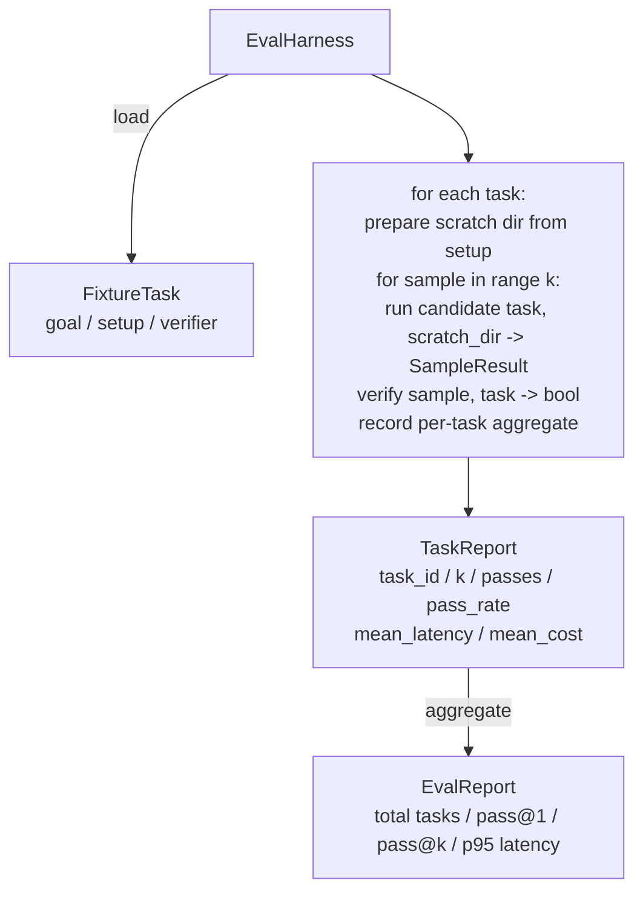

# 结课项目第 27 课:带夹具任务的评测框架

> 一个编程智能体有多好,取决于你拿哪套任务去量它。本课构建一个评测框架:读入一文件夹的夹具任务,逐个跑过候选智能体,用确定性的验证器判过或不过,再把结果聚合成 pass@1、pass@k、平均延迟和平均成本。这个框架是事实之源,让你分得清一次回退和一次重构。

**类型:** 动手构建
**编程语言:** Python (stdlib)
**前置要求:** 第 19 阶段 · 25(校验门),第 19 阶段 · 26(沙箱运行器),第 14 阶段 · 30(评测驱动的智能体开发),第 14 阶段 · 19(SWE-bench 与 GAIA 基准测试)
**预计耗时:** 约 90 分钟

## 学习目标

- 把夹具任务定义为目标、环境准备、验证器的三元组。
- 对每个任务跑多个采样,计算 pass@1 和 pass@k。
- 把延迟和成本聚合成均值和 p95 指标。
- 把确定性验证器(文件比对、退出码、正则匹配)做成可复用函数。
- 输出一份结构化 JSON 报告,供回归追踪脚本消费。

## 问题

没有评测框架撑腰的智能体基准测试,常被三种失败模式拖累。

第一种是未验证的通过。智能体说修好了,人扫了一眼 diff,测试套件标绿,三周后回归测试又把同一个 bug 翻了出来。智能体的推理听起来头头是道,但什么也没修。

第二种是未被察觉的回退。改了提示词模板,智能体在那个显眼的任务上好了 4%,在那个不吭声的任务上差了 14%。没有金标任务集和逐任务分数,这次回退就顺着进了 main,直到客户投诉才浮出水面。

第三种是任务集漂移。周一跑评测用了 100 个任务,周五只剩 95 个——有人给五个夹具改了名。通过率看起来提升了 5%,其实不是。

评测框架就是把这些失败变成事实的程序。它每次都跑全部夹具,顺序可复现,验证器在确定性检查上返回 true 或 false。

## 概念

```mermaid
flowchart LR
  F1[fixtures/task_001/<br/>task.json + expected/] --> Harness
  F2[fixtures/task_002/<br/>...] --> Harness
  Harness[Harness<br/>for each task:<br/>setup / run agent k samples /<br/>verify each sample /<br/>record latency, cost]
  Harness --> Report[EvalReport<br/>pass@1 / pass@k<br/>mean ms / p95 ms<br/>mean cost]
```

一个 `FixtureTask` 是一小个 JSON 文件,外加一个可选的 `expected/` 目录。JSON 里声明 `id`、`goal`(喂给智能体的提示词)、`setup` 块(要放进临时目录的文件)和 `verifier` 块。verifier 块点名框架验证器注册表里的一个函数,并提供参数。

三种验证器形态覆盖了绝大多数有用的任务。

第一种是 `file_equals`。智能体跑完后,把指定文件与期望内容比对。适合"必须用这种方式修这个 bug"的任务。

第二种是 `regex_match`。把指定文件的内容与正则匹配。适合"这个函数必须存在且返回 X"这类有多种可接受解法的任务。

第三种是 `shell_exit_zero`。框架运行一条 shell 命令(走第 26 课的沙箱),命令退出码为零才算任务通过。适合"测试必须全过"的任务。

框架对每个任务跑 `k` 次。pass@k 为 `1 - (1 - p)^k`,其中 p 是经验通过率;框架同时报告原始计数,方便你看方差。延迟是每个采样的墙钟时间。成本是智能体自报的数字(token 数、美元,或两者);框架跨采样求和,给出逐任务和总体数字。

```figure
pass-at-k
```

## 架构



候选者是一个可调用对象:`Callable[[FixtureTask, str], SampleResult]`。框架用 `tempfile.mkdtemp()` 创建临时目录,把路径作为普通字符串传进去。框架不关心候选者内部怎么工作——它可以是一个确定性的补丁应用器(适合框架自测)、一个真实的 LLM 智能体、一个模糊测试器。契约就是 SampleResult。

## 你要构建什么

`main.py` 交付:

1. `FixtureTask` dataclass。
2. `SampleResult` dataclass:success_self_reported、latency_ms、cost_units、edits。
3. `TaskReport`、`EvalReport` dataclass,带 `to_dict()`。
4. `VerifierRegistry`,把验证器名字映射到函数。内置验证器:file_equals、regex_match、shell_exit_zero。
5. `EvalHarness` 类。对一目录的任务跑一个候选者,返回 EvalReport。
6. `tasks/` 里打包的五个夹具任务:
   - `fizzbuzz` 里的差一错误
   - `factorial` 缺 return
   - 错误信息里的拼写错误
   - 空函数体
   - 链表遍历里的差一错误
7. 一个确定性参考候选者(`apply_known_fixes`),框架用它演示干净的 pass@1 = 1.0。
8. 演示打印 EvalReport JSON 并以零退出码结束。

夹具任务以 JSON 文件打包在 `tasks/` 下,配套源码文件放在 `tasks/<id>/buggy/` 和 `tasks/<id>/expected/`。框架把 buggy 拷进临时目录,交给候选者,再拿 expected 验证。

## 为什么看 pass@k 而不只看 pass@1

真实的 LLM 智能体是随机的。pass@1 = 0.6 看起来像个失败者;pass@5 = 0.95 说明智能体大多数时候能拿到正确答案,只是在靠前的采样里选错了。解法是采样加排序,而不总是堆更多训练。pass@k 把这一点变得可见。

pass@k 要和 pass@1 一起看,因为 pass@k 会掩盖一种真实失败:如果模型二十次才蒙对一次,那这个智能体并不好用。框架把两个数都摆出来。

## 如何与 Track A 其余部分组合

第 25 课产出了门链,第 26 课产出了沙箱。评测框架在任何 `shell_exit_zero` 验证器里都会用到沙箱。第 28 课把每次框架运行包进一条 OTel trace。第 29 课对着一个打包好的夹具跑端到端演示,并断言参考候选者的 pass@1 = 1.0。

## 运行方式

```bash
cd phases/19-capstone-projects/27-eval-harness-fixture-tasks
python3 code/main.py
python3 -m pytest code/tests/ -v
```

演示打印 JSON 格式的 EvalReport,包含 pass@1、pass@5、平均延迟和逐任务明细,退出码为零。测试覆盖验证器函数、pass@k 数学、夹具加载,以及对着打包好的参考候选者跑框架端到端。
