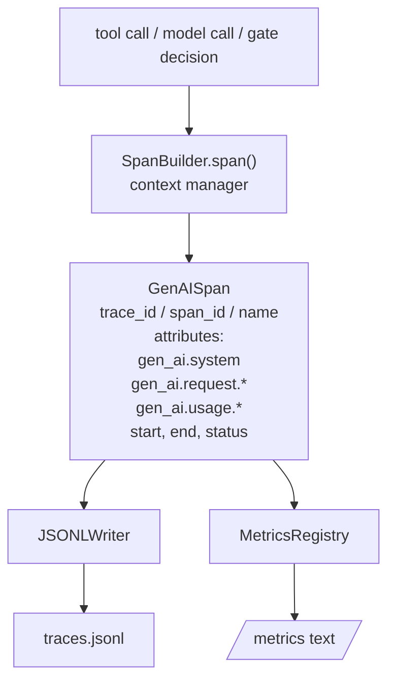
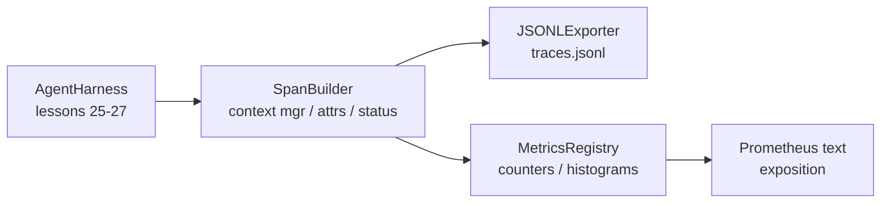

# 结课项目第 28 课:用 OTel GenAI Span 与 Prometheus 指标做可观测性

> 没有可观测性的智能体框架,就是一个会烧钱的黑盒。本课手搓一个 span 构建器:产出符合 OpenTelemetry GenAI 语义约定的记录,以每行一个 span 的方式写进 JSON-Lines 文件,并以 Prometheus 文本格式暴露计数器和直方图。全程只用 Python 标准库,离线可跑。

**类型:** 动手构建
**编程语言:** Python (stdlib)
**前置要求:** 第 19 阶段 · 25(校验门),第 19 阶段 · 26(沙箱),第 19 阶段 · 27(评测框架),第 13 阶段 · 20(OpenTelemetry GenAI),第 14 阶段 · 23(OTel GenAI 约定)
**预计耗时:** 约 90 分钟

## 学习目标

- 构建一个贴合 OpenTelemetry GenAI 语义约定的 span 数据类。
- 实现一个每行写入一个自包含 span 的 JSONL 导出器。
- 构建带标签的计数器和直方图,并以 Prometheus 文本格式暴露。
- 用一个记录时长、状态和异常的 span 上下文管理器包住任意可调用对象。
- 验证产出的 span 能经 `json.loads` 往返还原,且形状符合规范。

## 问题

生产环境里的编程智能体,每一轮都产出三类工件:一次模型调用、一次工具执行、一次校验门决策。没有结构化遥测,这些全都派不上用场。

第一种失败模式是缺失的轨迹。周二出了故障,但唯一的记录是一份 500 行的聊天日志。哪个工具跑了、花了多久、提示词吃进去多少 token、门有没有拒绝过什么——统统没有记录。智能体的作者只能靠猜。

第二种失败模式是无法解析的轨迹。框架写了 span,但字段名是自己拍的。Grafana、Honeycomb、Jaeger、本地 CLI,谁都读不了。团队技术栈里现成的工具全浪费了,就因为 span 不标准。

第三种失败模式是无法聚合的指标。你能在轨迹里看到某次工具调用很慢,却答不出"过去一小时 read_file 调用的 p95 延迟是多少"——因为只有轨迹,没有指标。

OpenTelemetry GenAI 语义约定正是为此而生。它定义了一小组标准属性,各家 LLM 框架的 span 产出方共同遵守。你的框架写了这些属性,所有兼容 OTel 的后端就都能读。

## 概念



框架里的每个操作都产出一个 span。一个 span 有 trace id(整个智能体调用)、span id(本次操作)、名字(如 `gen_ai.chat`、`gen_ai.tool.execution`)、一组遵循 GenAI 约定的属性、起止时间和状态。

GenAI 约定标准化的属性键有:`gen_ai.system`(供应商,如 `anthropic`、`openai`)、`gen_ai.request.model`(模型 id)、`gen_ai.request.max_tokens`、`gen_ai.usage.input_tokens`、`gen_ai.usage.output_tokens`、`gen_ai.response.model`、`gen_ai.response.id`、`gen_ai.operation.name`,外加工具专属键 `gen_ai.tool.name` 和 `gen_ai.tool.call.id`。

导出器写 JSONL,每行一个 JSON 对象。这是下游工具能流式处理、能 grep、能导入的最简格式。真正的 OTel 导出器说 OTLP gRPC;本课的 JSONL 导出器是它的离线等价物,在任何工作站上都能以零退出码跑完。

指标与轨迹比邻而居。每次工具调用,计数器加一:`tools_called_total{tool="read_file"}`。直方图记录观测到的延迟:`tool_latency_ms{tool="read_file"}`。两者都序列化为 Prometheus 文本暴露格式——拉取式指标事实上的标准。

```figure
trace-spans
```

## 架构



span 构建器是一个小类,`span(name, attrs)` 方法返回一个上下文管理器。进入时记录开始时间,退出时记录结束时间,若抛了异常就把异常挂上,然后把定稿的 span 推给导出器。

指标注册表就是两个字典。计数器是 `{(name, frozen_labels): int}`。直方图把原始样本存在列表里,暴露时再序列化成 Prometheus 直方图桶。

## 你要构建什么

`main.py` 交付:

1. `GenAISpan` dataclass:trace_id、span_id、parent_span_id、name、attributes、start_unix_nano、end_unix_nano、status、status_message、events。
2. `SpanBuilder` 类,带 `span(name, attrs, parent=None)` 上下文管理器。
3. `JSONLExporter` 类,`export(span)` 每次追加一行。
4. `Counter` 和 `Histogram` 类,外加 `MetricsRegistry`。
5. `prometheus_exposition(registry)`,产出文本格式输出。
6. `wrap_tool_call(name)` 装饰器,发出 span 并更新指标。
7. 演示:合成一次完整的智能体调用(gen_ai.chat span 包住若干工具 span),写出 traces.jsonl,打印 Prometheus 暴露文本,以零退出码结束。

span id 和 trace id 是 16 字节的十六进制字符串,由 `os.urandom` 生成,与 OTel 的 W3C trace context 一致。导出器绝不抛异常;IO 错误会被暴露出来,但框架继续跑。

直方图用固定的桶集合(OTel 对毫秒级延迟的默认值:5、10、25、50、100、250、500、1000、2500、5000、10000、+Inf)。样本存成列表,暴露时才按需计算每桶计数。

## 为什么手搓而不用 opentelemetry-sdk

OTel Python SDK 是个实打实的依赖:好几千行代码,OTLP 导出器还要起多个进程,运行时开销能把一节课的预算吞光。手搓版教你的是线上格式。到了生产环境,你把同样的属性接进真正的 SDK,OTLP 导出器、批处理、资源探测就全都有了。

约定是稳定的。本课产出的线上格式到 2030 年照样能解析,因为 OTel 从不破坏 GenAI 属性名,只会新增。

## 如何与 Track A 其余部分组合

第 25 课产出了门链,第 26 课产出了沙箱,第 27 课产出了评测框架。第 28 课让这三者都可观测。第 29 课把端到端演示的每一步都包进 span,并在结尾打印 Prometheus 文本。

## 运行方式

```bash
cd phases/19-capstone-projects/28-observability-otel-traces
python3 code/main.py
python3 -m pytest code/tests/ -v
```

演示在本课工作目录里产出一个 `traces.jsonl`(结束时清理掉),然后打印三个 span 的样本,再打印计数器和直方图的 Prometheus 暴露文本。测试验证 span 序列化往返、规范的 GenAI 属性齐全、计数器正确递增、直方图暴露文本包含预期的桶计数。
