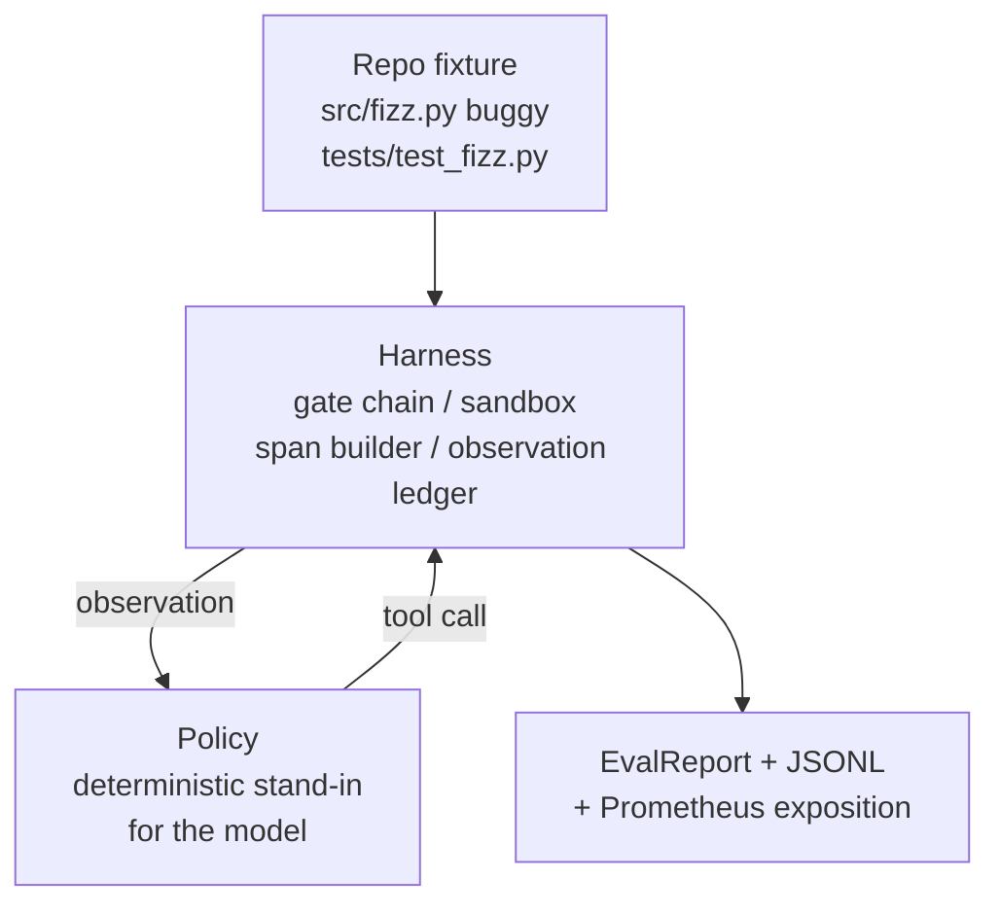
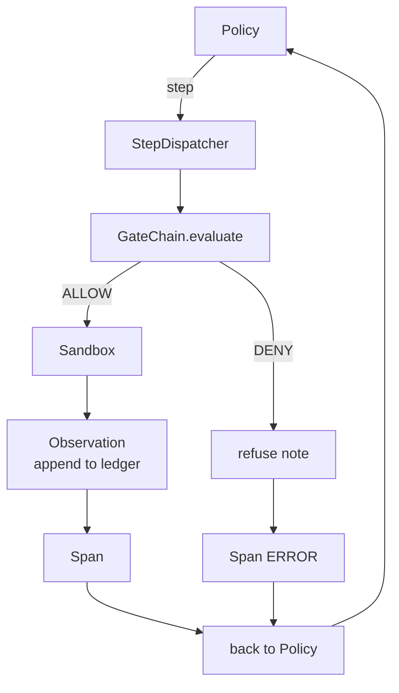

# 结课项目第 29 课:在框架上跑通端到端编程智能体

> Track A 的收获时刻。本课把门链、沙箱、评测框架和 OTel span 缝成一个能跑的编程智能体,让它在一个多文件 Python 项目里修一个真实的(小型的、夹具规模的)bug。这个智能体的策略是确定性的,不是 LLM;这个替换让本课可以复现,也说明了一件事:框架才是全程真正有意思的部分。契约完全一致:真实模型从策略接缝处插入即可。

**类型:** 动手构建
**编程语言:** Python (stdlib)
**前置要求:** 第 19 阶段 · 25(校验门),第 19 阶段 · 26(沙箱),第 19 阶段 · 27(评测框架),第 19 阶段 · 28(可观测性),第 14 阶段 · 38(校验门),第 14 阶段 · 41(真实仓库工作台),第 14 阶段 · 42(智能体工作台结课项目)
**预计耗时:** 约 90 分钟

## 学习目标

- 把门链、沙箱、评测框架和 span 构建器组合进一个智能体循环。
- 实现一个确定性策略,用 read_file、run_tests、write_file 修掉夹具 bug。
- 在端到端运行中同时执行全局步数预算和观察 token 预算。
- 为整次运行产出完整的 OTel GenAI 轨迹和 Prometheus 指标。
- 验证智能体在 12 步之内解出夹具,且合法工具上的门触发次数为零。

## 问题

大多数智能体演示都是各自为战:一个单独的沙箱、一个单独的评测框架、一个单独的 span 发射器。各自看着都挺好,组合起来,接缝就露出来了。

门链说 ALLOW,沙箱却以一个门链没预料到的理由拒绝了。评测框架记了一次通过,OTel span 却说门拒绝了智能体声称用过的工具。Prometheus 计数器该加一的时候加了二。观察预算已经超了,智能体却还在跑,因为预算记在门链里,沙箱不知情。

本课就是整条 track 的集成测试。智能体必须按顺序做四件事:读项目、跑测试、从测试失败中定位 bug、写出修复、重跑测试、停下。每个操作都要过门链,每次工具执行都要过沙箱,每一步都包在 span 里,最后由评测框架给整次运行打分。

## 概念



智能体的策略是一个状态机,五个状态。

`SURVEY`:智能体读项目文件列表。下一个状态是 RUN_TESTS。

`RUN_TESTS`:智能体跑测试命令。测试全过,状态机以成功停机。否则进入 INSPECT。

`INSPECT`:智能体读失败的那个源文件。下一个状态是 FIX。

`FIX`:智能体写出改正后的文件。下一个状态是 VERIFY。

`VERIFY`:智能体再跑一次测试命令。通过,成功停机;否则以失败停机。

每个状态对应一次工具调用,每次工具调用都过门链。工具调用被拒,智能体在轨迹里记录这次拒绝并停机。

夹具 bug 是 `fizz.py` 里的一个差一错误。确定性策略用正则从测试失败信息里认出这个 bug,然后产出改正后的文件。把策略换成 LLM 并不改变框架契约。

```figure
cg-harness-weave
```

## 架构



本课是自包含的。前几课的每个原语都在 `main.py` 里以最小规模重新实现了一遍(门、沙箱、账本、span),这样本课不依赖兄弟课程就能跑。命名与第 25-28 课完全一致,概念映射一目了然。

## 你要构建什么

`main.py` 交付:

1. 最小化的框架原语,与第 25-28 课同名照搬:`GateChain`、`Sandbox`、`ObservationLedger`、`SpanBuilder`、`MetricsRegistry`。
2. `CodingAgentPolicy` 类:五状态的状态机。
3. `Repo` 辅助类:准备一个带打包 buggy 夹具的临时目录。
4. `AgentRun` 类:驱动策略,经由框架派发,返回 `AgentRunReport`。
5. 打包的夹具(`fixture_repo/`),含 src/fizz.py、tests/test_fizz.py,以及给评测框架用的 expected/ 树。
6. 演示:端到端跑策略,打印逐步轨迹,断言通过,打印指标。

打包夹具的形状与第 27 课的任务结构相同:一个 buggy 文件加一个测试文件。测试失败信息里包含足够让确定性策略定位修复方案的信息。真实 LLM 做的是同一件事——更慢、知识面更广,但不会改变框架的预期。

## 为什么策略不是 LLM

真实 LLM 需要 API key、网络调用,还带着无法验证的随机性。本课关心的部分是框架。换成确定性策略,本课就能在任何开发者笔记本上以零外部依赖跑起来,测试套件也能断言精确的步数。

本课的策略是 LLM 智能体行为的一个严格子集。策略读仓库、看失败的测试、定位那一行、给出修复。LLM 走的是同一个循环、同一份框架契约,簿记完全相同。

## 演示断言了什么

端到端演示在退出时断言五件事,测试套件再以编程方式重新断言一遍。

策略在 12 步之内解出了夹具。

观察预算从未被超出。

合法工具上的门拒绝次数为零。(智能体从未凭空造出被拒的工具名。)

每一步在 traces.jsonl 里都有对应的 span。

Prometheus 暴露文本里有 `tools_called_total{tool="read_file"}` 条目和 `tool_latency_ms` 直方图。

## 如何与 Track A 其余部分组合

本课就是那次集成。第 25 课写了门链,第 26 课写了沙箱,第 27 课写了评测框架,第 28 课写了可观测性,第 29 课证明它们能作为一个系统运转。真实的智能体框架由此延伸:把确定性策略换成模型,把打包夹具换成真实仓库任务,把 JSONL 导出器换成 OTLP。

## 运行方式

```bash
cd phases/19-capstone-projects/29-end-to-end-coding-task-demo
python3 code/main.py
python3 -m pytest code/tests/ -v
```

演示打印逐步轨迹、最终评测报告和 Prometheus 暴露文本,退出码为零。测试覆盖策略状态转移、对合成工具调用的门拒绝、打包夹具上的端到端运行,以及步数预算不变量。
