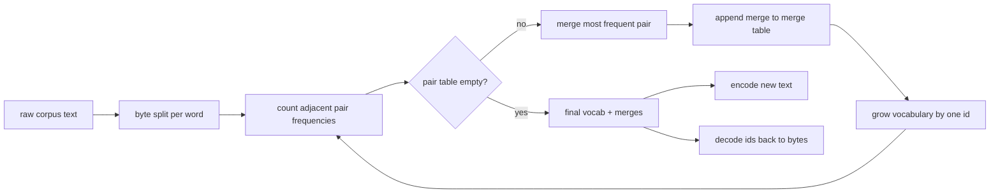
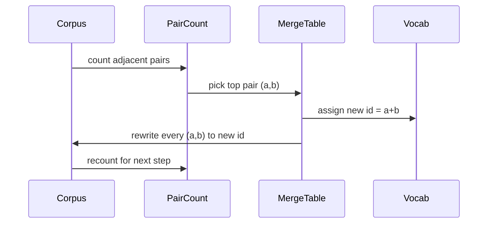

# 从零实现 BPE 分词器

> 字节进,id 出,id 再还原成同样的字节。动手构建那个至今仍是每个现代文本模型起点的分词器。

**类型:** 动手构建
**编程语言:** Python
**前置要求:** 第 04 阶段 课程,第 07 阶段 Transformer 课程
**预计耗时:** 约 90 分钟

## 学习目标
- 在原始文本语料上训练一个字节对编码(Byte-Pair Encoding)词表:反复合并出现频率最高的相邻符号对。
- 实现一张确定性的合并表,并把它应用到新文本上,产出子词 id 流。
- 把任意 UTF-8 输入无损地往返于 id 序列与原文之间。
- 保留并保护特殊 token(`<|endoftext|>`、`<|pad|>`),让它们在训练和解码中都安然无恙。
- 说清楚为什么字节级字母表是通用分词器的正确下限。

```figure
cap-bpe-merge
```

## 定位

语言模型永远看不到文本,它看到的是整数。字符串到整数列表、再映回字符串的那张映射表,就是分词器。这一层做错了,训练里每一条 loss 曲线量的都是错的东西。

通用文本模型的主流子词分词器家族是字节对编码。思路很小:从一个已知字母表出发,找到训练语料里出现最多的相邻符号对,把它合并成一个新符号,重复,直到词表达到目标大小。编码新文本时,按同样的顺序复用同一张合并表。

我们要构建的是字节级变体。字母表是 256 个原始字节,而不是 Unicode 码点。正是这个选择,让分词器能处理任何 UTF-8 输入,而不必退回 unknown token。

## 流水线



训练侧和推理侧共享合并表,这份共享就是契约。推理时改了合并顺序,解码出的就是另一条 id 流。

## 字节字母表

前 256 个 id 保留给原始字节 0x00 到 0xFF。这保证了在任何合并发生之前,每个输入字符串都能在词表里表达出来。字节区之后,我们保留一小段给特殊 token。训练循环永远不会把这些 id 提名为合并目标,因为它们从一开始就不在预分词后的流里。

预分词器在训练看到语料之前,先按空白和标点边界切分语料。没有这一步,BPE 合并会高高兴兴地学出跨词边界的合并,词表里塞满完整的常见短语。有了这一步,合并留在词内部,结果才有泛化能力。

## 训练循环

每个训练步做三件事。遍历语料里的每个词,统计当前符号序列里每对相邻符号出现的次数,按词本身的词频加权。选出计数最高的那一对。把这对符号的所有出现改写成单个新符号,其 id 是词表里下一个空位。然后记下这次合并。



每一步的开销,与语料表示成符号序列列表后的规模成线性关系。一百万个词、目标词表一万个 id,循环几秒就跑完了,因为随着合并落地,符号序列越来越短。

## 编码新文本

推理不调用合并计数器。它按学习时的顺序应用合并表。对一个新词,编码器从字节切分开始,扫描当前序列,找到 rank 最低的可用合并(也就是最早学到、且适用于当前位置的那个),执行它,再扫一遍。当表里没有任何合并再适用于当前序列时,循环结束。

按 rank 排序这条性质,让编码是确定性的,也让编码行为与同样输入下的训练行为一致。先学到的合并排在表头,先被应用。两个合并都能作用于同一位置时,rank 低的赢。

## 特殊 token

特殊 token 是字节流永远产生不出来的 id,由我们手工保留。本课两个就够。

- `<|endoftext|>` 在预训练时分隔文档。它告诉模型:"新文档从这里开始,别让上一篇的上下文漏过来。"
- `<|pad|>` 把短序列补齐,让一个批次能拼成矩形张量。训练时 loss 掩码会把它遮掉。

编码器接受一个开关,决定是否允许输入里出现特殊 token。开关关着,字符串 `<|endoftext|>` 和 `<|pad|>` 会被当成普通字节序列分词;开关开着,这两个字面字符串直接映射到保留 id,不参与任何合并。

## 往返保证

先编码再解码,必须逐字节还原输入。解码器按顺序把每个 id 的字节展开拼接起来。每个 id 要么是原始字节,要么是两个已知 id 的拼接,所以递归展开总会终止于原始字节。解码最后返回这些字节拼出的 UTF-8 字符串。

本课的测试套件在三种输入上检查这条性质:一句没见过的句子、一句带 Unicode emoji 的句子、一句含有字面 `<|endoftext|>` token 的句子。

## 本课不做什么

不构建最大型生产分词器那种正则驱动的预分词器。这里的预分词器只是一个按空白和标点切分的小东西,足够在小训练语料上学出合理的合并,与课程链其余部分的契约也保持一致。下一课把分词器当黑盒,在它之上构建滑动窗口数据集。

不做 pair 计数并行化。几千个词的语料,Python 循环远低于一秒就跑完。语料再大,显然的做法是按词并行计数再归约。

## 代码怎么读

`main.py` 定义了四个对象。`BPETokenizer` 持有词表、合并表和特殊 token 表;`train` 是训练循环;`encode` 是推理路径;`decode` 做字节拼接。文件底部的演示在内置语料上训练一个小分词器,编码一句留出句,把 id 解码回去,并把两者都打印出来。`code/tests/test_bpe.py` 里的测试钉死了往返性质、特殊 token 保留和合并顺序。

跑一下演示。然后把演示里的目标词表大小从 300 改成 600,看看留出句的编码长度怎么往下掉。那条曲线就是 BPE 压缩曲线。
