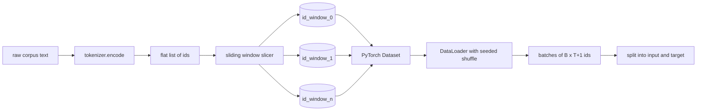
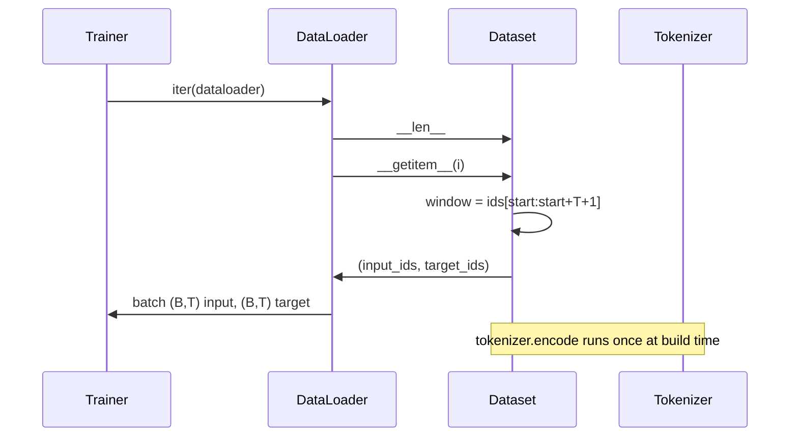

# 带滑动窗口的分词数据集

> 一次预训练运行,就是一个从 token id 到梯度的函数。本课构建那条把 id 喂进去的传送带。

**类型:** 动手构建
**编程语言:** Python
**前置要求:** 第 04 阶段 课程,第 07 阶段 Transformer 课程,本阶段第 30 课
**预计耗时:** 约 90 分钟

## 学习目标
- 调用一次分词器,把原始语料转成 token id 流。
- 用可配置的重叠步长,把 id 流切成定长窗口。
- 构建一个 PyTorch Dataset,为下一 token 预测返回输入和目标张量。
- 用按 epoch 播种的确定性 shuffle,把数据集包进 DataLoader。
- 说清楚步长、冗余度和有效数据集大小之间的取舍。

```figure
cap-sliding-window
```

## 定位

预训练运行一次读一个批次的 token id,然后更新模型。批次的形状由训练契约固定。对因果语言模型来说,批次里是 `(B, T)` 的输入 id 和 `(B, T)` 的目标 id,目标是输入左移一位。数据流水线的职责,就是按需产出这份契约——确定性、可复现,哪怕语料是好几 GB 的原始文本。

本课构建这条流水线。上一课的分词器把文本变成一条长长的扁平 id 列表;滑动窗口把列表切成训练样本;自定义 Dataset 把样本暴露为张量;DataLoader 用已知种子把它们组批、打乱。

## 形状契约

因果语言模型消费形状为 `(B, T)` 的 id,`B` 是批次大小,`T` 是上下文长度。位置 `t` 的目标是位置 `t+1` 的输入。也就是说,每个训练样本覆盖 `T+1` 个原始 id。窗口步长控制相邻样本之间有多少重叠。



切片器从不越过语料边界。最后一个窗口凑不满 `T+1` 个位置就丢掉。用 `<|pad|>` 补尾部也是合法选择,但会让 loss 掩码变复杂。本课选择丢。

## 为什么用滑动窗口

预训练语料是一条长长的 id 流。如果模型只看到不重叠的窗口,每个训练样本教它的都是同样的 `T` 个边界。调整步长就能挪动这些边界,让模型看到更多样的"预测下一 token"任务。

步长为 `T`,窗口互不重叠。步长为 `T // 2`,重叠百分之五十,有效数据集翻倍。步长为 `1`,重叠最大,数据集膨胀 `T` 倍。代价是每个 epoch 算得更多,收益是边界更多样。大多数预训练运行的步长等于上下文长度——因为语料本来就比模型一个 epoch 能吃完的量多得多,边界多样性这条理由就没那么硬了。

## Dataset 类

PyTorch Dataset 有两个必备方法。`__len__` 返回样本数,`__getitem__` 返回一个样本(一对张量)。我们的 Dataset 存编码后的 id 流和步长。索引时现场算出窗口起点,所以无论步长产出多少样本,内存开销始终是 id 流的一份拷贝。



左移一位发生在 `__getitem__` 内部。Dataset 返回 `(input, target)`,其中 `input = window[:-1]`、`target = window[1:]`。两者都是 PyTorch long 张量,训练循环把它们当作真值。

## 确定性 shuffle

`shuffle=True` 的 DataLoader 从一个 PyTorch 随机生成器里取数。显式传入一个按 epoch 播种的 `torch.Generator`,重跑时每次都能得到同样的 shuffle。想比较只差一点超参数的两次运行时,这条性质很关键:没有种子,两次运行看到的数据顺序不同,loss 曲线的分叉原因就和你的改动毫无关系。

本课的种子契约很简单:`epoch_seed = base_seed + epoch_index`。base seed 在构造时传入,epoch index 由训练器在每个 epoch 开头自增。同样的 base seed 重跑,每个 epoch 的顺序都一模一样。

## 批次采样器

PyTorch 默认采样器无放回地均匀随机取索引,这正是预训练想要的。在小数据集上微调,契约也一样。DataLoader 通过调用 `B` 次 `__getitem__` 并堆叠结果来组批。因为每个样本按构造就是同样长度,不需要任何补齐逻辑。

本课为简单起见保持 `num_workers=0`。生产运行里,worker 进程会并行执行 `__getitem__`。对我们这条流水线来说那基本是无操作——工作只是对内存中张量做一次切片——但同一个 Dataset API 可以干净地支持 worker。

## 数样本个数

id 流长度为 `N`、上下文长度 `T`、步长 `S` 时,样本数为 `max(0, 1 + (N - (T + 1)) // S)`。本课把这个计算暴露为 Dataset 上的静态方法,训练器不用迭代就能算出每个 epoch 的总步数。

## 本课不做什么

不做磁盘流式读取。语料整个在内存里编码,存成一个张量。几百万 id 的语料不到一百 MB,对本课是合适的形状。磁盘流式是另一件事——替换存储层即可接入,Dataset 契约不变。

不处理多文档。语料被当作一条连续的 id 流。从多份文档构建语料时,文档边界用插入 `<|endoftext|>` id 的方式编码,模型会学着预测边界附近的内容。

## 代码怎么读

`main.py` 定义了两个类和一个辅助函数。`SlidingWindowDataset` 是那个 PyTorch Dataset;`make_dataloader` 返回一个配好种子生成器的 DataLoader;`_encode_corpus_to_ids` 是那次性的分词器调用。文件底部的演示在进程内构建一个小分词器,编码内置语料,构造数据集和 DataLoader,打印一个批次,并断言形状契约。`code/tests/test_dataset.py` 里的测试钉死了窗口数公式、左移一位性质、确定性 shuffle 和步长取舍。

跑一下演示。然后把上下文长度从 16 改成 32,看看每个 epoch 的样本数怎么往下掉。那个数字就是你的每 epoch 步数预算。
