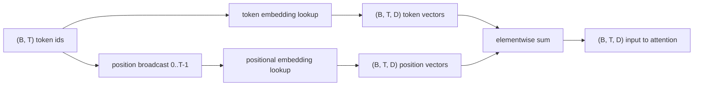
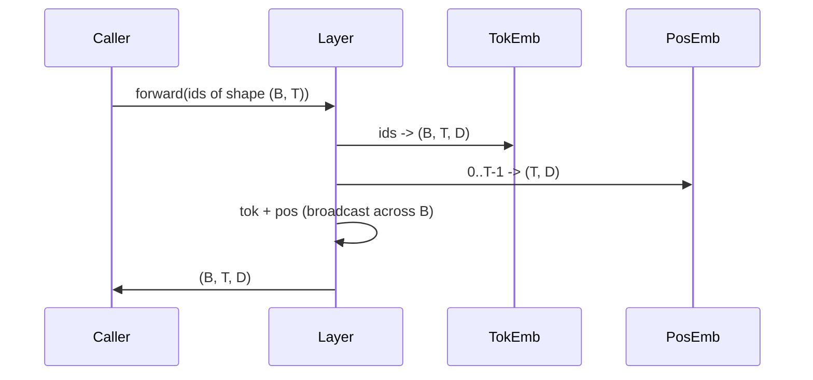

# Token 嵌入与位置嵌入

> id 是整数,模型要的是向量。两者之间隔着两张查找表,而位置那张怎么选,决定了模型能学到什么。

**类型:** 动手构建
**编程语言:** Python
**前置要求:** 第 04 阶段 课程,第 07 阶段 Transformer 课程,本阶段第 30、31 课
**预计耗时:** 约 90 分钟

## 学习目标
- 构建一张 token 嵌入查找表,把词表 id 映射到稠密向量。
- 构建一张按位置索引的学习式位置嵌入查找表。
- 构建一张按位置索引、零参数的固定正弦位置嵌入。
- 把 token 嵌入和位置嵌入合成 Transformer 块的单一输入。
- 在长度泛化和参数量上对比学习式与正弦式嵌入。

```figure
cc-embedding-lookup
```

## 定位

模型与 token id 的第一次接触,是在 token 嵌入矩阵里查一行。矩阵每行对应一个词表 id,每列对应一个模型维度。查出来的向量,模型其余部分就把它当作这个 id 的含义。反向传播只更新前向用到过的那些行。训练久了,这些行的几何结构就学会了用方向编码相似性。

光有 token id 没有顺序。模型还需要第二个信号,告诉它位置一和位置十七不一样。这个信号的两种主流选择是:学习式位置嵌入(第二张查找表,每个位置一行)和固定正弦位置嵌入(一个零参数的数学公式)。这个选择有后果。学习表是参数,而且以模型训练时的最大上下文长度为界。正弦表在理论上无参数,公式可以延伸到任意位置;但本课的 `SinusoidalPositionalEmbedding` 在 `max_context_length` 处预计算了一张固定表,`forward` 越过这个界就抛异常——所以在这里,两个模块都强制最大上下文长度。即便表足够大、索引得下,模型越过训练长度后照样可能挣扎。

本课两种都建,并把它们与 token 嵌入合成下一课注意力块的单一输入。

## 形状契约

嵌入阶段的输入是一批形状为 `(B, T)` 的 token id,输出是形状 `(B, T, D)` 的张量,`D` 是模型维度。每个批次元素的上下文长度 `T` 相同,每个位置的向量维度 `D` 相同。



组合方式是求和,不是拼接。求和让 `D` 在网络里保持不变,也让模型能逐特征地决定:在每一层,是 token 含义占主导,还是位置占主导。

## token 嵌入矩阵

token 嵌入是形状 `(V, D)` 的参数张量,`V` 是词表大小。PyTorch 里就是 `nn.Embedding(V, D)`。初始化时各项取自小高斯——Transformer 规模的模型传统上均值取零、标准差取 `0.02` 上下。具体初始化没有"各次运行保持一致"重要。

前向就是一次索引操作。PyTorch 按行收集,把 `(B, T)` 的 int64 id 映成 `(B, T, D)` 的浮点数。反向只把梯度累进前向碰过的行。批次里从没出现过的两行,这一步梯度为零。

有个微妙的细节。token 嵌入和模型末端的输出投影经常共享权重(weight tying)。一旦共享,每次反向都会经由输出侧碰到嵌入的每一行。本课把两者暴露为独立模块,但在完整模型里,同一张矩阵可以身兼两职。

## 学习式位置嵌入

学习式位置嵌入是第二张 `nn.Embedding`,形状 `(max_context_length, D)`。查找以位置 id `0, 1, 2, ..., T-1` 为键。前向把这个位置向量沿批次维度广播。

学习表的缺点是:模型只训练到位置 `T-1`,就没法查位置 `T`——那一行不存在。采用这种方案的生产级 decoder-only 模型,会把最大上下文长度焊死在架构里,拒绝处理更长的输入。

## 正弦位置嵌入

正弦位置嵌入是一个从位置到向量的函数。位置 `p`、特征 `i` 产出:

```python
angle = p / (10000 ** (2 * (i // 2) / D))
emb[p, 2k]     = sin(angle)
emb[p, 2k + 1] = cos(angle)
```

这个函数没有参数。每个位置都有唯一向量。波长沿特征维度几何变化,低维编码粗粒度位置,高维编码细粒度位置。

`sin` 和 `cos` 搭配带来的性质是:位置 `p + k` 的向量是位置 `p` 向量的线性函数。这给了注意力层一条学习相对位置偏移的捷径——表达"往前看五个 token"不需要单独的参数。

本课在构造时一次算好整张正弦表,前向时索引。

## 组合

输入流水线按顺序做三件事:读 token id,查 token 向量,加位置向量,返回和。



求和步骤的广播,把 `(T, D)` 的位置张量沿批次维度复制。unsqueeze 之后位置张量形状是 `(1, T, D)`,PyTorch 自动处理。

## 对比分析

本课让两种变体跑同样的输入,打印两项诊断。

第一项是参数量。学习变体在 token 嵌入之上多 `max_context_length * D` 个参数,正弦变体是零。

第二项是相邻位置嵌入之间的余弦相似度。正弦变体的衰减平滑且可预测,因为函数连续。学习变体在初始化时相似度接近随机,因为各行独立抽取。训练之后,学习变体通常也会长出类似的平滑结构,但它得从数据里自己发现这个结构。

## 本课不做什么

不构建旋转位置编码(RoPE)和 AliBi。那是生产级 Transformer 的现代选择。两者遵循与这里相同的形状契约(对形状 `(B, T, D)` 的向量施加依赖位置的变换),但作用点在注意力投影那一步,而不是输入端。下一课构建注意力块,可选扩展之一就是把旋转位置编码折进那里的 query-key 投影。

不训练嵌入。训练需要 loss,loss 需要模型输出,模型输出需要注意力和 LM 头。那是下一课和下下一课。

## 代码怎么读

`main.py` 定义了三个模块。`TokenEmbedding` 包着 `nn.Embedding(V, D)`;`LearnedPositionalEmbedding` 包着 `nn.Embedding(L, D)`;`SinusoidalPositionalEmbedding` 预计算表并暴露为 buffer;`EmbeddingComposer` 把一个 token 嵌入和一个位置嵌入绑在一起。文件底部的演示打印形状、参数量和相邻位置相似度诊断。`code/tests/test_embeddings.py` 里的测试钉死形状、广播行为、参数量和正弦公式。

跑一下演示。然后把模型维度 `D` 从 64 改成 32,看看正弦波长条带怎么变。
