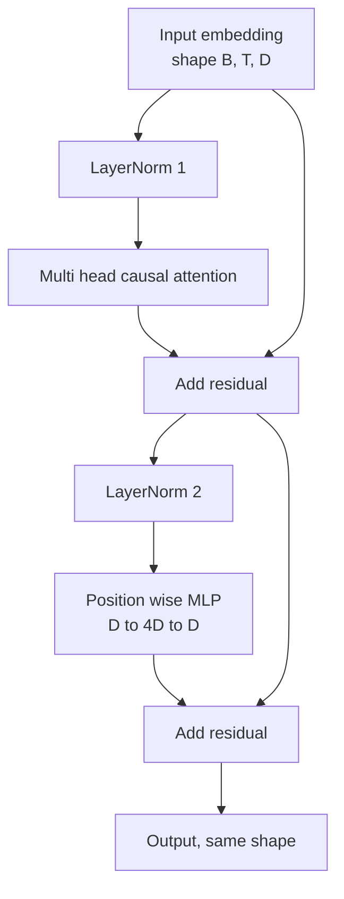
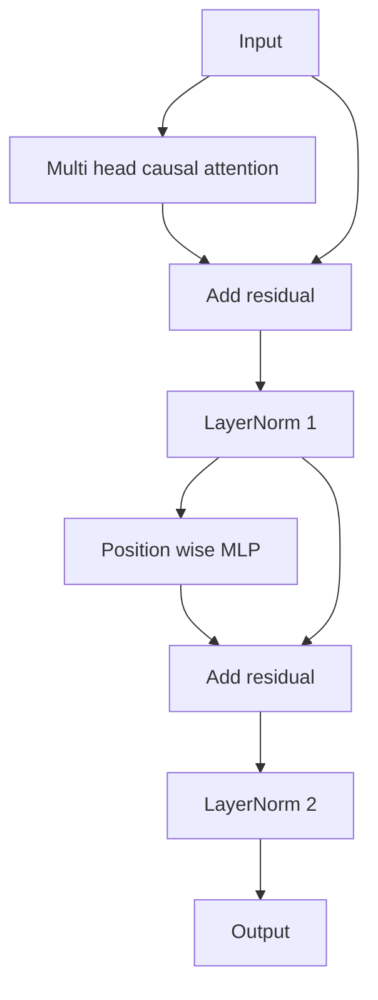

# 从零实现 Transformer 块

> 一个块,就是每个现代 decoder LLM 的基本单元。LayerNorm、多头注意力、残差、MLP、残差。pre-LN 变体不用 warmup 也能稳定训练,post-LN 变体是原始论文交付的版本。本课把两者并排建出来,看看在常见学习率下,哪一种能活过 12 层堆叠。

**类型:** 动手构建
**编程语言:** Python
**前置要求:** 第 19 阶段 第 30-33 课(分词器、嵌入、注意力数学、批式数据加载器)
**预计耗时:** 约 90 分钟

## 学习目标

- 用 PyTorch 从四个活动部件构建 Transformer 块:LayerNorm、多头因果注意力、残差连接、逐位置 MLP。
- 以两种配置(pre-LN 和 post-LN)摆放 LayerNorm,并解释为什么其中一种不用 warmup 也能稳定训练。
- 在多头注意力内部实现因果掩码,让 token `i` 看不到 `j > i` 的 token。
- 在 12 层堆叠上追踪两种变体的梯度流,把结果读得明明白白。
- 在下一课组装 1.24 亿参数 GPT 时,把这个块原样复用。

## 问题

Transformer 就是一个块的不断重复。块写错一次,重复十二次,你交付的模型要么第一个 epoch 就发散,要么一路靠 warmup 拐杖走到底。本课里你会看到的两种失败模式并不稀奇——初学者第一次朴素地堆块时就会撞上。一个是注意力层看到了未来,另一个是 LayerNorm 放错了位置,在深处在残差信号面前无能为力。

看清之后,修法是机械性的。块里恰好有两条残差路径、恰好两个归一化位置。位置选对,剩下的堆叠只是簿记。

## 概念

每个 decoder-only Transformer 块都是一个函数:吃进形状 `(batch, sequence, embedding)` 的张量,吐出同形状的张量。内部由两个子层干活。



这是 pre-LN 变体。LayerNorm 坐在残差分支内部、子层之前。残差连接把未归一化的信号一路带向前。

post-LN 变体把 LayerNorm 挪到残差相加之后。



形状一模一样,训练行为不一样。post-LN 里,沿残差路径回流的梯度必须穿过 LayerNorm。在 12 层深度、学习率 `3e-4` 下,这个梯度缩得快到必须配 warmup 日程。pre-LN 让残差路径保持未归一化,梯度干净地一路传到嵌入层。GPT-2 之后的模型都交付 pre-LN,原因就在于此。

### 因果多头注意力

注意力子层把输入向三个方向投影成 query、key、value 张量,各自从 `(B, T, D)` 重排为 `(B, H, T, D/H)`,`H` 是头数。缩放点积注意力逐头计算 `softmax(Q K^T / sqrt(d_k))`,把上三角掩成负无穷,经 softmax 施加掩码,再乘 `V`。各头拼回单个 `(B, T, D)` 张量,再投影一次。掩码是让模型具有因果性的唯一部件。忘了掩码,训练出来的就是个作弊的模型。

### MLP

逐位置 MLP 对每个 token 独立施加同一个两层网络。隐藏宽度是嵌入宽度的四倍,激活用 GELU,第二个线性层之后跟 dropout。MLP 内部 token 之间互不交谈,所有 token 混合都发生在注意力里。

### 残差连接的两个作用

它让梯度路径随深度保持加性,梯度范数在十二层里不失尺度。它也让每个块学的是对流动表示的增量更新,而不是整体替换。这两个效应加在一起,块才堆得起来。

```figure
cc-transformer-block
```

## 动手构建

`code/main.py` 实现:

- `class LayerNorm`,带可学习的缩放和平移、eps 偏置,逐 token 向量施加。
- `class MultiHeadAttention`,带 `num_heads`、`head_dim = d_model // num_heads`、融合 QKV 投影、注册的因果掩码、注意力 dropout 和残差 dropout。
- `class FeedForward`,两个线性层、GELU 激活、dropout。
- `class TransformerBlock`,一个 `pre_ln` 开关在两种变体间切换。
- 一个演示:用相同输入分别构建 6 层 pre-LN 堆叠和 6 层 post-LN 堆叠,打印 (a) 输出形状,(b) 一次反向之后嵌入层的梯度范数。

运行:

```bash
python3 code/main.py
```

输出:两个堆叠的形状检查,并排的梯度范数。同样学习率下,pre-LN 堆叠的嵌入层梯度比 post-LN 堆叠大一个数量级——这就是"pre-LN 不用 warmup 也能训练"的经验证据。

## 技术栈

- `torch` 提供张量运算、自动求导和 `nn.Module` 管线。
- 不用 `transformers`,不用预训练权重。块完全从原语实现。

## 生产环境里的实战模式

三个模式把教科书里的块变成能交付的东西。

**融合 QKV 投影。** 三个独立线性层意味着三次 kernel 发射、三次矩阵乘。一个宽度 `3 * d_model` 的线性层一次发射干完同样的活,再沿最后一维切开。融合路径在任何加速器上都更快,GPT-2、LLaMA、Mistral 的参考实现都这么交付。

**注册因果掩码 buffer。** 掩码只取决于最大上下文长度。构造时用 `register_buffer` 一次分配好,每次前向切出活动窗口,免去逐次分配。忘了这点,长上下文下掩码会变成分配器热点。

**dropout 放两处,不是三处。** dropout 属于注意力 softmax 之后(注意力 dropout)和 MLP 第二个线性层之后(残差 dropout)。在残差本身上加 dropout,会破坏那个让梯度在深处流动的加性恒等式。一些早期实现就错在这里,用脆弱的训练买了单。

## 投入使用

- 本课的块不用任何改动,直接插进第 35 课的 GPT 组装。
- pre-LN 是每个现代开源权重 LLM 在用的变体,post-LN 是 2017 年原始注意力论文用的变体。两个都懂,你遇到的任何 decoder 架构都读得下去。
- 把 GELU 换成 SiLU,你就有了 LLaMA 家族的激活;把 LayerNorm 换成 RMSNorm,你就有了 LLaMA 家族的归一化。骨架不变。

## 练习

1. 给块里每个线性层加一个 `bias=False` 开关。现代开源权重 LLM 的线性层都不带 bias。算算在 12 层、768 维的模型里省了多少参数。
2. 用手搓的 RMSNorm 替换 `nn.LayerNorm`,验证输出形状不变。
3. 加一个开关,以 `(B, T, T)` 张量返回第一个头的注意力权重。画出上三角,确认 softmax 之后为零。
4. 构建一个健全性检查:把一个 `(2, 16, 384)` 张量在 `H=6` 下分别喂给两种变体,断言权重初始化相同、dropout 为零时,两者前向输出不同(例如 `not torch.allclose`)。

## 关键术语

| 术语 | 人们口中的说法 | 实际含义 |
|------|-----------------|------------------------|
| Pre-LN | "前置归一化" | LayerNorm 在残差分支内部、每个子层之前;残差携带未归一化的信号 |
| Post-LN | "后置归一化" | LayerNorm 在残差相加之后;2017 年论文交付的版本,需要 warmup |
| Causal mask | "三角掩码" | 注意力 logits 的上三角置为负无穷,token i 在 j 大于 i 时读不到 token j |
| Fused QKV | "合并投影" | 一个宽度 3D 的线性层,代替三个宽度 D 的线性层;一次 kernel,一次矩阵乘 |
| Residual stream | "跳跃连接" | 自上而下流过每个块的未归一化张量;每个块都往它上面加东西 |

## 延伸阅读

- 第 7 阶段 第 02 课(从零实现自注意力):本块底下的注意力数学。
- 第 7 阶段 第 05 课(完整 Transformer):同一副骨架的 encoder-decoder 版本。
- 第 10 阶段 第 04 课(预训练迷你 GPT):本块将要插入的训练流程。
- 第 19 阶段 第 35 课(本 track):把十二个这样的块堆成一个 GPT 模型。
