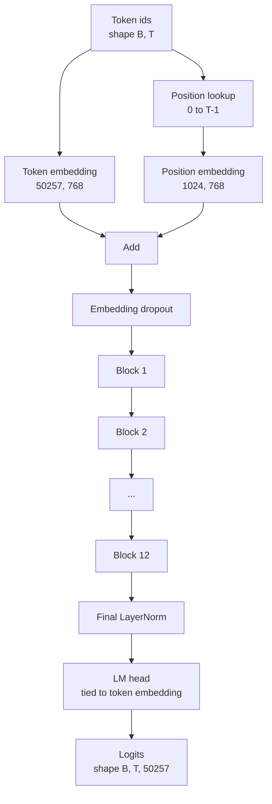
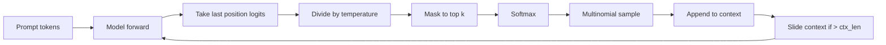

# GPT 模型组装

> 十二个块堆起来,一张 token 嵌入表,一张学习式位置嵌入表,一个最终 LayerNorm,再加一个权重共享的 LM 头。这就是 1.24 亿参数 GPT 模型的全部。本课把这些部件组装成一个能跑的类,清点参数以确认模型符合 124M 参考形状,并用多项采样、温度和 top-k 生成文本。

**类型:** 动手构建
**编程语言:** Python
**前置要求:** 第 19 阶段 第 30-34 课
**预计耗时:** 约 90 分钟

## 学习目标

- 把第 34 课的 Transformer 块组装成完整 GPT 模型:token 嵌入、位置嵌入、N 个块、最终 LayerNorm、LM 头。
- 复现 1.24 亿参数配置:词表 50257、上下文 1024、嵌入 768、十二头、十二层。
- 把 LM 头权重与 token 嵌入绑定,并解释为什么这个规模下能省约 3800 万参数。
- 用多项采样、温度缩放、top-k 截断从提示词生成文本,并用滑动窗口守住上下文长度。
- 对照 124M 目标,量一量参数量和前向开销。

## 问题

一个 Transformer 块单靠自己什么都做不了。你得把 token id 变成向量、混入位置信息、跑过整个堆叠、再投回词表 logits。这四步忘掉任何一步,模型要么前向不了,要么位置信息漂移,要么说不出话。

模型的形状也很重要。参考的 GPT-2 small 恰好就是上面那组配置下的 1.24 亿参数。这些数字没有魔法。词表 50257 乘嵌入 768 是 token 表;位置 1024 乘 768 是位置表;十二个块每块约 700 万参数,合计 8400 万;最终头通过权重绑定复用 token 表。各部分相加,正好落在 1.24 亿。搭出来的模型参数量对不上参考值,就是哪里接错了的信号。

## 概念



token id 变成 token 向量,位置 id 变成位置向量,两者相加送进堆叠。最终 LayerNorm 是块外唯一在所有现代变体里都幸存下来的部件。LM 头复用 token 嵌入矩阵——这就是权重绑定的含义。

### 权重绑定

token 嵌入的形状是 `(vocab, d_model)`,LM 头要从 `d_model` 投回 `vocab`。两者互为转置。绑定,就是字面意义上的同一张参数张量用两次。词表 50257、d_model 768,这张矩阵是 3800 万参数。不绑定,付两次;绑定,付一次,还顺带得到更干净的梯度信号——嵌入和头一起更新。

### 位置嵌入是学习式的,不是正弦式

GPT-2 交付的是学习式位置嵌入。位置表是形状 `(1024, 768)` 的参数张量。每次前向,模型查位置 0 到 T-1,把查到的值加进 token 嵌入。这是各种位置方案里最简单的一种(替代方案有 RoPE、ALiBi、T5 相对偏置),也是 124M 参考模型用的那种。

### 生成:温度、top-k、多项采样

生成是自回归的。每一步,模型返回每个位置上对整个词表的 logits。你只取最后一个位置,除以温度,可选地把 top-k 之外的 logits 全掩成负无穷,softmax 得到概率,再从分布里采一个 token。



三个旋钮,三种行为。温度趋零退化成贪心;温度为一就是模型的自然分布。top-k 为一是贪心;top-k 为四十滤掉长尾。组合方式很重要;下一课训练时会把生成当作定性评测信号。

```figure
cc-gpt-assembly
```

## 动手构建

`code/main.py` 实现:

- `class GPTConfig` dataclass,带 124M 默认值:`vocab_size=50257`、`context_length=1024`、`d_model=768`、`num_heads=12`、`num_layers=12`、`mlp_expansion=4`、`dropout=0.1`、`use_bias=True`、`weight_tying=True`。
- `class GPTModel`,含 token 嵌入、位置嵌入、嵌入 dropout、十二个 `TransformerBlock`、最终 LayerNorm,以及一个在开关打开时绑定到 token 嵌入的 `lm_head`。
- `count_parameters` 辅助函数,返回去重后的参数计数(这样权重绑定在计数中才被尊重)。
- `generate` 函数,实现温度、top-k、多项采样和滑动窗口上下文。
- 一个演示:构建模型,把参数计数与 124M 参考值并排打印,并从一个固定提示词生成一小段序列,证明流水线端到端通畅。

运行:

```bash
python3 code/main.py
```

输出:与 124M 参考值并排的参数计数、从随机提示词生成的 token id 序列,以及绑定开启时 LM 头与 token 嵌入共享存储的确认。

为了让演示跑得快,脚本还会用一个迷你配置(`d_model=64`、`num_layers=2`)端到端跑一遍,把生成的 token 序列就地打印。124M 配置也会构建,但只演练它的参数计数和一次前向。

## 技术栈

- `torch` 提供张量运算、自动求导和模块管线。
- `code/main.py` 在本地重新实现了第 34 课的同一种块模式。

## 生产环境里的实战模式

三个模式,决定模型是"能跑"还是"能交付"。

**残差投影要初始化得小。** 注意力的输出投影和 MLP 的第二个线性层都直接喂进残差相加。用和其他线性层一样的标准差初始化它们,残差流就会随深度膨胀,把最终 LayerNorm 推进高负荷区间。把这两个投影的标准差按 `1 / sqrt(2 * num_layers)` 缩放,残差流在十二层里都能保持在正常范围。

**位置 id 张量缓存起来,别重算。** `torch.arange(T)` 每次前向都新分配内存。在 `__init__` 里按最大上下文一次分配好,每次调用切前 T 个,省去分配器来回。

**权重绑定要绑在参数层面,不是拷贝。** `lm_head.weight = token_embedding.weight` 是共享张量,拷贝不是。优化器要更新的是一个参数,autograd 图要累加的也是一处。如果用拷贝,头会从嵌入那里漂走,权重绑定就白做了。

## 投入使用

- 本课的模型类与下一课要训练的模型形状相同。
- 把学习式位置嵌入换成 RoPE,不动块和头,你就到了 LLaMA 家族。
- 再把 GELU 换成 SiLU、LayerNorm 换成 RMSNorm,LLaMA 家族其余的改动也就齐了。
- 生成函数适用于任何 logits 来源,不只这个模型。第 37 课可以从预训练 GPT-2 文件里取 logits,复用同一个生成循环。

## 练习

1. 解开 LM 头与 token 嵌入的绑定,重新数参数。验证差值是 50257 乘 768 = 3800 万。
2. 把学习式位置嵌入换成构造时算好的正弦表。确认模型仍能前向,且参数计数减少 786,432。
3. 给生成加一个 `greedy=True` 开关:跳过采样直接取 argmax。确认多次运行生成的序列完全一致。
4. 加一个 `repetition_penalty` 旋钮:softmax 之前,把提示词或已生成历史里出现过的 token 的 logit 除以一个常数。在固定提示词上展示:取值大于一会减少输出中的重复次数。
5. 在 `top_k` 旁边加 `top_p`(核)采样。两行代码检查保留下来的 token 概率之和超过 `top_p`。

## 关键术语

| 术语 | 人们口中的说法 | 实际含义 |
|------|-----------------|------------------------|
| Weight tying | "绑定嵌入" | LM 头与 token 嵌入共享同一张参数张量;节省 vocab 乘 d_model 个参数,与 GPT-2 参考一致 |
| Position embedding | "学习式位置" | 一张形状为(上下文长度, d_model)的独立表,加进 token 向量;端到端学习 |
| Sliding window context | "上下文截断" | 提示词加已生成 token 超过上下文长度时,丢掉最老的 token,让活动窗口放得下 |
| Top-k sampling | "K 截断" | 保留值最大的 K 个 logits,其余掩成负无穷,对剩余做 softmax |
| Temperature | "采样温度" | softmax 之前把 logits 除以 T;T 小于 1 变尖锐,T 等于 1 保持自然分布,T 大于 1 变平坦 |

## 延伸阅读

- 第 19 阶段 第 34 课:本模型所堆叠的块。
- 第 19 阶段 第 36 课:用交叉熵 loss 驱动本模型的训练循环。
- 第 19 阶段 第 37 课:把预训练 GPT-2 权重装进这个架构。
- 第 7 阶段 第 07 课(GPT 因果语言建模):下一 token 预测的数学。
- 第 10 阶段 第 04 课(预训练迷你 GPT):同一架构上的原始训练流程。
