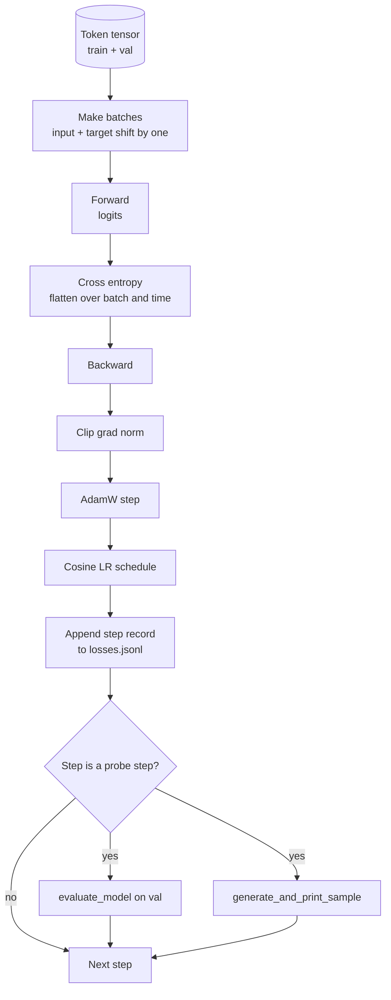

# 训练循环与评估

> 不测量的循环,就是会撒谎的循环。本课构建驱动 GPT 模型的训练循环:带权重衰减分组的 AdamW、warmup 加余弦学习率日程、`calc_loss_batch` 辅助函数、在留出数据上的 `evaluate_model` 评估、每 K 步一次的 `generate_and_print_sample` 定性探针,以及一份可以事后画图的 JSONL loss 日志。未来你构建的每个 decoder LLM,用的都是这副骨架。

**类型:** 动手构建
**编程语言:** Python
**前置要求:** 第 19 阶段 第 30-35 课
**预计耗时:** 约 90 分钟

## 学习目标

- 构建一个训练循环,按下一 token 预测的正确输入-目标对齐方式计算交叉熵 loss。
- 配置 AdamW:权重衰减施加于权重张量,不施加于 LayerNorm 和 bias 张量。
- 实现线性 warmup 加余弦衰减的学习率日程,并读懂 LR 随时间的变化。
- 用 `evaluate_model` 在留出切分上评估,让各次运行的 eval loss 可比较。
- 每 K 步用 `generate_and_print_sample` 生成定性样本,在 loss 曲线之前抓住发散。
- 把每步 loss 持久化到 JSONL,以便重新加载、画图,并把训练日志作为交付物。

## 问题

一个只会打印 loss 的训练脚本有三种失败方式。它说不清 loss 的下降原因对不对(模型可能过拟合了训练集,什么也没学到);它说不清发散是不是正在开始(loss 可以尖峰一步又恢复,也可以尖峰一步就崩盘);它说不清模型学到了什么(loss 是个标量,生成的样本才是一段话)。循环不测量,这三种失败全都藏得住。

本课的循环从三个维度测量:每一步训练批次的 loss,每 K 步一次留出批次的 loss,每 K 步一次从固定提示词生成的续写。训练日志落进 JSONL,这份工件就是循环的证词。

## 概念



两个不直观的部件是 loss 对齐和 AdamW 衰减分组。

### loss 对齐

模型在每个位置预测下一 token。输入批次是 `[t0, t1, t2, t3]`,目标批次就必须是 `[t1, t2, t3, t4]`。交叉熵在摊平形状 `(batch * seq, vocab)` 上对摊平目标 `(batch * seq,)` 计算。忘了移位,你训练的就是让模型预测它自己——loss 收敛到零,有用的东西一点没学。

### AdamW 衰减分组

权重衰减正则化权重张量,但不正则化归一化缩放和 bias。把衰减加到 LayerNorm 缩放上,缩放会被慢慢压向零,归一化就垮了。把衰减加到 bias 上,数学上无害,但纯属浪费算力。标准分法是:矩阵形状的张量(线性层权重、嵌入表)加衰减,任何看起来像缩放或平移的不加。

### warmup 加余弦日程

warmup 用几百步把学习率从零爬到目标值,让优化器状态有时间填充起来。余弦衰减在剩余步数里把学习率降回接近零,让最后阶段以小步长微调权重。这个组合是开源权重 LLM 训练里最常见的日程,因为它消除了头一千步和最后一千步里大多数脆弱时刻。

### 留出评估

`evaluate_model` 从验证切分里跑固定数量的批次,累加 loss,除以批次数,返回。无梯度,无 dropout。种子和切分相同,数字就可复现。把留出 loss 和训练 loss 摆在一起报告,正是你发现过拟合的方式。

### 定性采样作为早期信号

训练 loss 降得很漂亮、生成样本却全是同一个 token 的模型,是坏的。loss 曲线看着平、生成样本却逐渐收敛成连贯单词的模型,在学。定性探针比读完整条曲线快,还能抓住标量抓不住的模式。

```figure
cap-training-loop
```

## 动手构建

`code/main.py` 实现:

- `make_batches(token_ids, batch_size, context_length)`:把长 token 张量切成输入-目标对。
- `calc_loss_batch(model, inputs, targets)`:前向、摊平,返回标量交叉熵。
- `evaluate_model(model, val_loader, max_batches)`:无梯度地迭代固定数量的验证批次,返回平均 loss。
- `generate_and_print_sample(model, prompt, max_new_tokens)`:在固定提示词上运行第 35 课的生成函数并打印结果。
- `build_param_groups(model, weight_decay)`:产出两组的 AdamW 参数列表。
- `cosine_with_warmup(step, warmup_steps, total_steps, max_lr, min_lr)`:返回指定步的 LR。
- `train(...)`:跑循环,持久化 `outputs/losses.jsonl`,每 `eval_every` 步打印 eval loss 和一个样本。
- 一个演示:在合成数据上训练一个迷你模型若干步,写 JSONL 日志,在探针点打印 eval loss 和样本。CPU 上远低于一分钟跑完。

运行:

```bash
python3 code/main.py
```

输出:每步 loss 行、每个探针步的 eval loss 和生成样本,以及最终一份可以逐行用 `json.loads` 加载的 `outputs/losses.jsonl`。

## 技术栈

- `torch` 提供自动求导、优化器和模块。
- `main.py` 在本地重新实现了第 35 课的 `GPTModel` 和配套模块。

## 生产环境里的实战模式

三个模式,把教科书循环变成敢放着过夜的东西。

**梯度范数裁剪没有商量余地。** 一个坏批次(异常数据、LR 尖峰、数值边角情况)会产生巨大梯度,把几个小时的训练一笔勾销。`backward` 之后、`step` 之前调用 `torch.nn.utils.clip_grad_norm_(params, max_norm=1.0)`,让优化器待在安全区间。裁剪值是自由参数,1 是在大多数配置下都活得好好的默认值。

**用可恢复的 JSONL 日志,不要 pickle 状态。** 每步 loss 记录写成 `{"step": int, "train_loss": float, "lr": float}` 的 JSONL 行是耐久的:任何崩溃都留下可读的工件,可以 grep,三十行 Python 就能画图,读最后一行就能恢复训练。pickle 状态把你绑死在产出文件时的模块布局上,重构一次就脆一次。

**评估批次取自固定切片。** 验证 token 在脚本启动时切成批次,不是现用现切。可复现性依赖评估批次在多次运行间完全一致;否则两次运行的 eval loss 之差,量的是批次 shuffle,不是模型。

## 投入使用

- 本课的循环,和在真实数据上训练 124M 模型用的是同一副骨架。把合成 token 张量换成 `datasets` 风格的加载器,循环原样运行。
- JSONL 日志是把一次训练运行变成证据的交付物。下一课会拿它比较新训的检查点和预训练检查点。
- 定性样本探针是标量 loss 替代不了的兜底网。

## 练习

1. 给 `weight_decay_groups()` 加单元测试,确认缩放和 bias 参数落在无衰减组,线性层和嵌入权重落在衰减组。
2. 把合成随机 token 换成一个小文本文件的字节,让演示在可读的内容上训练。验证生成样本用的字符都在文件里出现过。
3. 给余弦日程加一个 `max_lr` 百分之十的 `min_lr` 下限,重新画图。
4. 除 JSONL 日志外,每 `eval_every` 步保存一个检查点。加一个 `resume_from` 开关,重新加载模型状态和优化器状态。
5. 在 loss 旁边记录每步吞吐量(每秒 token 数),确认它稳定在一条带子里。

## 关键术语

| 术语 | 人们口中的说法 | 实际含义 |
|------|-----------------|------------------------|
| Loss alignment | "左移一位" | 输入 token 在位置 0..T-1,目标 token 在位置 1..T;交叉熵在摊平形状上计算 |
| Decay split | "两个组" | AdamW 对矩阵形状张量施权重衰减,对缩放或 bias 张量不施 |
| Warmup | "爬升" | 学习率在固定步数内从零爬到目标值,让优化器状态得以填充 |
| Eval batches | "留出批次" | 验证 token 张量的一个固定切片,脚本启动时切好,每次探针原样使用 |
| Qualitative probe | "样本打印" | 每 K 步从固定提示词生成一小段,抓住单靠 loss 看不见失败模式 |

## 延伸阅读

- 第 19 阶段 第 35 课:本循环驱动的模型。
- 第 19 阶段 第 37 课:把预训练权重装进同一个模型。
- 第 10 阶段 第 04 课(预训练迷你 GPT):真实数据上的训练流程。
- 第 10 阶段 第 10 课(评估):交叉熵 loss 之外更宽的评估面。
