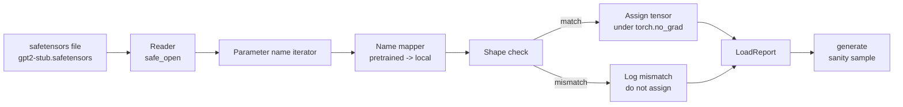

# 加载预训练权重

> 从零训练一个 1.24 亿参数的模型是个预算决策;加载一个已发布的检查点只是个周二。本课把 GPT-2 风格的预训练权重从 safetensors 文件装进第 35 课那个分毫不差的架构里,逐段走一遍参数名映射,并生成一段续写来证明加载成功。无网络、无第三方加载器、无不透明的魔法。

**类型:** 动手构建
**编程语言:** Python
**前置要求:** 第 19 阶段 第 30-36 课
**预计耗时:** 约 90 分钟

## 学习目标

- 用 `safetensors` Python 库读取 safetensors 文件,检查张量名和形状。
- 把每个预训练参数名映射到第 35 课 GPT 模型内部的参数上。
- 处理已发布 GPT-2 权重与本 track 模型之间的两套命名差异:`wte/wpe/h.N.attn.c_attn/c_proj` 和 `mlp.c_fc/c_proj`,对应本地的 `tok_embed/pos_embed/blocks.N.attn.qkv/out_proj` 和 `mlp.fc1/fc2`。
- 在任何权重赋值发生之前,检测并以清晰的报错拒绝形状不匹配。
- 用加载后的权重生成一小段续写,确认 token 来自加载进来的分布,而不是随机初始化的那个。

## 问题

已发布的权重不是为你的架构打包的。它们带着原始实现用过的名字。预训练文件里有形状 `(2304, 768)` 的 `transformer.h.0.attn.c_attn.weight`;你的模型期望的是形状 `(2304, 768)` 的 `blocks.0.attn.qkv.weight`(同一张矩阵,布局约定不同),或者你的模型用了存转置矩阵的 `nn.Linear`。同一个参数以三种微妙不同的身份出现(名字、形状、字节布局),加载器要把三者全部对齐。

盲目拷贝的加载器会把对的张量放进错的位置,你得到一个生成胡言乱语的模型。形状不符就拒绝拷贝、却什么都不记的加载器,让你猜半天哪个张量没落地。本课的加载器是显式的:每次赋值都记日志,每个形状都检查,最后用一份 `LoadReport` 汇总命中、遗漏和形状不匹配,发生了什么一目了然。

## 概念



名字映射器就是一个字符串到字符串的函数。形状检查就是一个 if。赋值发生在 `torch.no_grad()` 里,autograd 不追踪加载过程。报告持有每个名字的结局。

### GPT-2 命名约定

已发布的 GPT-2 权重住在这样的名字下:

| 预训练名 | 形状 | 含义 |
|-----------------|-------|---------|
| `wte.weight` | (50257, 768) | Token 嵌入 |
| `wpe.weight` | (1024, 768) | 位置嵌入 |
| `h.N.ln_1.weight` | (768,) | 第 N 块 LayerNorm 1 缩放 |
| `h.N.ln_1.bias` | (768,) | 第 N 块 LayerNorm 1 平移 |
| `h.N.attn.c_attn.weight` | (768, 2304) | 融合 QKV 线性层权重 |
| `h.N.attn.c_attn.bias` | (2304,) | 融合 QKV 线性层 bias |
| `h.N.attn.c_proj.weight` | (768, 768) | 注意力输出投影 |
| `h.N.attn.c_proj.bias` | (768,) | 注意力输出投影 bias |
| `h.N.ln_2.weight` | (768,) | LayerNorm 2 缩放 |
| `h.N.ln_2.bias` | (768,) | LayerNorm 2 平移 |
| `h.N.mlp.c_fc.weight` | (768, 3072) | MLP fc1 权重 |
| `h.N.mlp.c_fc.bias` | (3072,) | MLP fc1 bias |
| `h.N.mlp.c_proj.weight` | (3072, 768) | MLP fc2 权重 |
| `h.N.mlp.c_proj.bias` | (768,) | MLP fc2 bias |
| `ln_f.weight` | (768,) | 最终 LayerNorm 缩放 |
| `ln_f.bias` | (768,) | 最终 LayerNorm 平移 |

有两个意外要预案。`c_attn`、`c_proj`、`c_fc` 这些线性层存的是相对 `nn.Linear.weight` 期望的转置矩阵,加载器在赋值时转置。LM 头根本不在文件里:模型依赖与 `wte` 的权重绑定,`wte` 落地后,头通过别名设置。

### 本地命名约定

本 track 的模型用描述性名字:

| 本地名 | 含义 |
|------------|---------|
| `tok_embed.weight` | Token 嵌入 |
| `pos_embed.weight` | 位置嵌入 |
| `blocks.N.ln1.scale` | 第 N 块 LayerNorm 1 缩放 |
| `blocks.N.ln1.shift` | LayerNorm 1 平移 |
| `blocks.N.attn.qkv.weight` | 融合 QKV |
| `blocks.N.attn.qkv.bias` | 融合 QKV bias |
| `blocks.N.attn.out_proj.weight` | 注意力输出投影 |
| `blocks.N.attn.out_proj.bias` | 输出投影 bias |
| `blocks.N.ln2.scale` | LayerNorm 2 缩放 |
| `blocks.N.ln2.shift` | LayerNorm 2 平移 |
| `blocks.N.mlp.fc1.weight` | MLP fc1 |
| `blocks.N.mlp.fc1.bias` | MLP fc1 bias |
| `blocks.N.mlp.fc2.weight` | MLP fc2 |
| `blocks.N.mlp.fc2.bias` | MLP fc2 bias |
| `final_ln.scale` | 最终 LayerNorm 缩放 |
| `final_ln.shift` | 最终 LayerNorm 平移 |

映射是一个固定函数,本课把它交付为一个字典,加载器迭代它。

### 桩夹具

真实 GPT-2 权重有 0.5 GB。演示不下载它,而是在首次运行时生成一个小 safetensors 夹具:命名约定与 GPT-2 完全一致,形状对应一个 12 块、d_model 取 192 而非 768 的模型。这个夹具的结构足以走通加载器的每条代码路径。把夹具换成真实文件,加载器不用改就能工作。

```figure
cc-weight-remap
```

## 动手构建

`code/main.py` 实现:

- 第 35 课 `GPTModel` 的一个小型复制品,让本课自包含。
- `make_pretrained_to_local(num_layers)`:展开逐层条目。
- `load_safetensors(model, path)`:迭代名字、映射、查形状、转置 conv1d 风格的权重,并在 `torch.no_grad()` 下赋值。返回 `LoadReport`。
- `make_stub_safetensors(path, cfg)`:生成一个带精确预训练命名约定的夹具文件。
- 一个演示:首次运行创建 `outputs/gpt2-stub.safetensors`,构建一个全新的模型,先从随机初始化生成一段续写,加载桩文件,再生成一段续写,两段都打印,并验证两者不同(加载确实改变了模型)。

运行:

```bash
python3 code/main.py
```

输出:夹具路径、逐名字的加载日志、`LoadReport` 汇总、加载前的续写、加载后的续写,以及一个由故意注入夹具的坏张量触发的形状不匹配——这样失败路径也被走到了。

## 技术栈

- `safetensors` 提供磁盘格式和流式读取器。
- `torch` 提供模型和赋值运算。
- 不用 `transformers`,不用 `huggingface_hub`,不发网络请求。

## 生产环境里的实战模式

三个模式,让加载器经得起不是你创建的权重的考验。

**任何赋值之前先验证文件。** 打开文件,列出每个张量的名字、dtype、形状,带形状检查跑完整映射,全部成功才开始赋值。加载了一半的模型是悄无声息的失败机器。

**每次赋值都记下源名和目标名。** 出问题时,日志告诉你哪个张量落到了哪里;否则你只能去读十六进制转储。本课的 `LoadReport` dataclass 追踪 `loaded`、`missing`、`unexpected`、`shape_mismatch` 四个列表,并在结尾打印汇总。

**LM 头是权重绑定别名,不是独立拷贝。** 加载完 `tok_embed` 后设置 `model.lm_head.weight = model.tok_embed.weight` 是规范做法。把嵌入矩阵拷进一个新的 `lm_head.weight` 参数会破坏绑定,还悄咪咪把参数量翻倍。

## 投入使用

- 加载器适用于任何使用这套预训练命名约定的 safetensors 文件。真实 GPT-2 文件(small / medium / large / xl)不用改代码就能用,只有模型配置不同。
- 更新名字映射后,同一模式可以延伸到 LLaMA、Mistral、Qwen 权重。形状检查和报告保持不变。
- 加载后的健全性生成是一道快检门:如果加载后的样本看起来和加载前一样,说明加载没改变模型——映射悄悄漏掉了所有张量。

## 练习

1. 给加载器加一个 `dtype` 参数,赋值时把每个张量转成目标 dtype(`bfloat16`、`float16`、`float32`)。确认 `float32` 模型可以降成 `bfloat16` 且仍能生成。
2. 加一个 `expected_layers` 参数:检查点的 `h.N` 索引与模型 `num_layers` 不符时拒绝加载。
3. 把加载器接进第 35 课的生成函数,并排产出两个样本:一个来自随机初始化,一个来自加载后的夹具。
4. 加一条导出路径:用预训练命名约定把当前模型状态写进一个新的 safetensors 文件。让加载器走个往返,确认报告里形状不匹配为零。
5. 扩展 `NAME_MAP` 以处理 LLaMA 命名约定(无 bias、RMSNorm、融合 qkv 布局),在你生成的桩 LLaMA 夹具上重跑加载器。

## 关键术语

| 术语 | 人们口中的说法 | 实际含义 |
|------|-----------------|------------------------|
| Name map | "键重映射" | 从预训练张量名到本地参数名的函数;通常就是一个字面字典,逐层条目按索引循环展开 |
| Shape mismatch | "形状不对" | 映射名下的预训练张量存在,但维度与本地参数不一致;加载器拒绝赋值并记录这一对 |
| Transpose-on-load | "Conv1d 布局" | 已发布的 GPT-2 把注意力和 MLP 投影按 nn.Linear 期望的转置存储;加载器在赋值时转置 |
| Weight tying alias | "共享 LM 头" | 设置 model.lm_head.weight = model.tok_embed.weight,让头和嵌入共享存储;正因如此头不在文件里 |
| Load report | "覆盖率汇总" | 一个追踪 loaded、missing、unexpected、shape_mismatch 列表的小 dataclass;打印它就能判断加载成功与否 |

## 延伸阅读

- 第 19 阶段 第 35 课:接收这些权重的架构。
- 第 19 阶段 第 36 课:产出同形状检查点的训练循环。
- 第 10 阶段 第 11 课(量化):内存紧张时如何处置加载好的权重。
- 第 10 阶段 第 13 课(构建完整 LLM 流水线):围绕加载和推理的完整生命周期。
