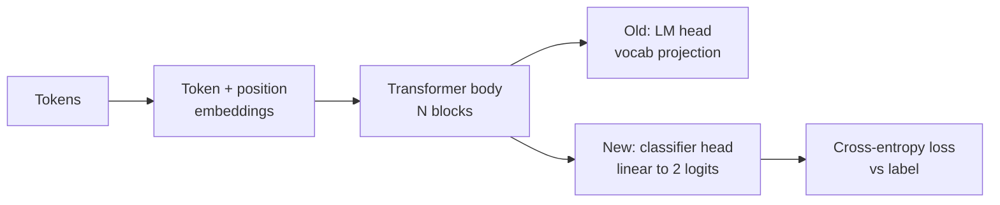
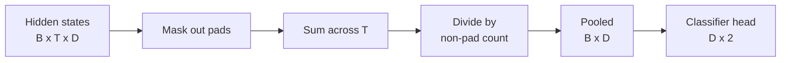
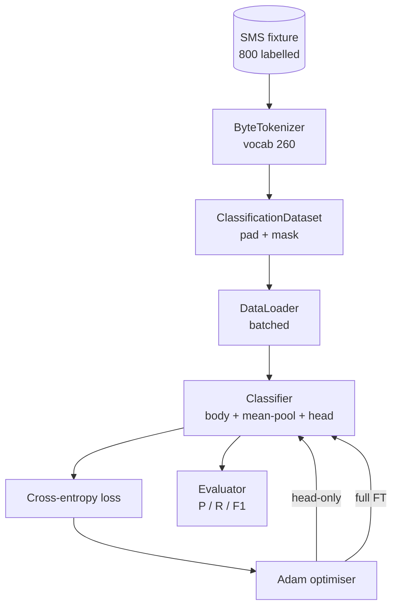

# 结课项目第 38 课:换头微调分类器

> Track B 的第一个结课项目。预训练语言模型是一摞自注意力块,顶端是一个 token 预测头。当你想要的是垃圾短信还是正常短信,头不对,但身体大体是对的。本课把头扯下来,往池化后的表示上粘一个二分类线性层,然后用两种方式训练这个分类器:只训最后一层,和全量微调。评估用留出切分上的精确率、召回率和 F1。你会学到每种策略买到什么、代价是什么。

**类型:** 动手构建
**编程语言:** Python (torch, numpy)
**前置要求:** 第 19 阶段 第 30-37 课(NLP LLM track:分词器、嵌入表、注意力块、Transformer 躯干、预训练循环、检查点、生成、困惑度)
**预计耗时:** 约 90 分钟

## 学习目标

- 在不重新初始化躯干的前提下,把语言模型头换成分类头。
- 实现两种训练范式:冻结躯干(只训头)和全量微调,共用同一个训练循环。
- 构建一条感知分词器的数据流水线:补齐、掩住补齐位、池化注意力输出。
- 从原始 logits 计算精确率、召回率、F1 和混淆矩阵。
- 说清楚参数量、训练时间和上限空间之间的取舍。

## 问题

你在一个通用语料上预训练了一个小 Transformer。输出头把最后的隐状态投到 1000 个 token 的词表上。现在你手上有 800 条标注了垃圾/正常的短信,想要一个二分类器。三个选项摆在面前。

错误选项是从零训练一个新分类器。预训练模型的躯干已经编码了有用的结构:词的身份、位置、简单共现。扔掉它,就浪费了构建它的那份算力。

两个正确选项是:换头且冻结躯干,换头且躯干可训。只训头很快,内存几乎免费,这么点数据也几乎不会过拟合。全量微调更慢,小数据上可能过拟合,但当下游领域偏离预训练语料时,准确率上限更高。

本课两个都建,让你在同一夹具上比较。

## 概念



模型是函数 `f_theta(tokens) -> hidden_states`,头是函数 `g_phi(hidden) -> logits`。换头就是保留 `theta`、换掉 `g_phi`。躯干的参数才是昂贵的那部分,头只是一个线性层。

有两组可训练参数要紧:

- `theta`(躯干):每个注意力块数以万计的权重。
- `phi`(头):`hidden_dim * num_classes` 个权重加一个 bias。

只训头时,你对 `phi` 算梯度,对 `theta` 置零。PyTorch 里把躯干参数的 `requires_grad` 设为 `False` 就行。优化器于是只看得到头,躯干保持冻结。

全量微调时,梯度回流穿过整个堆叠。躯干权重向分类目标漂移。风险是小数据上的灾难性遗忘:躯干的预训练成果被过拟合噪声冲刷掉。

## 池化之问

分类器要的是每序列一个向量,不是每 token 一个向量。三个常见选择:

- **均值池化**:跨序列对隐状态求平均,按注意力掩码加权。
- **CLS 池化**:前面加一个特殊 token,只用它的输出。BERT 就是这么做的。
- **末 token 池化**:用最后一个非补齐 token。GPT 系分类器是这么做的。

本课用带显式注意力掩码加权的均值池化。它最简单,在不同序列长度上信号稳定,也不需要预训练一个 CLS token。



## 数据

800 条短信,垃圾 400、正常 400,由 `code/main.py` 确定性地生成。生成器用固定种子,挑模板、填槽位,产出 5 到 25 个 token 长的消息。真实数据集有这个夹具没有的噪声。这个夹具的意义在于可复现。

数据按 80/20 切分:640 训练、160 测试。切分是分层抽样的,测试集保持 50/50 平衡。一个已知平衡的留出集,让精确率和召回率能被当作诚实的数字来读。

## 指标

二分类,类别 1 为正类(垃圾短信)。计数如下:

- `TP`:预测垃圾,实为垃圾。
- `FP`:预测垃圾,实为正常。
- `FN`:预测正常,实为垃圾。
- `TN`:预测正常,实为正常。

三个头条指标:

- `precision = TP / (TP + FP)`。被标记为垃圾的短信里,真垃圾占几成?
- `recall = TP / (TP + FN)`。真正的垃圾短信里,模型抓住了几成?
- `F1 = 2 * P * R / (P + R)`。两者的调和平均。

混淆矩阵把四个计数打印成 2x2 网格。演示会对两种训练范式各自把它写到 stdout。

```figure
cap-classifier-head-swap
```

## 架构



躯干是个刻意做得很小的 Transformer:词表 260、隐藏 64、4 头、2 块、最长序列 32。小到两种范式都能在 CPU 上九十秒内训到收敛。本课里它不做真正的预训练;取而代之的是 `pretrain_quick` 辅助函数在同一夹具文本上做五个 epoch 的 LM 训练,给躯干一个不平凡的起始点。这样本课保持自包含。

## 你要构建什么

实现是一个 `main.py` 加一个测试模块(`code/tests/test_main.py`)。

1. `ByteTokenizer`:把字节映射到 id,保留一个 pad id。
2. `Block`:一个带多头注意力和前馈层的 Transformer 块,pre-norm。
3. `LMBody`:token 加位置嵌入,外面一摞块。返回隐状态。
4. `MeanPool`:沿序列轴的掩码加权平均。
5. `Classifier`:躯干、池化、线性头。躯干在两种范式间是同一个实例。
6. `freeze_body` 和 `unfreeze_body`:切换躯干参数的 `requires_grad`。
7. `train_classifier`:一个共享循环。接受模型和一个按当前可训参数组配置好的优化器。
8. `evaluate`:跑测试集,返回 `Metrics(precision, recall, f1, confusion)`。
9. `run_demo`:先快速预训练躯干,再训练并评估只训头范式,然后全量范式,打印两份报告,以零退出码结束。

## 为什么这个比较重要

只训头范式通常训得更快,欠拟合也欠得更体面。在这个夹具上,二十个 epoch 的只训头之后,你一般会看到精确率接近 0.9、召回率接近 0.85。全量微调大约多花两倍时间,落点在上下几个百分点以内,取决于随机种子。

本课不评选赢家。它教你读数字、读代价。800 条样本加一个迷你躯干,只训头是正确选择;八万条样本加一个大躯干,全量微调才开始值回票价。你从本课带走的契约是那个 API:同一个 `train_classifier` 函数通吃两种范式,切换只需一次调用。

## 拓展目标

- 加第三种范式:只解冻最后一个块。这有时叫部分微调。代价比全量微调低,学到的比只训头多。
- 加一个学习率调度器。头上用余弦日程、躯干用更小的恒定速率,是常见的生产配置。
- 把均值池化换成学习式注意力池化:一个带单个学习 query 的小注意力层。在长序列上常常胜过均值池化。

实现给你留好了钩子,测试钉死了契约。数字由你去推。
