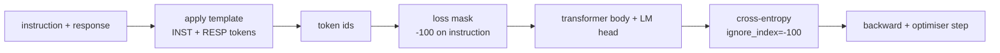
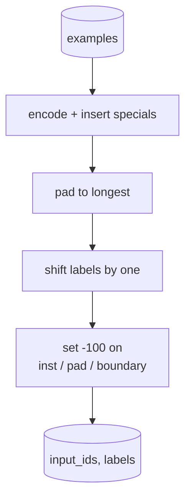
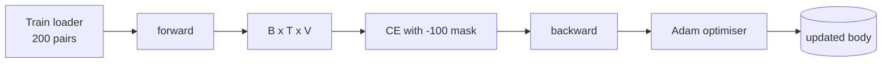

# 结课项目第 39 课:监督微调做指令调优

> 预训练基座模型会续写序列,但不会听从指令。监督微调(SFT)是修好这件事的最小改动:喂给模型一通通"指令—期望回答"配对样本,训练躯干去预测回答部分的 token。诀窍在于,loss 只该算回答,不该算指令。本课构建一个 Alpaca 风格的 SFT 循环,用一个自定义 collate 函数把指令 token 掩成 `ignore_index=-100`,在 200 对指令-回答样本上训练,并在留出切分上用精确匹配评估。

**类型:** 动手构建
**编程语言:** Python (torch, numpy)
**前置要求:** 第 19 阶段 第 30-37 课(NLP LLM track:分词器、嵌入表、注意力块、Transformer 躯干、预训练循环、检查点、生成、困惑度)
**预计耗时:** 约 90 分钟

## 学习目标

- 把指令-回答配对数据格式化成一条带显式边界 token 的因果序列。
- 构建一个掩住指令 token 的 collate 函数,让交叉熵只统计回答 token。
- 在 SFT 目标下训练一个迷你 Transformer 躯干,看着评估指标动起来。
- 实现尊重回答起始边界的贪心生成和温度采样生成。
- 在生成的续写上计算留出精确匹配率。

## 问题

在下一 token 预测上训练出来的基座模型,根本不知道指令是什么。给它看字符串 `"What is the capital of France?"`,它会续写问题,或者凭空造个新句子。模型有语言能力,但没有格式契约。

SFT 契约就是一个字符串模板。每个训练样本变成一条单序列,分三个区域:

```text
<INST> What is the capital of France? <RESP> The capital of France is Paris.
```

边界 token 是训练时保留的特殊 token。模型学到的是:`<RESP>` 之后的一切是回答,被打分的是回答。基座模型的下一 token 目标依然适用,只是训练语料里每个样本都长这样。

但有个坑。如果把整条序列喂给普通的交叉熵 loss,你同时也在训练模型去预测指令 token。指令是给定的,那些位置上你要的梯度是零。修法就是掩码。

## 概念



`ignore_index` 是 `torch.nn.functional.cross_entropy` 的一个特性。任何等于 `ignore_index` 的目标位置,贡献的 loss 和梯度都是零。PyTorch 的约定值是 `-100`。collate 函数为每个样本构建两个张量:`input_ids`(完整序列)和 `labels`(`input_ids` 的拷贝,指令位置被覆写成 `-100`)。

前向时模型看到整条序列,注意力可以关注指令;loss 只统计回答 token。这正是你要的:以指令为条件,预测回答。

## 数据

200 对指令-回答样本由 `main.py` 确定性生成,覆盖六种任务类型:

- 单发事实问答(X 的首都)
- 算术
- 列表提取
- 一句话摘要
- 代码(打印、排序)
- 定义

每种任务有模板化指令和确定性回答。这是刻意从简的:精确匹配很脆,所以本课用的夹具里正确答案就是某个特定字符串。真实 SFT 数据集需要模糊指标,原理则完全相同。

切分是 160 训练、40 测试。测试集覆盖全部六种任务类型,可以报告逐类别的精确匹配率。

## 分词与补齐

分词器是字节级的,保留三个特殊 token:

- `INST_ID = 256`:标记指令区域的开始。
- `RESP_ID = 257`:标记指令与回答之间的边界。
- `PAD_ID = 258`:变长批次的补齐位。

序列形如 `[INST] inst_bytes [RESP] resp_bytes [PAD]*`。collate 函数:

1. 对每个样本分词。
2. 把批次里每个样本补齐到批次内最长序列。
3. 构建 `labels` = `input_ids` 左移一位(因果 LM 目标),并且:
   - 指令区域替换为 `-100`。
   - 补齐区域替换为 `-100`。
   - `RESP_ID` 边界位置本身也替换为 `-100`(不训练模型去预测边界 token;它预测的是边界之后的内容)。



移位是标准的因果技巧:`input_ids` 的位置 `i` 预测位置 `i+1`,所以 `labels[i] = input_ids[i+1]`(输入丢掉最后一个位置,目标丢掉第一个位置)。掩码在移位之后施加,才能落在正确的位置上。

## 训练



循环就是标准的 PyTorch SFT 循环。Adam,学习率 3e-4 到 1e-3,在这个夹具上十到二十个 epoch,不用调度器。模型足够小(隐藏 96、2 块、最长 64),CPU 上两分钟内收敛。

每第五个 epoch,循环在留出集上跑一个小评估并打印精确匹配率。看着精确匹配率从 epoch 一的 0.0 爬到 epoch 十五的 0.85 上下,就是本课的收获时刻:你能看到模型同时学会了格式和答案。

## 生成

评估时,模型拿到指令前缀 `[INST] inst_bytes [RESP]`,然后生成 token,直到:

- 序列达到 `max_len`,或
- 模型触发特殊停止启发式:连续两个句尾字节(`.`、`!`、`?`)。

本课交付贪心解码,外加一个可选的温度采样器。精确匹配用贪心,因为温度会让指标变成随机变量。真实系统常常先采样再模糊评判——那条流水线是第 41 课的内容。

## 精确匹配评估

精确匹配是最严的文本指标。预测的回答字符串先归一化(小写、去首尾空白、压缩连续空格),再与同样归一化的参考回答比较。每个样本的得分非 1 即 0,汇总就是均值。

真实 SFT 流水线会用 token 级 F1(第 41 课)和评判模型来补充精确匹配。精确匹配依然有用,因为它没有歧义:它说 0.7,就是恰好 70% 的测试指令逐字符产出了金标回答。

```figure
cc-sft-loss-mask
```

## 你要构建什么

实现是一个 `main.py` 加测试。

1. `InstructionTokenizer`:带保留特殊 token 的字节级编码器。既能编码指令前缀,也能编码完整配对。
2. `make_dataset`:用固定种子生成覆盖六种任务类型的 200 对样本。
3. `SFTDataset`:每个样本返回 `(input_ids, labels)`,掩码已备好。
4. `sft_collate`:动态补齐,构建批次张量,在指令和补齐位置置 `-100`。
5. `TinyGPT`:Transformer 躯干加绑定或非绑定的 LM 头。
6. `train_sft`:SFT 循环,带逐 epoch 评估钩子。
7. `generate`:从前缀做因果解码,贪心或采样,带停止启发式。
8. `exact_match`:归一化字符串比较,返回 `[0, 1]` 内的浮点数。
9. `run_demo`:构建数据,训练二十个 epoch,评估,打印逐类别明细,成功时以零退出码结束。

## 为什么掩码要紧

没有掩码,loss 就把指令 token 当目标。模型学的是预测指令。这是另一个目标,产出的模型更差,有两层原因。第一,模型容量被浪费在重建用户永远会给定的输入上。第二,大多数批次里指令 token 数量多过回答 token,回答 loss 在梯度总和里占比被稀释——优化器在你真正关心的那部分上的有效学习率,低于你的本意。掩码不是打磨,它就是这个目标本身。

## 拓展目标

- 加学习率 warmup 接余弦衰减。SFT 对学习率比预训练敏感。
- 加逐 token loss 日志,画出训练过程的 loss 曲线。注意早期 epoch 由模板 token(`<RESP>`、常见前缀)主导,后期 epoch 由真正的答案 token 主导。
- 把评估扩展到 BLEU-1 或 chrF。精确匹配会低估那些换个说法给出同样答案的模型。
- 加一个带多轮格式的聊天模板,在包含追问的夹具上训练。

实现给了你格式契约、掩码和循环。从基座模型到指令跟随者,目标的转变就是一个 collate 函数。
