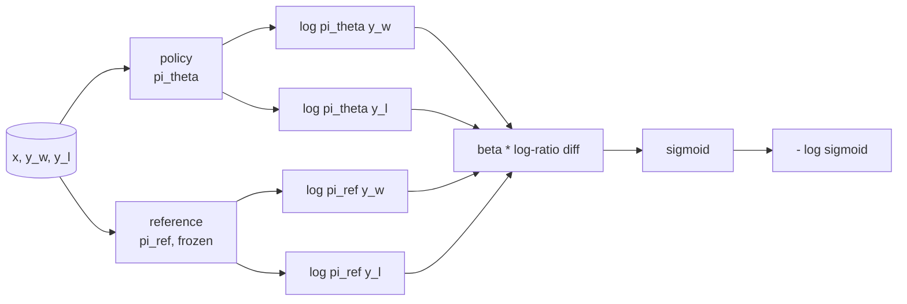
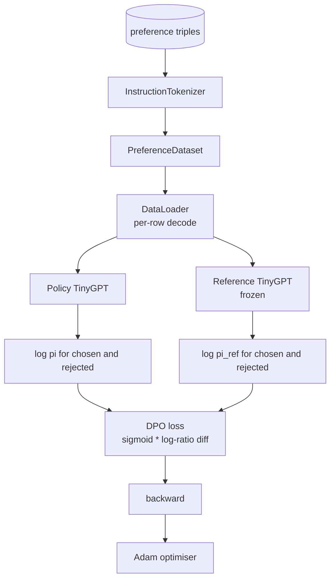

# 结课项目第 40 课:从零实现直接偏好优化(DPO)

> 奖励模型加 PPO 是经典的 RLHF 技术栈。DPO 把这摞东西折叠成一个监督 loss,直接对着偏好对拟合策略。本课从奖励差恒等式推导出 DPO loss,交付一对能跑的参考模型加策略模型,计算逐 token 对数概率,并在一个由优选和劣选续写组成的偏好夹具上训练一个迷你 Transformer。测试钉死 loss 数学和梯度方向,让你确信实现与论文一致。

**类型:** 动手构建
**编程语言:** Python (torch, numpy)
**前置要求:** 第 19 阶段 第 30-37 课(NLP LLM track:分词器、嵌入表、注意力块、Transformer 躯干、预训练循环、检查点、生成、困惑度)
**预计耗时:** 约 90 分钟

## 学习目标

- 把 DPO loss 推导为"经缩放的对数比率之差的 sigmoid",并把它与隐式奖励联系起来。
- 构建参考模型加策略模型的组合:参考冻结,策略可训。
- 在两个模型下计算序列级对数概率,掩住提示词 token。
- 在 `(prompt, chosen, rejected)` 三元组上训练策略,看着优选的对数概率相对劣选抬升。
- 用测试钉死 loss 数学、梯度符号和参考不变性。

## 问题

你有一个 SFT 模型。它会听指令,但输出参差不齐:有的续写干净利落,有的啰嗦或干脆错了。你手上还有一小份偏好对数据集:同一个提示词,人标了一条续写为优选,另一条为劣选。

经典 RLHF 的答案是两段式流水线。先在偏好上训练奖励模型,再用 PPO 对着奖励优化策略。这条路走得通,但昂贵:PPO 期间内存里住着两个模型,还要 KL 控制把策略拴在参考附近,奖励模型一脆弱就出现奖励黑客。

DPO 用一个监督 loss 换掉两个阶段。奖励模型从不显式存在。策略直接在偏好对上训练,带一个朝向 SFT 参考的显式 KL 惩罚。在 Bradley-Terry 偏好模型下最优解相同,代码量少得多。

## 概念

从 Bradley-Terry 模型出发。给定提示词 `x` 和两条续写 `y_w`(优选)、`y_l`(劣选),人类偏好 `y_w` 的概率是:

```text
P(y_w > y_l | x) = sigmoid( r(x, y_w) - r(x, y_l) )
```

其中 `r` 是某个潜在奖励函数。RLHF 先从偏好拟合 `r`,再训练策略 `pi` 在 KL 锚定下最大化 `r`:

```text
max_pi   E_{x, y~pi} [ r(x, y) ] - beta * KL(pi || pi_ref)
```

DPO 推导的关键观察是:这个目标下的最优策略 `pi*` 有一个关于 `r` 的闭式解:

```text
pi*(y | x) = (1/Z(x)) * pi_ref(y | x) * exp( r(x, y) / beta )
```

整理出 `r`:

```text
r(x, y) = beta * ( log pi*(y | x) - log pi_ref(y | x) ) + beta * log Z(x)
```

`log Z(x)` 项对 `y_w` 和 `y_l` 都一样(它依赖 `x`,不依赖 `y`),所以计算偏好差时它消掉了:

```text
r(x, y_w) - r(x, y_l) = beta * ( log pi_theta(y_w|x) - log pi_ref(y_w|x)
                                - log pi_theta(y_l|x) + log pi_ref(y_l|x) )
```

代回 Bradley-Terry 的 sigmoid,对偏好对取负对数似然:

```text
L_DPO(theta) = - E_{(x, y_w, y_l)} [
  log sigmoid( beta * ( log pi_theta(y_w|x) - log pi_ref(y_w|x)
                       - log pi_theta(y_l|x) + log pi_ref(y_l|x) ) )
]
```

这就是那个 loss。它是对每个样本的一个标量做 sigmoid,标量由四个对数概率算出。没有独立的奖励模型,没有 PPO,loss 里也没有 KL 项——KL 约束已经烘进了闭式推导里。



## 梯度的符号

任何训练运行之前,一个有用的健全性检查。对 `log pi_theta(y_w | x)` 求梯度:

```text
d L_DPO / d log pi_theta(y_w | x) = - beta * (1 - sigmoid(z))
```

其中 `z` 是 sigmoid 的输入。它对所有 `z` 都为负,意思是:增大策略对优选续写的对数概率会减小 loss。对称地,对 `log pi_theta(y_l | x)` 的梯度为正:增大劣选对数概率会增大 loss。训练把优选往上推、把劣选往下压。参考是冻结的,纹丝不动。

## 数据

本课附带十二个偏好三元组,每个是 `(prompt, chosen, rejected)`。优选续写简短精确,劣选续写啰嗦、跑题或错误。这些对覆盖与第 39 课相同的任务家族(首都、算术、列表),所以从 SFT 基座出发的策略有个合理的起点。

夹具刻意很小。生产里 DPO 用数以万计的对;这里的重点是,loss 数学和循环在一个微型数据集上端到端跑通,且优选与劣选的对数概率差距肉眼可见地拉大。

## 参考不变性

DPO 实现必须小心处理参考模型。参考就是冻结在原地的 SFT 模型。三条性质必须成立:

- 参考参数永不接收梯度。
- 参考对数概率在不同 epoch 之间永不变。
- 策略从与参考相同的权重出发。(最优 `theta` 是参考加一次学习到的更新;把策略初始化为参考的拷贝,就是那个定义明确的起点。)

实现通过以下方式强制这些性质:

- 前向时用 `torch.no_grad()` 包住参考。
- 把每个参考参数的 `requires_grad` 设为 `False`。
- 参考建好后,用 `policy.load_state_dict(reference.state_dict())` 构造策略。

```figure
cap-dpo-preference
```

## 架构



模型就是第 39 课那个 TinyGPT(decoder-only、因果、字节分词器)。参考和策略共享架构;训练中策略权重从参考那里漂走,参考保持不动。

## 你要构建什么

实现是一个 `main.py` 加测试。

1. `InstructionTokenizer`:带 `INST` 和 `RESP` 特殊 token 的字节分词器。与第 39 课同形状。
2. `TinyGPT`:decoder-only Transformer。与第 39 课同形状,所以即使你跳过第 39 课,本课也自包含。
3. `make_preferences`:返回十二个 `(prompt, chosen, rejected)` 三元组。
4. `sequence_log_prob`:给定模型、提示词前缀和续写,返回续写上逐 token 下一 token 对数概率之和(提示词位置不贡献)。
5. `dpo_loss`:接受四个对数概率和 `beta`,返回逐样本 loss 张量,以及供日志用的隐式奖励差。
6. `train_dpo`:逐 epoch 循环,在策略和参考下计算优选、劣选对数概率,施加 loss,步进 Adam。
7. `evaluate_margins`:返回任意时刻策略下优选减劣选的平均对数概率差。
8. `run_demo`:从一次小型热身预训练构建参考和策略,拷贝权重,训练三十步,打印逐步 loss 和差距,成功时以零退出码结束。

## 为什么 DPO 成立

在 Bradley-Terry 偏好模型下,DPO 与 RLHF 数学等价,差别只到奖励的参数化方式为止。隐式奖励 `r(x, y) = beta * (log pi(y|x) - log pi_ref(y|x))` 从偏好中可辨识,最多差一个 `x` 的函数——而这个差项在求差时消掉。闭式策略让你跳过显式奖励模型。KL 约束是结构性强制:`pi` 偏离 `pi_ref` 越多,对数比率越大,sigmoid 就越饱和,策略走太远时梯度自然衰减。参考就是你的安全网。

## 拓展目标

- 给对数概率求和加长度归一化:除以续写长度。长度偏置是已知的 DPO 失败模式——模型偏爱更短的续写,因为短续写的对数概率绝对值更大。
- 加 loss 的 IPO 变体:把 sigmoid 加 log 换成 `(z - 1)^2`。在夹具上对比收敛。
- 加标签平滑参数,在硬性的优选-劣选标签与均匀的 0.5 之间插值。
- 把参考换成更小更便宜的模型(知识蒸馏风味)。

实现给了你 loss、参考不变性和训练循环。数学是本课的主体,代码让数学落地。
