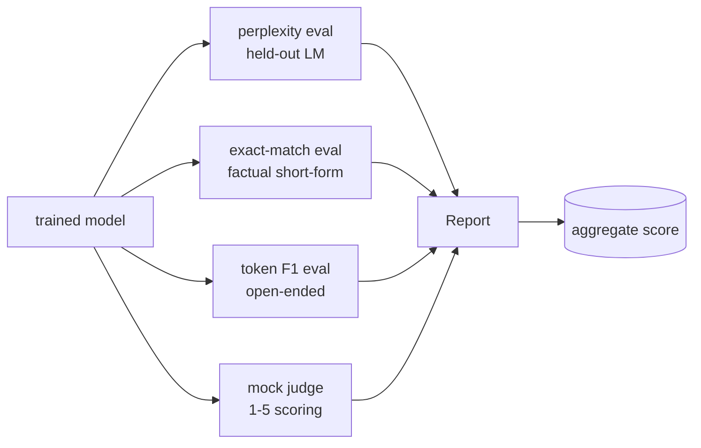
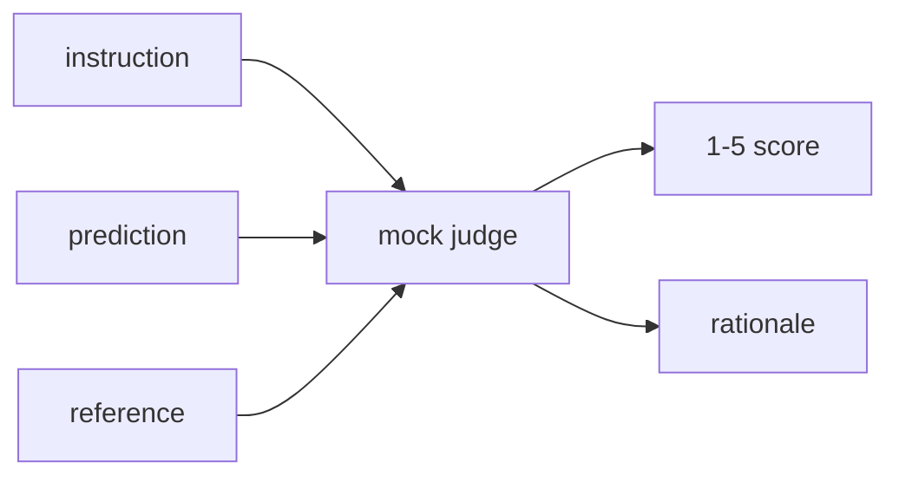
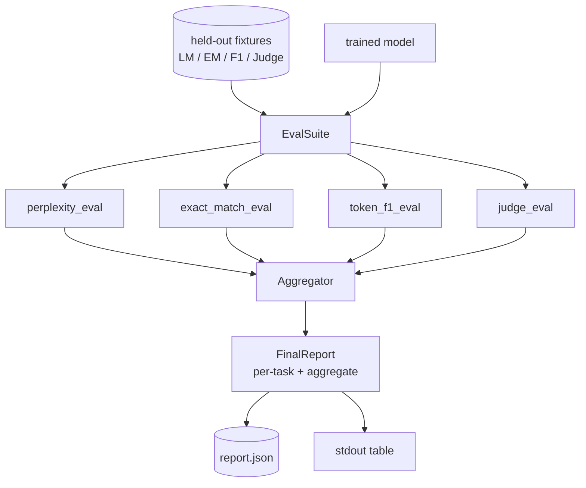

# 结课项目第 41 课:完整评估流水线

> 训练是可以拿 loss 曲线盯着看的部分,评估是必须亲手设计的部分。本课构建一条统一的评估流水线:接受任何训练好的语言模型,在它上面跑四种异质评估,把结果聚合成逐任务报告,并附带一个本地模拟的 LLM 评判员,让整条闭环离线可跑。四种评估覆盖了交付模型必需的四个维度:语言建模(困惑度)、短答题正确性(精确匹配)、开放式相似度(token F1)、定性打分(评判员)。

**类型:** 动手构建
**编程语言:** Python (torch, numpy)
**前置要求:** 第 19 阶段 第 30-37 课(NLP LLM track:分词器、嵌入表、注意力块、Transformer 躯干、预训练循环、检查点、生成、困惑度)
**预计耗时:** 约 90 分钟

## 学习目标

- 在一个迷你 Transformer 上,按掩码 token 记账法计算留出困惑度。
- 在短答事实性提示词上跑精确匹配评估。
- 带归一化地计算预测串与参考串之间的 token 级 F1。
- 构建一个本地模拟 LLM 评判员,按 1-5 分给模型输出打分。
- 把四种评估聚合成一份带逐任务明细的加权报告。

## 问题

单一指标从来描述不了一个语言模型。困惑度说的是模型对语言分布拟合得多好,却对它答不答得对问题只字不提。精确匹配说的是模型产没产出金标字符串,却会惩罚正确的换述。token F1 原谅换述,却会被"词面重叠但内容错误"骗过。LLM 评判员能捕捉定性维度,但又贵又随机。

你真正想要的流水线四个都有。每种评估补上其他评估漏掉的维度,各自跑在为该指标塑形的一份留出数据子集上。最终报告把逐任务数字并排摆开,再给出一个聚合分,审阅者一眼就能看出模型在做什么样的取舍。

本课端到端构建这条流水线,全在一个文件里。

## 概念



每种评估都是一个 `(model, dataset) -> EvalResult` 的函数。结果里带着指标值、供检查的逐样本明细,和一个用于聚合的名字。流水线用一份配置把它们组合起来:跑哪些评估、各配多少权重。

## 困惑度,要数得对

困惑度是 `exp(每 token 平均负对数似然)`。实现有两个坑:

- 均值必须对真实 token 位置求,不能对 batch * sequence 求。分母里混入补齐 token,困惑度就会显得比实际好。
- 模型预测的是下一 token,位置 `i` 的 logits 预测位置 `i+1` 的 token。这里的差一错误是悄无声息的:loss 照样能训练,指标却变得毫无意义。

评估按批次累加非补齐位置上的 `-log p(token)`,并按批次统计 token 数,最后才相除。这在数值上比对逐批次困惑度求平均更安全(那种平均会给短序列过低权重),也与教科书定义一致。

## 精确匹配,要带归一化

框架比较之前,先对预测和参考做同样的归一化:

- 转小写。
- 去首尾空白。
- 内部连续空白压缩成单个空格。
- 若两边只差结尾的终止标点(`.`、`!`、`?`),去掉它。

归一化让精确匹配在实践中有用。说 `"Paris"` 的模型是对的,说 `"Paris."` 的也对,说 `"  paris  "` 的也对。归一化之后,指标仍要求答案是同一个字符串。

## token F1,正确的算法

token F1 是在词袋上算出的精确率与召回率的调和平均。步骤:

1. 归一化预测和参考(规则与精确匹配相同)。
2. 各自切成 token 列表(按空白分词)。
3. 统计多重集交集。
4. 精确率 = `intersection_count / len(pred_tokens)`,召回率 = `intersection_count / len(ref_tokens)`,F1 = 调和平均。

预测和参考都为空时,F1 为 1(空泛匹配);只有一个为空时,F1 为 0。这套规则与 SQuAD 评估参考实现一致,在换述场景下数字稳定。

## 本地模拟 LLM 评判员

真正的评判员是 API 背后的前沿模型。本课的评判员必须离线可跑。模拟评判员是一个确定性打分器:接受指令、模型的预测和参考,返回 `{1, 2, 3, 4, 5}` 中的一个分数,外加一行理由。打分规则是显式的:

- 归一化后预测等于参考,5 分。
- 预测与参考的 token F1 不低于 0.8,4 分。
- token F1 落在 `[0.5, 0.8)`,3 分。
- token F1 落在 `[0.2, 0.5)`,2 分。
- 其余,1 分。

这不是真评判员,但接口是对的。以后换一个真模型,只需改一个函数,流水线不在乎。



## 聚合

聚合分是归一化评估分的加权平均。每种评估报一个 `[0, 1]` 内的数:

- 困惑度:归一化为 `1 / (1 + log(perplexity))`。困惑度 1 映到 1,无穷大映到 0。
- 精确匹配:本来就在 `[0, 1]`。
- token F1:本来就在 `[0, 1]`。
- 评判员:除以 5。

权重可配置。默认配比是困惑度 0.2、精确匹配 0.3、token F1 0.3、评判员 0.2。权重怎么选是产品决策;本课把旋钮暴露出来,让你去试。

```figure
cg-eval-quadrant
```

## 架构



`EvalSuite` 是个薄薄的编排器。每个评估都是独立函数,接受 `(model, tokenizer, dataset, config)`,返回 `EvalResult`。`Aggregator` 收集结果、产出最终报告。演示打印表格,并写一份 JSON 副本供下游 CI 消费。

## 你要构建什么

实现是一个 `main.py` 加测试。

1. `TinyGPT`:与第 38-40 课相同的 decoder-only 架构,收录在此让本课独立成篇。
2. `InstructionTokenizer`:带 INST / RESP / PAD 特殊 token 的字节分词器。
3. 四个夹具:一份 LM 语料、一套 EM 集、一套 F1 集、一套评判集。各 20 个样本,确定性生成。
4. `perplexity_eval`:返回带困惑度值和逐 token loss 直方图的 `EvalResult`。
5. `exact_match_eval`:返回平均 EM 和逐样本记录。
6. `token_f1_eval`:返回平均 token F1 和逐样本记录。
7. `mock_judge` 和 `judge_eval`:逐样本的分数和理由,以及全集平均得分。
8. `Aggregator.normalise`:逐评估的归一化规则。
9. `Aggregator.aggregate`:加权平均和组装好的报告。
10. `run_demo`:快速训练一个迷你模型,跑全部四种评估,打印报告表并写 JSON,成功时以零退出码结束。

## 怎么读这份报告

报告分三层。顶层是聚合分;下面是四个逐评估数字;再下面是逐样本明细,供诊断用。挂掉的 CI 运行通常只看聚合分,但追一次回退的审阅者要的是逐样本明细——看模型在哪些输入上栽了。

JSON 转储用稳定的键,CI 看板可以跨版本画趋势线。美化打印的表格是给训练完盯着终端的人看的。

## 拓展目标

- 加校准评估:模型的 softmax 概率和它的准确率对得上吗?按置信度把预测分桶,报告每桶的经验准确率。
- 加鲁棒性评估:给每个样本打上扰动标签(拼写错误、换述、干扰项),报告每种扰动下的指标跌幅。
- 把模拟评判员换成 HTTP 调用背后的真模型。函数签名不变。
- 加逐任务权重学习:不用固定权重,而是对着一个目标模型偏好序拟合权重。

实现给了你四种评估、聚合器和报告。真实的评估流水线在此之上叠加更多维度;模式不变:一个评估一个函数,一个聚合器,一份报告。
