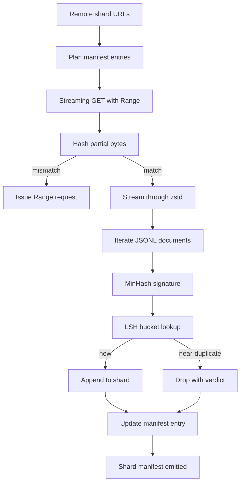

# 大语料下载器

> 语言模型的训练,早在第一次前向之前就开始了。语料得先落盘:解压好、去重好、可寻址,而且断点续传的方案必须在网络断于 4% 之前就想好。本课构建一个流式下载器:拉取压缩分片、用 Zstandard 边下边解压、用 MinHash 加局部敏感哈希给近似重复打指纹,并产出一份流水线下游可以信赖的分片清单。

**类型:** 动手构建
**编程语言:** Python
**前置要求:** 第 19 阶段 第 30-37 课
**预计耗时:** 约 90 分钟

## 学习目标

- 用 `urllib` 流式拉取远程分片,用 `zstandard` 解压,全程不把整个文件缓进内存。
- 对着已验证的字节偏移量发出 HTTP `Range` 请求,续传部分下载。
- 为每篇文档构建 MinHash 签名,并用 LSH 分桶,让近似重复发生碰撞。
- 产出带内容哈希、字节数、文档数和去重裁决的分片清单。

## 问题

第一次在 200 GB 语料上训练,网络断在 41%,脚本带着一个 `urllib` 异常退出;第二次断在 78%;到 99% 那次,你已经把循环重写了三遍。从第一分钟起就必须为两种失败做设计:部分下载的续传,和重复文档的去除。两者都有成熟解法,也都常被跳过——因为流水线起初只是一行 `requests.get`,长着长着露出了獠牙。

续传是 HTTP 问题。服务器得支持 `Range`,客户端得对着磁盘上的记录追踪已验证偏移量,而且这个偏移量得活过进程死亡。偏移量和文件哪怕差一个字节,续传写下的就是垃圾,语料就以一种要到分词阶段才暴露的方式损坏了。

去重是签名问题。精确哈希去重抓不到近似重复:同一篇维基百科条目带着三种不同的样板页脚出现,同一份代码文件换了许可证头,同一篇博客文章每个链接挂着追踪参数。MinHash 加 LSH 以亚线性成本抓住这些。代价是每篇文档一个签名、每个签名一次分桶查询。

## 概念



### 用 `urllib` 流式处理

标准库的 `urllib.request.urlopen` 返回一个类文件对象。把它包进 `zstandard.ZstdDecompressor().stream_reader`,字节就从网络流经解压器进入文档迭代器,压缩分片和解压后的分片从头到尾都不在内存里物化。内存开销只有行缓冲、当前文档的 MinHash 签名,以及 LSH 索引。

### 用 `Range` 续传

下载器为每个分片写两个文件:分片本身和一个 `.partial.json` 检查点。检查点记录 `verified_bytes`、`expected_size`、`sha256_prefix`(对前 `verified_bytes` 字节计算)和源 URL。启动时,下载器读检查点,对磁盘上的字节重算 `sha256_prefix`,只有重算哈希匹配才续传。哈希不对就丢弃部分文件,从字节零重下。静默损坏不可能发生,因为已验证字节是检查出来的,不是假设出来的。

### MinHash 加 LSH

MinHash 用固定空间估计两个集合的 Jaccard 相似度。对文档而言,集合是其文本的 shingle(重叠 n-gram)。签名是 `k` 个最小哈希值,每个来自一个独立哈希函数。Jaccard 相似度为 `s` 的两篇文档,在签名的任何单个分量上达成一致的概率是 `s`。

LSH 再把 `k` 个分量分成 `b` 个带,每带 `r` 行,`k = b * r`。两篇文档至少在一个带上碰撞的概率是 `1 - (1 - s^r)^b`,这是一条围绕 `s` 的陡峭阈值曲线,`(b, r)` 就是按你要的阈值调的。典型语料去重的阈值是 `s = 0.8`,LSH 研究文献给出的配置是 `k = 128`、`b = 32`、`r = 4`。

### 分片清单即契约

下载器唯一的耐久产物是清单。清单按分片记录:URL、解压后字节数、文档数、去重后的唯一文档数,以及最终分片文件的 sha256。下游分词读的是清单,不是目录列表。分片缺失或 sha256 不对,清单会告诉下一阶段拒绝启动。清单就是"数据下载完了"和"数据下载完且可验证"之间的那条分界线。

```figure
cap-corpus-downloader
```

## 动手构建

`code/main.py` 实现:

- `ShardPlanner`——读取分片 URL 列表,产出计划好的清单条目。
- `StreamingDownloader`——打开带可选 `Range` 的 `urllib` 流,写入临时文件,每个数据块更新 `.partial.json` 检查点,续传时验证 sha256 前缀。
- `ZstdDocIterator`——把类文件流包进 `zstandard.ZstdDecompressor`,逐行产出一篇文档。
- `MinHasher`——用一族固定哈希种子为字符串生成 `k` 分量签名。
- `LSHIndex`——按带对签名分桶并报告碰撞。
- `Dedup`——组合哈希器和索引,给每篇文档打上 `keep` 或 `near_duplicate` 标签,附带与之碰撞的分片 id。
- `ManifestWriter`——收集逐分片统计,写出 `manifest.json`。

文件底部的演示在磁盘上构建一个小合成语料,用 `zstandard` 压缩,通过 `file://` URL"下载"它,去重,并打印清单。

运行:

```bash
python3 code/main.py
```

脚本以零退出码结束并打印清单摘要。

## 生产环境里的实战模式

四个模式把本课扩展到真实语料。

**先落检查点,再写字节。** `.partial.json` 必须先 `fsync`,然后才把字节追加进分片。否则一次断电就颠倒顺序:分片字节在盘上,检查点却没记它们;下次续传以为自己已验证的字节比实际少,重复写入的尾部字节就毁掉了文件。先检查点,后写入——这和预写日志是同一套纪律。

**分片的 LSH 索引。** 覆盖整个语料的单个 LSH 索引,在 200 GB 规模下放不进 RAM。按第一个带的哈希对 LSH 索引分区,分区存磁盘,新签名只查它会落入的那个分区。代价是每篇文档多一次磁盘读,收益是 LSH 索引不再是硬内存顶。

**立墓碑,不删除。** 被丢掉的重复文档以裁决 `near_duplicate` 记进清单,附上与之碰撞的文档的分片 id。直接删除会丢失重复文档与其正主之间的链接。立墓碑保留审计轨迹,也让下游环节有机会改变对阈值的主意。

**清单里放逐分片 sha256,再给清单本身一个 sha256。** 清单自身也有内容哈希。下游阶段先验证清单哈希,再信任逐分片条目。缺了这一步,清单就是静默的攻击面:能改一个文件的攻击者就能毁掉整条流水线。

## 投入使用

生产模式:

- **每次 CI 运行都续传。** CI runner 是短命的。下载器必须假设每次运行都是全新磁盘,从缓存或远程恢复。`--cache-dir` 是一等公民参数。
- **先分词前去重。** 分词很昂贵。同一篇文档分词两次,就是同样的 loss 曲线付两倍的钱。去重在分词上游,不在下游。
- **清单当合并闸门。** 训练运行从一个钉死的 commit 读清单 sha256。新数据集版本需要新的清单 commit。代码与数据之间的链接是 git,不是口口相传。

## 交付

在真实项目里,`outputs/skill-corpus-downloader.md` 会描述:哪些 URL 喂给下载器、检查点目录怎么布局、去重用的 shingle 宽度和 `(k, b, r)` 三元组是什么、清单放在版本控制的哪里。本课交付的是引擎。

## 练习

1. 加 `--shingle-width` 参数,量一量宽度 3、5、9 下去重裁决怎么变。为你选的默认值辩护。
2. 通过嗅探魔数,在 zstd 旁边加 gzip 支持。下载器不该要求调用方指定编解码器。
3. 加 `--resume-only` 模式:找不到检查点时拒绝开始全新下载。CI 里有用,防止某次运行意外重拉 200 GB。
4. 把 LSH 索引挪到 shelf 或 sqlite 文件里,对比内存版量吞吐量。
5. 启动时加清单 sha256 检查。磁盘上的清单与 `manifest.lock` 里的清单哈希不一致时,下载器应当闭锁失败。

## 关键术语

| 术语 | 人们口中的说法 | 实际含义 |
|------|-----------------|------------------------|
| Shard | "一个文件" | 语料的一个自包含切片,自带 sha256,是续传和去重的基本单位 |
| MinHash signature | "指纹" | 集合的 `k` 分量素描,每个分量是一个独立哈希在集合上的最小值 |
| LSH band | "桶" | 一组 `r` 个签名分量,当作单个桶键用于碰撞检测 |
| Verified bytes | "续传偏移量" | 磁盘上 sha256 前缀与检查点匹配的字节;唯一安全的续传起点 |
| Manifest | "索引" | 下载器产物的唯一耐久记录,含内容哈希 |

## 延伸阅读

- [RFC 7233](https://datatracker.ietf.org/doc/html/rfc7233)——HTTP Range 请求,续传协议
- [Zstandard format specification](https://datatracker.ietf.org/doc/html/rfc8478)——让流式解压安全的帧格式
- [MinHash](https://en.wikipedia.org/wiki/MinHash)——本课使用的签名家族
- [Locality-sensitive hashing](https://en.wikipedia.org/wiki/Locality-sensitive_hashing)——去重阈值背后的分带方案
- 第 19 阶段 · 43——下载器喂给的 HDF5 分词语料
- 第 19 阶段 · 44——在这个语料上训练的余弦日程
- 第 19 阶段 · 45——消费该日程的 AMP 循环
