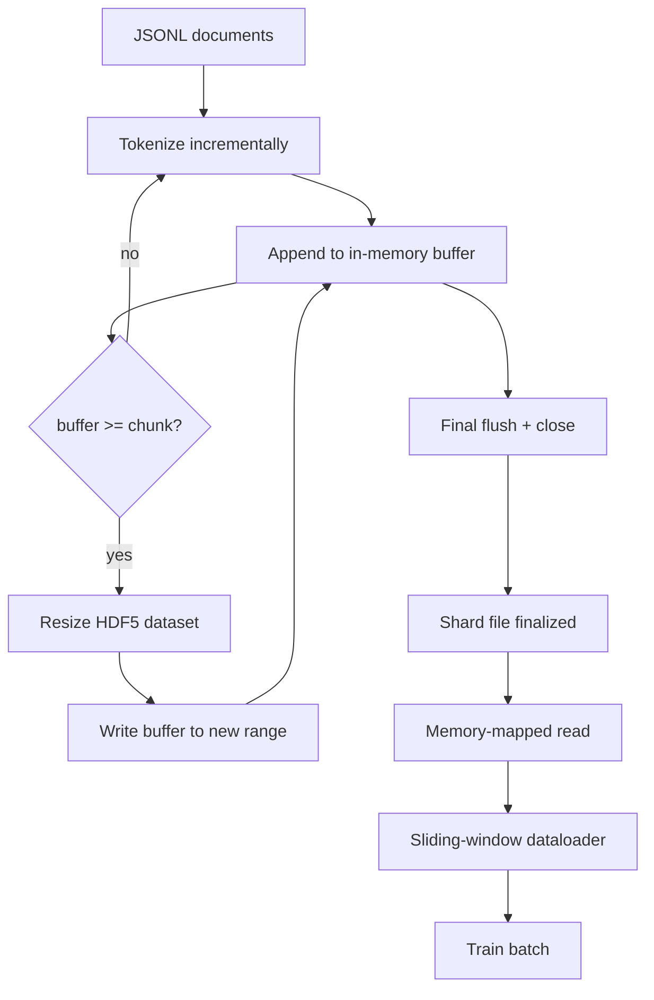

# HDF5 分词语料库

> 下载好的语料必须落成训练器能以行速流读的布局。磁盘上的 JSONL 扛不住 16 个 dataloader worker,可分块、可扩缩的 HDF5 整数数据集扛得住。本课构建:流式分词写入可扩缩 HDF5 数据集、跨多文件的分片写入、训练时的内存映射读取,以及一个按正确打包规则产出定长序列的滑动窗口数据加载器。

**类型:** 动手构建
**编程语言:** Python
**前置要求:** 第 19 阶段 第 30-37 课
**预计耗时:** 约 90 分钟

## 学习目标

- 以确定性分块方式,把文档流式写进可扩缩的 HDF5 整数数据集。
- 把写入分片到多个 HDF5 文件,让失败有界、并行可行。
- 经由 HDF5 页缓存友好的分块布局读回 token,dataloader 只在组批时才拷贝进批次缓冲。
- 实现一个按显式打包规则产出定长训练序列的滑动窗口数据加载器。

## 问题

现代语言模型训练,要在几十个 worker 上以每秒数十万样本的速度读 token。磁盘上的 JSONL 在第一次冷缓存缺页时就死了:JSON 解析慢,文档边界不可寻址,想定位"第 4,217,884 号样本"得扫描整个文件。连压缩得很好的 Parquet 也不合适——训练器要的不是列,而是一条扁平的、可以 O(1) 随机访问的 token 流。

HDF5 合适,因为它提供分块、可扩缩、纯整数的数据集,读取时块对页缓存友好。训练器要 `tokens[3,200,000 : 3,200,8192]` 这一片,HDF5 就把请求的超切片从页缓存拷进一个新分配的 NumPy 数组。代价是每个 worker 一个打开的文件句柄和一个块大小的页缓存足迹——与解码 JSONL 的开销相比可以忽略。

构建侧的问题是让写入诚实。可扩缩数据集很容易用错:一次写一篇文档,HDF5 文件会碎到没法用;一次性 resize 写全部文档,进程一死整片全丢。正确的纪律是先缓冲再扩缩,缓冲区大小与块大小对齐,并且分片写入,把工作负载摊到多个文件上,让一次崩溃最多丢一片。

## 概念



### 可扩缩 HDF5 的正确用法

token 数据集以 `maxshape=(None,)` 和固定 `chunks=(chunk_size,)` 创建。写入流程是:在长度为 `chunk_size` 的 NumPy 数组里缓冲 token,缓冲区一满,数据集恰好扩 `chunk_size`,缓冲区写进新区间。分片结束时,残余缓冲区写进最后一个不完整区间。除最后一次外,每次写入都连续且块对齐;读取方被告知按分片 HDF5 属性里记录的 `token_count` 截断最后一段。

### 分片写入

单个 HDF5 文件是单点故障。流水线并行写分片:第 19 阶段 第 42 课的每个输入分片产出一个 HDF5 输出分片。`shards.json` 索引按分片记录文件路径、token 数、文档数和 token 的 sha256。训练器读 `shards.json` 来计算全局偏移量并校验语料。

### 内存映射读取

训练时,每个 worker 以 `swmr=True` 模式打开自己那份 HDF5 文件,请求 `tokens[start:stop]`。块热了之后,HDF5 的分块布局让这成为页缓存支撑的读取。worker 从不物化整个文件:切片被拷进 dataloader 的批次缓冲,dataloader 组批时再拷进钉住内存的训练张量。热路径上每次块切换一次系统调用,其余全是内存访问。

### 滑动窗口数据加载器

dataloader 是唯一知道训练序列长度的环节。它在全局 token 流里挑一个随机起点,读 `window_size + 1` 个 token,返回 `(input, target) = (tokens[:-1], tokens[1:])`。文档边界不强制:窗口可以横跨两篇文档,中间有一个显式的 `boundary_token_id`,让模型学会利用这个分隔符。这是标准的打包规则,也是新手会忘掉的那条规则——忘掉的下场是语料里 8% 是训练用边界 token、92% 是自然文本。

```figure
cc-hdf5-corpus
```

## 动手构建

`code/main.py` 实现:

- `Tokenizer`——一个字节级的确定性分词器,对演示够用。接口是 `encode(text) -> list[int]` 和 `vocab_size`。
- `HDF5ShardWriter`——打开可扩缩整数数据集,按块大小缓冲 token,以定长步幅扩缩并写入,关闭时把 `token_count` 和 `sha256` 记为 HDF5 属性。
- `ShardedTokenizationPipeline`——迭代输入文档,路由给写入器,产出 `shards.json` 索引。
- `MmapTokenStore`——为内存映射读取打开分片文件,计算全局偏移量,暴露单一 `get_slice(start, stop)` API。
- `SlidingWindowDataloader`——从全局流挑随机窗口,产出 `(input_ids, target_ids)` NumPy 数组。

文件底部的演示构建一个微型内存语料,分词进两个分片,经内存映射打开,跑 dataloader 十个批次,打印每批形状和一个校验和。

运行:

```bash
python3 code/main.py
```

脚本以零退出码结束并打印批次校验和。

## 生产环境里的实战模式

四个模式把本课扩展到真实训练。

**块大小等于典型读取量。** 训练器每个样本读 `window_size + 1` 个 token。把 HDF5 块设为 `window_size` 的倍数,读取就与页缓存对齐。块不匹配,吞吐减半——每个样本都要碰两个块。

**token 数记在属性里,不记在数据集里。** 数据集的尾部切片可能没填满,因为块大小整除不了文档边界。把真实 `token_count` 存为数据集的 HDF5 属性,读取方按这个值截断。少了这一步,读取方会走出末尾、走进零填充 token,模型就学起预测零来。

**分片 sha256,并行校验。** 每个分片有自己的 token 字节 sha256。训练器可以在开训前并行校验所有分片。sha256 错了,运行尽早失败——而不是在十六个小时后的第三个 epoch 才炸。

**两边都开 `swmr=True`,写入方配 `libver="latest"`。** 单写多读模式要求写入方以 `libver="latest"` 打开,预先建每个数据集,再设 `file.swmr_mode = True`。此后写入方每次 resize 后必须调 `dataset.flush()`,以 `swmr=True` 打开的读取 worker 才能看到一致的数据。漏掉 `libver="latest"`,或在结构性改动之后才开 SWMR,是"file is locked"故障的常见来源。

## 投入使用

生产模式:

- **每个源分片一个 HDF5。** 下载器(第 42 课)每个 URL 产出一个分片;分词(本课)每个源分片产出一个 HDF5。1:1 映射让续传和部分失败恢复变得平凡。
- **边界 token id。** 边界 token 是分词器词表的一部分,是 dataloader 唯一注入的 token。若模型应当忽略它,训练 loss 就掩掉它;否则模型会学着把它当序列分隔符用。
- **`shards.json` 是事实之源。** 加新分片就是写 HDF5、算 sha256、追加一条条目。训练器启动时读一次这个文件,永不碰目录列表。

## 交付

在真实项目里,`outputs/skill-hdf5-tokenized-corpus.md` 会描述:哪个分词器喂这条流水线、什么块大小配训练器的窗口、`shards.json` 放在版本控制的哪里、dataloader worker 怎么跨文件分片。本课交付的是引擎。

## 练习

1. 给 HDF5 写入器加 `--compression gzip` 参数,在演示语料上量吞吐代价。为你选的默认值辩护。
2. 给滑动窗口 dataloader 加确定性种子,验证同一种子的两次运行产出完全相同的批次。
3. 加 `--validate` 模式:读每个分片,重算其 token 的 sha256,与 `shards.json` 比对。CI 应在开训前跑这个。
4. 对比块大小等于、半于、两倍窗口大小时的 dataloader 吞吐。报告页缓存效应。
5. 加 `--max-document-tokens` 参数,写入时截断超长文档。与读取时再决定相比,为这种取舍辩护。

## 关键术语

| 术语 | 人们口中的说法 | 实际含义 |
|------|-----------------|------------------------|
| Resizable dataset | "只追加" | `maxshape=(None,)` 的 HDF5 数据集,通过 `resize` 调用以块大小步幅增长 |
| Chunked layout | "HDF5 的存法" | 固定大小的盘上页,内核可内存映射,dataloader 可连续读取 |
| `swmr` mode | "边写边读" | 单写多读模式,让 dataloader worker 安全共享文件 |
| Shard index | "shards.json" | 全部 token 分片的耐久索引,带偏移量和内容哈希 |
| Sliding window | "训练样本" | 全局 token 流的一段定长切片,训练器把它与左移一位的目标配对 |

## 延伸阅读

- [HDF5 chunking documentation](https://support.hdfgroup.org/documentation/hdf5/latest/hdf5_chunking.html)——本课使用的分块可扩缩数据集布局
- [h5py user guide](https://docs.h5py.org/en/stable/)——HDF5 的 Python 绑定
- [NumPy memory mapping](https://numpy.org/doc/stable/reference/generated/numpy.memmap.html)——HDF5 经 h5py 暴露的读侧原语
- 第 19 阶段 · 42——其输出被本课分词的下载器
- 第 19 阶段 · 44——消费本 dataloader 的余弦日程
- 第 19 阶段 · 45——包住训练步的 AMP 循环
