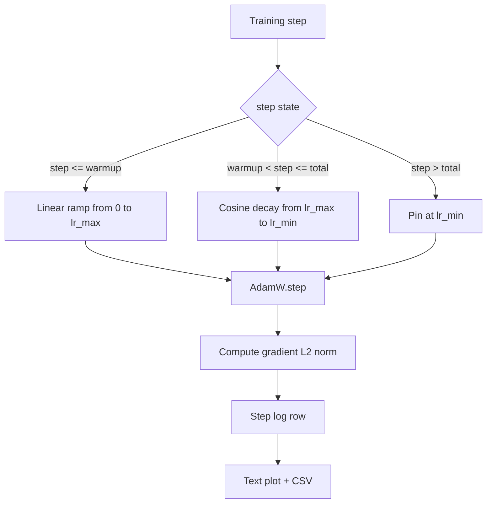

# 带线性 Warmup 的余弦学习率

> 学习率日程是仅次于损失函数的第二重要决策。AdamW 配余弦衰减加线性 warmup,是语言模型训练的现代默认——因为它让模型在脆弱的头一千次更新里看到较小的有效步长,随后爬到配置好的峰值,再平滑地衰减回接近零。本课构建这个日程,画出它在训练步上的曲线,把梯度范数和学习率并排记录,并证明日程严守 warmup、峰值和衰减三处边界。

**类型:** 动手构建
**编程语言:** Python
**前置要求:** 第 19 阶段 第 30-37 课
**预计耗时:** 约 90 分钟

## 学习目标

- 实现一个接线到余弦学习率日程(带线性 warmup)的 AdamW 优化器。
- 算出日程在任意步的精确值,跨运行无浮点漂移。
- 把梯度 L2 范数与学习率并排记录,让训练健康可观测。
- 把日程渲染成肉眼可读的文本图,和任何工具都能消费的 CSV。

## 问题

头一千次训练更新是最喧闹的。模型权重还贴着初始化,优化器的二阶矩滑动估计还没稳定,梯度范数又大又噪。如果学习率在这批更新期间就处在峰值,模型要么直接发散,要么陷进一个再也爬不出来的 loss 平台。两个众所周知的解法是梯度裁剪(第 19 阶段 第 45 课的主题),以及一个从小起步、慢慢爬升的学习率日程。

余弦加 warmup 日程分三段。第 0 步到第 `warmup_steps` 步,学习率从零线性爬到配置好的峰值 `lr_max`。第 `warmup_steps` 步到第 `total_steps` 步,学习率沿余弦曲线的上半支,从 `lr_max` 衰减到 `lr_min`。`total_steps` 之后,学习率钉在 `lr_min`,这样配置出错的训练器跑过头了也不会悄悄滑出日程。

构建侧的问题是:日程太容易写出差一错误。这个差一会以"学习率在模型开始过拟合的那一刻偏高或偏低 1%"的形式,在训练跑了六个小时后现身——除非日程在边界上被穷举测试过,否则根本看不见。

## 概念



### warmup 公式

`step` 在 `[0, warmup_steps]` 内且 `warmup_steps > 0` 时,学习率为 `lr_max * step / warmup_steps`。退化的 `warmup_steps = 0` 情形按"无 warmup"处理:日程在第 0 步直接从 `lr_max` 开始,立刻进入余弦衰减。有些测试框架会传 `warmup_steps = 0`,验证日程仍能产出可用曲线。

### 余弦公式

`step` 在 `(warmup_steps, total_steps]` 内时,学习率为 `lr_min + 0.5 * (lr_max - lr_min) * (1 + cos(pi * progress))`,其中 `progress = (step - warmup_steps) / max(1, total_steps - warmup_steps)`。`step = warmup_steps` 时余弦取 `cos(0) = 1`,给出 `lr_max`,与 warmup 终点严丝合缝。`step = total_steps` 时余弦取 `cos(pi) = -1`,给出 `lr_min`,与衰减终点严丝合缝。

两个端点的连续性不是巧合。这正是日程要实现成关于 `step` 的单一函数、而不是三个胶水函数的理由。胶水日程在你第一次改 `lr_max` 时就会丢一个边界。

### 总步数之后的地板

`step > total_steps` 时学习率保持在 `lr_min`。契约是显式的:日程不报错、不外推,钉在地板上,由训练器记一条警告。需要延长训练的训练器,改的是日程的 `total_steps`,不是循环。

### 梯度范数与学习率并排记录

日程是训练健康的一半,梯度范数是另一半。训练循环每步两者都记。发散的训练运行里,梯度范数尖峰先于 loss 出现;调得好的 warmup 下,范数随学习率线性上升;峰值定得太激进,表现为 warmup 之后范数居高不下。落盘的数据集是 `step, lr, grad_l2_norm, loss`。这份 CSV 是唯一的耐久记录。

```figure
cap-cosine-warmup
```

## 动手构建

`code/main.py` 实现:

- `CosineWithWarmup`——一个无状态函数 `lr(step) -> float`,按配置好的日程求值。
- `TrainState`——把模型、`AdamW` 优化器和日程包进单一步步函数。
- `TrainState.step`——跑一次前向、一次反向,记录梯度 L2 范数,把 `lr(step)` 应用到优化器。
- `plot_schedule_ascii`——把日程渲染成肉眼可读的文本图。
- `write_schedule_csv`——每步一行,输出学习率。

文件底部的演示构建一个迷你 `nn.Linear` 模型,在固定输入批次上训练 20 步,打印逐步的学习率、梯度范数和 loss。日程也会渲染成文本图供目检。

运行:

```bash
python3 code/main.py
```

脚本以零退出码结束,打印逐步训练日志和日程图。

## 生产环境里的实战模式

四个模式把日程提升为生产工件。

**日程住配置里,不住代码里。** 训练器从提交进 git 的 YAML 或 JSON 配置读 `warmup_steps`、`total_steps`、`lr_max`、`lr_min`。日程可复现,因为配置按内容寻址;日程可审计,因为配置是 PR diff 的一部分。

**步数计数器单调,且与 epoch 解耦。** 数据集分片或 dataloader 重启时,有些框架会混淆 step 和 epoch。日程从训练器检查点读 `global_step`,不用本地计数器。恢复的运行能落在正确的日程位置上,因为步数计数器才是那根耐久轴。

**日程图进运行目录。** 每次训练运行把 `outputs/lr_schedule.png`(本课里是文本图)写进自己的运行目录。扫一眼目录的审阅者不用重跑任何东西就能目检日程。这能在 PR 阶段抓住"日程配错"这一类 bug。

**日志行模式固定。** `step, lr, grad_l2_norm, loss`,就这个顺序。下游 notebook 或看板按这个模式读;不改版本号就改列名,等于作废所有现成看板。

## 投入使用

生产模式:

- **先扫峰值,再扫别的。** `lr_max` 是最敏感的旋钮。先在小模型上扫;最优 `lr_max` 随模型规模变化很弱,小模型的扫描结果是强先验。
- **warmup 是总步数的分数,不是绝对数。** 两亿步的运行配 2,000 步 warmup,几乎立刻就到峰值;两万步的运行配同样的数,warmup 占了 10%。按比例配 warmup(典型 1-3%),日程才能随训练时长伸缩。
- **`lr_min` 故意非零。** 设为 `lr_max` 百分之十的地板,让优化器在长尾阶段仍在学习。`lr_min = 0` 的日程,画出来的训练曲线很好看,模型其实没训完。

## 交付

在真实项目里,`outputs/skill-cosine-warmup.md` 会描述:日程住在哪份配置里、全局计数器从训练器的哪一步读、哪次 `lr_max` 扫描产出了部署值。本课交付的是引擎。

## 练习

1. 加一个反平方根变体的日程,在 200 步玩具训练上对比。哪条曲线的最终 loss 更低?
2. 加 `--restart` 参数,在 `total_steps / 2` 处再加一次 warmup。为"热重启在玩具运行上是利是弊"辩护。
3. 加一个日程连续性单元测试:对 `[0, total_steps]` 内每一步,`|lr(step+1) - lr(step)|` 以 `lr_max / warmup_steps` 为上界。
4. 把日程接进 `torch.optim.lr_scheduler.LambdaLR`,让它能与框架代码组合。本课用的是朴素步进函数,包一层改变了什么?
5. 加 `--plot-png` 参数,用 `matplotlib` 写真正的图。为"本课的文本图还是 PNG 更适合 CI 默认"辩护。

## 关键术语

| 术语 | 人们口中的说法 | 实际含义 |
|------|-----------------|------------------------|
| Warmup | "慢启动" | 前 `warmup_steps` 次更新内从零线性爬到 `lr_max` |
| Cosine decay | "平滑下降" | 剩余步数内沿上半支余弦曲线从 `lr_max` 降到 `lr_min` |
| Floor | "训练结束后" | 超过 `total_steps` 后日程钉住的固定 `lr_min` |
| Gradient norm | "梯度的 L2" | 拼接梯度向量的欧几里得范数,每步记录 |
| Global step | "日程轴" | 单调的步数计数器,活过重启,驱动日程 |

## 延伸阅读

- [Loshchilov and Hutter, SGDR: Stochastic Gradient Descent with Warm Restarts (arXiv 1608.03983)](https://arxiv.org/abs/1608.03983)——余弦日程的参考论文
- [Loshchilov and Hutter, Decoupled Weight Decay Regularization (arXiv 1711.05101)](https://arxiv.org/abs/1711.05101)——AdamW 的参考论文
- [PyTorch torch.optim.lr_scheduler](https://docs.pytorch.org/docs/stable/optim.html#how-to-adjust-learning-rate)——步进函数如何与框架调度器组合
- 第 19 阶段 · 42——其语料被本日程消费的下载器
- 第 19 阶段 · 43——与本日程共同演化的数据加载器
- 第 19 阶段 · 45——梯度裁剪与 AMP,循环的下一层
