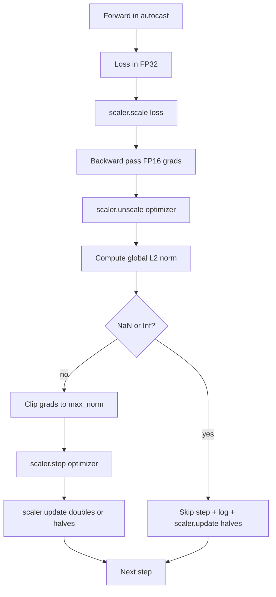

# 梯度裁剪与混合精度

> 上一课的优化器和日程,假设梯度是体面的。梯度通常并不体面。一个坏批次就能把梯度范数冲三个数量级。混合精度训练又在 loss 侧引入 FP16 溢出,把问题放大。本课构建生产训练缺了就不能交付的两条安全带:按配置的全局 L2 范数做梯度裁剪,以及一个带 autocast 和 GradScaler 的混合精度循环——检测 NaN 和 Inf,干净地跳过这一步,并把缩放因子记下来供事后追查。

**类型:** 动手构建
**编程语言:** Python
**前置要求:** 第 19 阶段 第 30-37 课
**预计耗时:** 约 90 分钟

## 学习目标

- 对所有参数梯度计算全局 L2 范数,超过配置阈值时就地裁剪。
- 用 autocast 加 GradScaler 包住训练步,让 FP16 前向和反向扛过溢出。
- 检测 loss 或梯度里的 NaN 和 Inf,跳过优化器步,并记录这次跳过。
- 每步报告 GradScaler 的缩放因子,让一长串跳过立刻可见。

## 问题

昨天还干干净净的训练运行,loss 曲线在第 8,217 步垂直起飞。元凶是单个批次:梯度范数 4,200,是此前峰值的二十倍。没有裁剪,优化器一步下去,模型过去一小时学到的东西全部归零。在范数 1.0 处做全局 L2 裁剪,同一个批次只贡献一次单位范数的更新;loss 留在趋势线上;运行存活。

混合精度训练把前向和反向的大部分放进 FP16,吞吐提升 2-3 倍。代价是 FP16 的指数范围窄。一个在 FP16 里溢出的典型梯度求值为 Inf,Inf 在后续层里传播成 NaN,下一次优化器步就把所有权重置成 NaN。PyTorch 的 GradScaler 这样解:反向前把 loss 乘上一个大缩放因子,优化器步前把梯度除以同一个因子。反缩放时若有任何梯度是 Inf 或 NaN,scaler 跳过这一步并把缩放因子减半;若此前 N 步干净,scaler 把因子加倍。训练过程中,因子会找到 FP16 范围允许的最高值。

构建侧的问题是把两者接线接对。在反缩放之前裁剪,阈值量的是缩放后的梯度;在反缩放之后裁剪,GradScaler 上的操作顺序就有讲究。正确顺序是:`scaler.scale(loss).backward()`,然后 `scaler.unscale_(optimizer)`,然后 `clip_grad_norm_`,然后 `scaler.step(optimizer)`,最后 `scaler.update()`。任何其他顺序都会产出一个悄无声息坏掉的循环。

## 概念



### 全局 L2 范数

全局 L2 范数是拼接后梯度向量的欧几里得范数,不是逐参数范数。PyTorch 的实现是 `torch.nn.utils.clip_grad_norm_(parameters, max_norm)`。函数返回裁剪前的范数,所以本课能同时记下自然值和裁剪值——诊断"我们是不是每一步都在裁剪"时必须两个都有。

### autocast 与 GradScaler

`torch.amp.autocast(device_type)` 是那个有选择地把符合条件的运算(大多数矩阵乘类运算)跑在 FP16 的上下文管理器。`torch.amp.GradScaler(device_type)` 是那个在反向前缩放 loss、优化器步前反缩放梯度的辅助器。两者是配套设计的;只用一个是配置错误,测试应当抓住。

本课用 CPU autocast,因为 CI 上跑的是它;同一模式逐字照搬到 CUDA,只需把 `device_type="cpu"` 改成 `device_type="cuda"`。CPU 上的 GradScaler 是个桩(CPU autocast 默认就走 BF16,不需要 loss 缩放),但本课保留了调用点,让接线与 GPU 循环完全一致。

### NaN 与 Inf 检测

检测发生在两处。第一,反向前用 `torch.isfinite` 检查 loss 本身;Inf 或 NaN 的 loss 产不出有用的梯度,不进优化器直接跳过。第二,`scaler.unscale_(optimizer)` 之后,本课用 `has_non_finite_grad(...)` 扫描反缩放后的梯度,任何 Inf 或 NaN 都按跳过处理。两处检查合起来,盖住前向和反向两种失败模式。

### 缩放因子诊断

缩放因子是 GradScaler 的内部状态。每步本课读 `scaler.get_scale()`,把它与学习率、梯度范数并排记录。健康的运行里,缩放因子以二的幂次爬升,直到在 `2^17` 或 `2^18` 附近饱和。出问题的运行里,因子在高值和低值之间震荡——这信号说明模型的梯度时而在范围内、时而不在。不记录,这个诊断就是隐形的。

```figure
grad-clip-monitor
```

## 动手构建

`code/main.py` 实现:

- `clip_global_l2_norm`——对 `torch.nn.utils.clip_grad_norm_` 的包装,同时返回裁剪前和裁剪后范数。
- `has_non_finite_grad`——扫描梯度找 NaN 和 Inf 的辅助函数。
- `AmpTrainState`——包住模型、`AdamW` 优化器、GradScaler 和 autocast 设备。暴露 `step(inputs, targets)`,跑完整的裁剪、缩放、遇 NaN 跳过流水线。
- `StepLog` 和 `SkipLog`——结构化的逐步记录。
- 一个演示:训练一个小 `nn.Linear` 模型 20 步,在第 5 步往梯度里注入一个 Inf 来走跳过路径,打印结果日志。

运行:

```bash
python3 code/main.py
```

脚本以零退出码结束,打印逐步日志,每行标记 `STEP` 或 `SKIP`;至少有一行是 `SKIP`。

## 生产环境里的实战模式

四个模式把循环提升为生产训练步。

**跳过计数是告警,不是日志行。** 一次训练运行跳过寥寥几步是健康的。每个 epoch 跳过几百步是硬告警:模型进入了 FP16 装不下的区间,循环正在静默失败。本课追踪 1,000 步的滚动跳过率;生产上跳过率超过 5% 就应当叫人。

**裁剪阈值住配置里。** `max_norm = 1.0` 是语言模型训练的现代默认。先在小模型上扫;更大的阈值让模型能从真正困难的批次里恢复,更小的阈值以 loss 曲线更噪为代价兜住最坏情况。阈值与第 44 课的日程放在同一份 YAML 或 JSON 配置里。

**范数日志和日程进同一份 CSV。** CSV 列是 `step, lr, grad_l2_pre_clip, grad_l2_post_clip, loss, skipped, skip_reason, scaler_scale`。打开文件的审阅者在一行里就能看到日程、梯度的故事、缩放因子和跳过结局(带原因)。把这些列拆到多个文件,是分析错位的配方。

**`scaler.update()` 每步都跑,跳过那步也跑。** 干净步上,scaler 读自己的无 inf 计数器,自增,可能把因子加倍;跳过步上,scaler 把因子减半并重置计数器。跳过路径上忘了 `update()`,就是那个"缩放因子怎么永远不变"的 bug。

## 投入使用

生产模式:

- **autocast 设备与优化器设备一致。** GPU 训练用 `torch.amp.autocast(device_type="cuda")`,CPU 用 `torch.amp.autocast(device_type="cpu")`。混用设备会产出静默的类型错误,表现为 loss 曲线看着正常、模型却没在学。
- **反向前先查 loss。** `torch.isfinite(loss).all()` 是一次张量归约;开销可忽略,而在 NaN loss 上省下的是整个训练步。永远跑它。
- **`zero_grad` 里用 `set_to_none=True`。** 把梯度设为 `None` 而不是零,优化器就能跳过未受影响参数组的计算。这个设置是白捡的吞吐提升,还略微缩小了 bug 面。

## 交付

在真实项目里,`outputs/skill-clip-amp.md` 会描述:训练步用哪个裁剪阈值和 autocast 设备、逐步 CSV 放在版本控制的哪里、生产跳过率的告警阈值是多少。本课交付的是引擎。

## 练习

1. 把合成的 Inf 注入换成真实的 loss 尖峰(把某批次的目标乘 1e8),验证跳过路径被触发。
2. 加 `--bf16` 模式,把 autocast 从 FP16 切到 BF16。BF16 的指数范围比 FP16 宽,几乎不需要 loss 缩放;在同一个演示上验证跳过率降到零。
3. 加一个单元测试:没有发生裁剪时,梯度裁剪包装正确返回裁剪前和裁剪后范数。
4. 加滚动窗口跳过率计算,加一个 CLI 参数:跳过率连续 100 步超过配置阈值就让运行失败。
5. 把循环接上写规范 CSV(`step, lr, grad_l2_pre_clip, grad_l2_post_clip, loss, skipped, skip_reason, scaler_scale`),每行落盘后 flush,确认文件能活过 Ctrl-C。

## 关键术语

| 术语 | 人们口中的说法 | 实际含义 |
|------|-----------------|------------------------|
| Global L2 norm | "裁剪目标" | 所有可训练参数的拼接梯度向量的欧几里得范数 |
| autocast | "混合精度" | 在 `with` 块内有选择地以 FP16(或 BF16)执行符合条件的运算 |
| GradScaler | "loss 缩放器" | 反向前乘 loss、优化器步前反缩放梯度的辅助器 |
| Skip | "坏步" | 因梯度或 loss 非有限而被拒绝的优化器步;scaler 把因子减半 |
| Scaling factor | "scaler 状态" | GradScaler 当前的乘数;干净段后加倍,每次跳过后减半 |

## 延伸阅读

- [Micikevicius et al., Mixed Precision Training (arXiv 1710.03740)](https://arxiv.org/abs/1710.03740)——loss 缩放的原始提案
- [Pascanu, Mikolov, Bengio, On the difficulty of training recurrent neural networks (arXiv 1211.5063)](https://arxiv.org/abs/1211.5063)——梯度裁剪的参考论文
- [PyTorch torch.amp.GradScaler](https://docs.pytorch.org/docs/stable/amp.html)——本课包装的 scaler API
- [PyTorch torch.nn.utils.clip_grad_norm_](https://docs.pytorch.org/docs/stable/generated/torch.nn.utils.clip_grad_norm_.html)——本课使用的裁剪原语
- 第 19 阶段 · 42——其语料喂给本循环的下载器
- 第 19 阶段 · 43——本循环消费的数据加载器
- 第 19 阶段 · 44——与本循环组合的日程
