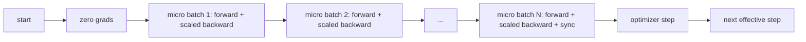
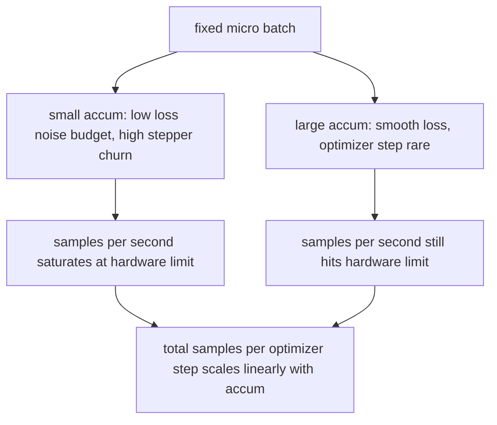

# 梯度累积

> 在你负担不起的有效批次上训练——一次一个微批次。缩放 loss,压住优化器步,让梯度堆起来。

**类型:** 动手构建
**编程语言:** Python
**前置要求:** 第 19 阶段 第 42-45 课
**预计耗时:** 约 90 分钟

## 学习目标

- 推导有效批次恒等式:`effective_batch = micro_batch * accum_steps`。
- 实现逐微批次的 loss 缩放,让累积梯度与单次全批次反向一致。
- 到最后一个微批次才做优化器同步(末步同步)。
- 读懂"吞吐量对有效批次"曲线,解释收益递减。

## 问题

你想在 512 的有效批次上训练,因为那个规模下 loss 曲线更平滑、优化器步更有意义。桌上的加速器塞 32 个样本就内存见底。批次翻倍不行,模型减半不行。这个领域 2017 年捡起、之后再没放下过的技巧是:跑 16 次反向,让梯度堆在参数缓冲里,计数到了目标才步进一次优化器。

风险在于,loss 不再是大批次下的那个数。朴素地把 16 个微批次的交叉熵求和,是一次全批次 loss 的 16 倍。不缩放,梯度方向对、幅度错,优化器步大了 16 倍。修法是一次除法,而这次除法也很容易忘。

## 概念



契约很短:

- 每个微批次的 loss 在 `backward()` 之前除以 `accum_steps`。PyTorch 默认把梯度加进 `param.grad`;这次除法把滚动求和拉回正确的尺度。
- 优化器步每个有效批次点火一次,在最后一个微批次的反向之后。累积中途步进,会带歪本次运行余下部分依赖的每个参数。
- 优化器状态(动量缓冲、Adam 矩)每个有效步推进一次,不是每个微批次一次。否则指数滑动平均看到的频率是错的,日程会被烧穿。
- 单设备上这只是簿记。多 rank 集群上,同一模式用 `no_sync` 上下文包住非末尾微批次,跳过梯度 all-reduce;最后一个微批次一次归约整个累积梯度,而不是把网络开销付 N 次。

### 用代码写的等价性证明

```python
loss = criterion(model(x_full), y_full)
loss.backward()
opt.step()
```

等价于

```python
for x, y in chunks(x_full, y_full, n):
    scaled = criterion(model(x), y) / n
    scaled.backward()
opt.step()
```

(至多差浮点求和顺序。)循环结束时,累积梯度缓冲与单次全批次反向产出的是同一张量。本课代码在 `equivalence_check` 里用 max-abs 差小于 1e-4 断言了这一点。

### 开销去了哪里

每个微批次花一次前向加一次反向。用累积,你拿内存换时间。`outputs/accum-curve.json` 里的吞吐曲线展示了微批次固定、有效批次增大时会发生什么:



没有免费的午餐。`accum_steps` 翻倍,每个优化器步的墙钟时间翻倍。改变的是梯度估计的方差:同样的墙钟预算下,优化器步数更少了,但每一步平均过的样本更多。文献把大批次和小批次当作不同的优化问题对待;本课讲的是机械部分,不是统计部分。

```figure
cc-grad-accumulation
```

## 动手构建

`code/main.py` 是可运行工件,做三件事。

### 第一步:等价性检查

`equivalence_check()` 用同种子构建同一网络的两个拷贝。一个在一次前向里看 16 个样本的批次;另一个看 4 个 4 样本的块,loss 除以四。函数比较优化器步前的梯度缓冲和步后的参数。断言是 `max_abs_diff < 1e-4`。

### 第二步:末步同步模式

`train_one_optimizer_step` 遍历微批次。除最后一个外,每个微批次都进入 `no_sync_context(model)`。单进程上这个上下文是无操作;DDP 上,梯度 all-reduce 就在这里被跳过。簿记两者相同。`sync_counter` 记录我们离开 no_sync 作用域的次数:N 个微批次,每个有效步计数为一,而不是 N。

### 第三步:吞吐曲线

`sweep_effective_batches` 用固定微批次和一组累积步数跑同一个模型。每组配置记录:

- `samples_per_sec`:总样本数除以墙钟时间
- `median_step_ms`:每个有效步的 50 分位毫秒数
- `sync_calls`:实际走过的集合通信点数
- `avg_loss`:本次扫描所有优化器步的平均 loss

输出落进 `outputs/accum-curve.json`,可从 notebook 复用。

运行:

```bash
python3 code/main.py
```

脚本依次打印等价性差值、扫描表和 JSON 路径。退出码为零。

## 投入使用

生产训练里,梯度累积藏在一个旋钮后面。PyTorch 的式子是 `accumulation_steps = effective_batch // (micro_batch * world_size)`。那些这里不许你用的框架包的是同一个循环,步骤也一样:缩放 loss、非末尾微批次跳过同步、累积、步进一次。

野外的三个模式:

- 微批次大小按喂饱设备内存来选。再小浪费加速器周期,再大直接崩。
- 有效批次从学习率日程反推。大有效批次需要按比例放大的学习率和 warmup;这就是 2017 年以来一直在谈的线性缩放规则。
- 累积数是连接前两者的桥,也是你不重写数据加载器就能在运行时自由调整的唯一旋钮。

## 交付

`outputs/skill-gradient-accumulation.md` 把这份配方记下来,好让同事能把它丢进新仓库:loss 按 `accum_steps` 缩放、非末尾微批次跳过优化器同步、每个有效批次步进一次优化器、把"吞吐量对有效批次"记成 JSON 让取舍可见。

## 练习

1. 用 `--num-steps 100` 重跑扫描,画出每秒样本数对有效批次的曲线。曲线在哪里走平?
2. 加一个错误缩放变体(不做除法),展示第 1 步时与参考的参数差。
3. 把 SGD 换成 AdamW,确认优化器状态每个有效步推进一次,而不是每个微批次一次。
4. 引入真正的 `DistributedDataParallel` 包装,把 `no_sync_context` 路由到它的方法。确认每个有效批次的 sync_calls 减少 N-1。
5. 修改等价性检查,比较两种不同的微批次切法(2x8 对 4x4),并解释你需要放宽的容差。

## 关键术语

| 术语 | 人们口中的说法 | 实际含义 |
|------|-----------------|------------------------|
| Micro batch | 你前向的那个批次 | 单次前向能塞进内存的那个切片 |
| Accum steps | 每步的反向次数 | 一次优化器步之前求和的反向次数 |
| Effective batch | 那个批次 | 微批次乘累积步数,再乘数据并行 world size |
| Loss scaling | 除以 N | 逐微批次除法,让求和梯度与全批次一致 |
| Sync on last | 跳过其余 | 只在窗口内最后一次反向上跑梯度集合通信 |

## 延伸阅读

- PyTorch 文档中关于 `DistributedDataParallel.no_sync` 的部分——末步同步技巧的生产版本。
- Goyal et al., 2017——大批次训练的线性缩放规则,关心有效批次的经典理由。
- PyTorch issue tracker 上关于梯度累积与混合精度反缩放交互的讨论。
- 第 19 阶段 第 42-45 课——本课假设的模型、数据加载器、优化器和训练器脚手架。
- 第 19 阶段 第 47 课——检查点与恢复,让长累积运行活过墙钟上限。
