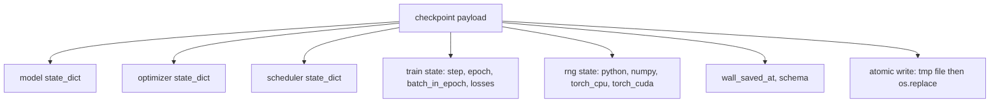
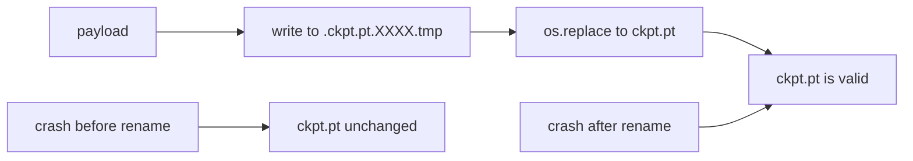
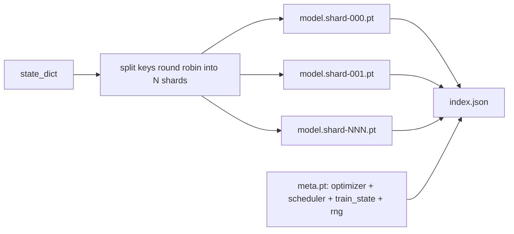

# 检查点保存与恢复

> 训练中断会杀死运行,检查点让运行续命。把模型、优化器、调度器、loss 历史、步数计数器和 RNG 状态原子地存下来,任何时刻被杀,磁盘上留下的都是一个有效文件。

**类型:** 动手构建
**编程语言:** Python
**前置要求:** 第 19 阶段 第 42-45 课
**预计耗时:** 约 90 分钟

## 学习目标

- 把完整训练状态捕获进单个载荷,能装进一个全新的进程。
- 用"先写临时文件再改名"实现原子保存,崩溃永远不留下半写文件。
- 恢复 Python、NumPy、PyTorch 的 RNG 状态,让恢复后的 loss 与不中断基线一致。
- 为再也装不进单文件的模型构建分片检查点布局,带哈希校验的分片和 JSON 索引。

## 问题

你排了一个 18 小时的训练任务。墙钟上限是 4 小时。集群在第 11 小时重启了,因为某个你职级之上的人批准了一次内核升级。没有检查点,从头再来。没有恢复,你还丢掉优化器花 11 个小时学出来的状态——就算模型权重幸存,AdamW 的矩也没了,下一步会朝一个训练轨迹早已越过的方向踉跄走去。

正确的工件是一个单文件,装着继续训练所需的一切:模型参数、优化器状态、调度器状态、画曲线用的 loss 历史、当前步数/epoch/epoch 内批次计数器,以及每个随机源的 RNG 状态。少了 RNG 状态,恢复后的 loss 曲线就是另一条曲线。同一个模型,同一份数据,不同的 shuffle,不同的 dropout 掩码,看板上不同的数字。

原子保存是契约的另一半。直接往最终文件名里写,写到一半崩溃就留下损坏文件,恢复读到的是垃圾。往同目录的临时文件里写、再改名,写到一半崩溃,上一个好文件原封不动。改名在 POSIX 文件系统上是原子的。

## 概念



### 五个状态桶

| 桶 | 为什么要紧 |
|--------|----------------|
| Model | 权重和缓冲;模型之所是。 |
| Optimizer | 动量和自适应矩;少了它们,下一步就是另一个优化问题。 |
| Scheduler | 学习率处在曲线的哪个位置;余弦日程尤其在乎。 |
| Train counters | 步数、epoch、epoch 内批次,外加画出看板的 loss 历史。 |
| RNG state | dropout、数据打乱和模型内一切采样的确定性。 |

### 原子保存



两条规则。第一,临时文件与目标同目录,改名才待在同一个文件系统内——跨设备改名不是原子的。第二,临时名每次尝试都唯一,两个写入者不会互踩。

### 分片检查点

模型变大后,单文件载荷加载太慢、检查太难,网络共享读到一半抖一下就要命。修法是把参数状态拆成分片,再写一个小索引把它们串起来。



索引记录分片数、每个分片的 sha256 和 meta 文件的 sha256。任何哈希不匹配,加载器响亮地失败。分片可以落在不同物理盘上;meta 很小,先读。

### 恢复到 epoch 中途

一个直接跳到下一 epoch 开头的恢复,浪费几分钟到一天不等。修法是 `(epoch, batch_in_epoch)` 加 RNG 状态。加载后,训练循环把随机数生成器快进到当前 epoch 已消费批次之后,从 `batch_in_epoch` 继续。本课代码做的就是这件事;断言是恢复后的 loss 轨迹与不中断基线在 1e-4 以内一致。

```figure
cc-atomic-checkpoint
```

## 动手构建

`code/main.py` 提供四个原语和一个演示驱动。

### 第一步:捕获和恢复 RNG 状态

`capture_rng_state` 返回一个字典,含 Python 的 `random.getstate`、NumPy 的 `np.random.get_state`、PyTorch CPU 和 CUDA 的 RNG 字节。`restore_rng_state` 做逆操作。CPU 张量是一个 uint8 字节缓冲,PyTorch 的 RNG 知道怎么消费。

### 第二步:原子保存

`atomic_save` 把载荷写进目标目录的临时文件,再 `os.replace` 换进最终文件名。`atomic_write_json` 对分片索引做同样的事。

### 第三步:完整检查点往返

`save_checkpoint` 把模型、优化器、调度器、训练状态和 RNG 打进一个字典。`load_checkpoint` 做逆操作,返回一个 `TrainState`。schema 字段是升级钩子:未来的格式变更提升版本字符串,加载器按版本分发。

### 第四步:分片变体

`save_sharded_checkpoint` 把参数键轮转分到 N 个分片,每个分片各自走原子保存,另写一个含优化器、调度器和训练状态的 meta 文件,再写带分片 sha256 的 JSON 索引。`load_sharded_checkpoint` 合并前先校验每个分片。

### 第五步:恢复演示

`run_resume_demo` 训练一个小模型 `total_steps` 步,在 `interrupt_at` 存一个检查点,然后继续。第二个进程恢复检查点,跑完剩余步数。函数返回中断点之后两条 loss 轨迹的最大绝对差。RNG 恢复后,差值为零或浮点噪声。

运行:

```bash
python3 code/main.py
```

单文件和分片两个演示都断言 max-diff 在 1e-4 以内。摘要落进 `outputs/resume-demo.json`。

## 投入使用

生产训练栈把检查点作为训练器的一部分交付。形状相同:模型 + 优化器 + 调度器 + 计数器 + RNG,原子写入,按步数命名,最新的一眼能找到。分片布局支撑大模型的并行读取加载;index.json 是让它转起来的东西。

三条要执行的规则:

- **schema 是载荷里的一个字符串。** 迁移按它分支。没有它,改格式就得砸旧运行。
- **每个分片都 sha256。** 静默截断的下载是最坏的那种 bug;加载器要么快速失败,要么很晚才失败。
- **检查点节奏要诚实。** 每 N 步存一次、每隔若干墙钟分钟也存一次,取两者中更短的。否则那次崩溃的长步,会浪费整整一个窗口的工作。

## 交付

`outputs/skill-checkpoint-save-resume.md` 是任何新训练脚本都能用的配方:载荷形状、原子写入、RNG 捕获、分片索引。把这份技能丢进仓库,在周期保存点接上 `save_checkpoint`,在启动处接上 `load_checkpoint`,运行就能活过各种 kill。

## 练习

1. 把轮转分片换成按参数组分片(以 `.weight` 结尾的层对 `.bias` 结尾的层)。什么场景下哪种布局更好?
2. 扩展保存循环:只保留最近 K 个检查点,剪掉更老的。磁盘小时 K 取多少合适?
3. 加 `--ckpt-every-seconds` 参数,按墙钟间隔触发保存,而不只按步数。
4. 加一个启动时运行的校验路径:扫描目录里每个检查点,报告哪些是坏的。
5. 实现 `migrate_v1_to_v2`:给载荷加一个新字段并提升 schema 字符串。让 load 同时容忍两个版本。

## 关键术语

| 术语 | 人们口中的说法 | 实际含义 |
|------|-----------------|------------------------|
| Atomic save | "写完祈祷" | 写进同目录临时文件,再 os.replace 进目标名 |
| State dict | "权重" | 以参数名为键的模型参数和缓冲 |
| Sharded checkpoint | "大模型文件" | 每分片一个文件,外加一个 meta 文件和一个带 sha256 的 JSON 索引 |
| RNG state | "随机种子" | python random、numpy、torch CPU、torch CUDA 的捕获状态;不只是种子 |
| Mid-epoch resume | "重启" | 快进 RNG,从同一 epoch 的下一批次继续 |

## 延伸阅读

- POSIX `rename` 语义——`os.replace` 原子性断言所依赖的东西。
- PyTorch 关于 `torch.save` 和 `torch.load` 的文档,含跨设备恢复的 `map_location`。
- 第 19 阶段 第 46 课——本课检查点载荷要活过去的梯度累积。
- 第 19 阶段 第 48 课——本方案要容纳其 state dict 格式的分布式包装。
- Linux 内核 `fsync` 文档——原子改名背后耐久性保证。
