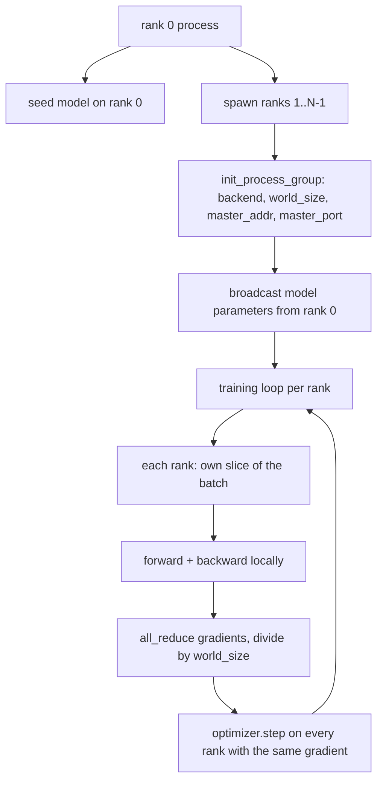
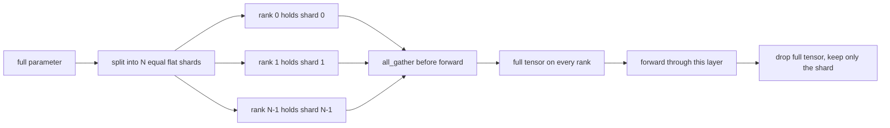

# 从零实现分布式数据并行与 FSDP

> 多 rank 训练就是两个集合通信加一条规则。启动时广播参数,反向后平均梯度,永远不让各 rank 对自己在哪一步产生分歧。

**类型:** 动手构建
**编程语言:** Python
**前置要求:** 第 19 阶段 第 42-45 课
**预计耗时:** 约 90 分钟

## 学习目标

- 用 `gloo` 后端拉起一个跨 N 个 rank 的进程组,不需要特殊硬件。
- 实现一个最小 DDP 包装:构造时广播参数,反向后 all-reduce 梯度。
- 证明逐 rank 梯度的 all-reduce 结果,与单进程在拼接输入上的梯度一致。
- 勾勒 FSDP 参数分片:每个 rank 持有一片,前向时聚拢完整张量,用完即弃。

## 问题

模型装得进一台设备,数据集装不进。优化预算说,你要在每墙钟秒里看到 N 倍的样本。第一根杠杆是数据并行:每个 rank 在批次的不同切片上跑同一个模型,优化器步之前平均梯度。第二根杠杆是 FSDP:模型也装不下一台设备了,于是每个 rank 只持有每个参数的一段,前向时逐层重建完整张量。

痛点在簿记。参数在 rank 之间漂移,运行就静默坏掉。只平均梯度不平均 loss,看板就撒谎。集合通信后端对拓扑达不成一致,运行就永远挂起。修法是亲手把集合通信写一遍,从此不信任何你复现不出来的包装。

本课在 CPU 上跑,不假设 CUDA。`gloo` 后端随每个 PyTorch 构建发布,接受 `torch.multiprocessing` worker;同一份代码在多 GPU 节点上切到 `nccl`,结构不变。

## 概念



### 要紧的两个集合通信

| 集合通信 | 做什么 | 何时用 |
|------------|--------------|------|
| `broadcast` | 把一张量从一个 rank 拷给所有其他 rank | 参数初始化、调度器状态、任何一对全同步 |
| `all_reduce` | 跨所有 rank 对张量求和(或均值、或最大值),每个 rank 都拿到结果 | 反向后的梯度平均 |
| `all_gather` | 每个 rank 贡献一张量,每个 rank 拿到拼接结果 | logits 收集、FSDP 参数去分片 |

DDP 契约是构造时 `broadcast`、反向后 `all_reduce`。FSDP 素描在每层前向之前再加 `all_gather`。

### 梯度平均与单进程梯度一致

在 N 个 rank 上对 B 个样本的批次训练模型,产出的梯度必须等于单进程在 N*B 批次上的梯度。诀窍在于:逐 rank 梯度求和再除以 N,得到的是平均 loss 的梯度——这正是 mean 归约的交叉熵在全批次上会产出的东西。本课代码断言手工 all-reduce 梯度与参考单进程梯度之间的 max-abs-diff 小于 1e-3。

### FSDP 素描



内存收益是精确的:每 rank 的参数内存降到 1/N。代价是聚拢,每次前向都付一遍。生产 FSDP 把聚拢与上一层的计算重叠起来,墙钟开销远小于朴素账面的预测。本课对每个参数做完整往返,并断言重建结果与原张量逐位相等。

### CPU 与 gloo 后端

CUDA 是生产目标,但同样的代码路径在 CPU 上也存在。`gloo` 是 CPU 集合通信后端,比 GPU 上的 `nccl` 慢几个数量级,但 API 表面一模一样。本课的进程组用 `backend="gloo"` 初始化,rank 用 `torch.multiprocessing` 而不是 `torchrun` 拉起;两条路最终都走到同样的 `torch.distributed` 调用。多 GPU 节点上,要改的只有 `backend="nccl"`、设备张量,以及用 `torchrun` 启动。

```figure
cg-allreduce-ring
```

## 动手构建

`code/main.py` 是可运行工件。

### 第一步:拉起进程组

```python
os.environ["MASTER_ADDR"] = "127.0.0.1"
os.environ["MASTER_PORT"] = str(port)
dist.init_process_group(backend="gloo", rank=rank, world_size=world_size)
```

`MASTER_ADDR` 和 `MASTER_PORT` 是会合点:每个 rank 拨同一台主机的同一个端口。本课用一个 bind-and-close 技巧挑空闲端口,避免多个运行共享机器时撞车。

### 第二步:构造时广播

`MinimalDDP.__init__` 遍历每个参数和缓冲,调用 `dist.broadcast(tensor, src=0)`。rank 0 的值成为规范初始化。少了这一步,每个 rank 用自己的种子初始化,从第一步起就各奔东西。

### 第三步:反向后 all-reduce 梯度

```python
def all_reduce_grads_(module, world_size):
    for p in module.parameters():
        if p.grad is None:
            p.grad = torch.zeros_like(p.data)
        dist.all_reduce(p.grad.data, op=dist.ReduceOp.SUM)
        p.grad.data.div_(world_size)
```

每个 rank 最终拿到同一份平均梯度。优化器步于是成为每个 rank 上同一输入的函数——这就是整个运行中参数保持同步的原因。

### 第四步:证明等价

`manual_all_reduce_matches_single_process` 在 rank 0 上构建同一个模型,把 all-reduce 后的梯度与单进程在拼接输入上算出的梯度对比。max-abs-diff 在 1e-8 上下。

### 第五步:FSDP 往返

`fsdp_round_trip_sketch` 把每个参数摊平,补齐到 `world_size` 的倍数,切片,all-gather,去补齐。每个 rank 的重建都等于原值。这是去分片那步;它的逆操作(前向之后再分片)只是对聚拢张量的一次切片。

运行:

```bash
python3 code/main.py
```

默认 world size 是 2。两个 CPU 进程拉起,通过 `gloo` 互相通话,以零退出码结束。输出 `outputs/ddp-demo.json` 记录逐 rank 参数和、all-reduce 后的梯度范数、FSDP 往返结果,以及手工与参考梯度之差。

## 投入使用

生产训练栈调的就是这些原语。PyTorch 的 `DistributedDataParallel` 在此之上加了:反向后梯度钩子,让 all-reduce 与反向重叠;分桶 all-reduce,把多个小梯度并成一次集合通信;以及第 46 课用过的 `no_sync` 上下文。

PyTorch 的 FSDP 在此之上加了:逐层的扁平参数视图,每个 rank 持有一段连续缓冲;下一层去分片与当前层计算重叠;以及可选的分片 CPU offload。

形状不变:启动时广播,反向后归约,参数装不下时分片。

## 交付

`outputs/skill-distributed-fsdp-ddp.md` 携带给新训练脚本的配方:CPU 用 `gloo`、GPU 用 `nccl` 拉起进程组;把模型包进一个构造时广播、反向后归约的 DDP 壳;可选地用 FSDP 素描里的 all_gather 模式给参数分片。

## 练习

1. 用 `--world-size 4` 运行,确认整个运行中参数离散度保持在 1e-3 以内。
2. 把手工平均换成 `dist.all_reduce(op=dist.ReduceOp.AVG)`,计时对比差异。
3. 给 DDP 包装加反向后钩子,让 all-reduce 与反向的其余部分重叠;量一量墙钟提升。
4. 实现 FSDP 的再分片那步:前向之后,把完整张量换回本地分片。确认每 rank 内存下降。
5. 在 CUDA 机器上把后端切到 `nccl`。记下哪些环境变量变了、哪些没变。

## 关键术语

| 术语 | 人们口中的说法 | 实际含义 |
|------|-----------------|------------------------|
| Backend | "gloo 还是 nccl" | 实现集合通信的库;gloo 走 CPU,nccl 走 GPU |
| World size | "总 rank 数" | 组内进程数;组是集合通信的作用单位 |
| Rank | "worker id" | 组内进程标识,从零开始 |
| All-reduce | "梯度求和" | 跨所有 rank 对张量求和,每个 rank 拿到同样的结果 |
| Unshard | "聚拢参数" | 用 all_gather 从逐 rank 切片重建完整张量 |

## 延伸阅读

- PyTorch `torch.distributed` 文档——本课依赖的集合通信语义。
- `gloo` 库的集合通信清单——与 CUDA 支撑的 `nccl` 原语形状一致。
- 第 19 阶段 第 46 课——把 DDP all-reduce 包进 `no_sync` 的梯度累积模式。
- 第 19 阶段 第 47 课——能活过 DDP 和 FSDP 运行的检查点布局。
- PyTorch FSDP 文档——本课素描的参数分片的生产实现。
