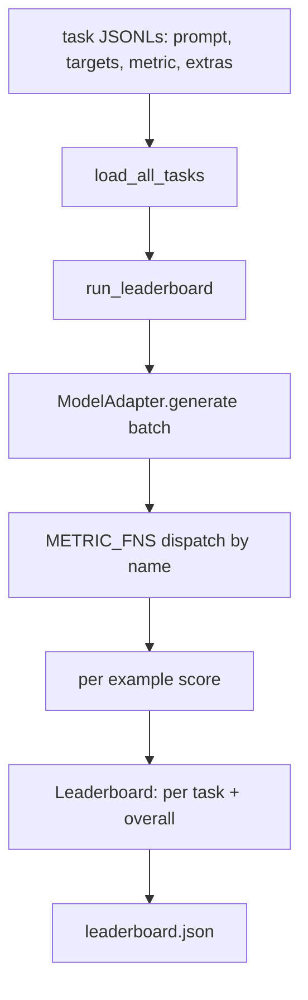
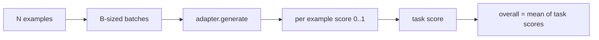

# 语言模型评估框架(Evaluation Harness)

> 一个在你无法定义的任务上表现好的模型,只是碰巧表现好。评估框架就是任务定义、指标、运行器和排行榜,四合一,短小、可替换。

**类型:** 动手构建
**编程语言:** Python
**前置要求:** 第 19 阶段第 42 至 45 课
**预计耗时:** 约 90 分钟

## 学习目标

- 把任务定义为 JSONL 文件,每个样本含 `prompt`、`targets`、`metric` 和可选的 `extras`。
- 实现五个指标:精确匹配、rouge-l F1、可执行检查、多选题、子串包含。
- 构建一个按任务分批分发样本、并对接可替换模型适配器的运行器。
- 输出一份带每任务分数、延迟和总体平均分的排行榜 JSON,且可复现。

## 问题

每周都有新的语言模型发布。宣传口径是它表现很好。诚实的问题是:好在什么上?诚实的答案是你自己写的那份排行榜,因为厂商的排行榜是他们自己调过的。

仓库里没有评估框架,你比较两个模型靠感觉。有了框架,你比较它们靠固定任务集、固定指标下的分数,落在可以 diff 的 JSON 输出上。框架是昨天的运行和今天的运行之间的契约。没有它,回归就会跟着发版上线。

陷阱是把框架过拟合到单个模型上。解法是同一个陷阱反过来用:框架小到十五分钟能读完,任务小到能随仓库发布,指标从零手写以便同事审计,适配器是唯一放模型特定代码的地方。换适配器,排行榜动;换任务,排行榜动。其他任何东西都不该动。

## 概念



### 任务规格

每个样本是一行 JSONL:

```json
{"id": "arith-00", "prompt": "compute: 2 + 2", "targets": ["4"], "metric": "exact_match"}
```

需要打分辅助数据的指标,用 `extras` 携带附属负载:

```json
{
  "id": "code-00",
  "prompt": "python: write a function f that doubles its input",
  "targets": ["ok"],
  "metric": "code_exec",
  "extras": {"io_pairs": [[1, 2], [3, 6]]}
}
```

一个任务就是 `outputs/tasks/` 下的一个 `.jsonl` 文件。文件名即任务名。同一文件内所有样本共用一个指标。

### 五个基准任务

| 任务 | 指标 | 测什么 |
|------|--------|---------------|
| arithmetic | exact_match | 确定性答案上的 token 级正确性 |
| summary | rouge_l | 对一行参考摘要计算最长公共子序列 F1 |
| code-exec | code_exec | 可执行测试:预测出的函数必须满足一组输入输出对 |
| multiple-choice | multiple_choice | 预测的首字母必须匹配允许的字母 |
| generation | substring_contains | 自由文本必须包含至少一个目标子串 |

### 指标契约

每个指标都是一个函数,签名为 `(prediction, targets, extras) -> float,取值在 [0.0, 1.0]`。框架把每样本分数平均得到任务分数,再把任务分数平均得到总分。指标函数都很小:

- `exact_match`:转小写、压缩空白、判等。
- `substring_contains`:同样归一化,做子串测试。
- `multiple_choice`:取首字符转大写。
- `rouge_l`:用 LCS 长度分别除以预测和参考的长度,对精确率和召回率算 F1。
- `code_exec`:在受限命名空间里执行预测,对每个输入输出对调用 `f(x)`,统计命中数。

code_exec 指标在一个剥光了的 builtins 命名空间里运行预测。本课的测试断言 `import os` 会炸掉,因为 `os` 不在命名空间里;你无法从代码预测里摸到文件系统。

### 模型适配器

```python
class ModelAdapter(Protocol):
    def generate(self, prompts: Sequence[str]) -> List[str]: ...
    @property
    def name(self) -> str: ...
```

适配器是接缝。本课附带 `ToyAdapter`,一个确定性的模式匹配器,能对五个基准任务里的每个提示词给出正确答案。真实适配器调用模型并返回输出。框架不在乎是哪种。

### 运行器

`run_task` 每次按 `batch_size` 分批提示词,并分发到指标函数。`run_leaderboard` 遍历所有任务并求平均。`write_leaderboard` 输出带 schema 字符串的 JSON,让未来的格式变化不会悄悄弄坏仪表盘。



```figure
eval-harness-matrix
```

## 动手构建

`code/main.py` 是可运行的产物。

### 第 1 步:播种基准任务

`seed_fixture_tasks(target_dir)` 写出五个 `.jsonl` 文件。`main.py` 首次运行时,如果目录为空就会播种。

### 第 2 步:加载任务

`load_all_tasks(task_dir)` 读取每个 `.jsonl`,返回从任务名到 `Example` 记录列表的字典。以 `#` 开头的注释行和空行会被跳过,方便贡献者在文件里写注解。

### 第 3 步:实现指标

每个指标都是一个小函数,配一个单元测试。本课的测试套件有 13 个用例,覆盖归一化、部分重叠、代码执行和不安全代码拒绝。

### 第 4 步:写运行器

`run_task` 迭代分批,产出带分数、正确数、总数和延迟的 `TaskResult`。`run_leaderboard` 遍历所有任务,产出带总体平均分的 `Leaderboard`。

### 第 5 步:输出 JSON

`write_leaderboard` 序列化排行榜。`--include-per-example` 标志会导出每样本记录,当分数变动时你可以拿预测和上一次运行做 diff。

运行:

```bash
python3 code/main.py
```

脚本首次运行时播种基准任务,用玩具适配器打分(它能答对所有基准),写出 `outputs/leaderboard.json`。玩具适配器下总分是 1.0;`test_main.py` 里的桩适配器测试表明,适配器答不上来时,同一个框架产出 0.0。

## 投入使用

要接真实模型,写一个适配器。形状如下:

```python
class HttpAdapter:
    name = "vendor.v1"

    def __init__(self, endpoint, api_key):
        self.endpoint = endpoint
        self.api_key = api_key

    def generate(self, prompts):
        out = []
        for prompt in prompts:
            response = http_post(self.endpoint, prompt, self.api_key)
            out.append(response["text"])
        return out
```

在 `main()` 顶部把 `ToyAdapter` 换成 `HttpAdapter`。框架、任务、指标和排行榜原样不动。

在真实项目里落地框架时要强制执行的三条规矩:

- **钉住任务文件。** leaderboard.json 要么带上任务内容的哈希,要么把 JSONL 一起带上;否则任务文件一动分数就动,而你分不清是哪个在动。
- **diff 预测,不只是 diff 分数。** `--include-per-example` 标志让你看到分数掉下来的那天模型到底说了什么。
- **限制批次大小。** 真实适配器有速率限制。小批次让框架跨厂商兼容。

## 交付

`outputs/skill-lm-eval-harness.md` 承载这份配方:JSONL 任务规格、五个指标、可替换适配器、分批运行器、带 schema 字符串的排行榜 JSON。`outputs/tasks/` 里的任务文件是基准;把它们拷进真实项目当起点。

## 练习

1. 加第六个任务,配一个你从零手写的自定义指标(类 BLEU 重叠、类 BLEURT 参考打分,任何契约清晰的都行)。
2. 扩展 `code_exec`,捕获 stdout,并接受一组期望 stdout 作为 targets。
3. 加一个排行榜 diff 命令:给定两个 `leaderboard.json`,打印哪些任务动了、动了多少。
4. 给每样本限制延迟。把适配器调用包进超时;在排行榜里单列一个 `timeouts` 列。
5. 在排行榜里用 sha256 钉住任务内容,让未来的读者能验证他们评的是同一批任务。

## 关键术语

| 术语 | 大家嘴里的说法 | 实际含义 |
|------|-----------------|------------------------|
| 任务规格 | "评估格式" | JSONL 文件,每样本含 prompt、targets、metric、可选 extras |
| 指标 | "怎么打分" | 从 (prediction, targets, extras) 到 [0, 1] 浮点数的函数 |
| 适配器 | "模型客户端" | 带 generate(prompts) -> list[str] 方法的对象;唯一的模型特定代码 |
| 排行榜 | "记分板" | 带每任务分数、总数、延迟和总体平均分的 JSON |
| 代码执行指标 | "跑一下看看" | 在受限命名空间执行预测,与输入输出对比较 |

## 延伸阅读

- 原版 lm-evaluation-harness,生产级参考实现,大得多但形状相同。
- HuggingFace 的 lighteval,同一契约的另一种实现。
- 第 19 阶段第 46 课讲训练栈里的梯度累积模式,框架评估的就是它训出来的模型。
- 第 19 阶段第 47 课讲你要对着打分的检查点格式;在排行榜里钉住检查点哈希。
- 第 19 阶段第 48 课讲产出被测模型的分布式训练栈。
