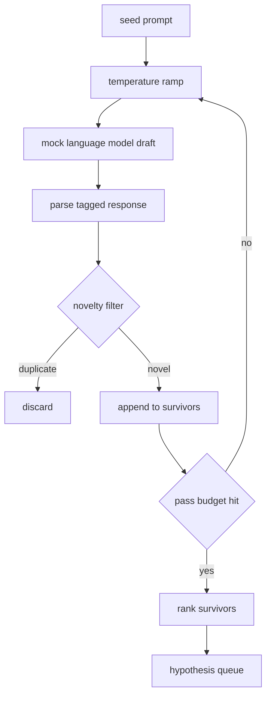

# 假设生成器

> 一个把同一个问题问两遍的研究智能体是在浪费 token。诀窍是逼每一稿落在一个新地方。

**类型:** 动手构建
**编程语言:** Python
**前置要求:** 第 19 阶段 Track A 第 20-29 课
**预计耗时:** 约 90 分钟

## 学习目标
- 从种子提示词驱动采样器,把输出转成带类型的假设记录。
- 每一轮调高采样温度,让下一稿离上一稿更远。
- 用一个小嵌入模型和余弦距离阈值过滤近似重复。
- 用一个融合新颖性、具体性和可检验性的打分函数给幸存者排序。
- 每一步保持确定性,让同一颗种子永远产出同一条队列。

## 为什么先生成、再过滤

只问一个模型一次的规划器只能得到一个假设。用来做演示没问题。对研究循环来说形状不对。循环要的是一条有深度的有序队列,这样第一个假设失败时,运行器不用再花一整个采样轮次的钱,就能直接取下一个。

两个想法组合出这条队列。第一个是温度爬坡:每过一轮采样器,温度抬高一档,鼓励越往后的草稿越野。第二个是新颖性过滤:每一稿出来后,生成器测量它与此前每个幸存者的嵌入距离,落在簇内的直接拒掉。

本课附带一个模拟语言模型,对固定提示词返回脚本化的 token 序列。这个模拟足够跑通全路径:种子提示词进,温度爬坡应用,候选解析,新颖性过滤,有序队列出。

## Hypothesis 的形状

```text
Hypothesis
  id             : int           (monotonic within a run)
  text           : str           (the claim)
  variables      : list[str]     (what changes between conditions)
  metric         : str           (what the runner will measure)
  baseline_ref   : str | None    (which paper or run the comparison cites)
  draft_pass     : int           (which sampler pass produced this)
  temperature    : float         (the sampler setting at draft time)
  novelty_score  : float         (distance from prior survivors, 0..1)
  rank_score     : float         (weighted sum used for ordering)
```

`variables` 和 `metric` 不是自由文本。解析器从带标签的响应里把它们抽出来。第 52 课的运行器构建实验配置时直接读这两个字段。

`baseline_ref` 可选但推荐。第 53 课的评估器需要一个基线来对比。如果假设没给,评估器回退到同一指标上的上一次运行。

```figure
cg-novelty-ramp
```

## 架构



循环本身很直白。有意思的是每个框都有一条硬契约。

## 温度爬坡

从 `t_min` 开始,到 `t_max` 结束,步长 `(t_max - t_min) / (n_passes - 1)`。每一轮以当前温度调一次采样器,由 `GeneratorConfig.schedule()` 产出 `n_passes` 个等间距的值。模拟模型按温度在一小组脚本化响应之间切换,键是 `(prompt, temp_bucket)`。桶是开区间,所以温度小幅变化就会选中不同的桶,产出不同的草稿。生产环境里采样器是真实模型,把 `temperature=t` 透传进去。

默认排程是从 `0.2` 到 `1.2` 跑六轮。六轮足够填满队列,又不必为注定被新颖性过滤拒掉的采样买单。低于 `0.2` 模型只会复读种子。高于 `1.2` 响应容易跑题,过不了解析器。

## 新颖性过滤

每一稿解析完之后,生成器对文本做嵌入,和每个已接受的假设比较。嵌入是一个哈希词袋,归一化到单位长度。两个单位向量的余弦距离是 `1 - dot(a, b)`。一稿能通过的条件是:它到所有此前幸存者的最小距离高于 `novelty_threshold`。默认 `0.25`。

哈希嵌入不花哨。它确定、零依赖,足够抓住最明显的情形:两稿共享大部分名词。生产部署会换一个小型句子模型。接口不变。

## 排序分数

```text
rank_score = w_novelty * novelty_score
           + w_specificity * specificity_score
           + w_testability * testability_score
```

三个子分数。`novelty_score` 是到此前幸存者的最小嵌入距离。`specificity_score` 是假设中具体变量的数量除以一个目标数量。`testability_score`:同时指定了指标和基线得 1,只有指标得 0.5,否则得 0。

默认权重是 `0.4`、`0.3`、`0.3`。权重放在生成器配置里,后续课程不用 fork 代码就能调整。

## 模拟语言模型

```python
class MockLLM:
    def sample(self, prompt: str, temperature: float, seed: int) -> str:
        ...
```

给定 `(prompt, temperature, seed)` 三元组,采样器是确定性的。模拟器维护一张脚本化响应表,键为 `(prompt_signature, temperature_bucket)`。表里没有对应键时,采样器返回一个过不了解析器的兜底值。有一个测试专门走兜底路径。

种子混进了响应,所以同一对 `(prompt, temperature)` 换不同种子会产出不同草稿。测试里我们把种子钉死保证结果可复现。真实部署里种子来自系统时钟或计数器。

## 输出队列

输出是按 `rank_score` 降序排列的 `Hypothesis` 记录列表。第 52 课的运行器弹出队首,跑实验,第 53 课的评估器写回判定。如果判定说假设错了,运行器弹下一个。

队列是有限的。队列空了之后,编排器要么放宽种子提示词再跑一轮生成器,要么停下来报告预算耗尽。

## 怎么读这份代码

`code/main.py` 定义了 `Hypothesis`、`MockLLM`、`HypothesisGenerator` 和一个确定性演示。生成器只暴露一个 `run(seed_prompt)` 方法,返回排好序的队列;轮数从 `GeneratorConfig.n_passes` 读,不作为参数传。嵌入是哈希词袋。新颖性过滤是单个函数。排序分数是单个函数。没有任何东西依赖 `numpy`;嵌入数学是纯标准库,保证本课可移植。

`code/tests/test_generator.py` 覆盖线性路径、重复拒绝路径、解析失败路径、温度爬坡边界和排序次序。

## 在整体中的位置

第 50 课产出队列。第 51 课取队首,跑文献检索去证实或证伪。第 52 课取同一个队首,跑真实实验。第 53 课读两边输出,写判定。四课组成一个没有人参与的研究循环;人可以在任何边界介入。
