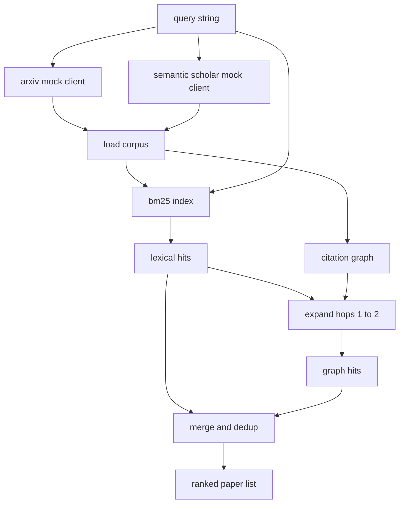

# 文献检索

> 假设很便宜。知道是不是已经有人证明过它,才是贵的部分。构建检索层,在运行器启动沙箱之前先回答这个问题。

**类型:** 动手构建
**编程语言:** Python
**前置要求:** 第 19 阶段 Track A 第 20-29 课
**预计耗时:** 约 90 分钟

## 学习目标
- 建模一个小型论文记录,字段就是下游循环要读的。
- 只用标准库数据结构,在摘要上构建 BM25 索引。
- 走引用图,捞出词汇搜索漏掉的论文。
- 按稳定论文 id 对词法路和图路的命中去重。
- 把两个模拟外部 API 包在一个客户端后面,等真实端点落地时上游调用点不用改。

## 为什么要两路检索

在摘要上做关键词搜索,返回的是和查询共享词汇的论文。这覆盖了大部分情形。它漏两种。第一种是基础论文用了不同词汇;比如查 "sparse attention" 会漏掉一篇题为 "block selection in transformer routing" 的论文。第二种是相关论文是引用了某篇已知锚点论文的后续工作;找到锚点再向前遍历,比暴力扫摘要池高效得多。

本课把两路都建出来。摘要上的 BM25 抓词法命中。引用图遍历从一个种子集合出发,向前和向后各扩一到两跳。并集按论文 id 去重,再按一个小的组合分数排序。

## Paper 的形状

```text
Paper
  id          : str           (stable identifier, "p001" for the mock corpus)
  title       : str
  abstract    : str
  year        : int
  authors     : list[str]
  references  : list[str]     (paper ids this paper cites)
  citations   : list[str]     (paper ids that cite this paper)
  source      : str           (which mock api supplied it, "arxiv" or "s2")
```

references 和 citations 字段构成有向引用图。两个模拟 API 返回的字段有重叠但不完全一致,所以语料加载器按 `id` 取并集。

```figure
cg-citation-hops
```

## 架构



检索客户端管两路检索和合并。调用方给它一个查询,拿回一个有序列表,每个条目带每篇论文的分数字段(`bm25_score`、`graph_distance`、`recency_score`、`final_score`),解释排序的依据。

## 从零手写 BM25

实现是标准的 Okapi BM25,默认参数 `k1=1.5`、`b=0.75`。索引是两个字典:`term -> doc_frequency` 和 `term -> list of (doc_id, term_count)`。文档长度是摘要的 token 数。平均文档长度在建索引时算一次。给查询打分就是对查询词求 `idf * tf_norm` 的和,其中 `tf_norm` 是标准 BM25 的长度归一化词频。

分词器是先 `lower` 再按非字母数字切分。不做词干提取。生产系统会换一个小型词干提取器。接口不变。

```text
idf(t)      = log((N - df + 0.5) / (df + 0.5) + 1.0)
tf_norm(t)  = (f * (k1 + 1)) / (f + k1 * (1 - b + b * dl / avgdl))
score(d, q) = sum over t in q of idf(t) * tf_norm(t)
```

## 引用图遍历

图从语料建一次。前向边从论文指向它的参考文献。后向边从论文指向引用它的论文。遍历是以 BM25 头部命中为种子的广度优先搜索,上限两跳。

两跳是刻意设的天花板。一跳太浅;智能体常常要的就是直接的前驱或后继。三跳在连通图上会让结果集爆炸,还容易跑题。本课把跳数限制暴露为配置项,下游循环可以收紧。

## 去重与排序

两路返回的集合有重叠。合并以论文 id 为键。每篇论文的最终分数是一个加权混合。

```text
final_score = w_bm25 * bm25_score_norm
            + w_graph * graph_score
            + w_recency * recency_score
```

`bm25_score_norm` 是 BM25 分数除以合并集合中的最大 BM25 分数(让这个字段落在 0 到 1)。`graph_score`:直接词法命中为 1,一跳为 `0.6`,两跳为 `0.3`,其余为 0。`recency_score` 是从语料最小年份的 0 到最大年份的 1 的线性斜坡。

默认权重是 `0.5`、`0.3`、`0.2`。权重在配置里;陈旧主题可以调低时效性,快速变化的主题可以调高。

## 模拟语料

语料是一百篇论文,由 `build_corpus()` 生成。每篇论文有人工写的标题和摘要,分属五个主题之一:注意力稀疏化、检索增强、低秩适配器、数据集蒸馏、评估框架。引用和被引被接好,让每个主题形成一个连通子图,外加少量跨主题边。

两个模拟 API 客户端(`ArxivMockClient`、`SemanticScholarMockClient`)读同一份语料,但暴露不同字段。Arxiv 返回标题、摘要、年份、作者。Semantic Scholar 额外给 references 和 citations。检索客户端按 id 取并集;跨客户端字段不一致的处理留到后续课程。

## 第 52、53 课读什么

第 52 课的运行器读 `paper.id`、`paper.title` 和摘要的前三句,作为实验的上下文。第 53 课的评估器读 `paper.year` 和 `paper.references`,把基线归属到具体论文。

检索客户端返回一个 `RetrievalResult`,含有序列表和每查询指标:命中数、平均分、最高分、总墙钟时间。运行器记录这些,下游可观测性环节可以画出质量随时间的变化。

## 怎么读这份代码

`code/main.py` 定义了 `Paper`、`ArxivMockClient`、`SemanticScholarMockClient`、`BM25Index`、`CitationGraph`、`RetrievalClient` 和一个确定性演示。模拟客户端和语料放在同一个文件里,保证本课可移植。BM25 实现是一个类、六十行。图遍历是一个方法。

`code/tests/test_retrieval.py` 覆盖词法路径、图路径、合并、去重和空查询。

## 在整体中的位置

第 50 课产出一个假设。第 51 课检索文献,看这个假设是否已有定论。如果没有,第 52 课跑实验。第 53 课读检索结果和实验指标,写判定。检索客户端是四个阶段里最便宜的,在编排器里最先跑。
