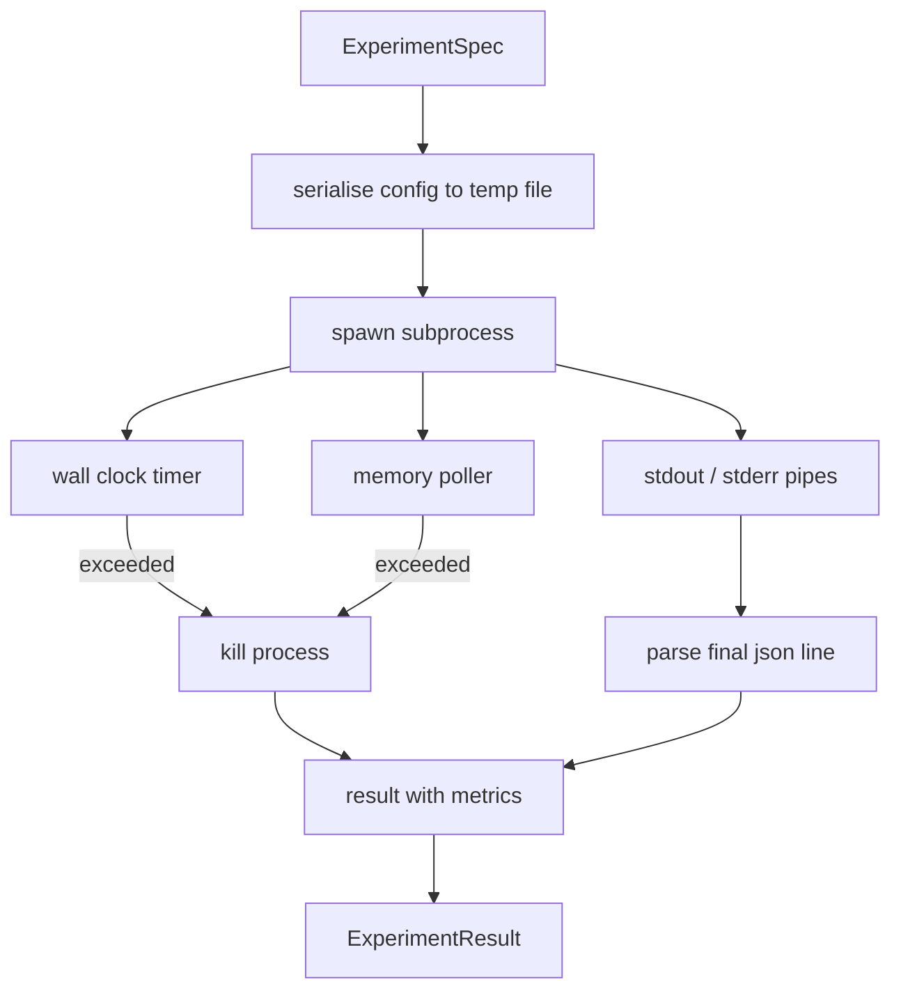

# 实验运行器

> 循环的诚实程度取决于它的测量。构建一个运行器:吃下一份规格,在沙箱子进程里执行,吐出一份评估器可以信任的 JSON 指标块。

**类型:** 动手构建
**编程语言:** Python
**前置要求:** 第 19 阶段 Track A 第 20-29 课
**预计耗时:** 约 90 分钟

## 学习目标
- 把实验编码成带类型的规格,运行器能把它序列化给子进程。
- 启动带硬墙钟超时和软内存上限的子进程,并把两者都作为终止条件暴露出来。
- 把 stdout、stderr 和结构化指标块收进同一条结果记录。
- 构建消融表:在固定基础规格上,一次只扫一个配置旋钮。
- 给定种子时让每个结果保持确定性,让评估器多次运行看到同一组数字。

## 为什么用子进程

研究循环跑的是不受信任的代码。假设来自采样器,实验脚本来自同一条链路;把其中任何一个当作安全的放进进程内,等于求着一次崩溃把编排器带走。子进程是这门语言自带的最简隔离:独立进程、独立地址空间、父进程侧有信号句柄。

这里的运行器没有实现完整沙箱。没有 cgroup,没有 seccomp 过滤,没有命名空间重映射。它有的是:墙钟超时、轮询内存增长的循环,以及任一限制触发时终止进程的 kill 路径。这就是所有更精巧沙箱都要扩展的运行时契约。本课把契约保持到一次能读完的大小。

## ExperimentSpec 的形状

```text
ExperimentSpec
  spec_id        : str            (stable id, "exp_001")
  hypothesis_id  : int            (link back to the queue from lesson 50)
  script_path    : str            (path to the python script to run)
  config         : dict           (passed to the script as one json arg)
  seed           : int            (deterministic seed for the experiment)
  wall_timeout_s : float          (hard timeout, killed on exceed)
  memory_cap_mb  : int            (soft cap, polled; killed on exceed)
  metric_keys    : list[str]      (which fields the evaluator will read)
```

脚本放在磁盘上;运行器把配置写到一个临时文件路径,脚本去读它。脚本应在 stdout 打印一行 JSON,其键是 `metric_keys` 的超集。stdout 上的其他内容会被捕获,但指标解析器会忽略。

```figure
cg-runner-limits
```

## 架构



运行器是一个类加一个主方法。轮询器是一个小线程,每个轮询间隔醒一次,在平台支持时从 proc 文件系统读子进程内存(相当于 `psutil` 的功能),平台不支持时退化为无操作。

## 为什么是软内存上限

硬内存上限需要 `resource.setrlimit`,而且只在 POSIX 上有效。本课给的是可移植方案:从平台轮询常驻内存集大小,超过上限就杀子进程。之所以是软的,是因为轮询有非零间隔;进程可能在两次轮询之间冲过上限再回落。运行器记录观察到的最大 RSS,让评估器能看到这次运行离上限有多近。

在不支持进程检查的系统上,轮询器记录一次警告并自我禁用。墙钟超时仍然生效。本课测试两条路径都覆盖。

## 捕获 stdout 和 stderr

运行器在读完后排空两条管道。stdout 逐行扫描;最后一个能解析为 JSON 且包含全部必需 `metric_keys` 的行,被当作指标块。更早的 JSON 行保留在结果的 `intermediate_metrics` 里;评估器可以用它们画学习曲线。

stderr 原样捕获进结果。运行器从不对非零退出码抛异常;它把退出码记进结果。任何非零退出都标为 `"crash"`,哪怕脚本打印了指标,这样评估器默认把部分完成的运行当作失败。

## 消融表

```python
def ablate(base: ExperimentSpec, knob: str, values: list[Any]) -> list[ExperimentSpec]:
    ...
```

给定基础规格和旋钮名,这个辅助函数为每个值返回一个规格,覆盖 `config[knob]`。每个规格得到派生的 `spec_id`(`f"{base.spec_id}_{knob}_{value}"`)。运行器附带一个 `AblationRunner`,按顺序跑这些规格,返回按旋钮值索引的 `AblationTable`。

为什么一次只动一个旋钮。全因子扫描指数爆炸,产出的结果评估器没法解读。一次一个旋钮,产出的是评估器能画图的干净坐标轴。本课只支持以"重复的单旋钮消融"做多旋钮扫描,由调用方组合。

## 确定性

每个规格都带种子。运行器通过 config 字典把种子转发给脚本(`config["__seed"] = spec.seed`)。`code/experiments/` 里的模拟实验脚本遵守种子,多次运行产出完全相同的指标。第 53 课的评估器依赖这一点;没有确定性,一次"回归"可能只是换了个随机初始化。

## 模拟实验脚本

本课附带一个实验脚本:`code/experiments/sparsity_experiment.py`。它是真脚本:读配置文件,用一次 numpy 随机过程模拟一个小训练运行,打印一行 JSON 指标块。脚本支持 `sleep_s` 旋钮(测超时)和 `allocate_mb` 旋钮(测内存轮询器)。

这个模拟并没有真训练什么。它是一个数值计算,模仿训练循环的形状:一条损失曲线、一个最终困惑度、一段墙钟时间。本课的重点是运行器,不是模拟。真实实验脚本会去 import 一个模型。

## 结果的形状

```text
ExperimentResult
  spec_id              : str
  hypothesis_id        : int
  exit_code            : int
  terminal             : "ok" | "timeout" | "oom" | "crash"
  wall_time_s          : float
  peak_rss_mb          : float | None
  metrics              : dict
  intermediate_metrics : list[dict]
  stdout_tail          : str
  stderr_tail          : str
```

评估器最先读 `metrics` 和 `terminal`。如果 terminal 不是 `"ok"`,这次实验算失败运行,评估器的判定自动产生。否则指标进入显著性检验。

## 怎么读这份代码

`code/main.py` 定义了 `ExperimentSpec`、`ExperimentResult`、`ExperimentRunner`、`AblationRunner` 和一个确定性演示。子进程管理是一个类。内存轮询器是一个小线程。消融辅助是单个函数。

`code/experiments/sparsity_experiment.py` 是测试用的模拟实验。它从 argv 读配置文件路径,完成时写一行 JSON 指标。

`code/tests/test_runner.py` 覆盖成功路径、超时路径、崩溃路径、消融表,以及跨两次运行的确定性检查。

## 在整体中的位置

第 50 课生成假设。第 51 课滤掉文献已有定论的部分。第 52 课给剩下的跑实验。第 53 课读结果、跑显著性检验,写出编排器挂在假设 id 上的判定。
