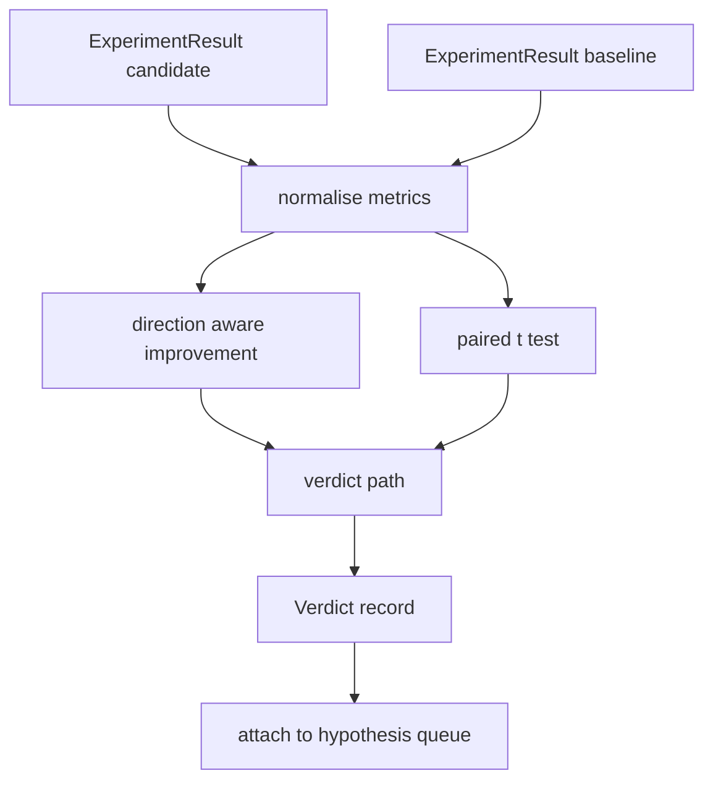

# 结果评估器

> 运行器产出了数字。评估器决定这些数字是改进、回归,还是噪声。构建判定路径,把指标变成一行结论。

**类型:** 动手构建
**编程语言:** Python
**前置要求:** 第 19 阶段 Track A 第 20-29 课
**预计耗时:** 约 90 分钟

## 学习目标
- 用带方向的改进度量和固定阈值,把候选运行与基线运行对比。
- 从零实现配对 t 检验,跑在按种子分的指标上,读出 p 值。
- 归一化对数刻度的指标,让下游报告能把它们和线性指标混在一起。
- 产出按假设挂的判定,编排器可以把它挂到第 50 课的队列上。
- 每一步保持纯函数,同样的输入永远产出同样的判定。

## 为什么是配对检验

运行器给的单个数字说明不了变化是不是真的。同样的配置换个种子,困惑度就不同。变化可能只是噪声。正确的比较是配对的:同样的种子、同样的数据,候选配置跑一次,基线配置跑一次。每个种子贡献一个差值。这些差值的均值就是效应。这些差值的标准误就是噪声地板。

本课从零实现这个检验。没有 `scipy.stats`。数学小到一屏能读完。

```text
diffs    = [a_i - b_i for i in seeds]
mean     = sum(diffs) / n
variance = sum((d - mean) ** 2 for d in diffs) / (n - 1)
t_stat   = mean / sqrt(variance / n)
df       = n - 1
p_value  = two_sided_p(t_stat, df)
```

双侧 p 值用正则化不完全 beta 函数。本课附带一个用 Lentz 连分数的小实现。整个东西是六十行标准库数学。

## 带方向的改进

有些指标越大越好(准确率、吞吐)。有些越小越好(损失、困惑度、墙钟时间)。评估器在每个指标上带一个 `direction` 字段。

```text
if direction == "higher_is_better":
    improvement = (candidate - baseline) / abs(baseline)
elif direction == "lower_is_better":
    improvement = (baseline - candidate) / abs(baseline)
```

改进是带符号的。在"higher is better"指标上,负的改进意味着候选更差。判定路径同时读符号和大小。

一个平直的阈值(`improvement_threshold=0.02`,百分之二)决定变化是否大到值得下结论。低于阈值,不管 p 值多少判定都是"noise";循环对用户根本测不出来的变化不感兴趣。

```figure
cg-paired-verdict
```

## 架构



评估器跑三个独立计算,在判定路径汇合。每个计算都是没有共享状态的纯函数。

## 对数归一化

困惑度是损失的指数。损失降 0.1,对应的困惑度降幅大得多。直接在两个配置间比较困惑度没问题,但要把它和线性指标混在同一份报告里,就需要归一化。

本课对任何 `scale` 字段为 `"log"` 的指标,在算改进之前先取自然对数。阈值随后在对数空间应用。困惑度从 32 降到 28,在一个 lower is better 指标上是 `log(28) - log(32) = -0.133`,远超百分之二的阈值。

```text
if scale == "log":
    a = log(candidate)
    b = log(baseline)
else:
    a = candidate
    b = baseline
```

`scale="linear"`(默认)的指标跳过变换。同一条代码路径处理两种。

## 按种子的配对检验

第 52 课的运行器每次运行输出一份最终指标块。配对检验需要候选按种子一份、基线按种子一份。编排器让同一个实验在两种配置下跨一组种子各跑一遍,把两组 `ExperimentResult` 记录交给评估器。

评估器按种子配对(种子存在 `result.metrics["seed"]` 里),沿请求的指标走。如果两组种子对不上,评估器抛出 `PairingError`。编排器应该重跑。

## Verdict 的形状

```text
Verdict
  hypothesis_id          : int
  metric                 : str
  direction              : "higher_is_better" | "lower_is_better"
  scale                  : "linear" | "log"
  candidate_mean         : float
  baseline_mean          : float
  improvement            : float       (signed, fraction; see direction rules)
  p_value                : float | None  (None if n < 2)
  significance_threshold : float
  improvement_threshold  : float
  verdict                : "improved" | "regressed" | "noise" | "failed"
  rationale              : str
```

判定路径是一张小决策表:

```text
1. If any candidate result has terminal != "ok": verdict = "failed"
2. else if |improvement| < improvement_threshold:  verdict = "noise"
3. else if p_value is None or p_value > significance: verdict = "noise"
4. else if improvement > 0:                          verdict = "improved"
5. else:                                             verdict = "regressed"
```

rationale 是一行人能读懂的句子,编排器可以把它记到假设 id 上。

## 怎么读这份代码

`code/main.py` 定义了 `MetricSpec`、`Verdict`、`Evaluator`、t 统计量和不完全 beta 辅助函数,以及一个确定性演示。t 检验用纯标准库数学实现;numpy 只用来读指标列表、算均值和方差。

`code/tests/test_evaluator.py` 覆盖 improved 路径、regressed 路径、noise 路径(改进太小)、noise 路径(n 太小)、failed 终止路径、对数归一化路径、对照已知参考值的 t 检验,以及配对错误。

## 在整体中的位置

第 50 课产出假设队列。第 51 课滤掉文献已有定论的部分。第 52 课让实验在候选和基线配置下跨种子运行。第 53 课读这些运行,写判定。编排器把四者缝在一起:

```text
for hypothesis in queue:
    literature = retrieval.search(hypothesis.text)
    if literature_settles(hypothesis, literature):
        attach(hypothesis, verdict="settled")
        continue
    candidates = runner.run_all(specs_for(hypothesis))
    baselines  = runner.run_all(baseline_specs_for(hypothesis))
    metric_spec = MetricSpec("perplexity", direction=LOWER, scale=LOG)
    verdict = evaluator.evaluate(hypothesis.id, metric_spec, candidates, baselines)
    attach(hypothesis, verdict)
```

这个编排器不在本课里;四课靠各自定义的数据类就能组合进去,不需要任何额外胶水。
