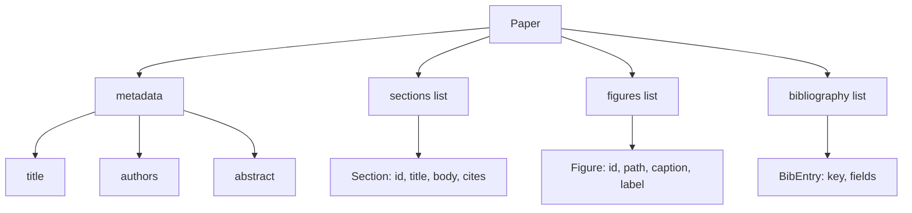
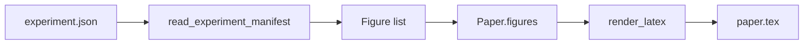
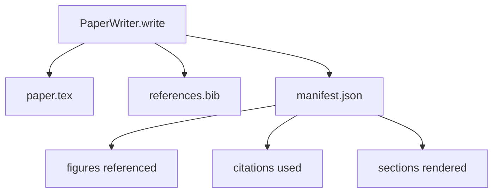

# 论文写作器

> LaTeX 骨架是研究者和排版器之间的契约。契约破了,文档就编译不过,而且失败得很响亮。先建骨架,再往里填。

**类型:** 动手构建
**编程语言:** Python
**前置要求:** 第 19 阶段第 50-53 课
**预计耗时:** 约 90 分钟

## 学习目标

- 把研究论文当作有已知章节图的结构化产物,而不是自由文本。
- 在任何正文落笔之前,先生成声明好摘要、章节、图槽位和参考文献键的 LaTeX 骨架。
- 通过确定性的槽位机制,把实验输出的图(路径和图注)注入骨架。
- 接入一个模拟正文生成器,按结构化大纲填充每个章节,让框架在没有模型的情况下也可测。
- 输出单个 `paper.tex`、一个 `references.bib`,再加一份清单,列出引用的每张图和用到的每条引文。

```figure
ch-paper-skeleton
```

## 为什么骨架先行

从正文开始写的草稿会积累结构债。引言长出三段本该放在相关工作里的文字。一张图在定义之前就被引用。参考文献里同一篇论文出现三个键。等作者注意到,重写的成本已经超过了写作的成本。

骨架把这个顺序倒过来。结构作为数据先行声明。章节是带名字和顺序的槽位。图是带 id 和图注的槽位。参考文献键在顶部声明,连同它们指向的条目。正文一次一个槽位地生成进去。框架可以在任何正文落笔之前先验证:每张图都有槽位,每条引文都有条目,每个章节都进了目录。

这和此前课程对计划、工具调用和 trace 施加的是同一种纪律。结构就是契约。

## Paper 的形状



每个字段都是普通 Python 数据。渲染器是从 `Paper` 到 LaTeX 字符串的纯函数。框架可以在渲染前内省论文:数章节数、列出缺失的图文件、检查每个 `\cite{key}` 是否有对应的 `BibEntry`。

## 渲染契约

渲染器保证三条性质。第一,骨架里的每个图槽位都产出一个 `\begin{figure}` 块,带形如 `fig:<id>` 的稳定标签。第二,每个章节产出一个 `\section{}`,带形如 `sec:<id>` 的稳定标签,交叉引用才能工作。第三,参考文献产出的 `\bibliography` 块,其 `references.bib` 恰好包含论文上声明的条目,不多不少。

违反任何一条都是渲染错误,不是警告。骨架就是契约;一次悄悄丢掉某张图的渲染就是违约。

## 从实验注入图

本路径此前的课程把实验输出产成 JSON 清单。每份清单带一个产物列表,含路径和短图注。论文写作器读这份清单,产出 `Figure` 记录。



注入是确定性的。图 id 由实验名加单调计数器派生。图注来自清单。路径归一化为相对论文输出目录的相对路径,这样即使实验输出在磁盘别的位置,LaTeX 也能编译。

## 模拟正文生成器

本课不调模型。`MockProseGenerator` 读一个大纲形状,确定性地产出正文。大纲形状是每个章节一句短字符串。生成器把它扩成两个短段落,把章节标题织进去。大纲里声明了图和引文时,生成的正文会恰到好处地点到它们。

这足够测写作器的每个行为了。真实实现会把生成器换成一次模型调用。外围框架不变。这就是把正文生成器声明为可调用对象的价值:测试换一个确定性的,生产换一个模型版的,流水线其余部分完全一致。

## 清单输出

写作器往输出目录写三个文件。



清单是给下游评估器或批评循环读的。它不解析 LaTeX;它读清单。下一课的批评循环就拿着这份清单做输入,产出反馈列表。这就是为什么清单是契约的一部分而 LaTeX 不是。

## 校验关卡

写作器在写任何文件之前过四道关卡。

1. 每个图 id 在论文内唯一。
2. 每个章节的 `cites` 字段引用的参考文献键都在论文上声明过。
3. 摘要非空。
4. 标题非空。

关卡失败抛出带精确原因的 `PaperValidationError`。框架把这个原因作为失效模式暴露出来。不存在部分写入:要么三个文件全部产出,要么一个都不写。

## 怎么读这份代码

`code/main.py` 定义了 `Paper`、`Section`、`Figure`、`BibEntry`、`PaperValidationError`、`MockProseGenerator`、`PaperWriter` 和一个 `render_latex` 函数。`write` 方法接收输出目录,产出 `paper.tex`、`references.bib` 和 `manifest.json`。`read_experiment_manifest` 辅助函数把一组实验清单转成 `Figure` 记录。

`code/tests/test_paper_writer.py` 覆盖:无章节骨架渲染、两章节两图的完整渲染、缺引文关卡、图 id 重复关卡、清单内容,以及 LaTeX 字符串契约(每个章节产出 `\section{}`,每张图产出 `\begin{figure}`)。

## 更进一步

真实实现会想要的两个扩展。第一,多格式渲染:同一个 `Paper` 形状既能编译成博客用的 Markdown,也能编译成预览用的 HTML。渲染器变成 `Paper` 上的一个策略。第二,引文补全:写作器拿着本地 DOI 缓存,按引文键抓取 BibTeX 条目。两者都有价值,而且都不用动骨架契约就能加。

骨架才是押注的地方。章节、图、引文声明为数据,正文生成进槽位,清单随 LaTeX 一起产出。其他一切改进都在这之上组合。
