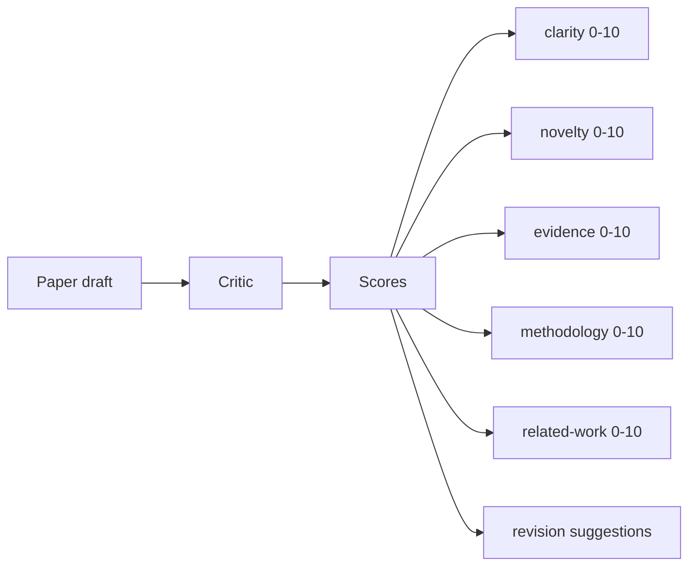
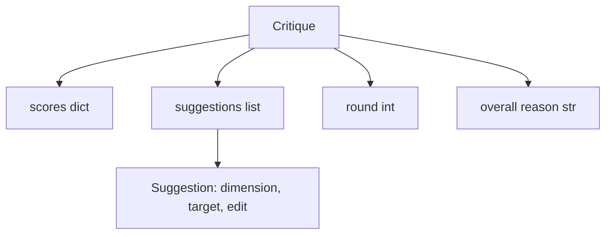
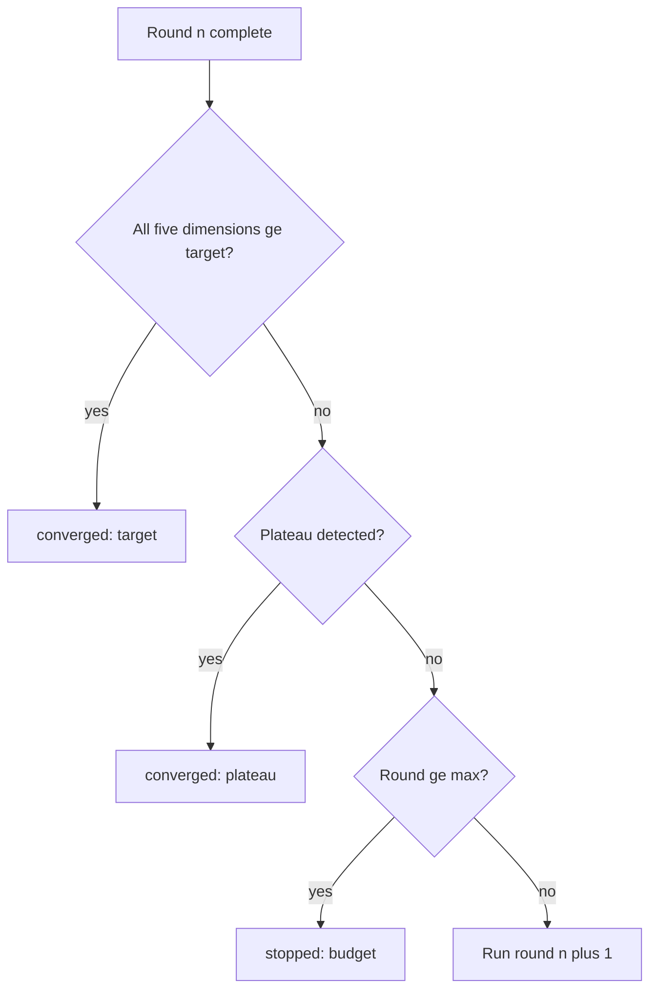
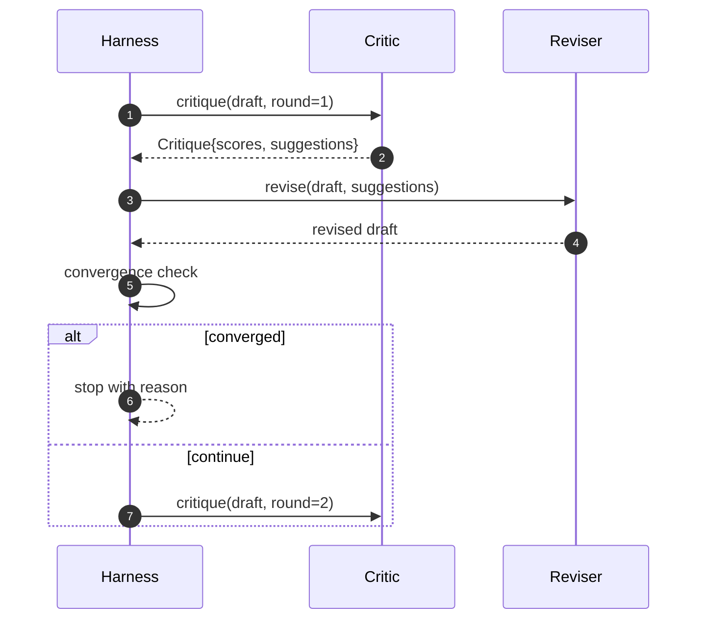

# 批评循环

> 第一次就回"看着不错"的批评器是坏的。永远回"还得改"的批评器也是坏的。有意思的是那个会收敛的批评器,而收敛是要靠工程做出来的。

**类型:** 动手构建
**编程语言:** Python
**前置要求:** 第 19 阶段第 50-53 课
**预计耗时:** 约 90 分钟

## 学习目标

- 沿五个固定维度给论文草稿打分:清晰度、新颖性、证据、方法论、相关工作。
- 把每轮批评作为结构化修订 diff 应用,而不是自由重写。
- 通过跨轮比较分数检测收敛;在平台期、达标或预算耗尽时停止。
- 用最大迭代预算封顶轮数,让不收敛的批评器不会永远跑下去。
- 每轮产出一条 trace,让仪表盘或下一阶段能画出分数轨迹。

```figure
ch-critic-converge
```

## 为什么固定五个维度

自由形态的批评器是一个返回一段建议的模型。下一轮的修订把这段话当作背景氛围。重写到底有没有回应批评无法验证,因为批评从来没有结构。

五个维度给了框架一份契约。



分数是一个向量。框架跨轮盯着每个维度。一次把清晰度拉高、把证据拉崩的修订,在证据维度上就是回归,收敛检查看得见。纯模型的批评器给不了这种保证。

## Critique 的形状



每条建议带着它要改进的维度、它针对的章节,以及一条修订器可以执行的 `edit` 指令。修订器也是可调用对象。本课附带一个确定性修订器,把 edit 指令解释为"追加到章节"操作。模型驱动的修订器会把同一个字段当作提示词。契约不变。

## 收敛规则,按顺序

满足以下任一条件,批评循环终止。



达标是最严的情形:五个维度(clarity、novelty、evidence、methodology、related_work)必须全部达到 `>= target_score`(默认 `8.0`),循环才返回成功。均分很高但有一个弱维度不算数。平台期检测比较本轮均分和上轮均分。如果改进连续两轮低于 `plateau_epsilon`(默认 `0.1`),循环以 `plateau` 退出。预算是轮数硬上限(默认 `5`),以 `budget` 退出。

顺序很重要。达标优先于平台期,平台期优先于预算。如果第三轮恰好同时会触发平台期,结果是 `target`,不是 `plateau`。

## 为什么平台期检测要看两轮

单轮平台期是噪声。真实批评器即使对着同一份草稿,每轮给的分数也会略有不同,因为确定性打分依然取决于哪些建议被应用了、按什么顺序。要求连续两轮平台期能滤掉这种噪声。框架报告平台期时,草稿是真的停止改进了。

## 本课的确定性批评器

本课不调模型。附带的批评器是一个可调用对象,基于三个信号给草稿打分:章节正文平均长度(清晰度)、图数量和引文数量(证据)、论文元数据上的 `originality_tag` 字段(新颖性)。修订器知道怎么把每个分数往上推。

```text
clarity      grows when the average section body length increases
novelty      grows when originality_tag is set to "high"
evidence     grows when a section's figure_refs is non-empty
methodology  grows when a section titled "Method" exists with body
related-work grows when a section titled "Related Work" exists with body
```

修订器把每条建议解释为定向追加。第一轮之后,框架能观察到分数在涨。测试用这个性质断言循环在缩小差距。

## 完整循环契约



框架持有轮数计数器、trace 和收敛检查。批评器持有分数。修订器持有 diff。三者互不碰对方的状态。

## Trace 输出

每轮产出一条 trace 事件,含轮数、分数向量、建议数和收敛判定。完整 trace 随最终草稿一起返回。下游仪表盘可以画出每轮分数图。下一课的迭代调度器读这份 trace,决定这条分支值不值得保留。

## 防坏批评器的预算

一个永远提不出能涨分建议的批评器,会把循环顶死在最大迭代上限。trace 让这一点可见:五轮,分数走平,判定 `budget`。用户读到的是批评器的 bug,不是草稿的 bug。另一种做法——只暴露最终草稿——会把诊断藏起来。trace 优先的设计把它亮出来。

## 怎么读这份代码

`code/main.py` 定义了 `Critique`、`Suggestion`、`Critic` 协议、`Reviser` 协议、`CriticLoop`,以及一个返回确定性批评器和配套修订器的 `make_deterministic_critic_pair` 工厂。内含一个极简 `Paper` 形状,让本课自成一体。

`code/tests/test_critic_loop.py` 覆盖:第一轮后的单调改进、调好草稿上的达标收敛、两轮走平后的平台期检测、无建议能涨分时的预算耗尽、修订器对建议的应用,以及 trace 形状。

## 更进一步

真实实现会想要的两个扩展。第一,维度权重:投研讨会的论文把新颖性权重调高,投期刊的反过来。收敛检查变成加权平均。第二,成对批评器:一个批评器打分,第二个批评器在修订器看到建议之前先裁决一遍。两者都有价值,都组合在同一个 `Critique` 形状上。

押注的是分数向量。一旦批评被结构化了,其他一切改进——收敛规则、仪表盘、成对批评器——都能直接插入,不用动循环。
