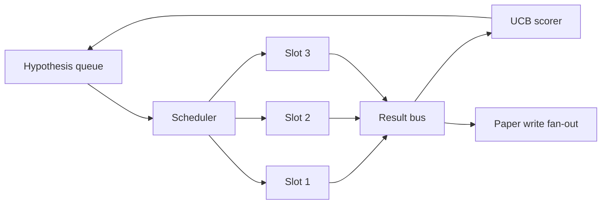
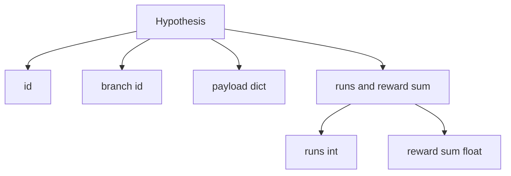
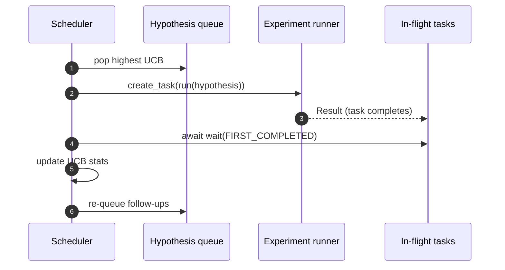

# 迭代调度器

> 没有调度器的研究循环,是一条自以为是的队列。循环在哪里决定停止探索什么,调度器就在哪里,而这个决定就是全部的游戏。

**类型:** 动手构建
**编程语言:** Python
**前置要求:** 第 19 阶段第 50-53 课
**预计耗时:** 约 90 分钟

## 学习目标

- 把研究工作流建模为:假设队列喂给并行实验槽,结果再回流汇合。
- 用 asyncio 并发跑多个实验,让调度器把所有槽位喂满。
- 用 UCB 给每个假设分支打分,让调度器能剪掉低产分支而不放弃探索。
- 把完成的结果扇出到论文写作阶段和重入队阶段,让高产分支孵化后续假设。
- 暴露每次迭代的 trace,含分支分数、槽位占用和剪枝决策。

```figure
ch-ucb-scheduler
```

## 为什么是调度器,而不是工作清单

扁平工作清单按提交顺序跑任务。每个任务相互独立时这没问题。研究不是相互独立的:实验三的发现会改变实验四和实验五的优先级。一个读结果回流、重排队列的调度器,能用单位算力完成更多有用的工作。

有意思的设计选择是打分规则。贪心打分器永远选当前的领先者,从不探索。均匀打分器从不利用。UCB(上置信界)是中间道路:利用领先者的同时,给试得少的分支保留运力。

## 系统的形状



队列装着假设。槽位空出来时,调度器挑 UCB 最高的假设。每个槽异步跑一个实验。完成的实验把结果扇到总线上。总线更新发起分支的 UCB 统计,并在分支产出跨过阈值时扇出到论文写作阶段。

## Hypothesis 的形状



`branch` 是 UCB 统计的键。多个假设可以共享一个分支(分支是研究方向;假设是其中一次试验)。`runs` 是该分支已完成实验的计数,`reward_sum` 是累计奖励。UCB 两个都读。

## UCB 打分

本课用的 UCB 公式是经典的 UCB1。

```text
ucb(branch) = mean_reward(branch) + c * sqrt( ln(total_runs) / runs(branch) )
```

`total_runs` 是所有分支上已完成实验的总数。`c` 是探索权重;本课默认 `sqrt(2)`。零运行的分支得 `+inf`,所以没试过的分支永远最先被调度。平均奖励高的分支保持高分,直到其他分支追上来;跑了很多次却没什么奖励的分支,会被跑得少的备选盖过。

剪枝闸门和挑选器是分开的。当一个分支在至少 `prune_after_runs` 次试验(默认 `3`)之后平均奖励跌破绝对地板(默认 `0.2`),剪枝把它从未来调度中移除。这让队列保持有界。

## 用 asyncio 做并行槽

调度器用 `asyncio.create_task` 驱动实验。每个任务跑实验运行器(一个 `async def` 可调用),返回一个 `Result`。主循环用 `asyncio.wait(..., return_when=asyncio.FIRST_COMPLETED)` 等在飞任务集合上,每次完成就触发打分更新。



三个槽并发跑。主循环从不在单个实验上阻塞。槽位一空出来,调度器立刻起新任务,直到队列空了且在飞任务归零。

## 扇出:论文触发

当一个分支的平均奖励跨过 `paper_threshold`(默认 `0.7`)且该分支还没产过论文,调度器往输出列表扇出一个 `paper.trigger` 事件。下游由第 54 课的论文写作器接走。本课里触发被捕获为一个列表,方便测试断言。

## 扇出:后续假设

高产结果落地时,调度器可以调用用户提供的 `expander`,在同一分支上产出一个或多个后续假设。expander 是从 `Result` 到 `list[Hypothesis]` 的纯函数。本课附带一个确定性 expander,对任何奖励超过论文阈值的结果产出两个后续假设。

## 预算

两道预算防止调度器失控。

```text
max_experiments    : total count of experiments run across all branches
max_seconds        : wall-clock cap (asyncio time)
```

任一触发,调度器停止调度新任务,等待在飞任务完成,返回最终 trace。trace 含 `stop_reason`。

## Trace 与最终报告

每个调度决策(挑选、分发、结果、剪枝、扇出)产出一条事件。最终报告汇总每分支统计、总运行数、总墙钟时间和触发的论文事件。下一课的端到端演示读这份报告来驱动论文写作器。

## 怎么读这份代码

`code/main.py` 定义了 `Hypothesis`、`Result`、`BranchStats`、`IterationScheduler`,以及一个 `make_deterministic_runner` 工厂,返回奖励可预测的 asyncio 实验运行器。运行器固定睡 `delay_ms`(默认 `5ms`),让并发可观察。

`code/tests/test_scheduler.py` 覆盖:UCB 优先挑没试过的分支、并行槽位占用、跨阈值时的论文触发、低产试验后的分支剪枝、扇出后续假设,以及预算退出(实验数和墙钟两种)。

## 更进一步

真实实现会想要的三个扩展。第一,跨会话持久化 UCB 统计:当前统计活在内存里;真实调度器会把它们存档,重启后保住已花掉的探索预算。第二,多目标打分:结果不再是标量奖励,每个结果产出一个向量,UCB 变成帕累托式挑选器。第三,上下文老虎机:挑选器以假设特征(长度、复杂度)为条件,让相似假设共享探索。

调度器是研究超越工作清单的地方。一旦 UCB 接好、槽位并行跑起来,其他一切改进都在这之上组合。
