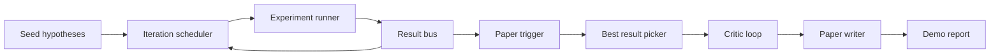
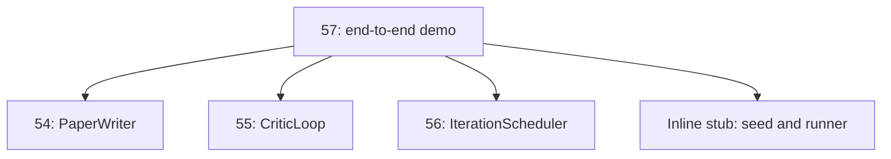
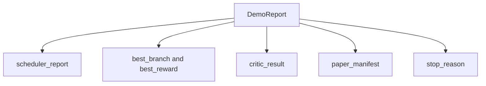

# 端到端研究演示

> 演示是你此前写下的每份契约必须组合起来的地方。任何一份契约漏了,抓住它的就是演示这一课。

**类型:** 动手构建
**编程语言:** Python
**前置要求:** 第 19 阶段第 50-53 课
**预计耗时:** 约 90 分钟

## 学习目标

- 把自动研究循环端到端接起来:假设种子、实验运行器、调度器、批评循环、论文写作器。
- 通过普通 Python import 组合此前四课的原语,而不是靠框架。
- 把循环跑到自行终止,产出一份列出每个阶段输出的演示报告。
- 保持演示的确定性,让测试套件能断言最终形状。
- 当任一阶段的契约破裂时暴露清晰的失效模式,让下一阶段不会带着坏输入运行。

```figure
ch-research-pipeline
```

## 在这里组合了什么



五个阶段。种子是三个假设的列表。调度器用三个并行槽跨假设跑六个实验。总线报告一个或多个论文触发。挑选器选出单个最佳结果。批评循环在由该结果构建的草稿上迭代。论文写作器产出最终的 LaTeX、BibTeX 和清单。

## 为什么 import,而不是拷贝

此前的每一课都附带一个 `main.py`,里面有公开的数据类和函数。演示通过调整 `sys.path` 指向各课的父目录来 import 它们。这不是框架接线;这和此前课程测试文件里用的 import 是同一个。



内联桩代替第 50 到 53 课:一个小型种子假设生成器和一个同步奖励函数。用户改两行 import,就能把内联桩换成那些课里的真实原语。

## 确定性保证

演示在构造上就是确定的。实验运行器是带种子的 numpy。批评循环的修订器按固定顺序走固定维度。论文写作器的正文生成器是第 54 课的模拟版。调度器的 UCB 挑选器按迭代顺序破平,而不是随机选择。

给定同样的种子,演示产出同样的报告。测试通过跑两遍演示、比较清单来断言这条性质。

## 演示报告的形状



每个字段都原样来自上游阶段。演示不转换任何输出;它组合它们。这就是演示所充当的测试。

## 失效模式处理

每个阶段要么成功,要么抛出带类型的错误。

```text
Scheduler ........ returns SchedulerReport with stop_reason
                   in {queue_empty, max_experiments, deadline}
Best-result pick . raises NoTriggerError if no paper trigger fired
Critic loop ...... returns LoopResult with status converged or stopped
Paper writer ..... raises PaperValidationError on contract break
```

任一阶段失败,演示以带类型的异常短路。测试钉住了这份契约:`test_no_triggers_raises_typed_error` 和 `test_best_picker_raises_when_no_triggers` 断言挑选器在没有分支触发论文事件时抛出 `NoTriggerError` / `BestResultError`,且写作器从未被调用。

## 最佳结果挑选器

调度器按分支产出论文触发。挑选器在所有触发中选出平均奖励最高的分支。平局按分支 id 字母序破平,保证演示确定。挑选器是一个小的纯函数;测试把它钉在一份固定的调度器报告上。

## 接批评循环

第 55 课的批评循环操作 `MiniPaper`。演示从选中的分支构建 `MiniPaper`:摘要填分支 id,播种两个章节(Introduction 和 Results),并按分支平均奖励设置 `originality_tag`(`>= 0.8` 为 high,`>= 0.6` 为 medium,否则 low)。

修订器随后把草稿迭代到收敛。输出进入论文写作器。

## 接论文写作器

第 54 课的论文写作器操作带图和参考文献的完整 `Paper` 形状。演示通过 `mini_to_full_paper` 把收敛的 `MiniPaper` 升级:为选中分支附上一张图,并从批评建议过的引文键的并集构建一个小型合成参考文献。演示加的每条引文也都会加进参考文献列表,所以校验能通过。

## 怎么读这份代码

`code/main.py` 定义了 `BestResultError`、`NoTriggerError`、`DemoReport`、`pick_best_branch`、`build_mini_paper`、`mini_to_full_paper` 和 `run_demo`。顶部的 import 调整一次 `sys.path`,从各自课程拉来 `PaperWriter`、`CriticLoop` 和 `IterationScheduler`。

`code/tests/test_e2e.py` 覆盖:演示端到端跑通并产出五个字段都填了的报告、跨两次运行的确定性、无分支跨阈值时的 NoTriggerError、写作器契约破裂时的 PaperValidationError、论文清单包含选中分支的图,以及调度器停止原因是预期值之一。

## 更进一步

演示跑绿之后值得接的三个扩展。第一,持久化状态:每个阶段的结果写进一个小 JSON 存储,重启后能续跑而不必重跑便宜的阶段。第二,仪表盘:调度器和批评循环的 trace 事件渲染成一条时间线。第三,真实模型调用:把模拟正文生成器和确定性批评器换成模型驱动的版本;接线不变。

演示的职责是证明组合就是架构。五课,四个 import,一份报告。下次你加一个阶段,接线恰好只长一行。
