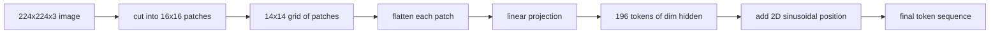

# 视觉编码器图像块

> 读像素的视觉模型需要一个像素的分词器。图像块嵌入(patch embedding)就是这个分词器。把图像切成方格网,每格压平,过一个线性层投影,再加上 2D 位置信号,让 Transformer 知道每个方块在原图里的位置。

**类型:** 动手构建
**编程语言:** Python
**前置要求:** 第 19 阶段第 30-37 课(Track B 基础)
**预计耗时:** 约 90 分钟

## 学习目标

- 把图像分词成定长的图像块嵌入序列。
- 实现基于 `Conv2d` 的图像块投影,与 unfold-then-linear 的数学等价。
- 构建确定性的 2D 正弦位置嵌入,让 token 顺序编码空间位置。
- 在合成样本上验证图像块数量、嵌入形状,以及 `Conv2d`/unfold 的等价性。

## 问题

Transformer 吃的是一个向量序列。图像是一个 3 通道网格。把每个像素当一个 token,序列长度爆炸:一张 224x224 的 RGB 图是 150,528 个 token,12 层 Transformer 的注意力根本负担不起。把整张图当一个巨大的平面向量,又丢掉了局部性,注意力层找不回来。编码器前端的工作,就是把像素网格压缩成几百个 token,每个概括一个方形区域。

图像块嵌入用一个线性投影解决这个问题。224x224 的图切成 16x16 的块,得到 14x14 的网格,共 196 块。每块从 `(3, 16, 16) = 768` 个像素值压平成一个向量,再经线性层映射到模型的隐藏维度。Transformer 看到的是 196 个维度为 `hidden`(通常 768)的 token,外加一个 CLS token。这才是网络其余部分嚼得动的序列。

## 概念



### 为什么是块,不是像素

注意力对序列长度是平方复杂度。196 个 token 的序列,每头每层要算 `196 * 196 = 38,416` 个注意力分数;150,528 个 token 的序列要算 `150,528 * 150,528 = 226 亿`。图像块把注意力计算量降低了 59 万倍,而单个 16x16 区域携带的信号对高层视觉任务已经足够。代价是块内细粒度空间细节的丢失,所以下游多模态栈在需要精细定位时,常常并跑一个高分辨率分支。

### 为什么一个线性投影就够

每个块被当作独立向量处理。投影学出的是一组基:边缘检测子、颜色滤波器、简单纹理。单个线性层很小(ViT-Base 是 `768 * 768 = 589,824` 个参数),训练快。更深的卷积干(hybrid ViT)确实存在,但平的线性投影是标准做法,大多数现代开源权重编码器用的就是这个形状。

### `Conv2d` 技巧

一个 `Conv2d(in_channels=3, out_channels=hidden, kernel_size=patch_size, stride=patch_size)`(无 padding),数值结果和 unfold-then-linear 完全相同,因为每个输出位置都是块像素对一个滤波器的点积。卷积就是块投影,多数生产代码库都这么写,因为它在 GPU 上更快,还少一次 reshape。

### 位置嵌入

token 从投影里出来时没有任何顺序信息。2D 正弦嵌入给每个 token 一个固定信号,编码它的 `(row, col)` 位置。嵌入维度的一半用多频率 sin/cos 编码行位置,另一半编码列位置。这个编码是确定性的,换分辨率不用重训,还能干净地插值到训练时没见过的网格。

| 组件 | 形状 | 参数量 |
|-----------|-------|------------|
| 块投影(`Conv2d`) | `(hidden, 3, patch, patch)` | `3 * P * P * hidden + hidden` |
| 位置嵌入(固定) | `(num_patches, hidden)` | 0(算出来的,不是学的) |
| CLS token(学习) | `(1, hidden)` | `hidden` |

ViT-Base/16 在 224 分辨率下:投影 590,592 个参数,CLS token 768 个,正弦位置为零。下一课(59)在这个前端之上叠一个 12 层 Transformer。

### 用等价性做健全性检查

块步骤有两种写法:`Conv2d` 投影,和显式的 unfold-then-linear。同样的权重必须产出同样的输出。如果不是,unfold 的数学就是错的,编码器的其余部分就建在沙子上。本课的测试检验的正是这个等价性。

```figure
ch-patch-tokenizer
```

## 动手构建

`code/main.py` 实现了:

- `PatchEmbed`,一个包着 `Conv2d` 做块投影的 `nn.Module`。
- `sinusoidal_2d(grid_h, grid_w, dim)`,一个无状态函数,构建 2D 位置表。
- `VisionFrontEnd`,把块嵌入、CLS 前置、位置相加组合进一次前向。
- `synthesize_image(seed)` 辅助函数,从 `numpy.random` 构建确定性的 224x224x3 样本。
- 一个演示:把一张样本图跑过前端,打印输出形状、CLS token 范数和位置嵌入的一行。

运行:

```bash
python3 code/main.py
```

输出:224x224 样本被分词成形状 `(1, 197, 768)` 的序列。第一个 token 是 CLS;后面 196 个是块 token。位置嵌入的范数在一行内是均匀的,这正是正弦签名。

## 投入使用

同一个图像块前端出现在每个现代视觉-语言模型里:CLIP ViT-L/14、SigLIP、DINOv2、Qwen-VL 家族、InternVL 栈,都从 `Conv2d` 块投影加位置信号起步。各家族的差异在下游(CLS vs 无 CLS 池化、寄存器 token、块大小 14 vs 16、靠插值位置做动态分辨率)。本课的前端就是所有这些模型的地基。

## 测试

`code/test_main.py` 覆盖:

- 块数量匹配 `(image_size / patch_size) ** 2`
- 输出形状匹配 `(batch, num_patches + 1, hidden)`
- `Conv2d` 投影在小样本上等于手工 unfold-then-linear
- 正弦位置表跨调用确定性
- CLS token 跨批次维广播,无泄漏

运行:

```bash
python3 -m unittest code/test_main.py
```

## 练习

1. 把正弦位置换成学习的 `nn.Parameter`,在一个微型合成分类任务上对比首轮损失。固定分辨率下学习位置更好;训练后改分辨率时正弦更好。

2. 把 `Conv2d` 换成显式 `nn.Unfold` 加 `nn.Linear`,断言输出在浮点容差内一致。同一份数学,两种写法。

3. 支持非正方形块大小(比如宽画幅输入用 32x16),验证位置表能处理非方形网格。

4. 在批次 1、8、64 下剖析块步骤。块投影很少是瓶颈;下游注意力层才是大头。

5. 在 4 类合成形状数据集(圆、方、三角、星)上把前端当冻结特征提取器训练。CLS token 的输出应当线性可分。

## 关键术语

| 术语 | 含义 |
|------|---------------|
| 图像块(Patch) | 图像的方形子区域,通常 14x14 或 16x16 |
| 图像块嵌入 | 一个压平图像块到隐藏维度的线性投影 |
| 序列长度 | 块分词后的 token 数,通常再加 CLS |
| 正弦位置 | 编码 2D 网格坐标的固定 sin/cos 信号 |
| CLS token | 前置在序列头部的学习向量,作为池化头 |

## 延伸阅读

- An Image is Worth 16x16 Words(ViT,2021),图像块嵌入的原始表述。
- Attention Is All You Need(2017),正弦位置公式,本课将其适配到 2D。
- DINOv2 论文,寄存器 token,可以作为练习 6 加上去。
