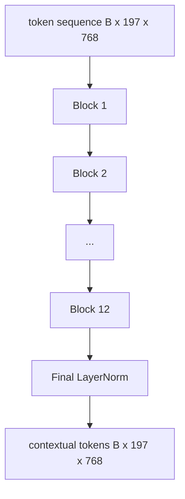
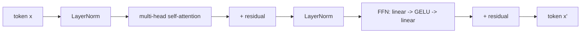

# Vision Transformer 编码器

> 只有图像块自己看不见东西。一个 12 层、12 注意力头的 pre-LN Transformer,把图像块 token 序列变成带上下文的 token 序列,CLS token 在最终隐藏态里池化整图特征。本课是每个现代视觉-语言模型的引擎室。

**类型:** 动手构建
**编程语言:** Python
**前置要求:** 第 19 阶段第 30-37 课(Track B 基础)
**预计耗时:** 约 90 分钟

## 学习目标

- 实现带多头自注意力和前馈子层的 pre-LN Transformer 块。
- 叠 12 块、12 头,组成 ViT-Base 编码器。
- 把第 58 课的图像块前端接进编码器,跑一次前向。
- 验证 CLS token 聚合了每个图像块的信息。

## 问题

图像块嵌入产出 197 个 token 的序列,每个向量都对其他块一无所知。一张猫的照片,需要每个块知道哪些块里有胡须、哪些是背景、哪只眼睛在哪。Transformer 是一次一层注意力地建起这种感知的机制。没有它,图像块前端只是个聪明的分词器,没有理解。

标准配方是 12 块深、12 头宽,pre-LayerNorm 摆放,GELU 激活,前馈 4 倍扩展。这个配方就是 CLIP ViT-L、SigLIP、DINOv2、Qwen-VL 家族、InternVL 以及 2025-2026 年其他所有开源权重视觉编码器的脊柱。这个配方稳定到你读其中任何一篇论文,都可以默认块就是这个形状,除非它明说改了。

## 概念





### Pre-LN vs post-LN

原始 Transformer 把 LayerNorm 放在残差之后。Pre-LN(在每个子层之前做 LayerNorm)是每个现代视觉-语言模型用的版本,因为它训练稳定,不需要学习率预热的花招。差别只是前向里的一行,但在 12 层以上的深度,梯度流是天壤之别。

### 多头自注意力

每个头把 token 向量投影到自己的 `(query, key, value)` 三元组,维度 `head_dim = hidden / num_heads`。`hidden = 768`、`heads = 12` 时,每个头 `dim = 64`。12 个头并行做注意力,输出拼回 768 维,再过输出投影。多头的意义在于:一个头可以学"注意猫的眼睛",另一个学"注意背景渐变",互不干扰。

### 为什么前馈是 4 倍扩展

FFN 走 `hidden -> 4 * hidden -> hidden`,中间夹 GELU。因子 4 是经验值,自 2017 年以来在语言和视觉 Transformer 上都站住了。小了(2x)欠拟合;大了(8x)在固定数据预算下过拟合。MLP 是模型存放大部分习得知识的地方,中间那层宽的部分就是它们住的位置。

| 组件 | ViT-Base 规模下的参数量 |
|-----------|------------------------------|
| 每块 qkv 投影 | `3 * 768 * 768 = 1.77M` |
| 每块输出投影 | `768 * 768 = 590K` |
| 每块 FFN(4 倍扩展) | `2 * 768 * 4 * 768 = 4.72M` |
| 每块 LayerNorm | `4 * 768 = 3K` |
| 每块合计 | 约 7.1M |
| 12 块 | 约 85M |
| 加前端 | 约 86M 总计 |

ViT-Base 是一个 86M 参数的编码器。按 2026 年标准这算小(SigLIP-So400M 是 400M,Qwen-VL 的 ViT 是 675M),但架构除了宽度和深度之外一模一样。

### 要不要因果掩码?

Vision Transformer 是纯编码器、双向的:任意 token `i` 都可以注意 token `j`。没有掩码。第 61 课的解码器侧交叉注意力会用因果掩码,但在视觉编码器内部,注意力是全连接的。

### CLS token 学到什么

CLS token 起初是一个学习参数,自己没有图像块内容,通过跨每一块的注意力积累信息。到最后一层,CLS 那一行就是整图的向量摘要;下游的头把这一个向量投影成类别 logits、对比嵌入,或文本解码器的交叉注意力键。

```figure
ch-cls-funnel
```

## 动手构建

`code/main.py` 实现了:

- `MultiHeadSelfAttention`,带 `qkv` 和输出投影、缩放点积注意力数学和形状断言。
- `FeedForward`,4 倍扩展的 GELU MLP。
- `Block`,把注意力和前馈子层按 pre-LN 方式与残差组合的块。
- `ViT`,12 块堆叠加一个最终 LayerNorm。
- `VisionEncoder`,把第 58 课的 `VisionFrontEnd` 接到 `ViT` 堆叠上,暴露 `forward()`,返回上下文序列和池化后的 CLS 向量。
- 一个演示:把合成的 224x224 样本图跑过完整编码器,打印输入形状、输出形状、参数量,以及每隔一层的 CLS 范数。

运行:

```bash
python3 code/main.py
```

输出:样本被编码成 `(1, 197, 768)` 张量。CLS 范数随层组合向上漂移,在最终 LayerNorm 处稳定。总参数量报告约 86M。

## 投入使用

这里定义的编码器,除宽度和深度外,就是 2025-2026 年每个开源权重 VLM 内部的块堆叠。差异在:

- **宽度和深度。** ViT-Large 是 `hidden=1024, depth=24, heads=16`;SigLIP So400M 是 `hidden=1152, depth=27, heads=16`。同一个块。
- **池化头。** CLS 池化(本课)vs 平均池化(SigLIP)vs 注意力池化(后来的 VLM)。
- **位置处理。** 固定正弦(第 58 课)vs 学习 1D vs ALiBi vs 2D RoPE。块数学不变。
- **寄存器 token。** DINOv2 多前置 4 个学习 token。一行代码的事。

这个块堆叠就是地基。后面的课(60-63)都站在它上面。

## 测试

`code/test_main.py` 覆盖:

- 单个块保持形状,且对输入批次大小不变
- 注意力分数沿键轴和为 1(softmax 健全性)
- 残差路径接通(零输入仍通过 CLS token 产生非零输出)
- 4 层堆叠前向产出正确形状
- 梯度从 CLS 输出流回块投影

运行:

```bash
python3 -m unittest code/test_main.py
```

## 练习

1. 加寄存器 token(CLS 之后再前置 4 个学习向量)重跑。通过最后一层 softmax 分布的熵,比较注意力图的平滑度。

2. 把 pre-LN 换成 post-LN,在合成形状分类器上训一个 epoch。观察哪个不用学习率预热也能稳定训练。

3. 把因果掩码实现为 `attn_mask` 参数,让同一个块能复用为解码器块。掩码形状 `(seq, seq)`,下三角。

4. 用 `torch.profiler` 在批次 1、8、64 下剖析前向。占墙钟时间大头的是 MLP 层,不是注意力。

5. 把一个注意力头的 q-k-v 投影换成低秩 LoRA 适配器,冻结其余部分,验证梯度只往你期望的地方流。

## 关键术语

| 术语 | 含义 |
|------|---------------|
| Pre-LN | LayerNorm 放在每个子层之前而不是之后 |
| 自注意力 | 每个 token 注意同一序列里所有其他 token |
| 多头 | 隐藏维度切给 `H` 个独立注意力头 |
| FFN 扩展 | 前馈层先扩到 `4 * hidden` 再收回来 |
| CLS 池化 | 用第一个 token 的最终隐藏态作为图像摘要 |

## 延伸阅读

- An Image is Worth 16x16 Words(ViT,2021),编码器配方。
- DINOv2(2023),寄存器 token 和自监督预训练目标。
- SigLIP(2023),平均池化变体,以及第 62 课要用的 sigmoid 对比损失。
