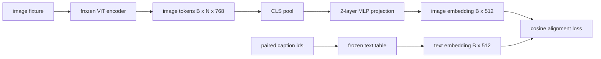

# 模态对齐的投影层

> 视觉编码器产出图像 token。文本解码器消费文本 token。两者活在不同的向量空间里。一个小型两层 MLP 把图像 token 投影进文本嵌入空间,再用一个对成对标题的余弦对齐损失,把两个空间拉到一致。这个投影是视觉-语言模型里最小的部件,也是对迁移最重要的部件。

**类型:** 动手构建
**编程语言:** Python
**前置要求:** 第 19 阶段第 30-37 课(Track B 基础)
**预计耗时:** 约 90 分钟

## 学习目标

- 构建把图像特征映射到文本嵌入空间的两层 MLP 投影。
- 构造一个模拟文本嵌入表(不用预训练分词器,不用真实语料)。
- 计算投影后图像 token 与成对标题嵌入之间的余弦对齐损失。
- 在冻结视觉编码器、冻结文本表的前提下,只训练投影。

## 问题

你有一个视觉编码器(第 58-59 课),产出维度 `vision_hidden = 768` 的 token。你想在上面接一个嵌入维度 `text_hidden = 512` 的文本解码器(换别的数字也一样成立)。解码器期望文本形状的 token。图像 token 不是文本形状的:它们活在编码器在纯视觉预训练中学出的基里,和解码器的词向量没有任何关系。

两层 MLP 投影(线性、GELU、线性)弥合这个裂缝。它小到(约 `768 * 1024 + 1024 * 512 = 1.3M` 参数)单卡几分钟就能训完,而且是对齐阶段唯一需要学的东西。视觉编码器冻结。文本嵌入表冻结。只有投影在动。这就是 LLaVA 2023 年落地的配方,BLIP-2 把它重构成 Q-Former,此后每个开源权重 VLM 都以某种形式采用了它。

## 概念



### 先池化,再投影

视觉编码器吐出 197 个 token。文本侧只有一个标题级嵌入。要对齐,你需要每个样本一个图像级向量。CLS 池化最简:取编码器第一个 token 去投影。对全部 197 个 token 做平均池化是另一个选项,SigLIP 用的就是它。两种都是把 197 个向量压成一个。

### 为什么两层而不是一层

单个线性投影能旋转、能缩放,但如果两个空间存在曲率不匹配,它修不了基。两层线性之间夹一个 GELU,给了投影一次非线性弯折,经验上足够把 CLIP 风格的特征对齐到语言模型嵌入。更深的投影(LLaVA-NeXT 用了 GLU;Qwen-VL 用了一叠注意力层)是扩展;两层 MLP 是经典基线,BLIP-2 的 Q-Former 投影头底下用的也正是它。

| 层 | 形状 | 参数量 |
|-------|-------|------------|
| fc1 | `(vision_hidden, projection_hidden)` | `768 * 1024 + 1024` |
| 激活 | GELU | 0 |
| fc2 | `(projection_hidden, text_hidden)` | `1024 * 512 + 512` |

一个 `768 -> 1024 -> 512` 的头约 1.3M 参数。

### 余弦对齐损失

对齐不是让 `image_emb == text_emb`。对齐是让 `image_emb` 在联合空间里和 `text_emb` 指向同一个方向。余弦损失是 `1 - cos_sim(image, text)`,取值从 0(完全对齐)到 2(完全相反)。训练把每对的这个值压向零。第 62 课会推广到对比批次(InfoNCE):每张图必须离自己的标题比离批次里任何其他标题更近;本课用逐对版本,让动力学过程看得见。

### 冻结编码器是关键

视觉编码器有 86M 参数。文本表还有几百万。拿模拟语料全训根本不现实。两边都冻结,意味着变化的只有投影的 1.3M 参数,在合成对儿上跑几百步就够把损失压下来。这正是每个适配器式 VLM 的运行形态:重的部分冻结,轻的桥训练。

```figure
ch-projection-bridge
```

## 动手构建

`code/main.py` 实现了:

- `MLPProjector(in_dim, hidden_dim, out_dim)`,带 GELU 激活的两层线性 MLP。
- `MockTextEmbedding(vocab_size, dim)`,冻结嵌入表,用种子确定性初始化。
- `make_pair(seed, vocab_size)`,合成一对(图像,标题)样本。标题是短 id 序列;标题嵌入对 token 嵌入做平均池化。
- `cosine_alignment_loss(image_emb, text_emb)`,逐对的 `1 - cos_sim` 目标。
- 一个训练循环:在 32 对合成样本(循环用)上训投影 200 步,视觉编码器和文本表冻结,每 25 步打印损失。

运行:

```bash
python3 code/main.py
```

输出:训练报告显示损失从初始约 1.07 在 200 步内降到约 0.80,证明光靠投影就能把图像 token 拉向文本空间。每对最终的余弦相似度也会打印出来。

## 投入使用

同一个模式出现在每个开源权重 VLM 里:

- **LLaVA 1.5。** 从 CLIP-ViT-L 隐藏维到 LLaMA 嵌入维的两层 GELU MLP 投影。冻结视觉编码器、冻结 LLM,只训投影(第二阶段再解冻 LLM)。
- **BLIP-2。** Q-Former 让 32 个学习 query token 通过交叉注意力读图像 token,再投影到 LLM 嵌入维。Q-Former 最末端的投影头,就是本课 MLP 的对应物。
- **MiniGPT-4。** 从 BLIP-2 Q-Former 输出到 Vicuna 嵌入维的单个线性投影。
- **Qwen-VL。** 带若干层的交叉注意力适配器,但最后一件依然是到 LM 嵌入维的投影。

形状有变化,角色一模一样:池化图像 token,投影到文本嵌入维,单独训练。

## 测试

`code/test_main.py` 覆盖:

- 投影器输出形状匹配配置的 `out_dim`
- 冻结文本嵌入表的 `requires_grad` 参数为零
- 相同向量上余弦损失为 0,反向平行向量上为 2
- 一次反传后投影器有梯度流
- 训练循环在第 0 步到第 200 步之间降低损失

运行:

```bash
python3 -m unittest code/test_main.py
```

## 练习

1. 把 CLS 池化换成对 196 个图像块 token 的平均池化,比较 200 步后的最终损失。平均池化在合成数据上通常训得更快;CLS 在自然图像上样本效率更高。

2. 给余弦损失加一个学习标量温度(`cos / tau`),观察 `tau` 太小(梯度噪声)或太大(损失高位平台)时会发生什么。

3. 把两层 MLP 换成单个线性层,量化损失差距。非线性在自然图像特征上更重要,在合成特征上影响较小。

4. 给投影器权重加一个小 L2 惩罚,观察它和余弦对齐的相互作用(余弦是尺度不变的,所以惩罚主要压缩没用到的方向)。

5. 保存投影器权重,重载后不做视觉编码器反传直接推理,验证部署时只需要投影器。

## 关键术语

| 术语 | 含义 |
|------|---------------|
| 模态对齐 | 让图像和文本嵌入在同一个共享空间里可比较 |
| 投影头 | 把一个空间映射到另一个空间的小模块,通常是两层 MLP |
| 余弦相似度 | 点积除以 L2 范数之积 |
| 冻结编码器 | 视觉(或文本)模型的所有参数都 `requires_grad=False` |
| 模拟语料 | 合成样本对,让训练不依赖数据集下载 |

## 延伸阅读

- LLaVA 论文,两阶段训练(先投影,再解冻 LM)。
- BLIP-2 论文,Q-Former 作为可学习投影的替代方案。
- Qwen-VL 技术报告,交叉注意力适配器作为更深的投影头。
