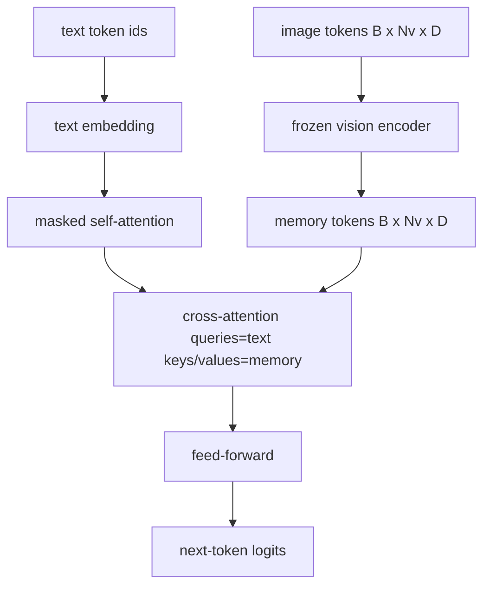
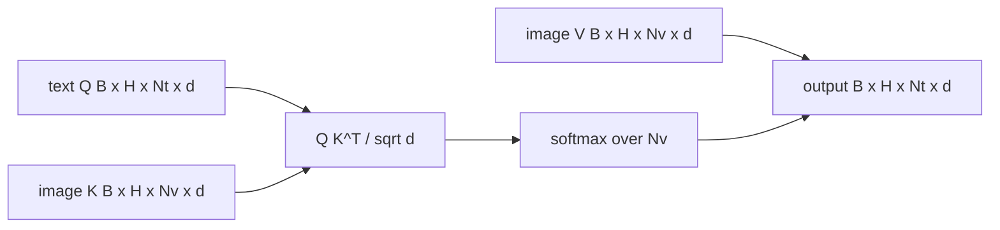

# 交叉注意力融合

> 投影层对齐的是一个图像向量和一个标题向量。真正的视觉-语言解码器需要每个文本 token 去注意每个图像块 token,模型才能把每个词落地到一个区域上。交叉注意力就是这种落地发生的方式。文本提问(query);视觉以键和值作答。本课构建交叉注意力块、因果文本自注意力,以及让两者都合法的掩码形状。

**类型:** 动手构建
**编程语言:** Python
**前置要求:** 第 19 阶段第 30-37 课(Track B 基础)
**预计耗时:** 约 90 分钟

## 学习目标

- 实现多头交叉注意力:query 流是文本,key/value 流是视觉。
- 组合解码器块:因果自注意力 + 交叉注意力 + 前馈。
- 把掩码形状搞对:自注意力用因果掩码,交叉注意力不加掩码。
- 用成批文本 token 和一池固定图像 token 跑前向。

## 问题

把图像 token 和文本 token 拼成一个序列是一种融合选项(早期融合,Chameleon 和 Emu3 走的路)。交叉注意力是另一种(晚期融合,Flamingo 开创、此后每个 Flamingo 形解码器都抄的路)。晚期融合里,文本解码器跑在纯文本 token 上,在每一层通过交叉注意力伸手进图像流。

晚期融合有两个优点。第一,文本流保持干净,模型保住纯文本能力。第二,图像流每张图只算一次,每个解码步都复用,所以生成长标题也很便宜。代价是每块多一个注意力子层。

## 概念





### 掩码形状

解码器块里的两个注意力需要不同的掩码:

| 注意力 | Query 长度 | Key 长度 | 掩码 | 为什么 |
|-----------|--------------|------------|------|-----|
| 自注意力 | `Nt`(文本) | `Nt`(文本) | 因果:下三角 `(Nt, Nt)` | 自回归时文本 token 不许偷看未来 |
| 交叉注意力 | `Nt`(文本) | `Nv`(视觉) | 无掩码 | 整幅图对每个文本位置都可见 |

本课附带一个形状校验函数,把两种掩码搞混的错误会以 `ValueError` 暴露,而不是一条悄悄坏掉的损失曲线。

### 为什么交叉注意力不加掩码

图像在任何文本生成之前就已完全可见。标题的第 `t` 个 token 可以注意图像的任何块;图像块上没有时序。某些 Flamingo 变体在交错多图多文本段时会加按样本的掩码模式,但对单图加标题的场景,交叉注意力看见一切。

### 键/值缓存

图像的键和值在解码开始时算一次,存进缓存。每个新文本 token 直接用缓存,不重算。这就是推理时生成标题快的原因:重型 ViT 只跑一次;交叉注意力每一步复用它的键和值。本课暴露了缓存,并测试了缓存命中路径。

### 块的组合

解码器块依次跑:pre-LN → 自注意力 → 残差 → pre-LN → 交叉注意力 → 残差 → pre-LN → 前馈 → 残差。三个子层,各自带 LayerNorm。Flamingo 论文在交叉注意力上加了一个学习门控,让模型能以训练稳定性为代价选择不走图像路径;经典基线(本课用的)没有门控。

```python
class DecoderBlock:
  def forward(self, text_tokens, image_tokens, text_mask, cross_mask):
      text_tokens = text_tokens + self.self_attn(self.ln1(text_tokens),
                                                 mask=text_mask)
      text_tokens = text_tokens + self.cross_attn(self.ln2(text_tokens),
                                                  image_tokens,
                                                  mask=cross_mask)
      text_tokens = text_tokens + self.ffn(self.ln3(text_tokens))
      return text_tokens
```

```figure
ch-crossattn-fan
```

## 动手构建

`code/main.py` 实现了:

- `CrossAttention(hidden, heads)`,带独立 `q` 和 `kv` 投影的多头交叉注意力。
- `CausalSelfAttention(hidden, heads)`,标准解码器的掩码自注意力。
- `DecoderBlock`,把三个子层按 pre-LN 残差组合。
- `VisionLanguageDecoder`,四层解码器,由模拟视觉编码器输出和一个小文本嵌入表喂入。
- `causal_mask(length)`,返回 `(length, length)` 下三角布尔张量。
- 一个演示:喂入批次为 2、长度 10 的文本序列,图像记忆长度 197,打印输出形状、自注意力掩码形状和每个位置的交叉注意力输出范数。

运行:

```bash
python3 code/main.py
```

输出:解码器产出 `(2, 10, text_vocab)` 的 logits 张量。掩码形状 `(10, 10)`。KV 缓存复用检查确认缓存路径和不缓存路径的 logits 完全一致。

## 投入使用

交叉注意力出现在两个生产家族里:

- **Flamingo 和 IDEFICS。** 每隔 K 个语言模型块插一个交叉注意力子层,LM 冻结。视觉-语言适配器就是交叉注意力块加它的门控。
- **BLIP-2。** Q-Former 用一组固定的 32 个 query token 对图像特征做交叉注意力,再把这些 query 投影进 LM 嵌入空间。

本课的块形状直接映射到两者。掩码纪律(自注意力因果、交叉注意力无)也一样。

## 测试

`code/test_main.py` 覆盖:

- 因果掩码是下三角,布尔形状符合预期
- 交叉注意力输出形状是 `(B, Nt, hidden)`,与 key 长度无关
- KV 缓存路径与不缓存路径在浮点容差内一致
- 文本流和图像流形状不匹配时抛出清晰的 `ValueError`
- 完整解码器前向产出正确的批次和序列形状

运行:

```bash
python3 -m unittest code/test_main.py
```

## 练习

1. 给交叉注意力残差加一个学习的 tanh 门控(Flamingo 技巧),验证训练能从接近零的初始门控收敛。门控从 0 开始;模型先恢复纯文本行为,再把图像流混进来。

2. 实现交错注意力:同一个解码器消费多张图加多段文本。构建按样本的交叉注意力掩码,防止文本段 2 去注意图像 1。

3. 在 `Nt=64, Nv=576`(更高分辨率的 24x24 网格)下剖析交叉注意力 vs 自注意力层。交叉注意力成本是 `Nt * Nv`,在高图像分辨率下占主导。

4. 在交叉注意力图上加 query 侧 dropout,测量演示中的标题多样性(交叉图里的 dropout 越大,标题采样方差越大)。

5. 把交叉注意力层换成 Q-Former 风格注意力块:固定的 32 token query 池每层对图像特征做一次注意力。

## 关键术语

| 术语 | 含义 |
|------|---------------|
| 晚期融合 | 文本和视觉留在各自流里;交叉注意力在每块搭桥 |
| 交叉注意力 | Q 来自一个流,K 和 V 来自另一个流 |
| 因果掩码 | 下三角布尔掩码,防止自回归时偷看未来 |
| KV 缓存 | 图像键和值存一次,每个解码步复用 |
| 记忆 token | 解码器伸手进去读的冻结图像 token |

## 延伸阅读

- Flamingo(2022),带门控交叉注意力的经典晚期融合设计。
- BLIP-2(2023),Q-Former——披着学习 query 池外衣的交叉注意力块。
- IDEFICS(2023),Flamingo 配方的开源权重复现。
