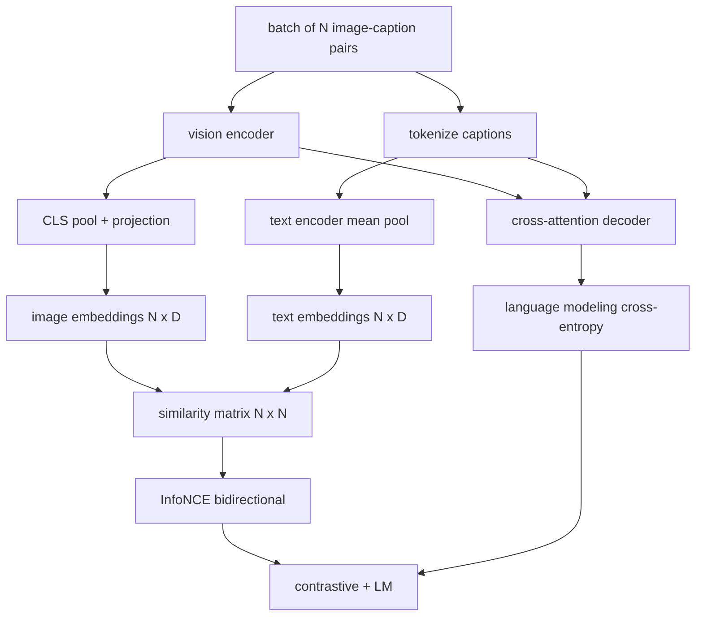

# 视觉-语言预训练

> 编码器、投影、解码器都接好了。现在把它们一起训练。两个目标驱动学习:对比图像-文本损失(InfoNCE)把匹配对拉进联合嵌入空间,语言建模损失要求解码器给每张图写标题。两者合起来,既教网络为标题找到对的图,也教它为图写出标题。

**类型:** 动手构建
**编程语言:** Python
**前置要求:** 第 19 阶段第 30-37 课(Track B 基础)
**预计耗时:** 约 90 分钟

## 学习目标

- 在一批图像-标题对上实现 InfoNCE 对比损失。
- 把对比损失和自回归语言建模损失组合。
- 合成 200 对模拟图像-标题语料,不下载真实数据集。
- 跑 50 步演示训练循环,观察两个损失都在下降。

## 问题

视觉-语言模型需要两种技能。它必须会排序:给定标题,从一堆图里找出对的那张。它必须会生成:给定图,写出标题。只用一种技能做预训练,得到的只是半个系统。CLIP 把排序做到了极致但不会写标题。GPT-4V 会写标题,但排序用的是单独的检索头。多目标预训练一次拿下两者。

InfoNCE 管排序那一半。对一批 N 个样本对,模型把 N 个匹配对当正例,把 `N^2 - N` 个错配对当负例,在得到的 `(N, N)` 相似度矩阵上跑交叉熵。LM 损失管生成那一半:以图像为条件的标准下一 token 预测。两个损失都可微,可以共享编码器、投影器和解码器权重。

## 概念



### 一段话讲清 InfoNCE

把 N 个图像嵌入堆成行,N 个文本嵌入也堆成行。两边都 L2 归一化。算 `N x N` 矩阵 `S = I T^T / tau`,`tau` 是学习的温度。对角线是匹配对;非对角线是负例。以"argmax 应落在对角线上"为目标做交叉熵:第 `i` 行的最大值应在第 `i` 列。沿列方向对称地再来一遍。总损失是两者的平均。这就是八行写完的 CLIP 损失。

### 温度很重要

温度 `tau` 控制 softmax 有多尖。太小(比如 `tau = 0.01`),梯度只来自最难的那个负例,训练噪声大。太大,softmax 被拉平,梯度消失。CLIP 把 `tau` 当作参数学习;这里的演示也一样。

### 语言建模损失

解码器通过交叉注意力消费图像记忆 token,在每个位置预测下一个文本 token。损失是以下一位置为目标的标准交叉熵。padding 位置从损失里掩掉。

### 组合两个损失

`total = contrastive + lm_weight * lm`,`lm_weight` 是标量(常为 1.0)。两个损失共享流入编码器和投影器的梯度;只有解码器接收 LM 损失的梯度。这就是 CoCa、BLIP、SigLIP 风格模型都在用的多任务配方,只是权重各有不同。

| 组件 | 损失面 | 影响 |
|-----------|--------------|---------|
| InfoNCE | 联合空间里的对排序 | 编码器 + 投影器 + 文本头 |
| LM | 以图像为条件的 token 预测 | 编码器 + 投影器 + 解码器 |
| 组合 | 多任务 | 整个栈 |

### 为什么 50 步够演示

模拟语料是 200 对合成集,随机图像配随机标题 id。批次 16 跑 50 步 SGD 之后,两个损失都可见地下降,哪怕绝对值仍高于真实数据模型能到的水平。演示的意义是确认梯度管线端到端通了,而且加进 LM 损失并没有让对比目标失稳。

```figure
ch-infonce-diagonal
```

## 动手构建

`code/main.py` 实现了:

- `MultimodalModel`,组合一个小 ViT 编码器、MLP 投影器、一个迷你文本侧编码器(对嵌入 id 做平均池化),以及第 61 课的交叉注意力解码器。
- `info_nce_loss(image_emb, text_emb, temperature)`,双向 CLIP 风格对比损失。
- `lm_loss(logits, target_ids, padding_id)`,带掩码的下一 token 交叉熵。
- `make_mock_corpus(seed, n_pairs)`,返回 200 对确定性的(图像,标题 id)。
- 一个训练循环:批次 16 跑 50 步,Adam 优化器,带学习的对数温度参数。每 5 步打印两个损失。

运行:

```bash
python3 code/main.py
```

输出:对比损失从约 `ln(16) = 2.77` 降到 2.4 附近;LM 损失从随机均匀基线 `ln(512) ≈ 6.24` 降到约 4.7。两个下降都证明梯度接对了。真实模型要训几百万步;动力学是一样的。

## 投入使用

同样的损失配方落地在:

- **CLIP(2021)。** 纯图文对比,另配一个冻结编码器的标题探针。
- **CoCa(2022)。** 图文对比加图生文 LM 损失,同模型。正是本课构建的模式。
- **BLIP(2022)和 BLIP-2。** 对比加 LM 加图文匹配头。三个损失组合。
- **SigLIP(2023)。** 把 InfoNCE 换成 sigmoid 成对损失;同样的对比角色,不同函数形式。
- **LLaVA 家族。** 两阶段训练:第一阶段对齐(冻结 LM 上的余弦),第二阶段加 LM 损失并解冻 LM。第 60 课对应第一阶段;本课对应第二阶段。

## 测试

`code/test_main.py` 覆盖:

- InfoNCE 损失对图像/文本行列对称
- 相似度矩阵是大正数完美对角线时 InfoNCE 损失为 0
- LM 损失正确掩掉 padding 位置
- 模型前向无错产出两个损失
- 5 步训练循环降低组合损失

运行:

```bash
python3 -m unittest code/test_main.py
```

## 练习

1. 把 InfoNCE 换成 SigLIP 风格 sigmoid 成对损失,在模拟语料上比较收敛。

2. 加难负例挖掘:每隔一批,从上一批里挑最难的非对角对追加进来。训练并观察对比损失是否降得更快。

3. 在联合嵌入上加图文匹配二分类头(真/假:这两样匹配吗?)作为第三个损失,复现 BLIP 的三头配置。

4. 把模拟语料换成从马尔可夫链采样的标题 id 序列,转移矩阵以图像哈希为条件。标题损失应该降得更深,因为这次有真正可学的信号。

5. 同一模型分别以 `lm_weight = 0` 和 `lm_weight = 1` 训练。比较对比损失;LM 损失不应让排序目标回退。

## 关键术语

| 术语 | 含义 |
|------|---------------|
| InfoNCE | 噪声对比估计:在相似度矩阵上做交叉熵 |
| 温度 | 控制对比 softmax 尖锐程度的标量 |
| 难负例 | 让模型犯迷糊的非对角对,采样时有用 |
| LM 损失 | 标题侧的标准下一 token 交叉熵 |
| 联合嵌入空间 | 投影之后图像和文本向量共处的共享空间 |

## 延伸阅读

- CLIP 论文,原始对比配方。
- CoCa 论文,同模型里的对比加标题生成。
- SigLIP 论文,sigmoid 成对损失变体,以及它为什么更好扩展。
