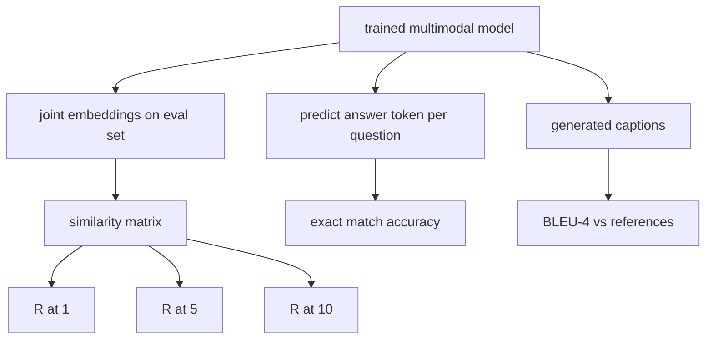

# 多模态评估

> 训练是循环的一半。另一半是测量。本课从原语构建三个评估面:图像-标题检索,报 R@1、R@5、R@10;视觉问答,报精确匹配准确率;图像描述生成,报 BLEU-4。每个指标都是作用在模型输出上的函数,配一套秒级跑完的合成评估套件。

**类型:** 动手构建
**编程语言:** Python
**前置要求:** 第 19 阶段第 58-62 课(Track E 基础:编码器、Transformer、投影、交叉注意力融合、预训练)
**预计耗时:** 约 90 分钟

## 学习目标

- 从图像与标题嵌入的相似度矩阵计算 Recall@K。
- 对把(图像,问题)对映射到固定答案词表的模型,计算精确匹配 VQA 准确率。
- 不借助任何外部库,从生成和参考 token 序列计算 BLEU-4。
- 在第 62 课训好的模型上,对合成套件跑全部三个评估。

## 问题

诱惑在于:训练损失走平了就宣布多模态模型完工。训练损失量的是在训练分布上的拟合;它量不出模型能不能在留出批次里排对样本对、答出问题、写出人能接受的标题。三个标准评估面:

- **检索(R@1、R@5、R@10)。** 为查询标题构建联合嵌入;按余弦给评估池里每张图排序;报告匹配图是否落在前 1、前 5、前 10。对称形式(图找文)同样计算。
- **视觉问答(精确匹配)。** 给定(图像,问题),模型输出答案 token。精确匹配是每样本一比特:预测答案等不等于参考答案?在评估集上求平均。
- **描述生成(BLEU-4)。** 生成标题。对参考标题计算 1-gram 到 4-gram 精确率的几何均值,带长度惩罚。多参考是标准形式(一张图,多个参考标题)。

每个指标都是一个薄薄的函数。本课把它们全部写成代码,让数学具体、评估面留在你手里。真实基准套件(MS-COCO、VQA v2、GQA、OK-VQA)插进的是同样的函数形状。

## 概念



### 从相似度矩阵算 Recall@K

构建图像与标题嵌入之间的 `(N, N)` 余弦相似度矩阵。对每一行,按相似度降序排列各列。Recall@K 是对角线列索引落在前 K 个位置内的行占比。对称 Recall@K(文找图)在转置矩阵上算。两个数都报。N=100 的评估里,R@1 = 0.6 意味着 100 个标题里有 60 个把正确图像检索为第一名。

### VQA 精确匹配

对每个(图像,问题,答案),编码图像、嵌入问题、经解码器融合,读出下一个 token。预测 token id 与参考 id 比较;相等即正确。在评估集上求平均。真实 VQA 数据集每题带多个人工标注答案,用软准确率公式(10 个标注者中至少 3 个一致得 1.0,低于则按比例);本课为清晰起见用单答案精确匹配。

### BLEU-4

```text
BLEU-4 = BP * exp(mean(log p1, log p2, log p3, log p4))
```

其中 `p_n` 是修正 n-gram 精确率(出现在任一参考中的生成 n-gram 截断计数,除以生成 n-gram 总数),`BP` 是长度惩罚:

```text
BP = 1                if generated length > reference length
   = exp(1 - r/g)     otherwise, where r is reference length and g is generated
```

小样本下某些 `p_n` 为零,需要平滑。实现用 Chen and Cherry 的 "method 1"(任何零计数给分子分母各加 1),这是低计数场景下最稳的默认。

### 合成评估套件

50 样本的评估套件在内存里构建,用和第 62 课相同的模拟语料模式,但换一个留出的种子。套件由三个列表组成:

- `pairs`:50 对(图像,标题 id),用于检索。
- `vqa`:50 个(图像,问题 id,答案 id)三元组。
- `caps`:50 条(图像,[参考标题 id, ...]),每图最多 3 个参考。

套件由种子确定,且与训练语料隔离,指标算在模型从没见过的数据上。把套件持久化成 JSON 留作练习(见下)。

| 指标 | 范围 | 随机基线(N=50) |
|--------|-------|------------------------|
| R@1 | 0 到 1 | 0.02(1 / N) |
| R@5 | 0 到 1 | 0.10 |
| R@10 | 0 到 1 | 0.20 |
| VQA EM | 0 到 1 | 1 / vocab |
| BLEU-4 | 0 到 1 | 小但非零 |

在合成数据上只训 50 步的模型,指标不指望高;指望的是高过随机基线,这正是演示检查的。

```figure
ch-recall-window
```

## 动手构建

`code/main.py` 实现了:

- `recall_at_k(sim_matrix, k)`,两个方向各返回 `[0, 1]` 内的一个浮点数。
- `vqa_exact_match(predictions, references)`,返回整数判等的均值。
- `bleu4(generated, references, smoothing=True)`,支持多参考。
- `build_eval_suite(seed, n_samples, vocab_size, max_len)`,返回三个确定性评估列表。
- `evaluate(model, suite)`,跑全部三个指标,返回数字字典。
- 一个演示:加载第 62 课全新初始化的多模态模型,评估一次,训 50 步,再评估一次,打印前后指标。

运行:

```bash
python3 code/main.py
```

输出:前后指标表显示检索从接近随机向模型学到的信号爬升,VQA 升到随机之上,BLEU-4 也有提升(合成结构已足够撑起 4-gram 精确率的抬升)。

## 投入使用

每个指标直接映射到一个生产基准:

- **检索。** MS-COCO 5K val、Flickr30K、ImageNet 零样本,都是同一个相似度矩阵上的 R@K 问题。把合成评估换成真实文件,函数签名不变。
- **VQA。** VQA v2、GQA、OK-VQA 用同样的精确匹配形状(VQA v2 用软准确率代替单答案 EM)。
- **BLEU-4。** MS-COCO 描述、NoCaps、Flickr30K 描述都用 BLEU-4 加 CIDEr 和 METEOR。加 CIDEr 就是再加一个函数。

接真实基准时,把 `build_eval_suite` 换成真实加载器,函数体保留。数学与基准无关。

## 测试

`code/test_main.py` 覆盖:

- 完美单位相似度矩阵上 recall@k 返回 1.0,翻转矩阵上 k < N 时返回 0.0
- recall@k 遵守 `k <= N` 上界
- 生成序列与某一参考完全相同时 bleu4 返回 1.0
- 词表不相交时 bleu4 返回 0.0
- vqa 精确匹配等于相等对占比
- build_eval_suite 返回预期数量的 pairs、vqa 条目和描述条目

运行:

```bash
python3 -m unittest code/test_main.py
```

## 练习

1. 给描述指标加 CIDEr。CIDEr 对 n-gram 做 TF-IDF 加权,奖励信息量大的 token。

2. 实现软准确率 VQA:每题多个人工答案,有匹配时准确率为 `min(human_count / 3, 1)`。复现 VQA v2。

3. 给 `bleu4` 加一个 NaN 安全变体,处理空生成序列而不崩溃。

4. 在 R@K 旁边加算平均倒数排名(MRR)。MRR 对正确答案落在前 K 之外的位置敏感;R@K 只对是否落进前 K 敏感。

5. 在训练的五个检查点(第 0、10、20、30、40、50 步)上跑评估,画学习曲线。确认指标轨迹跟着损失轨迹走。

## 关键术语

| 术语 | 含义 |
|------|---------------|
| R@K | 查询的正确匹配落在前 K 结果中的占比 |
| 精确匹配 | 最简 VQA 打分:预测答案等于参考 |
| BLEU-4 | 1 到 4-gram 精确率的几何均值,带长度惩罚 |
| 多参考 | 描述指标接受每图多个参考标题 |
| 留出 | 评估集从与训练语料不相交的种子采样 |

## 延伸阅读

- VQA v2 论文,软准确率公式与数据集统计。
- CIDEr 论文,TF-IDF 加权 n-gram 描述评估。
- BLEU 原始论文(Papineni 等,2002),各种平滑变体。
- MS-COCO 描述评估脚本,经典参考实现。
