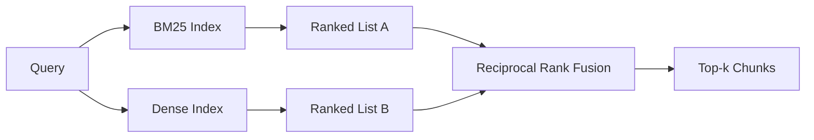

# BM25 与稠密嵌入的混合检索

> 词法检索和语义检索在相反的查询分布上翻车。带倒数排名融合(RRF)的混合检索不做插值,它投票——而且这个投票在每一类查询上都赢。

**类型:** 动手构建
**编程语言:** Python
**前置要求:** 第 11 阶段第 04 课(嵌入)、06(RAG);第 19 阶段 Track B 基础(第 20-29 课);第 19 阶段第 64 课(分块策略)
**预计耗时:** 约 90 分钟

## 学习目标
- 按 Robertson 和 Sparck Jones 的表述从零实现 BM25,带字段加权、文档长度归一化和可调 k1、b。
- 在确定性模拟嵌入上构建稠密检索器,让循环离线可跑。
- 按 Cormack、Clarke 和 Buettcher 2009 年发表的原样实现倒数排名融合,并解释它为什么碾压分数加权插值。
- 调 RRF 的 k 常数和各模态权重,在小样本语料上读出权衡。

## 问题

当查询带着语料里逐字存在的字面标识符时,词法搜索赢。查 `AbortMultipartOnFail`,BM25 几微秒返回正确的 Go 函数。同一个查询做成嵌入,落在三个相似度簇的边界上,稠密检索器把错误的文件排第一。

当查询相对语料的字面 token 做了改写时,稠密搜索赢。用户问"取消的上传我们怎么处理",从头到尾没打过 abort 或 multipart 这两个词。BM25 返回的是"上传大文件"的文档块,因为那页有 uploads 这个词。稠密检索能找到摘要里提到 cancellation 的中止函数。

两者之间的选择不是静态的。查询分布才是变量。生产 RAG 系统在同一个端点上处理两类查询,所以检索必须同时处理两者。这就是混合检索。合并这一步是必须做对的部分。

## 概念



### 一段话讲清 BM25

BM25 给查询-文档对打分的方式是:对查询词求和,每项是一个逆文档频率因子乘以一个带长度归一化修正的饱和词频因子。两个旋钮。`k1` 控制词频饱和;默认 1.5 是论文推荐值,没有基准别动它。`b` 控制文档长度有多大影响;默认 0.75 表示长文档被罚,但不是线性罚。

IDF 公式用平滑的 Robertson-Sparck Jones 定义:`log((N - df + 0.5) / (df + 0.5) + 1)`。对数里的加一让 IDF 在词出现于超过半数语料时仍为正。在小语料里这很重要,那里停用词在技术上也算稀有词。

字段加权让你告诉 BM25:符号名上的命中比正文里的命中更值钱。实现方式是在索引期给词频乘系数,而不是在打分期。这样数学保持一致,也不用每个字段单独算分。

### 一段话讲清稠密检索

用嵌入模型把每块嵌成定维向量。查询时嵌入查询,按相似度对每个块做余弦排序,返回前 k。模型是决定质量的变量。检索算法本身只有两行:点积、排序。

本课用确定性哈希嵌入,让你不用发网络请求也能读懂融合数学。哈希把按 token 索引的偏移加进一个 96 维向量再归一化。余弦排名跨运行确定,这正是测试套件的要求。

### 倒数排名融合,论文原式

两个排名列表。对出现在任一列表里的每个候选,把它的倒数排名贡献加起来。2009 年论文用 `1 / (k + rank)`,默认 k = 60。按总分排序。这就是整个算法。

论文常数 k = 60 不是拍脑袋。k = 60 时,第 1 名贡献 1 / 61,第 10 名贡献 1 / 70。贡献衰减得慢,深位候选仍能投票。k 更小让头部结果主导;k 更大把贡献曲线拉平。

我们的实现里有两个可调旋钮。`k` 常数。一对按模态的权重,当你有先验证据表明某模态在你的语料上更好时,可以抬 BM25 或稠密。给排名贡献乘权重是最简单的有原则实现;它保住排名衰减的形状,且保持尺度无关。

### 为什么融合胜过分数加权插值

BM25 分数无界且随语料而变。余弦相似度有界,在 -1 到 1。线性组合 `alpha * bm25 + (1 - alpha) * cosine` 需要按语料调 alpha,而且每次重建索引就失效。基于排名的融合不会。两个排名跨模态可比。2010 年以来,公开的 RRF 基线在每个 TREC 赛道都打败分数插值。

这和你在 Vespa、Weaviate 文档里看到的 RankFusion vs RRF 之争是同一个论证。它们得出同一结论:除非你有非常强的证据,否则待在排名侧,别插值分数。

```figure
rrf-fusion
```

## 动手构建

`code/main.py` 实现了:

- `tokenize(text)`——快速正则分词器。
- `BM25Index`——字段加权,带 `add`、`search`,k1、b 可调。
- `mock_embed`、`DenseIndex`——和第 64 课相同的确定性嵌入,块可比较。
- `rrf(rankings, k, weights)`——论文原式融合,带多模态权重。
- `HybridRetriever`——组合 BM25 和稠密。
- 演示 `main()`:加载小样本语料,跑三个分别针对各检索器强项和弱项的查询,打印每个模态的排名和融合列表。

运行:

```bash
python3 code/main.py
```

并排读演示输出。字面标识符查询落在 BM25 第 1、稠密第 4、RRF 第 1。改写查询落在 BM25 第 6、稠密第 1、RRF 第 1。歧义查询落在 BM25 第 3、稠密第 3、RRF 第 1。融合不是平局裁决器;它是在每一类查询上都赢的系统。

## 调旋钮

| 旋钮 | 默认 | 什么时候调高 | 什么时候调低 |
|------|---------|----------------|------------------|
| BM25 k1 | 1.5 | 词在文档里重复出现,想让频率更重要 | 文档短,词重复是噪声 |
| BM25 b | 0.75 | 长文档确实每词信息量更少 | 文档长度与主题无关 |
| RRF k | 60 | 深位候选应继续投票 | 想让第 1 名主导 |
| BM25 权重 | 1.0 | 语料含字面标识符且查询匹配它们 | 查询是用户改写过的 |
| 稠密权重 | 1.0 | 查询是改写过的 | 查询是字面原文 |

调参的方法是拿你的留出查询集重跑第 68 课的评估框架,不是凭直觉。

## 演示藏起来的失效模式

**词表外 token。** BM25 的 IDF 从语料算,只在查询里出现的词贡献为零。稠密嵌入却会为同一个词"幻觉"出一个向量。在语料外标识符上,稠密模态返回看着合理但错误的邻居。融合能吸收这一点,因为 BM25 什么都不返回、排名贡献自动出局——但前提是你按文档去重,而不是按块。

**停用词主导。** 对 "the" 这种词跑 BM25,产出的是全语料上的均匀排名。在索引器里滤掉停用词,或者接受高 IDF 词自然主导。

**跨模态内容雷同。** 语料小到 BM25 的第 1 名和稠密的第 1 名相同时,RRF 给你同样的第 1 名和同样的邻居。这是正确行为,不是失效,但会让融合看起来像没干活。在评估里加一对对抗查询,验证融合确实在工作。

## 投入使用

生产模式:

- BM25 在进程内索引;瓶颈是词频字典,不是向量。
- 稠密向量放独立存储(本课用扁平列表;生产用 HNSW)。
- 两个查询并行跑;融合是对并集的常数时间合并。
- 持久化每个命中来自哪个模态,让下游重排器看到是谁投的票。

## 交付

第 66 课拿本课融合后的前 k 用交叉编码器重排。第 68 课用精确率、召回、MRR、nDCG 评估整条流水线。本课的混合检索器是第 69 课端到端系统的第一级。

## 练习

1. 把 `mock_embed` 换成你供应商的真实模型。重跑演示,报告改写查询上纯稠密排名的变化。
2. 加第三个模态:块摘要单独索引,作为第三个排名列表融合。测增益。
3. 扫 RRF k:10、30、60、100、200。用第 68 课的方法画 recall@k 曲线。报告在你的语料上曲线峰值处的 k。
4. 正经实现 BM25F(按字段长度归一化,而不是乘系数技巧),在符号命中最重要的语料上对比。

## 关键术语

| 术语 | 大家嘴里的说法 | 实际含义 |
|------|-----------------|------------------------|
| BM25 | "词法搜索" | 概率排名:idf × 饱和 tf × 长度归一化 |
| RRF | "排名融合" | 跨排名列表求 1 / (k + rank) 的和;默认 k = 60 |
| k1 | "TF 饱和" | 控制重复词多快停止贡献更多分数 |
| b | "长度惩罚" | 0 表示忽略文档长度,1 表示完全归一化 |
| 字段加权 | "符号提升" | 索引期重复 token,提升该字段的命中 |
| 排名融合 vs 分数融合 | "为什么 RRF 胜过线性" | 排名跨模态可比;分数不可比 |

## 延伸阅读

- Cormack、Clarke、Buettcher,《Reciprocal Rank Fusion outperforms Condorcet and individual rank learning methods》,SIGIR 2009
- Robertson、Walker、Beaulieu、Gatford、Payne,《Okapi at TREC-3》(BM25 原始论文)
- [Vespa: Hybrid Retrieval with BM25 and Embeddings](https://docs.vespa.ai/en/tutorials/hybrid-search.html)
- [Weaviate: Hybrid Search](https://weaviate.io/developers/weaviate/search/hybrid)
- 第 11 阶段第 06 课——RAG 基础
- 第 19 阶段第 64 课——本课索引的块由那里的分块器产出
- 第 19 阶段第 66 课——消费融合前 k 的交叉编码器重排器
