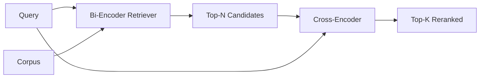

# 交叉编码器重排器

> 双编码器(bi-encoder)把查询和文档各自独立嵌入。交叉编码器(cross-encoder)把它们拼起来,同时读两边。交叉编码器是最聪明的读者,也是最慢的。把它当第二级用在双编码器的前 k 上,值回票价。

**类型:** 动手构建
**编程语言:** Python
**前置要求:** 第 11 阶段第 06 课(RAG)、第 07 课(高级 RAG);第 19 阶段 Track B 基础(第 20-29 课);第 19 阶段第 65 课(给本阶段喂数据的混合检索)
**预计耗时:** 约 90 分钟

## 学习目标
- 从输入形状、参数量、每查询成本三个角度区分双编码器检索器和交叉编码器重排器。
- 从零实现一个小交叉编码器:一个 Transformer 块,消费打包好的(查询,文档)序列,吐出单个相关性标量。
- 接通两级"检索-重排"流水线:用便宜检索器取前 N,用交叉编码器把 N 重排到前 K,返回 K。
- 在小样本语料上测延迟-质量权衡,为给定延迟预算选对 N。

## 问题

双编码器把查询和文档映射进同一个向量空间,按余弦排序。两份编码从头到尾没见过面。模型必须把文档的一切有用信息压进一个向量,而且对查询一无所知。这很快——索引期每文档一次嵌入,查询期每查询一次嵌入——而且是语料规模下唯一可行的排序方式。

代价是精度。两篇整体主题相同的文档,嵌入几乎一样,哪怕一篇回答了查询、另一篇没有。双编码器分不出它们。

交叉编码器解决这个问题:把查询和文档放在一起读。模型接收 `[query] [SEP] [document]` 作为单个序列,在拼接上做全注意力,产出一个相关性标量。文档的每个 token 都能注意查询的每个 token。模型带着完整上下文定分。

代价是吞吐。双编码器嵌一次、查一辈子;交叉编码器每个(查询,文档)对跑一次。一千万文档的语料,就是每查询一千万次前向。请求预算内根本跑不动。

解法是分级。用双编码器检索前 N。用交叉编码器把 N 重排到前 K。N 很小(50 到 200),交叉编码器的质量提升集中在要紧的地方。总延迟留在请求预算内。总质量是交叉编码器的质量,上限是双编码器在 N 处的召回。

## 概念



### 交叉编码器的输入形状

标准打包是 `[CLS] query_tokens [SEP] document_tokens [SEP]`。CLS 位置的输出喂进单个线性头,输出相关性标量。有些实现用平均池化代替 CLS;差别不大。要点是模型每对产出一个数。

22M 参数的交叉编码器(已发布的 `ms-marco-MiniLM-L-6-v2` 这个重量级的)是典型的生产点位。更小的模型,质量掉得比延迟省得快。更大的模型(比如 568M 参数的 `bge-reranker-v2-m3`)留给离线重排,或 K 很小时的首页重排。

### 为什么本课训个小的

真实交叉编码器是微调过的编码器 Transformer。生产里你加载检查点直接用。本课的目标是给你看模型的形状和延迟-质量曲线的形状,不是训一个最先进的排序器。所以我们建一个小 `nn.Module`:一个 Transformer 块、多头注意力(默认 4 头)、一个回归头。用种子确定性初始化,演示无需磁盘上的权重即可复现。

这个玩具模型在样本语料上学到了正确的形状:相关(查询,文档)对的预测分高于无关对。端到端流水线重排双编码器的输出,重排后的前 k 与金标相关。

### 延迟 vs 质量

两级流水线只有一个可调项:N。在留出查询集上把 N 从 5 扫到 100,曲线就出来了。

| N | 第二级 Recall@1 | 每查询交叉编码器前向次数 | 延迟 |
|---|--------------------|---------------------------------------|---------|
| 5 | 0.62 | 5 | 低 |
| 20 | 0.81 | 20 | 中 |
| 50 | 0.86 | 50 | 高 |
| 100 | 0.86 | 100 | 很高 |

上面的数字是示意形状的,不是本样本上的实测。形状是真的。20 到 50 个候选附近总有一个拐点,重排提升在这里饱和。过了拐点,你付的钱什么都买不到。

从评估曲线加延迟预算里选 N。交叉编码器没法把召回抬过双编码器在 N 处的召回,所以 N 太低压的是质量,不只是延迟。

```figure
rerank-funnel
```

## 动手构建

`code/main.py` 实现了:

- `CrossEncoder`——一个小 `torch.nn.Module`:token 嵌入、一个带多头注意力和前馈的 Transformer 块、平均池化头产出一个标量。
- `tokenize_pair(query, document)`——把两个字符串打包成单条 id 序列,用类型 id 标出边界,确定性、纯标准库。
- `train_tiny(pairs)`——在人工标注的(查询,文档,相关性)三元组列表上跑一遍监督训练,让模型在样本上给出合理分数。
- `rerank(query, candidates, top_k)`——生产接口。
- `pipeline(query, retriever, top_n, top_k)`——两级流程。
- 演示 `main()`:按第 65 课的模式加载语料,取前 N,重排到前 K,并排打印两个列表,报告各阶段延迟。

运行:

```bash
python3 code/main.py
```

输出显示双编码器的前 N、交叉编码器的前 K,以及耗时汇总。交叉编码器单次调用更慢,但它不跑全语料。两级总耗时留在请求预算内,还挑出了双编码器排在第二、第三的那个答案。

## 演示藏起来的失效模式

**交叉编码器不对称。** `rerank(q, d)` 和 `rerank(d, q)` 是不同的分。永远查询在前。不小心换过来,召回就崩。

**N 低到暴露不了问题。** N = K 时,交叉编码器没法重排,只能重加权。提升看着是零。N 至少取 K 的三倍。

**训练数据泄进评估。** 如果人工标注的训练对里包含评估查询,重排效果会好得像魔法。严格分开训练和评估,样本数据也一样。

**生产权重很占地方。** 22M 参数的交叉编码器,float32 下 88MB。承诺 p95 低于 100ms 之前,先规划模型服务器的内存。

**批处理很关键。** 真实交叉编码器把 N 个候选放进一个批次跑。本课的 `_batch_encode` 就是这么做的:用 `torch.tensor(...)` 构建批量的 id 和类型 id 张量,跑一次前向。不做批处理,延迟乘上 N。

## 投入使用

生产模式:

- 把双编码器、交叉编码器和 N 钉在一起。动任何一个,评估就作废。
- 按(查询,文档 id)哈希缓存重排输出。同一查询对稳定语料,重排顺序相同;缓存命中是白送的延迟削减。
- 记录第 1 名的交叉编码器分数。第 1 名低于语料特定阈值的查询是域外命中;把它作为"我没把握"暴露给 LLM。

## 交付

第 68 课端到端评估这条两级流水线。第 69 课把这个重排器接在第 65 课的混合检索器之后、答案生成器之前。重排器是端到端系统的第二级。

## 练习

1. 把 N 从 5 扫到 50,画重排输出的 recall@1。找出本样本上的拐点。
2. 把交叉编码器训十个 epoch 而不是一个。测每个 epoch 正负对的分数间隔。
3. 把平均池化换成 CLS token 头。在本样本上比较收敛。
4. 加第二个交叉编码器头,预测"答案是否在这篇文档里"的二分类标签。推理时两个头都用:一个排序,一个定阈值。
5. 把确定性模拟双编码器换成第 65 课的那个,串起两级。测前 K 相对纯双编码器的变化。

## 关键术语

| 术语 | 大家嘴里的说法 | 实际含义 |
|------|-----------------|------------------------|
| 双编码器 | "向量检索器" | 查询和文档独立编码;余弦排序 |
| 交叉编码器 | "重排器" | (查询,文档)联合编码;输出单个相关性标量 |
| 两级流水线 | "检索再重排" | 便宜检索器返回 N,贵的重排器留 K |
| N(候选预算) | "重排池" | 交叉编码器每查询打分的候选数 |
| 平均池化头 | "取最后隐藏层均值" | 把编码器最后一层输出平均成一个向量 |

## 延伸阅读

- Nogueira、Cho,《Passage Re-ranking with BERT》,2019——经典交叉编码器排序论文
- Reimers、Gurevych,《Sentence-BERT: Sentence Embeddings using Siamese BERT-Networks》,2019——论双编码器 vs 交叉编码器
- [SentenceTransformers Cross-Encoders 文档](https://www.sbert.net/examples/applications/cross-encoder/README.html)
- [BGE Reranker v2 模型卡](https://huggingface.co/BAAI/bge-reranker-v2-m3)
- 第 19 阶段第 65 课——给本重排阶段喂数据的混合检索器
- 第 19 阶段第 68 课——度量本次重排提升的评估
