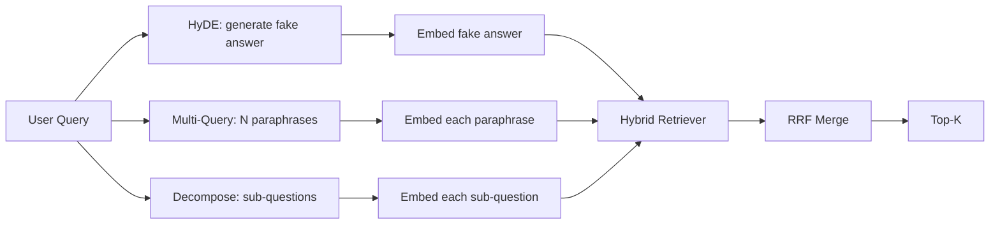

# 查询改写:HyDE、多查询扩展与分解

> 用户敲出来的查询,不是你的检索器想要的查询。改写发生在检索之前,把这道沟填上,让索引看到更接近答案长相的东西。

**类型:** 动手构建
**编程语言:** Python
**前置要求:** 第 11 阶段第 04 课(嵌入)、06(RAG);第 19 阶段 Track B 基础(第 20-29 课);第 19 阶段第 64、65 课
**预计耗时:** 约 90 分钟

## 学习目标
- 实现假设文档嵌入(HyDE):生成一个假答案,嵌入它,用这个向量而不是查询向量去检索。
- 实现多查询扩展:把一个查询改写成 N 个释义,分别检索,用倒数排名融合合并并集。
- 实现查询分解:把复杂问题拆成子问题,逐子问题检索,合并。
- 在同一样本上正面对比三种改写器,解释每种策略什么时候赢。
- 接一个产出确定性、贴合样本输出的模拟 LLM,让改写循环离线可跑。

## 问题

用户敲:"上传失败而且预算用完的时候,我们团队怎么办?"语料里有一篇文档写着:"AbortMultipartOnFail 中止一个在途的 S3 分段上传,并在上传失败时扣减按桶的重试预算。"查询和文档没有共享的名词短语。BM25 漏了。双编码器把这篇文档排第三第四,因为查询向量落在嵌入空间里偏爱"取消的任务"那篇、而非"中止上传"这篇的区域。第 66 课的两级重排还能救——只要答案挤进了前 N;但如果它连前 N 都没进,重排器永远看不到它。

修法是在查询碰到检索器之前先改写。2023 年论文《Precise Zero-Shot Dense Retrieval without Relevance Labels》(Gao 等)提出 HyDE:让 LLM 写一篇会回答这个查询的文档,嵌入这篇假设文档,用它的嵌入做检索向量。假设文档落在嵌入空间的正确区域,因为它是用语料的口吻写的。查询向量不是。

两个姊妹技术与 HyDE 配套。多查询扩展(微软 GraphRAG 用的叫法)生成查询的 N 个释义,分别检索再合并。分解(2024 年斯坦福 DSPy 工作中以"子查询分解"流行开来)把"上传失败而且预算用完的时候我们团队怎么办"拆成两个问题:"上传失败会发生什么"和"重试预算用完会发生什么"。两次检索,一份合并结果,答案的两块都可达。

本课三个都实现,在同一份样本语料上跑。

## 概念



### HyDE 详解

HyDE 用 LLM 写的假设文档向量替换用户的查询向量。提示词很短:

```
You are a domain expert. Write a one-paragraph passage that answers the question
below. Use the same vocabulary and phrasing the documentation in this domain would
use. Do not refuse. Do not say you do not know.

Question: {user_query}

Passage:
```

LLM 的答案作为事实答案是错的,因为 LLM 不知道你的语料。没关系。检索器不在乎事实正确,只在乎 token 分布。假设段落里含有 "abort"、"multipart"、"bucket"、"budget" 这些词,因为这个主题的文档段落就会这么写。嵌入它,向量就落在真实段落附近。

生产里把假设文档限制在两到三句。更长的假设收集更多噪声。更短的丢失 HyDE 需要的词法信号。

### 多查询扩展详解

生成用户查询的 N 个释义。最简提示词:

```
Rewrite the following question in {N} different ways. Each rewrite must preserve
the original intent. Number them 1 to {N}. Do not add explanations.
```

每个释义检索前 k。用 RRF(第 65 课的同一个算法)合并 N 个排名列表。便宜、可并行、确定。

当用户的措辞只是众多等价问法之一、任何一个改写都可能问得更好时,多查询赢。当所有改写一样烂——因为原句就是以同样方式烂的——它就输。

### 分解详解

单次检索满足不了多面问题。分解让 LLM 把问题拆成子问题,系统逐子问题检索。提示词:

```
The following question may require information from multiple distinct topics.
Decompose it into a list of sub-questions. Each sub-question must be answerable
independently. If the question is already atomic, return it unchanged.

Question: {user_query}
```

逐子问题检索。合并。分解是处理含并列连词、多从句比较、或两个无关主题的问题的正确工具。对原子问题它是错工具;分解器在那里的职责是原样返回,不编造假的子问题。

### 为什么三个都存在

三者互补。HyDE 弥合查询-语料的 token 鸿沟。多查询覆盖释义方差。分解覆盖多主题查询。生产系统三个都跑,按查询选策略(第 69 课的端到端系统展示选择器)。

## 模拟 LLM

本课离线运行。模拟 LLM 是一张按用户查询索引的小查找表,外加没见过查询的兜底。查找表包含:

- 对每个样本查询:一段写好的假设段落、三个释义、一份分解。
- 对未知查询:确定性变换——取查询的内容词,过一张同义词表展开,返回结果。

重要的是模拟的形状,不是数据。生产里把模拟换成真实模型调用。检索器不变。

```figure
cd-hyde-vector
```

## 动手构建

`code/main.py` 实现了:

- `MockLLM`——上面描述的确定性替身。
- `HyDERewriter`——调 LLM 写假设文档,以 `RewriteResult` 返回改写输出,含假设文本和检索器该用的查询。
- `MultiQueryRewriter`——调 LLM 要 N 个释义,返回查询列表。
- `DecomposeRewriter`——调 LLM 分解,返回子问题。
- `retrieve_with_rewriter`——接收改写器和检索器,跑改写,融合结果。
- 一个演示:在样本上跑三个改写器,打印哪种策略最先返回金标答案文档。

检索器形状复用第 65 课的(BM25 + 稠密混合)。融合是同一个 RRF。唯一的新形状是改写器接口,很小。

运行:

```bash
python3 code/main.py
```

输出是按策略的排名加一份总结。措辞不匹配查询上 HyDE 赢。释义方差查询上多查询赢。多主题查询上分解赢。兜底(不改写)在三个里至少输一个。

## 演示藏起来的失效模式

**HyDE 把语料特定标识符编错。** 模型捏造一个函数名。假设文档在正确文档上的 BM25 分数崩掉,因为捏造的名字成了高权重 token,却不在索引里。限制假设文档长度,融合里把 BM25 权重调低。

**多查询改写全部趋同。** 弱模型产出三个几乎一样的释义。N 次检索返回同样的前 k。RRF 合并不比单次检索好。在改写提示词里加显式多样性指令,用 Jaccard 检测重复。

**分解过度拆。** 分解器把原子问题拆成列表。各次检索返回同一篇文档但排名更低。合并结果比原始还差。扇出前加一道"这些子问题足够不同吗"的检查。

**延迟翻倍。** HyDE 花一次 LLM 调用。多查询花一次 LLM 调用生成 N 个改写,再 N 次检索。分解花一次 LLM 调用分解,再 M 次检索。检索可以并行;LLM 调用是地板。

## 投入使用

生产模式:

- 按查询长度做逐查询策略选择:短原子查询用多查询,复杂多从句查询用分解,黑话重的查询用 HyDE。
- 按查询哈希缓存改写输出。很多查询会重复。
- 三个并行跑,用 RRF 把三份结果集融成一份。成本是三次 LLM 调用加一次融合;质量是三种策略覆盖面的并集。

## 交付

第 69 课把改写级接在第 65 课的检索器之前、第 66 课的重排器之前。第 68 课评估改写器给检索召回带来的提升。

## 练习

1. 实现 RAG-Fusion(多查询的 2024 变体):改写器的释义刻意多样化,再由重排步(第 66 课)选出最终列表。
2. 加第四种策略:回退提示(问 LLM 更一般化的问题,检索之,再收窄)。在样本上对比。
3. 训练分解器识别原子查询:加一个"问题是否原子"头。测前后的过度拆分率。
4. 把模拟 LLM 换成真实模型调用。在你的栈上测各策略延迟。
5. 给每个改写加置信分数。低于阈值的丢弃。测对召回的影响。

## 关键术语

| 术语 | 大家嘴里的说法 | 实际含义 |
|------|-----------------|------------------------|
| HyDE | "假文档检索" | LLM 写答案;嵌入它去检索,而不是嵌入查询 |
| 多查询 | "释义扩展" | 查询的 N 个改写;检索 N 次,RRF 合并 |
| 分解 | "子查询拆分" | 多主题查询拆成子问题,分别检索 |
| 原子查询 | "单主题" | 不编造假子问题就拆不动 |
| 回退 | "抽象查询" | 问更一般的问题,检索,再收窄 |

## 延伸阅读

- Gao、Ma、Lin、Callan,《Precise Zero-Shot Dense Retrieval without Relevance Labels》(HyDE),2023
- Microsoft Research,《Multi-Query Expansion for Retrieval》
- Stanford DSPy,《Subquery Decomposition for Multi-Hop QA》
- [LlamaIndex query transformations 文档](https://docs.llamaindex.ai/en/stable/optimizing/advanced_retrieval/query_transformations/)
- 第 11 阶段第 07 课——高级 RAG 模式
- 第 19 阶段第 65 课——本改写器喂给的检索器
- 第 19 阶段第 68 课——度量改写器提升的评估
