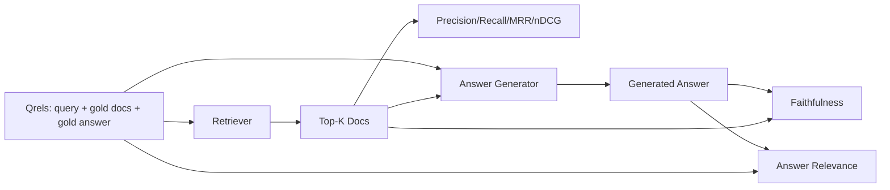

# RAG 评估:精确率、召回、MRR、nDCG、忠实度、答案相关性

> 如果你不能同时给你的检索和你的答案打分,你就发不了这个系统。两者不是同一个指标,同一个提示词会在不同的轴上翻车。

**类型:** 动手构建
**编程语言:** Python
**前置要求:** 第 11 阶段第 06 课(RAG)、10(评估);第 19 阶段 Track B 基础(第 20-29 课);第 19 阶段第 64、65、66、67 课
**预计耗时:** 约 90 分钟

## 学习目标
- 从金标 qrels 计算四个检索指标:precision@k、recall@k、MRR(平均倒数排名)、nDCG@k。
- 计算两个答案级指标:忠实度(每个论断都有检索到的上下文支撑)和答案相关性(答案回应了问题)。
- 构建评估端到端要读的样本 qrels 文件(查询、金标文档 id、金标答案文本)。
- 读懂指标数值,诊断流水线在哪里坏:检索、排序、生成,还是落地。

## 问题

RAG 系统至少有四个活动部件:分块器、检索器、重排器、生成器。任何一个都可能是错误答案的元凶。没有分阶段指标,你就是盲飞。

用户报了一个错答案。是分块器把答案跨度切断了?是检索器没把那块放进前 k?是重排器把对的那块推过了第一位?还是生成器无视那块自己编了一个?光看答案你分辨不出来。你需要:

- 检索指标,给检索器捞出来的东西打分。
- 排序指标,给对的那块在序列里的位置打分。
- 忠实度,给生成器是否待在检索上下文内打分。
- 答案相关性,给答案到底有没有回应问题打分。

本课在一个样本 qrels 文件上把六个全建出来。评估离线、确定;生产里把模拟 LLM 裁判换成真的。

## 概念



### Precision@k

检索器返回的前 k 篇里,多大比例在金标集里?金标有三篇,前 3 返回了其中两篇加一篇错的,precision@3 就是 2 / 3。当不相关块的代价高时用精确率(生成器在它上面浪费 token,或者它污染答案)。

### Recall@k

金标文档里,多大比例进了前 k?金标三篇,前 5 全含,recall@5 就是 1.0。当漏答案的代价高时用召回(宁可多看一篇错的,也不能整篇错过答案块)。

生产 RAG 里大家最常引用的是 recall@k。生成可以轻易丢掉不相关块;它没法从一块从没见过的块里编出答案。

### MRR(平均倒数排名)

对每个查询,找排名列表里第一篇相关文档的位置。倒数排名是 1 / 位置。在查询集上求均值。MRR 用一个数字概括检索器把最佳答案顶到最前的能力。

MRR 重罚非首位。金标在第 1 位的查询贡献 1.0。第 2 位贡献 0.5。第 10 位贡献 0.1。指标被列表头部主导。

### nDCG@k

归一化折损累计增益。完整公式给每篇检索到的文档一个增益(常取相关为 1、不相关为 0),按位置的对数折损,求和,再除以理想 DCG(完美排序时的 DCG)。范围 0 到 1。

nDCG 容纳分级相关性:金标可以说"文档 A 是 3 分,文档 B 是 2 分,文档 C 是 1 分"。MRR 和 recall@k 把一切压平成二值。语料中每查询有多篇部分相关文档时用 nDCG。

### 忠实度

对生成答案里的每个论断,检查它是否被检索上下文支撑。标准实现用 LLM 裁判提示词:输入(论断,上下文),返回是或否。指标是通过的论断占比。

忠实度抓的是生成器编造内容的失效模式。哪怕检索器返回了正确的块,一个会幻觉的生成器也是坏的。忠实度也叫落地性(groundedness)、支撑性、归因性。

本课用确定性模拟裁判实现忠实度:检查每个论断的 token 与检索上下文的重叠是否过阈值。生产里换成真实模型调用。指标形状不变。

### 答案相关性

答案真的回应了问题吗?忠实度问的是"答案是否落在上下文里?"答案相关性问的是"答案是否落在问题上?"忠实但跑题的答案,忠实度高、相关性低。简短切题但无视上下文的答案,相关性高、忠实度低。

标准实现同样用 LLM 裁判:输入(问题,答案),问答案是否回应了问题。本课用 token 重叠加裁判替身实现。

## 样本 qrels

```python
{
  "qid": "q1",
  "query": "what is the abort threshold for multipart uploads",
  "gold_doc_ids": ["d1", "d3"],
  "gold_answer_substring": "three failed parts",
  "graded_relevance": {"d1": 3, "d3": 2},
}
```

每个查询带:
- 查询字符串,
- 一组金标文档 id(给 precision / recall / MRR),
- 一个分级相关性字典(给 nDCG),
- 金标答案子串(作为每条 qrel 的参考元数据保留;本课的忠实度是把抽出的论断对检索上下文裁判算出来的,不是对这个子串算)。

生产里这些靠人工标注。本课附带手工构建的样本,评估开箱即跑。

```figure
ci-rag-metric-ladder
```

## 动手构建

`code/main.py` 实现了:

- `precision_at_k(retrieved, gold, k)`——字面定义。
- `recall_at_k(retrieved, gold, k)`——字面定义。
- `mean_reciprocal_rank(retrieved_list_of_lists, gold_list)`——跨查询求均值。
- `ndcg_at_k(retrieved, graded_relevance, k)`——DCG / IDCG,支持二值或分级增益。
- `extract_claims(answer)`——把答案拆成句子形状的论断。
- `faithfulness(claims, context_texts, judge)`——被判定有支撑的论断占比。
- `answer_relevance(question, answer, judge)`——裁判答案是否回应了问题。
- `MockJudge`——确定性 token 重叠裁判,评估离线可跑。
- `evaluate_pipeline(pipeline_fn, qrels, ks)`——跑所有指标的编排器。
- 一个演示:对 qrels 跑三个流水线变体(分块基线、混合检索、混合 + 重排),打印指标表。

运行:

```bash
python3 code/main.py
```

输出在一张指标表里给出每个变体的 precision@k、recall@k、MRR、nDCG@k、忠实度和答案相关性。混合检索行在召回上胜过基线;重排行在 MRR 上胜过混合检索。

## 读指标,诊断失效

| 症状 | 可能原因 | 修哪里 |
|---------|-------------|-------------|
| recall@k 低、precision@k 低 | 分块器切断答案或检索器找不到 | 分块边界(第 64 课)或检索模态(第 65 课) |
| recall@k 尚可、MRR 低 | 对的块进了前 k 但不在第 1 位 | 重排器(第 66 课) |
| MRR 高、忠实度低 | 上下文对了但生成器编造内容 | 生成提示词;强制引用否则拒答 |
| 忠实度高、相关性低 | 答案落地但跑题 | 查询改写器(第 67 课)或生成提示词 |
| 四项都高,用户还是抱怨 | 评估集不具代表性 | 用真实用户查询扩充 qrels |

## 演示藏起来的失效模式

**LLM 裁判偏见。** 模型评自己的输出,判的忠实度偏高。裁判用和生成器不同的模型家族,或者人工抽评。

**qrels 腐烂。** 语料在变,金标答案会漂移。2024 年 1 月是 q1 金标的文档,到 2024 年 10 月可能不再是正确答案,因为团队给函数改了名。安排每季度 qrels 复审。

**忠实度微检查漏掉宏观论断。** 逐句忠实度可能全过,而答案整体结构有误导。在自动指标之上加样本级人工定性复审。

**recall@k 掩盖单查询失效。** 90% 的平均召回可能藏着某一类查询永远落空。按查询类别(字面、改写、多主题)切 qrels,分片报告。

## 投入使用

生产模式:

- 检索器或生成器每次改动都跑评估。把 recall@k 回退当作测试失败对待。
- 按查询持久化指标轨迹。用户抱怨时,查匹配的 qrels 条目,看评估能不能抓到。
- qrels 分层:20 条查询的冒烟集跑 CI;200 条的回归集每晚跑;2000 条的深度集每周跑。

## 交付

第 69 课把整条流水线(分块器、检索器、重排器、生成器)接起来,拿本评估给端到端系统打分。

## 练习

1. 加第五个检索指标:hit-rate@k。与 recall@k 对比。解释它们何时不同。
2. 实现分级忠实度:0(无支撑)、1(部分支撑)、2(完全支撑)。相应更新指标。
3. 把模拟裁判换成真实模型调用。测模拟裁判和真实裁判在样本上的分歧。
4. 加查询类别切片("字面"、"改写"、"多主题")。报告分片指标。
5. 加"答案长度"指标,与忠实度做相关。画曲线。

## 关键术语

| 术语 | 大家嘴里的说法 | 实际含义 |
|------|-----------------|------------------------|
| Precision@k | "检索命中率" | 前 k 中金标的占比 |
| Recall@k | "金标命中率" | 金标进前 k 的占比 |
| MRR | "首中位置" | 首篇相关文档排名倒数的均值 |
| nDCG@k | "分级排序质量" | 前 k 的 DCG 除以理想 DCG |
| 忠实度 | "落地性" | 答案论断中被检索上下文支撑的占比 |
| 答案相关性 | "答没答到点上?" | 答案是否匹配问题意图 |
| Qrels | "金标" | 标注好的查询集及其金标文档和答案 |

## 延伸阅读

- Buckley、Voorhees,《Evaluating Evaluation Measure Stability》,SIGIR 2000——排名指标的经典论文
- Jarvelin、Kekalainen,《Cumulated Gain-based Evaluation of IR Techniques》——nDCG 论文
- [Ragas: Automated Evaluation of RAG Pipelines](https://docs.ragas.io)
- [Anthropic, Evaluating RAG](https://www.anthropic.com/news/evaluating-rag)
- 第 11 阶段第 10 课——评估框架基础
- 第 19 阶段第 64-67 课——本课评估的组件
- 第 19 阶段第 69 课——本评估打分的端到端流水线
