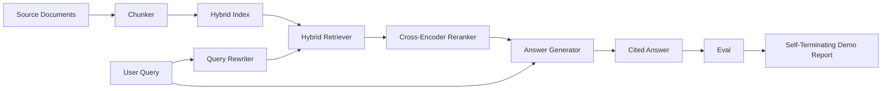

# 端到端 RAG 系统

> 六课的组件。一条流水线。一个评估循环。一个自行终止的演示。这就是你要交付的系统。

**类型:** 动手构建
**编程语言:** Python
**前置要求:** 第 11 阶段第 06 课(RAG)、10(评估);第 19 阶段 Track B 基础(第 20-29 课);第 19 阶段第 64、65、66、67、68 课
**预计耗时:** 约 90 分钟

## 学习目标
- 把分块器、混合检索器、查询改写器、交叉编码器重排器和答案生成器组合成单条端到端流水线。
- 实现按块锚点引用论断的答案生成器,带低置信拒答兜底。
- 对组装好的流水线跑第 68 课的评估,证明分级构建在每个指标上都胜过同批组件的孤立运行。
- 构建自行终止的 CLI 演示:摄入样本语料,跑固定查询集,以状态零退出并打印总结报告。

## 问题

孤立的六个组件什么也证明不了。分块器能在语料上赢 recall@5,却在系统的 recall@5 上输,因为检索器排不动分块器吐出来的东西。重排器能在合成候选池上抬高 MRR,却在真实双编码器候选上失败,因为双编码器在重排预算处的召回太低。查询改写器能在一个查询上把金标文档顶上来,却在下一个查询上崩掉,因为模拟 LLM 返回了退化的假设文档。

集成测试就是整条流水线端到端跑在同一套样本 qrels 上,用同样的指标,靠一个把所有东西接起来的编排文件。这正是本课要建的。如果集成流水线的指标胜过每个阶段孤立演示的指标,你就证明了这个系统。

## 概念



### 接线选择

流水线是一张小图。每个阶段是签名清晰的函数。

| 阶段 | 输入 | 输出 |
|-------|-------|--------|
| 分块器 | 文档文本 | Chunk 记录列表 |
| 检索器 | 查询字符串 | 前 N 个 Chunk 记录 |
| 改写器(可选) | 查询字符串 | 改写列表 + 假设文档 |
| 重排器 | 查询、候选 | 带交叉分数的前 K 个 Chunk 记录 |
| 生成器 | 查询、前 K 个 Chunk 记录 | 带引用的答案字符串 |

签名稳定时组合是顺的。本课的 `Pipeline` 类持有五个阶段和一个按顺序跑它们的 `query` 方法。每个阶段都可换:传入不同的分块器、检索器、改写器、重排器或生成器,流水线照跑。

### 带引用的答案生成器

生成器是最后一级,也最容易坏。本课附带的确定性模拟生成器:

1. 取重排后的前 K 块。
2. 选出内容 token 与查询重叠最多的至多两块。
3. 产出的答案是"从每个选中块各取一句"的拼接,每句后面跟一个 `[doc_id:chunk_index]` 锚点。
4. 如果没有块的重叠过拒答阈值,产出"我不知道",不带引用。

生产里把模拟换成真实 LLM 调用,提示词模板:

```
You are answering a question using only the snippets below.
Cite every claim with the anchor in parentheses.
If the snippets do not answer the question, say "I do not know".

Question: {query}

Snippets:
{enumerated chunks with anchors}

Answer:
```

低置信拒答路径,正是记录交叉编码器第 1 名分数的全部理由。低于语料阈值,生成器拒答。这是防幻觉答案的安全阀。

### 自行终止的演示

演示把一切端到端跑起来。它打印一个查询的分阶段拆解,在四个样本 qrels 上跑评估,打印指标表,若第 68 课的所有指标达到演示设定的阈值则以状态零退出。任何指标低于阈值,演示以非零状态退出,并点名失败的指标。

这就是 CI 冒烟测试的形状。流水线离线、快、确定。阈值在样本上刻意收紧,六课中任何一处回归都会让演示失败。

```figure
rag-pipeline-flow
```

## 动手构建

`code/main.py` 实现了:

- `Chunk`——贯穿所有阶段的记录(在第 64 课形状上扩展 chunk_index 和来源 doc_id)。
- `Chunker`——从第 64 课选策略(默认递归切分)。
- `HybridIndex`——打包第 65 课的 BM25 + 稠密 + RRF。
- `Rewriter`(可选)——按查询长度和连词有无,从第 67 课的 HyDE、多查询、分解里挑一个。
- `Reranker`——第 66 课训好的交叉编码器,换更小的样本训练集,秒级收敛。
- `Generator`——带引用和低置信拒答的确定性模拟生成器。
- `Pipeline`——组合五个阶段,`query(question)` 方法返回 `Result(answer, top_k, latency_ms_per_stage)`。
- `run_demo()`——摄入语料,跑三个样本查询,跑评估,打印结果,按阈值定退出码。

运行:

```bash
python3 code/main.py
```

输出是一条打印的查询轨迹、完整评估表和最终的通过/失败状态。在样本上返回退出码 0。

## 演示藏起来的失效模式

**分块器边界漂移。** 如果你在标评估 qrels 和跑演示之间换了分块策略,金标文档 id 就对不上了。把分块器策略锁死在 qrels 文件里。演示的头部标明了分块器。

**重排器训练集泄进评估。** 第 66 课的 14 个训练三元组里,有和评估查询相似的查询。生产里评估查询要严格留出。演示的评估查询刻意与重排训练集不相交。

**模拟生成器掩盖幻觉风险。** 模拟器不会幻觉,因为它只吐检索块里的文本。本课注明了这一点,并指出生产里换成真实模型的路径。

**没有流式。** 流水线在每个阶段末尾返回完整答案。生产系统会流式吐生成器输出。流式超出本课范围;答案级指标反正都作用在最终字符串上。

**延迟是离线的。** 模拟 LLM 调用是常数时间。真实 LLM 调用才是大头。在请求作用域里规划延迟预算;本课的分阶段计时只测 CPU 工作。

## 投入使用

生产模式:

- 流水线文件收在一个编排器下,阶段接口显式。别把接线撒得满仓库都是。
- 每次动到某个阶段的合并前都跑评估。评估掉了,合并不许进。
- 按 CI 运行持久化指标轨迹,回归才能归因到某次换阶段。
- 加 20 条查询的冒烟集(回归集子集),30 秒内跑完;完整回归集每晚跑。

## 交付

本课的流水线文件就是第 19 阶段 Track F 后续课程假定的形状。后续课程会在上面加摄入自动化、增量重建索引、遥测和服务层。检索、重排、改写和评估这几半,到这里已经齐了。

## 练习

1. 在改写器里加逐查询策略选择器:用第 67 课的启发式(长度、连词、黑话占比)挑 HyDE、多查询或分解。
2. 给生成器加真实 LLM 调用,藏在环境变量开关后面。默认用模拟。测延迟差。
3. 扩展演示,支持 `--corpus path` 标志加载真实语料。重跑评估和阈值检查。
4. 给分块器加 `--strategy` 标志。测每种策略对端到端召回的贡献。
5. 加流式生成器接口并接进评估。确认忠实度算在最终字符串上,而不是流式前缀上。

## 关键术语

| 术语 | 大家嘴里的说法 | 实际含义 |
|------|-----------------|------------------------|
| 流水线 | "RAG 流水线" | 从摄入到带引用答案的组合各级 |
| 引用锚点 | "来源链接" | 挂在每个论断上的 (doc_id, chunk_index) 引用 |
| 低置信拒答 | "我不知道" | 重排器第 1 名低于阈值时,生成器不返回答案 |
| 冒烟集 | "CI 评估" | 每次 PR 检查都跑的最小 qrels 子集 |
| 阶段接口 | "函数签名" | 每个流水线阶段稳定的输入输出类型 |

## 延伸阅读

- [Anthropic, Building search and retrieval](https://www.anthropic.com/news/contextual-retrieval)
- [Pinterest, MCP internal search](https://medium.com/pinterest-engineering)——生产架构参考
- [Ragas: Automated Evaluation of RAG Pipelines](https://docs.ragas.io)
- 第 11 阶段第 06 课——RAG 基础
- 第 19 阶段第 64-68 课——这里组合的组件
