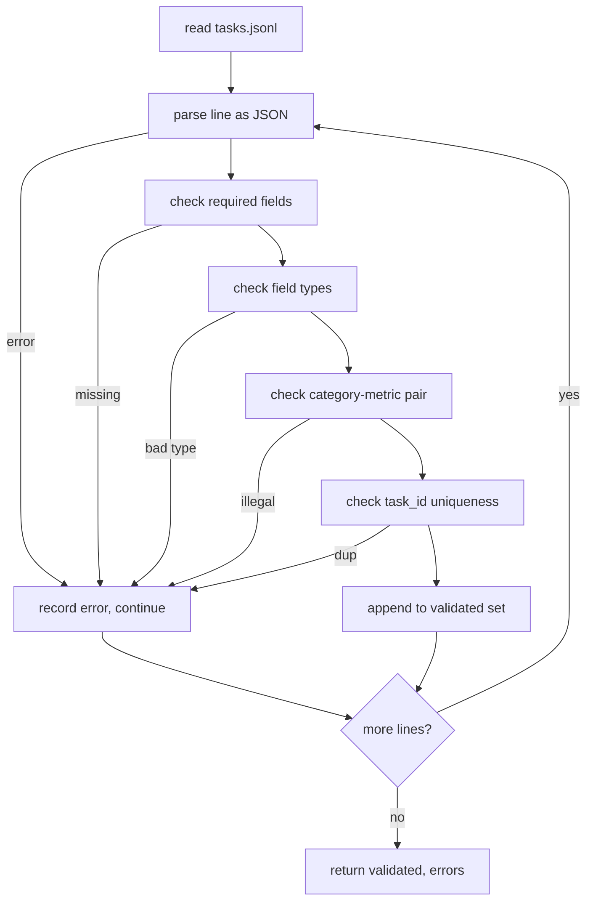

# 任务规格格式

> 评估框架的好坏,取决于它的任务遵守的那份契约。先冻结 JSONL 形状和指标词表,再写任何一个打分函数。

**类型:** 动手构建
**编程语言:** Python
**前置要求:** 第 19 阶段 Track B 基础
**预计耗时:** 约 90 分钟

## 学习目标

- 定义一个 JSONL 任务记录模式,用一种形状覆盖算术、多选、代码执行、分类和自由文本摘要。
- 钉死一个封闭的指标名词表,让后续课程(71-73)能按单个字段分发。
- 把少样本示例和后处理规则规定为任务的一部分而不是运行器的一部分,让同一提示词跨模型产出同一目标。
- 实现一个严格校验器,在畸形记录到达运行器之前拒掉。
- 交付 10 个任务的样本集,覆盖规格的每个分支,让校验器有真东西可嚼。

```figure
ci-task-spec-gate
```

## 为什么冻结规格

研究代码库积累评估脚本的速度比积累测试快。六个月后,每个笔记本有自己的 JSON 形状,每个指标被重复实现两次,任何结果都没法跨运行比较。修法很无趣。选一个模式。写一个校验器。其余全部拒掉。这就是本课做的事。

形状借用了 BIG-bench、HELM 和 lm-eval 风格框架的思路,但字段名是我们自己的。每个字段有单一归属。运行器读任务。指标读 targets。后处理步骤归一化生成结果。没有任何字段在流水线中途可变。

## 记录的形状

任务是单行的一个 JSON 对象。框架读 `tasks.jsonl`,逐行独立校验。坏行中止的是那条记录,不是这次运行。

```json
{
  "task_id": "arith_001",
  "category": "arithmetic",
  "prompt": "Compute the result. Question: 17 + 24\nAnswer:",
  "targets": ["41"],
  "metric_name": "exact_match",
  "few_shot_examples": [
    {"prompt": "Question: 2 + 2\nAnswer:", "completion": "4"}
  ],
  "post_process": "strip_whitespace",
  "metadata": {"difficulty": "easy"}
}
```

必填字段是 `task_id`、`category`、`prompt`、`targets`、`metric_name`、`post_process`。`few_shot_examples` 和 `metadata` 可选。未知的顶层字段校验不通过。

## 字段规则

`task_id` 是不含空白的字符串。校验器强制文件内唯一。

`category` 是 `arithmetic`、`mcq`、`code_exec`、`classification`、`summary` 之一。类别约束合法的指标-后处理配对。`code_exec` 任务必须用 `metric_name = code_exec`;`mcq` 任务必须用 `metric_name = exact_match` 对单字母目标。

`prompt` 是非空字符串。校验器禁止行尾空白,拒绝 prompt 正文里已含少样本块的记录。少样本渲染发生在运行器里,不由作者写。

`targets` 是非空字符串列表。`exact_match` 时任一元素匹配即算。`f1` 和 `rouge_l` 时取最高分的目标。`mcq` 时列表恰好一个元素。

`metric_name` 是 `exact_match`、`f1`、`bleu_4`、`rouge_l`、`accuracy`、`code_exec` 之一。词表封闭。新指标需要新课和这里的新条目。

`few_shot_examples` 是 `{prompt, completion}` 对的列表。校验器把列表上限钉在八条,让提示词有界。

`post_process` 是 `none`、`strip_whitespace`、`lower`、`extract_letter`、`extract_code_block`、`extract_first_line` 之一。每条规则有单一确定性行为。校验器禁止组合规则。

## 校验器行为



校验器返回两个列表:通过校验的记录,和错误记录(带出错行、被违反的规则、出问题的字段)。错误列表非空时运行器拒绝启动,除非显式设置 `--allow-bad-tasks` 标志。

## 少样本渲染

运行器把少样本示例拼在提示词前面,用空行分隔。每个模型走同一条代码路径,所以唯一的方差来源是模型本身。作者写一次示例,不用每个供应商写一次。

```python
def render(task):
    parts = []
    for ex in task.get("few_shot_examples", []):
        parts.append(ex["prompt"] + " " + ex["completion"])
    parts.append(task["prompt"])
    return "\n\n".join(parts)
```

## 后处理规则

后处理步骤在生成之后、指标之前跑。确定、无状态。

- `none` 原样返回字符串。
- `strip_whitespace` 去掉首尾空白。
- `lower` 转小写。
- `extract_letter` 返回第一个匹配 `[A-E]` 的字符,用于 MCQ。
- `extract_code_block` 返回第一个三反引号围栏块的正文,用于 code-exec。
- `extract_first_line` 返回第一个非空行,用于摘要分类。

需要此列表之外规则的任务,属于新课。

## 本课不做什么

不打分。不调模型。不跑代码。那些在第 71、72、75 课。本课冻结的是它们全体遵守的契约。

10 任务样本覆盖两道算术、两道 MCQ、两道 code-exec、两道分类、两道摘要。校验器对全部 10 条通过。另有一份样本(`tasks_bad.jsonl`)触发每条规则,校验器恰好返回那么多个错误。

## 怎么读这份代码

`main.py` 定义了 `TaskSpec`、`validate_task`、`validate_file` 和一个 CLI 入口。样本加载器是 `load_fixtures`。渲染和后处理辅助函数放在校验旁边,让第 75 课的运行器只 import 一个模块。

从头到尾读 `main.py`。再读 `code/tests/test_spec.py`。测试钉住每条校验规则和每个后处理行为。`main.py` 底部的演示校验随包样本并打印总结。

## 更进一步

真实评估套件长类别,就像模式长列。清醒的做法是:不连带加一个指标、一条后处理规则和至少一个样本任务,就拒绝加类别。把规格当数据库迁移对待。每次改动都要评审、带版本、带测试。本课的校验器就是那道门。
