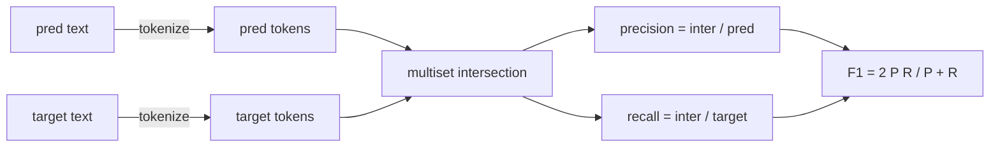
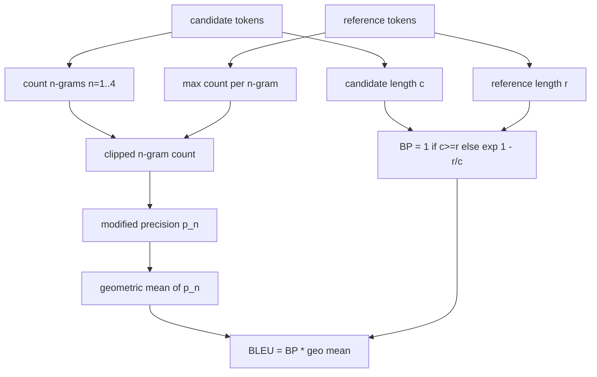

# 经典指标

> BLEU、ROUGE-L、F1、exact-match、accuracy。五个指标,至今仍占据已发表 LLM 评测数字的大头。从第一性原理把每一个实现一遍,你才知道这个数字到底意味着什么。

**类型:** 动手构建
**编程语言:** Python
**前置要求:** 第 19 阶段 Track B 基础,第 70 课
**预计耗时:** 约 90 分钟

## 学习目标

- 实现 token 级 exact-match、F1 和 accuracy,分词规则显式固定。
- 从零实现 BLEU-4:修正 n-gram 精确率、n 取 1 到 4 的几何平均、简短惩罚。
- 用最长公共子序列实现 ROUGE-L,精确率与召回率按 F-beta 组合。
- 按第 70 课的 metric_name 字段分发,让运行器保持指标无关。
- 用取自手工演算示例的参考向量钉死行为,而不是依赖第三方库。

```figure
cd-bleu-overlap
```

## 为什么要重新实现

你会读到一篇论文报 BLEU 28.3,另一篇报 BLEU 0.283。你会发现同一任务的 ROUGE-L 在两个库里差出十分,因为其中一个把文本截成小写,另一个没有。停止困惑的最快办法是自己把指标写一遍,然后指着"决定分词器的那一行"和"施加平滑的那一行"说话。从那以后,跨论文比数字就变成了读指标设置的事,而不是争论库的事。

标准库加 numpy 就够了。BLEU 是计数加一个钳制。ROUGE-L 是动态规划。F1 是 token 上的集合交集。最难的部分是选定一个分词器并坚持到底。

## 分词

分词器是 `re.findall(r"\w+", text.lower())`。小写、字母数字连段、丢弃标点。本课每个指标都用这个分词器,一字不差。运行器没有选择权。换了分词器,你跑的就是另一个基准。

```python
TOKEN_RE = re.compile(r"\w+", re.UNICODE)
def tokenize(text):
    return TOKEN_RE.findall(text.lower())
```

这是刻意的简化。生产环境会在意 CJK、缩约词和代码标识符。本课的要点在于:分词器是契约,不是旋钮。

## 精确匹配(Exact Match)

```python
def exact_match(pred, targets):
    return float(any(pred.strip() == t.strip() for t in targets))
```

每个任务返回 1.0 或 0.0。数据集上的聚合就是均值。这是算术、多选题和短分类任务的主力指标。

## Token 级 F1

为预测和目标分别建立 token 多重集。精确率是多重集交集除以预测的多重集;召回率是同一个交集除以目标的多重集;F1 是调和平均。实现要处理空预测和空目标的边界情况。



多目标任务取目标列表上的最大 F1。这与文献中广泛报告的 SQuAD 式行为一致。

## BLEU-4

BLEU 是机器翻译的经典指标,在摘要工作里也仍然常见。我们用的形式是语料级 BLEU-4,带标准简短惩罚,并对修正 n-gram 计数做加一平滑,这样单个缺失的 4-gram 不会把分数打到零。

对每个 candidate-reference 对,计算 n 等于 1、2、3、4 的修正 n-gram 精确率。修正精确率把 candidate 的 n-gram 计数按"该 n-gram 在任一 reference 中的最大计数"裁剪,所以 candidate 无法靠重复同一短语刷分。四个精确率的几何平均外面再包一层简短惩罚。



平滑规则是 Lin 和 Och 称为 method 1 的那一种:在取 log 之前,给每个 n-gram 精确率的分子分母各加一。这避免了 reference 没有匹配 4-gram 时出现 `log 0`,同时在长 candidate 上仍贴近未平滑的值。

## ROUGE-L

ROUGE-L 比较 candidate 和 reference token 序列的最长公共子序列。LCS 捕捉词序而不强制连续,这正是它成为默认摘要指标的原因。我们用标准动态规划表计算 LCS 长度,然后推导出召回率 `lcs / reference length`、精确率 `lcs / candidate length`,再按 F-beta 组合,beta 取 1 即对称的 F1 形式。

```python
def lcs_length(a, b):
    n, m = len(a), len(b)
    dp = numpy.zeros((n + 1, m + 1), dtype=int)
    for i in range(n):
        for j in range(m):
            if a[i] == b[j]:
                dp[i+1, j+1] = dp[i, j] + 1
            else:
                dp[i+1, j+1] = max(dp[i+1, j], dp[i, j+1])
    return int(dp[n, m])
```

numpy 表格让实现更可读;纯 Python 列表也行。选用 ROUGE-L 的任务要为每个任务付出 O(n m) 的代价。对典型摘要长度来说,耗时不到一毫秒。

## 准确率(Accuracy)

对多目标分类任务,accuracy 就退化为对单个归一化目标的 exact-match。我们把它暴露为独立函数,这样分发器可以按 `metric_name` 分发,而运行器内部不用做字符串比较。

## 分发契约

唯一入口是 `score(metric_name, prediction, targets)`,返回 `[0, 1]` 内的浮点数。运行器不按指标名分支,它把调用交出去、写下结果。这就是第 75 课将要对接到第 70 课任务规约上的那个面。

```python
def score(metric_name, pred, targets):
    if metric_name == "exact_match":
        return exact_match(pred, targets)
    if metric_name == "f1":
        return max(f1_score(pred, t) for t in targets)
    if metric_name == "bleu_4":
        return max(bleu4(pred, t) for t in targets)
    if metric_name == "rouge_l":
        return max(rouge_l(pred, t) for t in targets)
    if metric_name == "accuracy":
        return accuracy(pred, targets)
    raise ValueError(f"unknown metric_name: {metric_name}")
```

`code_exec` 在第 72 课处理,并在那里接入分发器。

## 本课不做什么

不调用模型。不在第 70 课后处理规则已做范围之外再做归一化。不计算置信区间。不做 BLEURT 或 BERTScore(那些需要模型,归另一课)。本课的要点是地板:五个指标、一个分词器、一张分发表。

## 怎么读这份代码

`main.py` 把每个指标定义为自由函数,外加分发器。参考向量在文件底部的 `_reference_examples` 块里。演示用分发器跑八个示例,打印逐指标分数。`code/tests/test_metrics.py` 里的测试钉死参考向量,并压测每个边界情况(空预测、空参考、无公共 token、精确匹配、重复短语裁剪)。

从头到尾读 `main.py`。函数按复杂度排序。exact_match 和 accuracy 各一行;F1 六行;BLEU 和 ROUGE-L 是重头,里面有关于平滑规则和 LCS 递推的详细注释。

## 更进一步

经典指标是必要的,但不充分。它们奖励表面重叠,读不懂含义。修法是在你信任经典地板之后,把基于模型的指标叠上去(BLEURT、BERTScore、GEval)。那是后面的课。眼下:让这五个指标跑起来,用测试钉死它们,你就拥有了一套可审计、快速、可复现的指标栈。
