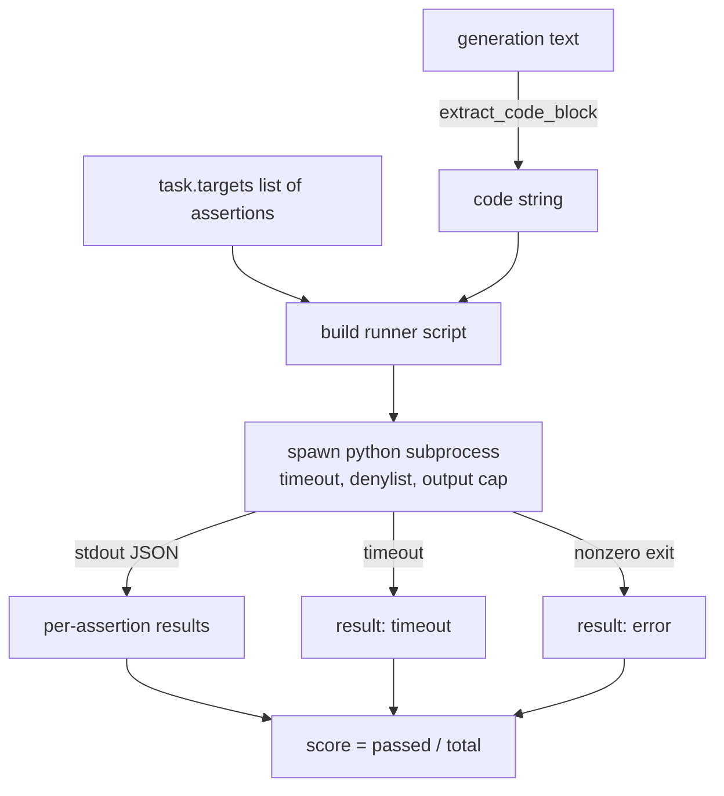
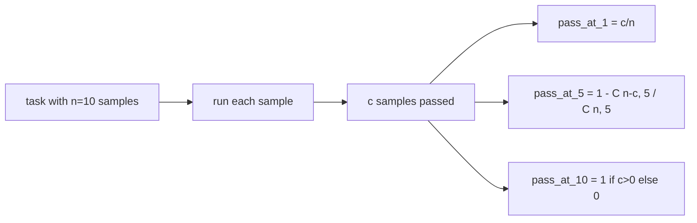

# 代码执行指标

> 生成的代码,跑过测试才算对。评估框架必须能抽出代码、在不拖垮宿主机的前提下运行它,并诚实地统计通过率。本课构建这个面。

**类型:** 动手构建
**编程语言:** Python
**前置要求:** 第 19 阶段 Track B 基础,第 70、71 课
**预计耗时:** 约 90 分钟

## 学习目标

- 从自由形态的生成文本中抽出代码块,方式与第 70 课的后处理规则一致。
- 在隔离子进程中执行候选代码,带墙上时钟超时、输出上限和 import 黑名单。
- 按"候选代码通过的断言字符串占比"给任务打分。
- 为从一个模型采样多个生成的任务计算 pass-at-k。
- 把沙箱崩溃、语法错误和超时当作一等失败模式,各自带运行器可记录的不同退出码。

```figure
sandbox-runner
```

## 为什么要隔离子进程

内联 `exec` 是安全和稳定性隐患。生成一个 `while True: pass`,评估就永远卡住。生成一个 `import shutil; shutil.rmtree('/')`,后果和听起来一样灾难。修法是:每个候选代码起一个新的 Python 解释器,代码走 stdin 传入,断言结果写 stdout,超时就杀进程。宿主评估进程继续运行。

HumanEval、MBPP、BigCodeBench、LiveCodeBench 这些真实评估都用子进程沙箱,有的再叠一层 Docker。我们停在子进程这一层是有原因的:它可移植、是标准库、并且能抓住教学评估中重要的失败模式。生产部署会再加 seccomp、网络隔离和只读文件系统。加固的下一课不在这条 track 里。

## 代码执行任务的形状

一个 `code_exec` 任务在 `targets` 里携带断言字符串。运行器从生成文本中抽出围栏代码块,在外面包一个测试框架,然后运行。



分数是 `[0, 1]` 内的一个分数值。一个任务有三条断言、过了两条,得分 0.667。不管哪里失败,运行器返回的形状都一样:子进程崩溃被映射为归一化的错误码,而不是 Python traceback 一路冒泡到评估框架。

## 黑名单

黑名单基于 import。运行候选代码之前,运行器脚本把危险模块的 import 改写为一个抛 `ImportError("denied")` 的桩。清单刻意保守:`os.system`、`subprocess`、`socket`、`requests`、`urllib`、`urllib.request`、`urllib.error`、`urllib.parse`、`ctypes`、`shutil`、`http.client`、`asyncio.subprocess`。

我们不假装这刀枪不入。铁了心的对抗代码可以逃出 Python 里任何进程内沙箱。黑名单是兜底。墙上时钟超时和输出上限才是承重的控制手段。

```python
DENIED = {
    "os.system": True,
    "subprocess": True,
    "socket": True,
    "shutil": True,
    "requests": True,
    "urllib": True,
    "ctypes": True,
}
```

我们给候选代码前插 `import sys` 和一个把 `os.system` 猴子补丁成抛异常的守卫。完整模板在 `main.py` 里。

## 墙上时钟超时

每个子进程默认有 3 秒墙上时钟预算。运行器用 `subprocess.run(..., timeout=t)`。超时触发时,运行器捕获 `TimeoutExpired`、杀掉进程,并为该任务记下 `timeout` 退出原因。该任务分数为零,运行器继续前进。

超时可通过 `task.metadata.timeout_s` 按任务配置。跑得久的单元测试可以申请更多;第 70 课的校验器把上限卡在 30 秒,保证整套评估有界。

## 输出上限

子进程可能往 stdout 灌水,耗尽宿主内存。运行器把 stdout 流式读入缓冲区,累计量一超过 256 KB 就杀掉子进程。结果记为 `exit_code = error`,详情字符串为 `"output overflow"`。实践中这出现在生成不小心写出带打印的死循环时。

## Pass-at-k

Pass-at-k 是 HumanEval 一系使用的无偏估计量。给定每个任务 `n` 个独立样本、其中 `c` 个通过,从 `n` 个里取大小为 `k` 的样本、至少含一个通过解的概率为:

```
pass_at_k(n, c, k) = 1 - C(n - c, k) / C(n, k)
```

当 `n - c < k` 时分子无定义,值为 `1`。实现直接处理这个边界情况。我们暴露 `pass_at_k(n, c, k)`,供第 74 课的排行榜层使用。



## 退出码

运行器对每个任务返回五种结果之一:

- `pass`:所有断言通过。
- `assertion_fail`:代码跑了,但至少一条断言失败。
- `syntax_error`:代码无法 import,或有 SyntaxError。
- `timeout`:墙上时钟耗尽。
- `error`:其他一切崩溃,包括命中黑名单和输出溢出(溢出以详情 `"output overflow"` 呈现)。

分数仍是分数值。退出码是元数据。下游课程可以自行决定把超时算零分还是算缺失数据。

## 本课不做什么

不给你真正的沙箱。不运行来自开放网络的不可信代码。不处理有状态任务,比如文件 I/O 或网络调用。那些需要容器或 microVM。本课的要点是契约:隔离子进程、黑名单、超时、输出上限、干净的退出码词汇表,以及 pass-at-k 的数学。

## 怎么读这份代码

`main.py` 定义了 `extract_code`、`run_candidate`、`score_code_exec` 和 `pass_at_k`。子进程运行器脚本以字符串形式构建,通过 `-c` 传给一个全新的 Python 解释器。`code/tests/test_exec.py` 里的测试用 HumanEval 风格的手工演算示例,检验四种退出码外加 pass-at-k。

从头到尾读 `main.py`。运行器模板是承重件。盯着断言循环看,直到你能预判它写回父进程的 JSON 信封。

## 更进一步

子进程形状跑通之后,下一个问题可移植性。不同 Python 版本在 Windows 上对 SIGKILL 的处理不同。最干净的修法是把运行器放进 Docker 镜像。再下一步是把断言字符串换成真正的单元测试文件,让评估和生产 CI 做的事对齐。到了那一步,就别再把断言字符串叫测试了;它们是玩具测试,有玩具级的失败模式。
