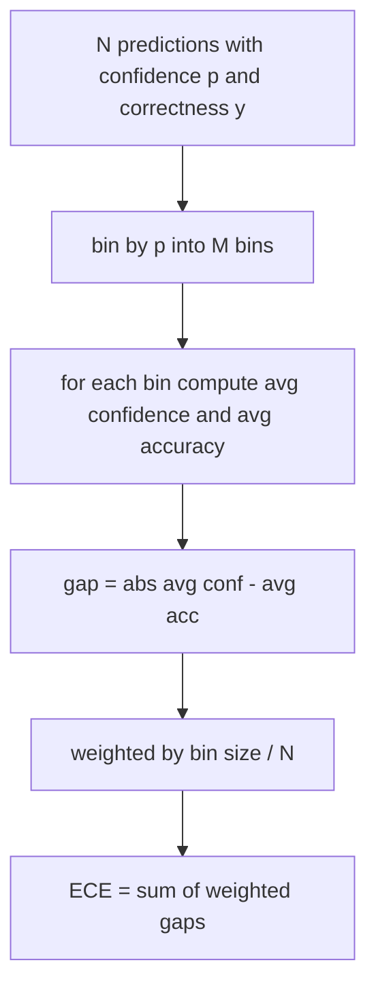
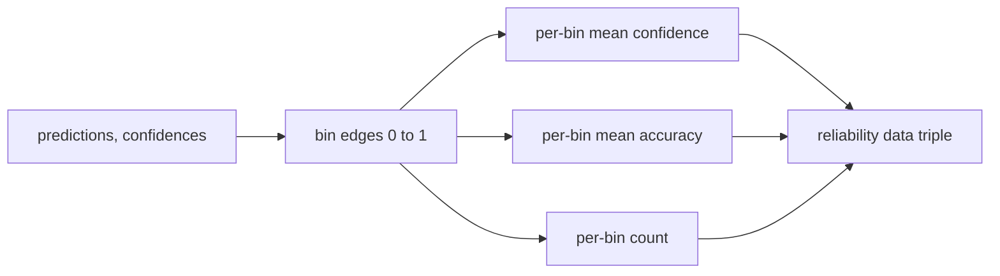

# 困惑度与校准

> 如果你的模型在一千个答案上都说自己有 90% 把握,结果只答对六百个,那它的校准就不好。校准是可信评估的一半。另一半是困惑度,它告诉你模型到底觉不觉得留出文本像样。

**类型:** 动手构建
**编程语言:** Python
**前置要求:** 第 19 阶段 Track B 基础,第 70、71 课
**预计耗时:** 约 90 分钟

## 学习目标

- 用模型适配器提供的 token 负对数概率,在留出语料上计算 token 级困惑度。
- 用分箱后的预测概率,计算分类或多选评估的期望校准误差(ECE)。
- 计算 Brier 分数(相对正确性指示变量的均方误差),并解释什么时候它能做到 ECE 做不到的事。
- 构建绘制"置信度-准确率"曲线所需的可靠性图数据。
- 把三者接入评估框架,让运行器能把 `perplexity`、`ece`、`brier` 三个数字挂到模型报告上。

```figure
cd-reliability-diagram
```

## 困惑度告诉你什么

困惑度是逐 token 平均负对数似然的指数。越低越好。困惑度为 1 意味着模型给每个实际 token 的概率都是 1。困惑度等于词表大小意味着模型是均匀分布、什么都没学到。真实数字落在中间:2026 年一个强基座模型在 WikiText-103 上大约是 8 到 12;差模型在同样文本上是 50 开外。

评估框架自己不算对数概率——那来自模型适配器。框架做的是聚合:接收逐 token 对数概率列表、逐序列 token 计数列表,返回语料级困惑度。

```python
def perplexity(neg_log_probs, token_counts):
    total_nll = sum(neg_log_probs)
    total_tokens = sum(token_counts)
    return math.exp(total_nll / total_tokens)
```

实现要处理零 token 的边界情况,并断言负对数概率非负。一个常见错误是忘了取负号:适配器如果返回 `log p` 而不是 `-log p`,会得到小于 1 的困惑度,而这是不可能的。函数会把它当作契约违例抓住。

## ECE 测什么

期望校准误差把预测按置信度分进固定数量的箱子,再测量各箱上置信度与准确率的平均差距,按箱大小加权。



标准做法是在 `[0, 1]` 上用十个等宽箱。实现支持任意正整数箱数。我们暴露 `bins` 参数,让运行器可以在发表惯例(10)和对比惯例(15)之间选择。

ECE 受箱数和样本量影响而有偏。十个箱、一百个预测,你无法把 0.02 的 ECE 与随机噪声区分开。实现会把非空箱数量和 ECE 一起返回,这样运行器可以拒绝在样本太少时报告单个数字。

## Brier 能做到而 ECE 做不到的事

ECE 只关心平均差距。一个在一半箱上过度自信、另一半箱上自信不足的模型,可能 ECE 很低,但局部校准很差。Brier 分数测量每个预测相对真实结果的平方误差,所以它直接惩罚离散程度。

二值结果下,Brier 是 `mean((p_i - y_i)^2)`。它可以分解为可靠性、分辨率和不确定性三项。我们计算分数和分解。运行器报告标量,但把分解写进日志供看板使用。

```python
def brier(p, y):
    return float(np.mean((p - y) ** 2))
```

## 可靠性图数据

可靠性图画出每个箱内预测置信度与经验准确率的关系。对角线是完美校准。函数返回三个数组:逐箱平均置信度、逐箱平均准确率、逐箱计数。绘图代码在下游;本课止于数据形状。



返回的三元组就是调用方画图或计算自定义 ECE 变体(自适应 ECE、扫描 ECE 等)所需的全部。我们返回 numpy 数组,下游代码不必再转换。

## 置信度从哪来

框架不假设置信度来自 softmax。它接受每个预测在 `[0, 1]` 内的任意数值。多选任务的自然置信度是"选项对数似然上的 softmax";自由文本的自然置信度是模型自报概率,或平均对数似然的指数。评估只消费这个数字。它从哪来,是适配器的事。

## 边界情况

- 预测全错:ECE 等于平均置信度,Brier 很高,困惑度取决于模型觉得文本如何。
- 预测全对且高置信:ECE 接近零,Brier 接近零。
- 完全不确定的预测器,p=0.5:ECE 是 0.5 减去准确率,Brier 是 0.25 减去一个修正项。
- 空输入:ECE、Brier 和可靠性返回 `0.0`(或全零数组)。困惑度在零 token 时返回 `NaN`。这些路径都不发警告;由运行器检查数值并决定报告还是跳过。

这些情况都写进了测试。真实模型在真实基准上不会撞到它们,但有 bug 的适配器或过小的样本会,而运行器不该因此崩溃。

## 分发

校准不是 F1 那样的逐任务指标,而是逐模型的报告。运行器在整套评估上累积 `(confidence, correct)` 对,一次性计算 ECE、Brier 和可靠性数据。困惑度在留出文本语料上单独计算,与逐任务打分分开。

接口是:

```python
report = CalibrationReport.from_predictions(confidences, correct)
report.ece          # float
report.brier        # float
report.reliability  # tuple of three numpy arrays
report.populated_bins  # int
```

`PerplexityResult.from_token_nll(neg_log_probs, token_counts)` 返回困惑度和逐 token 平均负对数似然。

## 本课不做什么

不调用模型。不实现 softmax。不从输出 token 估计置信度——那是适配器的事。不做温度缩放或 Platt 缩放——那些是事后修正,归另一课。本课的要点是让三个数字(困惑度、ECE、Brier)可信且可复现。

## 怎么读这份代码

`main.py` 定义了 `perplexity`、`expected_calibration_error`、`brier_score`、`reliability_diagram`,以及 `CalibrationReport` / `PerplexityResult` 两个 dataclass。演示跑在已知真相的合成预测上:一个校准良好的模型、一个过度自信的、一个自信不足的。`code/tests/test_calibration.py` 里的测试钉死每个边界情况,外加合成预测器的参考值。

从头到尾读 `main.py`。函数顺序从标量到向量到报告。每个函数都有带数学和契约的短 docstring。

## 更进一步

校准是已发表评估中最被忽视的轴。大多数排行榜报一个准确率数字就完事。一个准确率赢、Brier 输的模型,在生产部署上还不如一个准确率略低几分但能可靠报告自身不确定性的模型。等校准管线就位后,在留出验证切片上加温度缩放,重算 ECE,看差距缩小。那是另一课的内容,但地板在这里。
