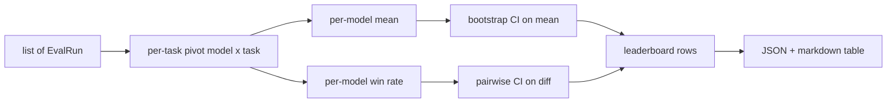
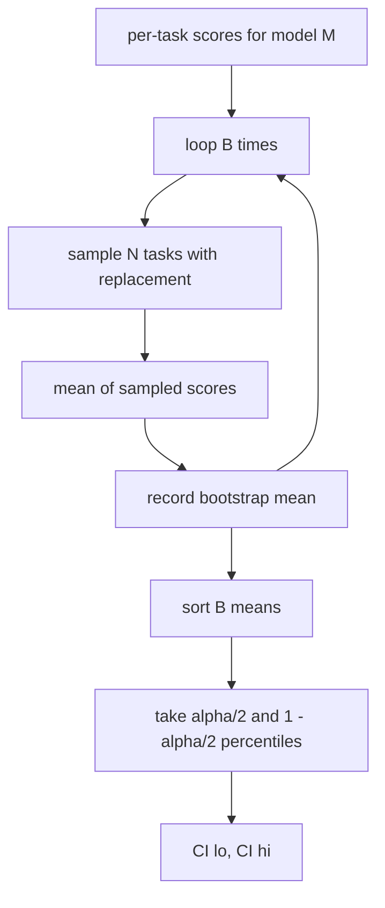

# 排行榜聚合

> 逐任务打分容易。跨异质任务的逐模型排名更难。千级预测的排行榜上的统计显著性,是人人都会跳过的部分。本课不跳。

**类型:** 动手构建
**编程语言:** Python
**前置要求:** 第 19 阶段 Track B 基础,第 70、71、73 课
**预计耗时:** 约 90 分钟

## 学习目标

- 把多模型、多任务的逐任务分数聚合成一张整洁的逐模型行。
- 归一化异质分数,让通过率和 BLEU 值不会过度影响聚合结果。
- 按均值和按胜率给模型排名,并解释各自适合的场景。
- 用 bootstrap 计算逐模型均值和成对差值的置信区间。
- 把排行榜输出为 JSON 报告和 markdown 表格,供第 75 课的运行器粘贴进 CI 评论。

```figure
ci-leaderboard-ci
```

## 输入的形状

聚合器消费一组 `EvalRun` 记录:

```python
@dataclass
class EvalRun:
    model_id: str
    task_id: str
    metric_name: str
    score: float          # in [0, 1]
    category: str
```

第 75 课的运行器为每个 `(model, task)` 对发出一条记录。聚合器不关心分数是怎么产生的;它假设归一化已经完成:每个分数都在 `[0, 1]` 内。

## 输出

产出三张表:



排行榜行包含:`model_id`、`mean_score`、`mean_ci_lo`、`mean_ci_hi`、`win_rate`、`tasks_completed`,以及可选的逐类别均值 `categories` 映射。

## 归一化

如果一个任务的分数在 `[0, 1]`、另一个在 `[0, 100]`,后者会悄悄主导均值。聚合器校验每个输入分数都在 `[0, 1]` 内,否则拒绝运行。修法在上游:指标本身就应该返回分数值。第 71 到 73 课强制执行这条契约。

## 均值与胜率

两种排名方案服务不同目标。

均值是一个模型逐任务分数的平均。它是排行榜报道的头条数字,但对离群值和任务不平衡敏感。

胜率统计一个模型在同一任务上击败其他每个模型的频率。每个任务上分数最高者胜(平局平分)。胜率等于胜场数除以该模型有分数的任务数。它对离群值和量纲差异不那么敏感,但损失信息。

```python
def win_rate(model_id, runs_by_task, all_models):
    wins, total = 0, 0
    for task_id, runs in runs_by_task.items():
        scores = {r.model_id: r.score for r in runs if r.model_id in all_models}
        if model_id not in scores:
            continue
        total += 1
        best = max(scores.values())
        if scores[model_id] >= best:
            wins += 1
    return wins / total if total else 0.0
```

框架两个都报。第 75 课的运行器默认按均值排名;胜率列就在 markdown 里,用户偏好它时可以直接用。

## Bootstrap 置信区间

逐模型均值带一个通过对任务做 bootstrap 重采样估计的置信区间。我们有放回地重采样任务 id,在重采样集上算均值,重复 `B` 次,取 `alpha` 水平的百分位区间。



成对比较时,对逐任务差值 `score_A - score_B` 做 bootstrap,取百分位区间并报告。用户看区间是否排除零:排除,则差值在 alpha 水平上显著;不排除,排行榜把两个模型视为打平。

底层辅助函数(`bootstrap_mean_ci`、`bootstrap_pairwise_diff`)默认 `B=1000`;公开的聚合器(`aggregate`、`pairwise_diffs`)默认 `b=500`,让演示和测试保持快速。默认 alpha 是 0.05。本课的 bootstrap 只用纯 numpy,不碰 scipy。

## 类别

如果 `EvalRun.category` 有值,聚合器还会报告逐类别均值。这就是每个排行榜上写着 `math`、`reasoning`、`code`、`safety` 的那一栏。它让运行者能看出一个模型总体强但代码弱——这是头条均值藏起来的信息。

## Markdown 渲染

排行榜渲染为 markdown 表格:

```text
| Rank | Model | Mean | 95% CI | Win rate | Tasks |
|------|-------|------|--------|----------|-------|
| 1    | gpt   | 0.78 | 0.74-0.82 | 0.62 | 50 |
| 2    | claude| 0.75 | 0.71-0.79 | 0.34 | 50 |
| 3    | random| 0.10 | 0.07-0.13 | 0.04 | 50 |
```

表格按均值排序。CI 渲染到两位小数。过长的模型 id 截断到二十个字符。

## 本课不做什么

不运行模型。不调用指标层。不实现自适应 ECE 或其他校准变体——那是第 73 课。不实现任务加权。这里每个任务权重相同。生产排行榜会加权;我们通过 `weight` 字段把这个钩子留着,但聚合器里不用。需要加权的话,在后续课程里加。

## 怎么读这份代码

`main.py` 定义了 `EvalRun`、`LeaderboardRow`、`aggregate`、`bootstrap_mean_ci`、`bootstrap_pairwise_diff` 和 `render_markdown`。演示构建一个三模型、十二任务的合成套件,聚合后打印排行榜和成对差值表。`code/tests/test_leaderboard.py` 里的测试钉死 bootstrap、markdown 渲染、胜率边界情况和空输入行为。

从头到尾读 `main.py`。先是数据形状(EvalRun、LeaderboardRow),再是聚合器,再是 bootstrap,最后是渲染。每个函数都有聚焦的契约。

## 更进一步

自然的下一步是成对任务显著性,而不是非成对 bootstrap。如果模型 A 和 B 跑了同一百个任务,合适的检验是对逐任务差值做成对 bootstrap,我们已经实现了。再往后,你会想要尊重任务族的层级 bootstrap(数学题之间并不独立;一种算术错误模式会影响其中十道)。那是后续内容。本课的要点是把地板做对,让评估报出一个你捍卫得住的数字。
