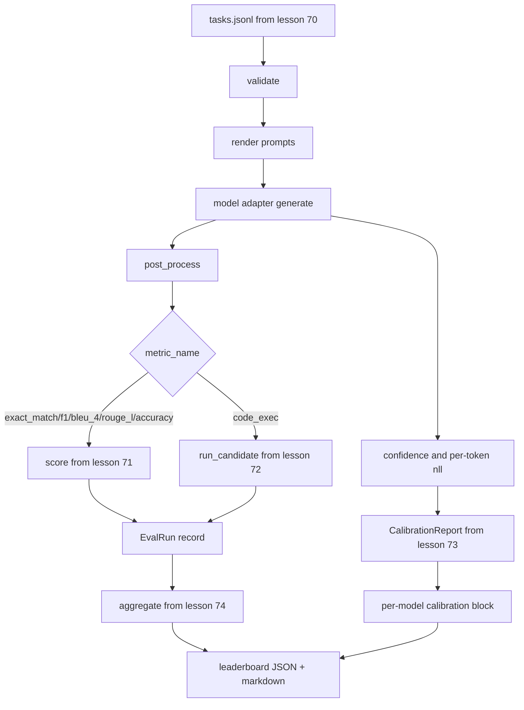

# 端到端评估运行器

> 五课管线,一课粘合。运行器读取第 70 课的任务规约,通过适配器调用模型,用第 71、72 课打分,挂上第 73 课的校准报告,产出第 74 课的排行榜。演示自行结束。

**类型:** 动手构建
**编程语言:** Python
**前置要求:** 第 19 阶段 Track B 基础,第 70 至 74 课
**预计耗时:** 约 90 分钟

## 学习目标

- 定义一个 `ModelAdapter` 接口,任何模型(mock、本地、API)用很小的方法面就能满足。
- 在 fixture JSONL 文件上跑评估,用工作池并行执行任务。
- 一趟跑完指标层(exact_match、F1、BLEU-4、ROUGE-L、code_exec)与校准层的组合。
- 产出逐模型 `EvalRun` 记录,直接喂给排行榜聚合器。
- 同时输出 JSON 报告和 markdown 表格;干净跑完以零退出码自行结束,校验或运行失败以非零退出。

```figure
eval-grid
```

## 流水线



运行器是集成点。第 70 到 74 课各自拥有一个被运行器组合的模块。运行器不重复这些模块里的任何逻辑:它 import 它们。

## 适配器接口

适配器是运行器与任意模型之间的接缝。接口刻意做小。

```python
class ModelAdapter:
    model_id: str

    def generate(self, prompt: str, task: TaskSpec) -> Generation: ...
```

`Generation` 是一个 dataclass,含:

- `text`:模型的自由形态输出
- `confidence`:`[0, 1]` 内的浮点数,表示模型对答案的自报概率
- `token_nll`:可选,生成 token 上的负对数似然之和
- `token_count`:可选,生成的 token 数

运行器里的 mock 适配器有三种口味:`RuleBasedAdapter`(确定性,接近全对)、`NoisyAdapter`(过度自信,经常错)、`BiasedAdapter`(一个类别很强,另一个类别很糟)。演示在第 70 课的 fixture 上跑这三个。

## 并行执行

运行器用 `concurrent.futures.ThreadPoolExecutor` 按模型并行跑任务。工作线程数默认取 8 和任务数的较小值。线程足够,因为真实模型调用的瓶颈是网络 I/O。代码执行路径在任务内部自己起子进程,执行器只负责调度等待。

为了确定性测试,运行器暴露 `run_eval(adapters, tasks, parallel=False)`,测试可以钉死执行顺序。

## 单趟打分循环

对每个任务:

1. 渲染提示词(few-shot 前缀加提示词正文)。
2. 调用适配器并计时。
3. 按任务规则对生成做后处理。
4. 分发到指标层。
5. 用分数和指标元数据构建 `EvalRun` 记录。
6. 把 `(confidence, correct)` 对追加到校准缓冲区。

`correct` 信号对 exact_match 系指标(`exact_match`、`accuracy`、`code_exec`)是 `score >= 1.0`,对分级指标是 `score >= 0.5`。阈值在 `_correct_from_score` 里,运行器不暴露公开覆盖口。

## 聚合

所有任务都有结果之后,运行器调用第 74 课的 `aggregate` 和 `pairwise_diffs`,以及第 73 课的 `CalibrationReport.from_predictions`。输出是单个 JSON 信封:

```json
{
  "leaderboard": [...],
  "pairwise": [...],
  "calibration": {
    "model_id_a": {"ece": 0.04, "brier": 0.10, "populated_bins": 8, ...},
    ...
  },
  "summary": {
    "tasks": 10,
    "models": 3,
    "wall_seconds": 1.2
  }
}
```

运行器还把 markdown 表格写到 stdout,方便用户把结果粘贴进 PR 评审。

## 自行结束的演示

演示在第 70 课的十个 fixture 任务上跑三个 mock 适配器。墙上时间应在十秒内。干净跑完退出码为零。

干净跑完的标准是:

- 每个任务通过第 70 课的校验。
- 每个任务通过第 71、72 课的打分。
- 校准报告按第 73 课聚合,无错误。
- 排行榜把 rule-based 适配器严格排在 random 适配器之上。

任何一条破了,运行器以非零退出,并在 JSON 信封里给出结构化错误。

## 本课不做什么

不调用真实模型。不实现 API key 流程或限流处理。不实现流式或部分生成;适配器每次调用返回一个生成。不做重试或缓存。那些关注点归适配器层;运行器对指标无关、对供应商无关。

## 怎么读这份代码

`main.py` 是集成。它通过一个小小的 `_load_sibling` 辅助函数按相对路径解析并 import 其他五课的模块。`Generation`、`EvalReport`、`ModelAdapter` 这几个 dataclass 在本地定义。mock 适配器在文件底部。

从头到尾读 `main.py`。扫一眼 import,然后看 `run_eval`,再 `_score_one`,再适配器。末尾的演示是入口。

`code/tests/test_runner.py` 里的测试钉死适配器接口、单趟循环、并行与串行等价性、校准缓冲区,以及 JSON 信封形状。

## 更进一步

这个运行器是地板。生产评估系统还要加:按 `(task_id, model_id, model_version)` 键控的结果缓存、跟踪每次运行美元和 token 的成本账本、限流时退避的重试层、pass-at-k 任务的采样策略,以及长跑套件的流式输出格式。每一项都是包住运行器的单一关注点,不动指标层和聚合层。这种分离正是契约的意义。

mock 跑通之后,给一个真实供应商加适配器。挑一个有免费额度的,写三十行胶水,看排行榜亮起来。然后加第二个供应商,让框架干活。
