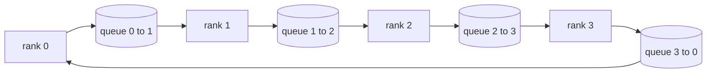

# 从零实现集合通信算子

> 把分布式训练粘合在一起的四个集合通信操作是 allreduce、broadcast、allgather 和 reduce_scatter。训练框架提供的其他一切原语都是这四个的包装。在 `multiprocessing.Queue` 网格上把它们建一遍、对照参考实现验证,这条 track 剩下的部分就都是管线活了。

**类型:** 动手构建
**编程语言:** Python
**前置要求:** 第 19 阶段 Track C 第 42-49 课
**预计耗时:** 约 90 分钟

## 学习目标

- 用两趟(先 reduce-scatter 再 allgather)实现 ring allreduce,并证明每 rank 通信量是每元素 2(N-1)/N 字节。
- 在 `multiprocessing.Queue` 的点对点发送之上构建 broadcast、allgather 和 reduce_scatter。
- 对每个原语,用同样输入对照 `torch.distributed` gloo 参考实现做验证。
- 能基于集群形状、延迟地板和带宽天花板为 ring 与 tree 的选型辩护。

## 问题

N 个 rank 上的朴素 allreduce 要把 N 倍张量发给一个根节点,再广播回 N 倍。每 rank 带宽随 O(N) 增长,根节点成为瓶颈,墙上时钟地板是最慢链路乘以 N。Ring allreduce 把它摊平成 2(N-1) 个大小为 T/N 的块,每 rank 字节数降到 2T(N-1)/N,与集群规模无关。Tree allreduce 在小 N、高延迟链路上占优,因为深度是 log2(N) 跳,而不是 2(N-1)。给集群形状选错拓扑,最慢的那块 GPU 就会决定步长时间。

你在本 track 读到的每个分布式训练框架都依赖这四个原语。PyTorch DDP 用每个参数桶一次 allreduce 来同步梯度。ZeRO 用 reduce_scatter 分片优化器状态,用 allgather 广播更新后的参数。FSDP 把整个前向变成 allgather 加 reduce_scatter。流水线并行需要 broadcast 跨阶段组传激活。如果你实现不了这四个集合通信,你就无法推理:训练为什么卡住、梯度不匹配为什么出现在 rank 3、换拓扑时流水线气泡为什么翻倍。

## 概念



### 两趟完成的 ring allreduce

把张量切成 N 个等大的块,编号 0..N-1。每个 rank 拥有编号等于自己 rank 的块。第 1 趟 reduce-scatter 跑 N-1 步。第 s 步,rank r 把块 (r - s) mod N 发给 rank (r + 1) mod N,并从 rank (r - 1) mod N 收块 (r - s - 1) mod N,把收到的块累加进本地副本。N-1 步之后,rank r 拥有块 r 的完整和。第 2 趟 allgather 再跑 N-1 步,把已完成的块沿环轮转,直到每个 rank 持有每个块的完整和。

| 原语 | 每 rank 字节数 | 步数 | 何时用 |
|-----------|---------------|-------|-------------|
| Ring allreduce | 2T(N-1)/N | 2(N-1) | 大 T、粗管道同构集群 |
| Tree allreduce | T log2(N) | 2 log2(N) | 小 T 或高延迟链路 |
| Broadcast | T | log2(N) 树 | 参数初始化、标量配置 |
| Allgather | T(N-1)/N | N-1 | 分片前向、ZeRO 还原分片 |
| Reduce_scatter | T(N-1)/N | N-1 | ZeRO 梯度分片 |

### 用队列网格充当 NCCL 替身

NCCL 跑在 PCIe 和 NVLink 上,归约由硬件卸载。CPU 上没有这个待遇。每条环边一个 `multiprocessing.Queue`,给你的是有序的点对点投递,单生产者单消费者。归约发生在用户空间,所以要付 Python 开销,但线路模式与 NCCL ring allreduce 完全一致。在队列版本上把正确性推理清楚,集群行为随之而明。

### 对照 gloo 验证

每个原语都带一个单元测试:在同样张量、同样 world size 上,把它的输出与用 gloo 后端初始化的 `torch.distributed` 对比。如果你的 ring allreduce 与 gloo 的偏差超过 float32 epsilon,测试失败。对照参考实现做验证没有商量余地;没有它,原语看起来正确,直到真实训练跑到第 10000 步。

```figure
ci-ring-allreduce
```

## 动手构建

`code/main.py` 实现了:

- `Mesh` 类:把 N 个 `multiprocessing.Queue` 实例接成环,向每个 rank 暴露 `send(dst, tensor)` 和 `recv(src)`。
- `ring_allreduce(mesh, rank, world_size, tensor)`:跑两趟算法。
- `broadcast(mesh, rank, world_size, tensor, src)`:走对数深度的树。
- `allgather(mesh, rank, world_size, tensor)`:用 N-1 次轮转。
- `reduce_scatter(mesh, rank, world_size, tensor)`:即 allreduce 的前半趟。
- `_gloo_reference(op, world_size, tensor)`:把同样输入过一遍 gloo 后端的 `torch.distributed`,做字节级相等的对比。

运行:

```bash
python3 code/main.py
```

输出:逐原语验证表,对比队列网格与 gloo 的输出;随后是每 rank 字节计数器,证明 2T(N-1)/N 的伸缩规律。

## 野外的生产模式

三个模式把这些原语加固到可交付程度。

**allreduce 之前先给梯度分桶。** 一个 10 亿参数模型有数万个梯度张量。每个张量一次 allreduce,就要把延迟地板付 N 次。DDP 把梯度装进约 25 MB 的桶,每桶一次 allreduce;小张量搭大张量的便车。不分桶,延迟开销会主导步长时间。

**通信与计算重叠。** 反向传播按逆序逐层算梯度。最后一层的梯度一就绪,就启动它的 allreduce,同时下一层继续算。PyTorch DDP 用 bucket-ready 钩子接这件事。网络有空闲时,重叠能把可见通信时间减半。

**按消息大小选 ring 还是 tree,别按信仰。** NCCL 自带拓扑检测器,消息大于约 1 MB 选 ring,小于则选 tree。分界点是带宽对延迟:1 MB 以上,带宽项 2T(N-1)/N 主导,ring 赢;1 MB 以下,log2(N) 的跳数赢。硬编码一种拓扑,在错误的消息尺寸上代价就是吞吐。

## 投入使用

生产中的样子:

- **PyTorch DDP。** 反向之后对分桶梯度调 `dist.all_reduce`。桶大小可调;默认 25 MB 对 100Gbit 以太网是合理的。
- **DeepSpeed ZeRO。** 发 reduce_scatter 分片梯度,发 allgather 在前向前重建完整参数。本课的原语正是 ZeRO 调用的那些。
- **FSDP。** 前向以 allgather 开头还原该层分片,计算,再用 reduce_scatter 归约并丢弃还原的分片。同样的原语,不同的调度。

## 交付

在第 77-81 课中使用队列网格原语。第 77 课把 allreduce 接进 DDP。第 78 课把 reduce_scatter 接进 ZeRO。第 79 课把 broadcast 接进流水线激活。第 81 课把四个全组合进端到端演示。

## 练习

1. 加一个 tree allreduce 变体,按消息大小在 ring 和 tree 之间切换。测量分界点。
2. 加 `recv_timeout_ms`,让卡住的 rank 报超时错误,而不是永远挂着。
3. 用 TCP socket 替换 `multiprocessing.Queue` 实现四个原语。同样的测试,真实的线。
4. 加带宽插桩钩子,让每 rank 字节计数器写 JSONL 日志。
5. 在 4 个 rank 上对比 ring 与 tree 跑 1KB、1MB、16MB 张量的墙上时间。用实证为分界点辩护。

## 关键术语

| 术语 | 大家嘴里的说法 | 实际含义 |
|------|----------------|----------|
| Allreduce | "跨 rank 求和" | 调用结束后每个 rank 持有同一个归约张量 |
| Ring | "快的拓扑" | N-1 个大小 T/N 的块绕环流两圈 |
| Tree | "对数拓扑" | 归约沿二叉树走;深度 log2(N) 跳 |
| Allgather | "拼接分片" | 每个 rank 最终拿到其他每个 rank 的分片 |
| Reduce_scatter | "把和拆开" | 每个 rank 最终只拿到某一个块的和 |
| Bucket(桶) | "融合小张量" | 把 N 个小 allreduce 合并成一个大的 |

## 延伸阅读

- [PyTorch Distributed:NCCL 集合通信](https://pytorch.org/docs/stable/distributed.html#collective-functions)
- [Horovod ring allreduce 论文](https://arxiv.org/abs/1802.05799)
- [NCCL 拓扑与算法选择](https://docs.nvidia.com/deeplearning/nccl/user-guide/docs/index.html)
- [Patarasuk 与 Yuan,Bandwidth optimal allreduce algorithms](https://www.cs.fsu.edu/~xyuan/paper/09jpdc.pdf)
- 第 10 阶段第 05 课 —— 分布式训练概览
- 第 19 阶段第 77 课 —— 在这些原语之上接 DDP
