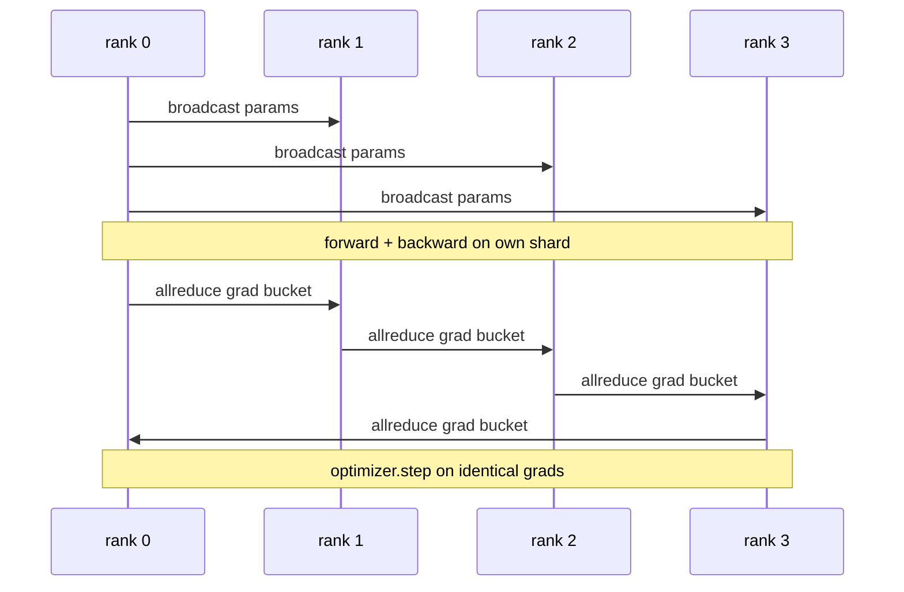

# 从零实现数据并行 DDP

> DistributedDataParallel 就是 allreduce 之上的一层钩子。包住模型,从 rank 0 广播初始参数让每个 rank 起点一致,给每个参数装一个反向钩子来发起梯度的 allreduce,剩下的就是梯度下降。整个模式 200 行。

**类型:** 动手构建
**编程语言:** Python
**前置要求:** 第 19 阶段 Track C 第 42-49 课
**预计耗时:** 约 90 分钟

## 学习目标

- 搭一个 `DistributedDataParallel` 形状的包装器:广播初始参数,反向后 allreduce 梯度。
- 用 `torch.multiprocessing.spawn` 在 gloo 后端上起 N 个 CPU rank,文件式 rendezvous。
- 证明梯度同步的正确性:同一模型同一数据先串行训练,展示逐步参数等价。
- 能为分桶(梯度融合)和重叠(反向期间通信)辩护——正是这两个改动把能跑的 DDP 变成生产级 DDP。

## 问题

10 亿参数模型加 12 GB 激活,一块消费级 GPU 装不下。就算装得下,训练也要数周。数据并行把批次切到 N 个 rank 上,每个 rank 在自己的分片上前向和反向,每一步把所有 rank 的梯度求和,N 份副本保持一致。优化器踩的就是这个求和后的梯度。

没有梯度同步,N 份副本第 2 步就分叉。模型不再是"一个模型用更多数据训练",而是 N 个恰好共享初始权重的独立模型。梯度同步做得烂(每个参数一次 allreduce、不重叠、不分桶),网络就成了瓶颈,GPU 空转等线路。DDP 的手艺在于让梯度同步相对计算几乎免费。PyTorch DDP 的标杆做法是:梯度分桶、allreduce 与下一层反向重叠、在 NVLink 上用 NCCL。这三件事我们在 CPU 上用 gloo 都能做,学到的是同样的课。

## 概念



### DDP 需要的三个操作

| 阶段 | 集合通信 | 为什么 |
|-------|-----------|-----|
| 初始化 | 从 rank 0 广播 | 每个 rank 以相同参数起步 |
| 反向之后 | 各梯度 allreduce | 优化器踩的是平均梯度 |
| 有时 | 广播 buffer | Batchnorm 运行统计量保持同步 |

### 为什么要平均而不是求和

Allreduce-SUM 除以 world_size 得到平均梯度。均值对 world_size 不变:一个 rank 上调好的学习率,在四个 rank 上也能用,因为每步梯度幅度不变。不除的 Allreduce-SUM 逼你每改一次集群规模就重调学习率。DDP 包了 SUM 并做了除法;本课也照做。

### 为什么梯度分桶

一个 Transformer 有数千个参数张量。每个张量一次 allreduce,就要把 gloo 的延迟地板付数千次。DDP 把梯度装进约 25 MB 的桶,每桶一次 allreduce。线路上走的总字节数一样,但延迟被摊到整个桶上。本课的小模型全部装进一个桶;能迁移过去的是结构。

### 为什么钉住种子

每个 rank 必须为 shuffle 调 `torch.manual_seed(seed + rank)`,而为参数初始化调 `torch.manual_seed(seed)`。共享一个种子意味着每个 rank 看到同样的批次顺序(数据并行白做了);参数用 rank 特定种子意味着初始参数差出浮点 epsilon,梯度同步再也无法让副本一致。种子模式搞错,参数等价测试在第 1 步就会失败。

```figure
ci-ddp-grad-sync
```

## 动手构建

`code/main.py` 实现了:

- `MiniMLP`:3 层 MLP,小到几秒内收敛,大到足以暴露接线问题。
- `DistributedDataParallel(model, world_size)`:构造时广播参数,返回的包装器的 `sync_grads` 把累积的 allreduce 求和梯度除以 world_size。
- `worker(rank, world_size, ...)`:完整训练循环,gloo 上初始化 `torch.distributed`,前向、反向、同步、step。
- `_reference_single_process_loop(...)`:在单 rank 上串行训练同一模型同一数据,供测试逐步做字节级参数等价对比。

运行:

```bash
python3 code/main.py
```

输出:逐步训练表,对比单进程的 loss 和参数校验和与 4 rank DDP 运行的对应值。两条路径产生浮点 epsilon 内一致的 loss 曲线,证明梯度同步正确。

## 野外的生产模式

三个模式把 DDP 加固到可交付程度。

**找出未使用的参数。** 有些前向路径有条件地跳过参数(提前退出、MoE 路由器)。被跳过的参数没有梯度,但 DDP 的 bucket-ready 钩子仍会等它们,allreduce 死锁。`find_unused_parameters=True` 让 DDP 在归约前先看哪些参数拿到了梯度。代价是每步一次图遍历,所以除非你的前向有分支,否则别开。

**静态图优化。** 前向跨步稳定时,`static_graph=True` 让 DDP 预计算分桶调度。这个优化在规模上才有感:预计算每步省几毫秒,一万步下来很可观。

**梯度累积要小心。** K 个微批次累积梯度、每个微批次都不同步,是 10 倍吞吐的赢面。DDP 暴露 `no_sync()` 上下文管理器,暂停反向后 allreduce。忘了它,你就白做 K 次 allreduce;吞吐直接坠地。

## 投入使用

生产中的样子:

- **PyTorch DDP。** 标杆实现。`torch.nn.parallel.DistributedDataParallel(model)` 接好分桶、重叠和 no_sync 上下文。
- **HuggingFace Accelerate。** 加一个启动器,处理 `torchrun` 环境变量和模型包装。底下是同一个 DDP。
- **Megatron-LM 数据并行。** 把 DDP 与张量并行组合用于大模型;数据并行那部分就是同一个"反向后 allreduce"模式。

## 交付

第 78 课(ZeRO 分片)用 reduce_scatter 替换逐参数 allreduce,每个 rank 只存优化器状态的自己的分片。第 81 课把 DDP 与 ZeRO 组合进端到端演示。

## 练习

1. 加可配置大小的梯度桶,在更深的模型上测量相对"逐参数一次 allreduce"的加速。
2. 把 `no_sync()` 实现为上下文管理器,验证 K 个微批次的梯度累积与单进程基线一致。
3. 加 `find_unused_parameters` 模式:前向有时跳过 MLP 的某一层;不开这个标志时运行应当死锁。
4. 用仅 `torch.distributed.barrier()` 的同步替换 gloo,体会 allreduce 同步与 barrier 同步的差别。
5. 测量批次大小 1、16、256 时梯度同步开销占步长时间的比例,解释其伸缩规律。

## 关键术语

| 术语 | 大家嘴里的说法 | 实际含义 |
|------|----------------|----------|
| DDP | "数据并行" | 广播参数、每步 allreduce 梯度的包装器 |
| Bucket(桶) | "融合梯度" | 把 N 个小 allreduce 合并成一个大的 |
| 重叠 | "藏起通信" | 后面的层还在算反向时就发起 allreduce |
| no_sync | "累积" | 梯度累积时跳过反向后 allreduce |
| find_unused | "带分支的前向" | 归约前检测没有梯度的参数 |

## 延伸阅读

- [PyTorch DistributedDataParallel 文档](https://pytorch.org/docs/stable/generated/torch.nn.parallel.DistributedDataParallel.html)
- [PyTorch DDP 内部机制教程](https://pytorch.org/tutorials/intermediate/ddp_tutorial.html)
- [Li et al, PyTorch Distributed: Experiences on Accelerating Data Parallel Training](https://arxiv.org/abs/2006.15704)
- 第 19 阶段第 76 课 —— DDP 所依赖的集合通信
- 第 19 阶段第 78 课 —— ZeRO 分片用 reduce_scatter 替换逐参数 allreduce
