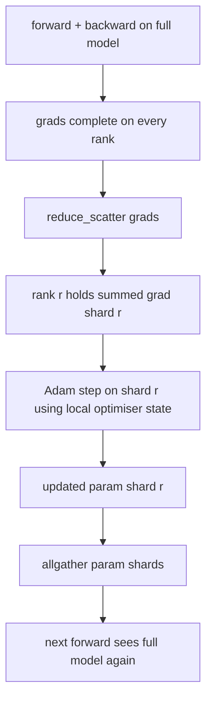

# ZeRO 优化器状态分片

> Adam 为每个参数存两个动量估计,都是 float32。7B 参数模型背着 56 GB 优化器状态。ZeRO stage 1 把它分片到 N 个 rank;每个 rank 拥有优化器的 1/N。本地 step 之后,更新好的参数分片广播回来,每个 rank 重建完整模型,开始下一步。收益是训练栈中最大单笔分配的内存线性下降。

**类型:** 动手构建
**编程语言:** Python
**前置要求:** 第 19 阶段 Track C 第 42-49 课
**预计耗时:** 约 90 分钟

## 学习目标

- 把优化器状态(一阶动量、二阶动量、fp32 主副本)分片到 N 个 rank,每个 rank 拥有 1/N。
- 用 reduce_scatter 只把每个 rank 自己分片的梯度求和送达,再用 allgather 把更新后的参数分片广播回来。
- 算出 stage 1、stage 2、stage 3 相对朴素 DDP 的内存节省表。
- 能按模型规模和带宽预算为 stage 1 / 2 / 3 的选型辩护。

## 问题

朴素 DDP 复制一切:参数、梯度、优化器状态,每个 rank 上都是完整的。对 fp16 的 7B 参数模型,这意味着每 rank 14 GB 参数、14 GB 梯度、28 GB 优化器状态。优化器状态是最大的一项,也最容易分片,因为它只在 step 时被碰,前向反向都不碰。

ZeRO stage 1 分片优化器状态。每个 rank 持有 1/N 的 Adam 动量。反向后,ZeRO 不再 allreduce 完整梯度再本地 step,而是 reduce_scatter,让每个 rank 只收到自己分片的求和梯度。该 rank 对自己那份主参数分片应用优化器 step。更新后的参数分片再 allgather 回去,每个 rank 又拿到完整模型用于下一次前向。优化器内存除以 N。每步线路流量与 DDP 相同:一次 reduce_scatter 加一次 allgather,按带宽算等于一次 allreduce。内存赢了,吞吐不变。

## 概念



### ZeRO 的各个 stage

| Stage | 分片了什么 | 每 rank 内存 | 每步通信 |
|-------|----------------|------------------|---------------|
| DDP | 无 | params + grads + optim | 1x allreduce |
| ZeRO-1 | 优化器状态 | params + grads + optim/N | 1x reduce_scatter + 1x allgather |
| ZeRO-2 | 优化器 + 梯度 | params + grads/N + optim/N | 1x reduce_scatter + 1x allgather |
| ZeRO-3 | 优化器 + 梯度 + 参数 | params/N + grads/N + optim/N | 每层 1x allgather + 每层 1x reduce_scatter |

Stage 1 是最便宜的赢面,因为优化器状态占预算大头。Stage 2 需要梯度分片累积逻辑,带宽不变。Stage 3(FSDP)为每次前向反向付逐层通信,换来参数分片的内存下降。本课完整实现 stage 1。

### 内存账,真实数字

P 参数模型,Adam 混合精度训练:

| 项 | 朴素 | ZeRO-1 | 为什么 |
|------|---------|--------|-----|
| fp16 参数 | 2P 字节 | 2P 字节 | 前向需要 |
| fp16 梯度 | 2P 字节 | 2P 字节 | 反向需要 |
| fp32 主副本 | 4P 字节 | 4P/N 字节 | 只有优化器用它 |
| fp32 一阶动量 | 4P 字节 | 4P/N 字节 | 只有优化器用它 |
| fp32 二阶动量 | 4P 字节 | 4P/N 字节 | 只有优化器用它 |
| 合计 | 16P 字节 | 4P + 12P/N 字节 |   |

N=8 时:朴素 16P,ZeRO-1 5.5P,降 65%。N=64 时:朴素 16P,ZeRO-1 4.19P,降 74%。

### 为什么 reduce_scatter 胜过 allreduce 再切分

Allreduce 给每个 rank 完整的求和梯度。如果你只需要分片 r,那么在 rank r 上,被归约的梯度里有 (N-1)/N 是浪费的。Reduce_scatter 精确投递每个 rank 拥有的分片;每 rank 字节数与 allreduce 相同(因为 allreduce = reduce_scatter + allgather),但后半趟被换成了稍后的参数分片 allgather。线上净流量与 DDP 相同,内存被除了。

```figure
cd-zero-shard
```

## 动手构建

`code/main.py` 实现了:

- `flatten_params(module)` 和 `unflatten_into(module, flat)`:把模型参数打包成一个连续张量再解包回去。扁平布局让按 rank 分片变成简单的切片。
- `ZeroOptimizer(model, world_size, rank, lr)`:持有该 rank 的主副本分片和 Adam 动量分片。
- `step()`:对扁平梯度做 reduce_scatter,对该 rank 分片应用 Adam,再 allgather 更新后的参数。
- 演示:训练 3 层 MLP 20 步,打印逐步内存预算,旁边对照朴素 DDP 基线。

运行:

```bash
python3 code/main.py
```

输出:逐步 loss,以及展示 ZeRO-1 每 rank 只持 1/N 优化器状态、而 DDP 持完整副本的内存表。

## 野外的生产模式

三个模式把 ZeRO 加固到可交付程度。

**分片检查点很重要。** ZeRO-1 的优化器状态拆在各 rank 上;检查点必须记录哪个 rank 拥有什么。第 80 课构建分片检查点清单,让 ZeRO 运行能在同一 world size 上恢复。没有它,保存的状态在重启时无法读取。

**混合精度才是重点。** ZeRO 是混合精度技术;被分片的是 fp32 主副本。不配混合精度跑 ZeRO,是在付 fp32 主副本的内存税,却拿不到 fp16 前向的对应收益。生产运行总是把 ZeRO 与 autocast 或 bf16 权重配对。

**Stage 1 是近乎免费的赢面。** 通信按带宽算与 DDP 相同。内存节省随 N 线性。唯一代价是优化器分片的簿记。生产栈默认 stage 1,除非参数分片的内存也是问题;那时用 stage 2 或 3 拿通信换内存。

## 投入使用

生产中的样子:

- **DeepSpeed ZeRO。** 参考实现。`deepspeed_config.json` 选择 stage 1/2/3 和分区大小。
- **PyTorch FSDP。** PyTorch 原生等价物。`ShardingStrategy.SHARD_GRAD_OP` 是 ZeRO-2;`FULL_SHARD` 是 ZeRO-3。
- **HuggingFace Accelerate。** 把 DeepSpeed 和 FSDP 包在统一配置下。

## 交付

第 79 课(流水线并行)是正交的分片轴:流水线不是在同一模型上分片优化器状态,而是把层切到不同 rank 上。第 81 课把 DDP + ZeRO 组合进端到端演示。

## 练习

1. 扩展到 ZeRO-2:分片梯度。每个 rank 只存自己分片的梯度,做法是反向后把非分片部分清零。
2. 加内存分析器,打印 rank 0 的实际 fp32 字节用量,对照公式预测。
3. 测量朴素 DDP 与 ZeRO-1 的逐步墙上时间,分解为前向、反向、通信。
4. 在 ZeRO-1 下实现梯度裁剪:L2 范数必须通过对本地范数平方做 allreduce 来跨所有分片计算。
5. 实现一个用 allreduce 代替 reduce_scatter 的"朴素 ZeRO",测量线路时间差。用数字为 reduce_scatter 的选择辩护。

## 关键术语

| 术语 | 大家嘴里的说法 | 实际含义 |
|------|----------------|----------|
| ZeRO-1 | "分片优化器" | 每个 rank 持 1/N 的 fp32 主副本 + Adam 动量 |
| ZeRO-2 | "梯度也分片" | reduce_scatter 之后每个 rank 还丢掉非分片梯度 |
| ZeRO-3 | "分片参数" | 每个 rank 持 1/N 的 fp16 参数;前向逐层 allgather |
| 主副本 | "fp32 权重" | 优化器更新的高精度参数副本 |
| Reduce_scatter | "把和拆开" | 只把每个 rank 自己分片的求和梯度投递给它 |

## 延伸阅读

- [Rajbhandari et al, ZeRO: Memory Optimizations Toward Training Trillion Parameter Models](https://arxiv.org/abs/1910.02054)
- [DeepSpeed ZeRO 文档](https://www.deepspeed.ai/tutorials/zero/)
- [PyTorch FSDP 文档](https://pytorch.org/docs/stable/fsdp.html)
- 第 19 阶段第 76 课 —— 本课所依赖的 reduce_scatter 和 allgather
- 第 19 阶段第 80 课 —— ZeRO 状态必须使用的分片检查点
